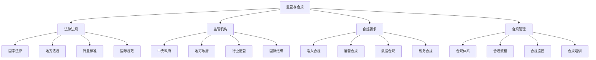

# 监管与合规

## 🎯 学习目标
掌握共享经济监管与合规理论，了解相关法律法规，学会制定合规策略，确保共享经济平台合法合规运营。

## 📊 监管与合规框架

### 监管要素

## ⚖️ 法律法规

### 国家法律
**基础法律**：
- **《民法典》**：民事法律关系
- **《公司法》**：公司治理规范
- **《合同法》**：合同法律关系
- **《消费者权益保护法》**：消费者权益保护

**专门法律**：
- **《电子商务法》**：电子商务规范
- **《网络安全法》**：网络安全规范
- **《数据安全法》**：数据安全规范
- **《个人信息保护法》**：个人信息保护

**相关法律**：
- **《反垄断法》**：反垄断规范
- **《反不正当竞争法》**：反不正当竞争
- **《劳动法》**：劳动关系规范
- **《税法》**：税务规范

### 地方法规
**地方政策**：
- **地方政府规章**：地方政府规章
- **地方性法规**：地方性法规
- **地方标准**：地方标准规范
- **地方政策**：地方政策文件

**区域差异**：
- **一线城市**：一线城市政策
- **二线城市**：二线城市政策
- **三四线城市**：三四线城市政策
- **农村地区**：农村地区政策

**政策协调**：
- **政策统一**：政策统一协调
- **政策差异**：政策差异处理
- **政策创新**：政策创新试点
- **政策推广**：政策推广实施

### 行业标准
**国家标准**：
- **国家标准**：国家标准规范
- **行业标准**：行业标准规范
- **团体标准**：团体标准规范
- **企业标准**：企业标准规范

**国际标准**：
- **ISO标准**：国际标准化组织标准
- **IEC标准**：国际电工委员会标准
- **ITU标准**：国际电信联盟标准
- **其他国际标准**：其他国际标准

**标准应用**：
- **标准实施**：标准实施应用
- **标准认证**：标准认证体系
- **标准监督**：标准监督机制
- **标准更新**：标准更新机制

### 国际规范
**国际公约**：
- **联合国公约**：联合国相关公约
- **WTO规则**：世界贸易组织规则
- **OECD准则**：经合组织准则
- **G20框架**：G20框架协议

**区域规范**：
- **欧盟规范**：欧盟相关规范
- **美国规范**：美国相关规范
- **日本规范**：日本相关规范
- **其他区域**：其他区域规范

**规范协调**：
- **规范统一**：规范统一协调
- **规范差异**：规范差异处理
- **规范创新**：规范创新实践
- **规范推广**：规范推广实施

## 🏛️ 监管机构

### 中央政府
**主要部门**：
- **国家发改委**：宏观政策制定
- **工信部**：信息化监管
- **商务部**：商务活动监管
- **市场监管总局**：市场秩序监管

**专业部门**：
- **网信办**：网络安全监管
- **公安部**：公共安全监管
- **交通运输部**：交通运输监管
- **住建部**：住房建设监管

**协调机制**：
- **部际协调**：部际协调机制
- **政策协调**：政策协调机制
- **监管协调**：监管协调机制
- **执法协调**：执法协调机制

### 地方政府
**省级政府**：
- **省政府**：省级政府监管
- **省发改委**：省级政策制定
- **省商务厅**：省级商务监管
- **省市场监管局**：省级市场监管

**市级政府**：
- **市政府**：市级政府监管
- **市发改委**：市级政策制定
- **市商务局**：市级商务监管
- **市市场监管局**：市级市场监管

**县级政府**：
- **县政府**：县级政府监管
- **县发改委**：县级政策制定
- **县商务局**：县级商务监管
- **县市场监管局**：县级市场监管

### 行业监管
**行业组织**：
- **行业协会**：行业协会监管
- **行业联盟**：行业联盟监管
- **行业标准**：行业标准监管
- **行业自律**：行业自律监管

**专业机构**：
- **认证机构**：认证机构监管
- **检测机构**：检测机构监管
- **评估机构**：评估机构监管
- **咨询机构**：咨询机构监管

**监管合作**：
- **政企合作**：政府企业合作
- **行业合作**：行业间合作
- **区域合作**：区域间合作
- **国际合作**：国际间合作

### 国际组织
**国际机构**：
- **联合国**：联合国相关机构
- **WTO**：世界贸易组织
- **OECD**：经合组织
- **G20**：二十国集团

**区域组织**：
- **欧盟**：欧盟相关机构
- **APEC**：亚太经合组织
- **ASEAN**：东盟
- **其他区域**：其他区域组织

**合作机制**：
- **多边合作**：多边合作机制
- **双边合作**：双边合作机制
- **区域合作**：区域合作机制
- **全球合作**：全球合作机制

## 📋 合规要求

### 准入合规
**准入条件**：
- **企业资质**：企业资质要求
- **技术条件**：技术条件要求
- **资金条件**：资金条件要求
- **人员条件**：人员条件要求

**准入程序**：
- **申请程序**：准入申请程序
- **审核程序**：准入审核程序
- **批准程序**：准入批准程序
- **公示程序**：准入公示程序

**准入管理**：
- **准入监管**：准入过程监管
- **准入评估**：准入条件评估
- **准入调整**：准入条件调整
- **准入退出**：准入退出机制

### 运营合规
**运营规范**：
- **服务规范**：服务提供规范
- **质量规范**：服务质量规范
- **安全规范**：运营安全规范
- **环保规范**：环境保护规范

**运营要求**：
- **资质要求**：运营资质要求
- **技术要求**：技术能力要求
- **管理要求**：管理能力要求
- **服务要求**：服务质量要求

**运营监管**：
- **日常监管**：日常运营监管
- **专项监管**：专项运营监管
- **定期检查**：定期运营检查
- **随机抽查**：随机运营抽查

### 数据合规
**数据保护**：
- **数据收集**：数据收集规范
- **数据存储**：数据存储规范
- **数据处理**：数据处理规范
- **数据使用**：数据使用规范

**隐私保护**：
- **个人信息**：个人信息保护
- **隐私政策**：隐私政策制定
- **用户同意**：用户同意机制
- **数据删除**：数据删除机制

**数据安全**：
- **安全措施**：数据安全措施
- **安全技术**：数据安全技术
- **安全监控**：数据安全监控
- **安全事件**：安全事件处理

### 税务合规
**税务登记**：
- **税务登记**：税务登记要求
- **税种认定**：税种认定要求
- **税率确定**：税率确定要求
- **纳税申报**：纳税申报要求

**税务管理**：
- **发票管理**：发票管理规范
- **账务管理**：账务管理规范
- **税务检查**：税务检查配合
- **税务争议**：税务争议处理

**税务优化**：
- **合法避税**：合法避税策略
- **税务筹划**：税务筹划策略
- **优惠政策**：优惠政策利用
- **税务风险**：税务风险控制

## 🛠️ 合规管理

### 合规体系
**体系架构**：
- **合规组织**：合规组织架构
- **合规制度**：合规制度体系
- **合规流程**：合规流程体系
- **合规文化**：合规文化体系

**体系要素**：
- **合规目标**：合规目标设定
- **合规原则**：合规原则制定
- **合规标准**：合规标准制定
- **合规措施**：合规措施实施

**体系管理**：
- **体系设计**：合规体系设计
- **体系实施**：合规体系实施
- **体系监控**：合规体系监控
- **体系改进**：合规体系改进

### 合规流程
**流程设计**：
- **流程规划**：合规流程规划
- **流程设计**：合规流程设计
- **流程优化**：合规流程优化
- **流程标准化**：合规流程标准化

**流程实施**：
- **流程执行**：合规流程执行
- **流程监控**：合规流程监控
- **流程评估**：合规流程评估
- **流程改进**：合规流程改进

**流程管理**：
- **流程文档**：合规流程文档
- **流程培训**：合规流程培训
- **流程监督**：合规流程监督
- **流程创新**：合规流程创新

### 合规监控
**监控体系**：
- **监控指标**：合规监控指标
- **监控方法**：合规监控方法
- **监控工具**：合规监控工具
- **监控频率**：合规监控频率

**监控实施**：
- **实时监控**：实时合规监控
- **定期监控**：定期合规监控
- **专项监控**：专项合规监控
- **随机监控**：随机合规监控

**监控管理**：
- **监控分析**：合规监控分析
- **监控报告**：合规监控报告
- **监控预警**：合规监控预警
- **监控改进**：合规监控改进

### 合规培训
**培训体系**：
- **培训规划**：合规培训规划
- **培训内容**：合规培训内容
- **培训方法**：合规培训方法
- **培训评估**：合规培训评估

**培训实施**：
- **新员工培训**：新员工合规培训
- **在职培训**：在职合规培训
- **专项培训**：专项合规培训
- **持续培训**：持续合规培训

**培训管理**：
- **培训记录**：合规培训记录
- **培训考核**：合规培训考核
- **培训效果**：合规培训效果
- **培训改进**：合规培训改进

## 💡 实践应用

### 合规管理实施流程
1. **合规分析**：分析合规要求
2. **合规设计**：设计合规体系
3. **合规实施**：实施合规管理
4. **合规监控**：监控合规执行
5. **合规改进**：改进合规管理

### 案例分析
**选择案例**：如滴滴合规管理
**分析维度**：
- 法律法规：国家法律、地方法规、行业标准、国际规范
- 监管机构：中央政府、地方政府、行业监管、国际组织
- 合规要求：准入合规、运营合规、数据合规、税务合规
- 合规管理：合规体系、合规流程、合规监控、合规培训

## 🧠 学习要点

### 费曼学习法应用
1. **选择概念**：监管与合规
2. **简化解释**：用简单语言解释监管与合规
3. **识别盲点**：找出理解不足的地方
4. **重新学习**：针对盲点深入学习

### 刻意练习要点
- **法律理解**：理解相关法律法规
- **合规设计**：设计合规管理体系
- **合规实施**：实施合规管理措施
- **合规监控**：监控合规执行效果

## 🔗 关联学习

### 前置知识
- [[02-信任机制设计]] - 信任机制设计
- [[01-共享经济模式]] - 共享经济模式
- [[01-商业法律基础]] - 商业法律基础

### 后续学习
- [[04-可持续发展]] - 可持续发展
- [[01-商业伦理基础]] - 商业伦理基础
- [[01-企业社会责任]] - 企业社会责任

### 实践应用
- 合规管理体系设计
- 合规管理实施
- 合规风险控制
- 合规管理优化

## 🎯 学习检验

### 理解检验
- [ ] 能够理解监管要求
- [ ] 能够掌握合规规范
- [ ] 能够设计合规体系
- [ ] 能够实施合规管理

### 应用检验
- [ ] 能够制定合规策略
- [ ] 能够建立合规体系
- [ ] 能够实施合规管理
- [ ] 能够优化合规效果

---
**下一步**：[[04-可持续发展]] - 可持续发展
