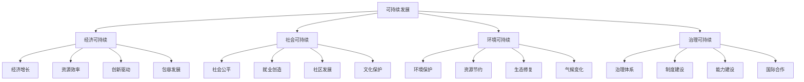

# 可持续发展

## 🎯 学习目标
掌握共享经济可持续发展理论，理解可持续发展的内涵和要求，学会制定可持续发展策略，实现经济、社会、环境协调发展。

## 📊 可持续发展框架

### 发展要素

## 💰 经济可持续

### 经济增长
**增长模式**：
- **绿色增长**：绿色经济增长模式
- **循环增长**：循环经济增长模式
- **创新增长**：创新驱动增长模式
- **包容增长**：包容性增长模式

**增长动力**：
- **技术创新**：技术创新驱动
- **制度创新**：制度创新驱动
- **模式创新**：模式创新驱动
- **管理创新**：管理创新驱动

**增长质量**：
- **增长效率**：经济增长效率
- **增长结构**：经济增长结构
- **增长动力**：经济增长动力
- **增长可持续性**：增长可持续性

### 资源效率
**效率提升**：
- **资源利用效率**：资源利用效率提升
- **能源利用效率**：能源利用效率提升
- **水资源效率**：水资源利用效率
- **土地资源效率**：土地资源利用效率

**效率管理**：
- **效率测量**：资源效率测量
- **效率分析**：资源效率分析
- **效率优化**：资源效率优化
- **效率监控**：资源效率监控

**效率创新**：
- **技术创新**：效率提升技术创新
- **管理创新**：效率提升管理创新
- **模式创新**：效率提升模式创新
- **制度创新**：效率提升制度创新

### 创新驱动
**创新体系**：
- **技术创新**：技术创新体系
- **制度创新**：制度创新体系
- **管理创新**：管理创新体系
- **文化创新**：文化创新体系

**创新要素**：
- **人才要素**：创新人才要素
- **资金要素**：创新资金要素
- **技术要素**：创新技术要素
- **环境要素**：创新环境要素

**创新机制**：
- **创新激励**：创新激励机制
- **创新保护**：创新保护机制
- **创新转化**：创新转化机制
- **创新扩散**：创新扩散机制

### 包容发展
**包容性增长**：
- **机会均等**：发展机会均等
- **成果共享**：发展成果共享
- **能力建设**：发展能力建设
- **权利保障**：发展权利保障

**包容性政策**：
- **就业政策**：包容性就业政策
- **教育政策**：包容性教育政策
- **医疗政策**：包容性医疗政策
- **社会保障**：包容性社会保障

**包容性治理**：
- **参与治理**：包容性参与治理
- **决策治理**：包容性决策治理
- **监督治理**：包容性监督治理
- **评估治理**：包容性评估治理

## 👥 社会可持续

### 社会公平
**公平原则**：
- **机会公平**：发展机会公平
- **过程公平**：发展过程公平
- **结果公平**：发展结果公平
- **权利公平**：发展权利公平

**公平机制**：
- **分配机制**：公平分配机制
- **调节机制**：公平调节机制
- **保障机制**：公平保障机制
- **监督机制**：公平监督机制

**公平政策**：
- **收入政策**：收入分配政策
- **教育政策**：教育公平政策
- **医疗政策**：医疗公平政策
- **住房政策**：住房公平政策

### 就业创造
**就业机会**：
- **直接就业**：平台直接就业
- **间接就业**：平台间接就业
- **灵活就业**：灵活就业机会
- **创业就业**：创业就业机会

**就业质量**：
- **就业稳定性**：就业稳定性提升
- **就业收入**：就业收入水平
- **就业保障**：就业保障水平
- **就业发展**：就业发展机会

**就业政策**：
- **就业促进**：就业促进政策
- **就业培训**：就业培训政策
- **就业保障**：就业保障政策
- **就业服务**：就业服务政策

### 社区发展
**社区建设**：
- **社区基础设施**：社区基础设施建设
- **社区公共服务**：社区公共服务建设
- **社区文化建设**：社区文化建设
- **社区环境建设**：社区环境建设

**社区参与**：
- **社区治理**：社区治理参与
- **社区决策**：社区决策参与
- **社区监督**：社区监督参与
- **社区评估**：社区评估参与

**社区发展**：
- **社区经济**：社区经济发展
- **社区社会**：社区社会发展
- **社区文化**：社区文化发展
- **社区环境**：社区环境发展

### 文化保护
**文化传承**：
- **传统文化**：传统文化保护
- **文化遗产**：文化遗产保护
- **文化多样性**：文化多样性保护
- **文化创新**：文化创新发展

**文化发展**：
- **文化教育**：文化教育发展
- **文化产业**：文化产业发展
- **文化交流**：文化交流发展
- **文化服务**：文化服务发展

**文化政策**：
- **文化保护**：文化保护政策
- **文化发展**：文化发展政策
- **文化创新**：文化创新政策
- **文化服务**：文化服务政策

## 🌱 环境可持续

### 环境保护
**环境治理**：
- **大气治理**：大气环境治理
- **水体治理**：水体环境治理
- **土壤治理**：土壤环境治理
- **噪声治理**：噪声环境治理

**环境监测**：
- **环境监测**：环境质量监测
- **环境预警**：环境预警系统
- **环境评估**：环境影响评估
- **环境报告**：环境状况报告

**环境政策**：
- **环境法规**：环境法规政策
- **环境标准**：环境标准政策
- **环境税收**：环境税收政策
- **环境补贴**：环境补贴政策

### 资源节约
**节约策略**：
- **能源节约**：能源节约策略
- **水资源节约**：水资源节约策略
- **土地节约**：土地资源节约策略
- **材料节约**：材料资源节约策略

**节约技术**：
- **节能技术**：节能技术应用
- **节水技术**：节水技术应用
- **节材技术**：节材技术应用
- **循环技术**：循环技术应用

**节约管理**：
- **节约规划**：资源节约规划
- **节约实施**：资源节约实施
- **节约监控**：资源节约监控
- **节约评估**：资源节约评估

### 生态修复
**修复策略**：
- **生态修复**：生态系统修复
- **环境修复**：环境污染修复
- **景观修复**：景观环境修复
- **功能修复**：生态功能修复

**修复技术**：
- **生物修复**：生物修复技术
- **物理修复**：物理修复技术
- **化学修复**：化学修复技术
- **综合修复**：综合修复技术

**修复管理**：
- **修复规划**：生态修复规划
- **修复实施**：生态修复实施
- **修复监控**：生态修复监控
- **修复评估**：生态修复评估

### 气候变化
**应对策略**：
- **减缓策略**：气候变化减缓策略
- **适应策略**：气候变化适应策略
- **技术创新**：气候变化技术创新
- **政策创新**：气候变化政策创新

**应对措施**：
- **减排措施**：温室气体减排措施
- **适应措施**：气候变化适应措施
- **监测措施**：气候变化监测措施
- **评估措施**：气候变化评估措施

**国际合作**：
- **国际协议**：国际气候协议
- **技术合作**：国际技术合作
- **资金合作**：国际资金合作
- **能力合作**：国际能力合作

## 🏛️ 治理可持续

### 治理体系
**治理结构**：
- **政府治理**：政府治理结构
- **市场治理**：市场治理结构
- **社会治理**：社会治理结构
- **全球治理**：全球治理结构

**治理机制**：
- **决策机制**：治理决策机制
- **执行机制**：治理执行机制
- **监督机制**：治理监督机制
- **评估机制**：治理评估机制

**治理能力**：
- **治理能力**：治理能力建设
- **治理效率**：治理效率提升
- **治理创新**：治理创新实践
- **治理协调**：治理协调机制

### 制度建设
**制度体系**：
- **法律制度**：法律制度体系
- **经济制度**：经济制度体系
- **社会制度**：社会制度体系
- **环境制度**：环境制度体系

**制度创新**：
- **制度设计**：制度设计创新
- **制度实施**：制度实施创新
- **制度评估**：制度评估创新
- **制度改进**：制度改进创新

**制度协调**：
- **制度统一**：制度统一协调
- **制度衔接**：制度衔接协调
- **制度冲突**：制度冲突协调
- **制度完善**：制度完善协调

### 能力建设
**能力要素**：
- **人力资本**：人力资本建设
- **技术能力**：技术能力建设
- **管理能力**：管理能力建设
- **创新能力**：创新能力建设

**能力提升**：
- **教育培训**：教育培训提升
- **实践锻炼**：实践锻炼提升
- **交流合作**：交流合作提升
- **创新实践**：创新实践提升

**能力评估**：
- **能力评估**：能力评估体系
- **能力监测**：能力监测机制
- **能力改进**：能力改进机制
- **能力创新**：能力创新机制

### 国际合作
**合作机制**：
- **多边合作**：多边合作机制
- **双边合作**：双边合作机制
- **区域合作**：区域合作机制
- **全球合作**：全球合作机制

**合作领域**：
- **技术合作**：国际技术合作
- **资金合作**：国际资金合作
- **人才合作**：国际人才合作
- **信息合作**：国际信息合作

**合作管理**：
- **合作规划**：国际合作规划
- **合作实施**：国际合作实施
- **合作监控**：国际合作监控
- **合作评估**：国际合作评估

## 💡 实践应用

### 可持续发展实施流程
1. **现状分析**：分析可持续发展现状
2. **目标设定**：设定可持续发展目标
3. **策略制定**：制定可持续发展策略
4. **措施实施**：实施可持续发展措施
5. **效果评估**：评估可持续发展效果

### 案例分析
**选择案例**：如Uber可持续发展实践
**分析维度**：
- 经济可持续：经济增长、资源效率、创新驱动、包容发展
- 社会可持续：社会公平、就业创造、社区发展、文化保护
- 环境可持续：环境保护、资源节约、生态修复、气候变化
- 治理可持续：治理体系、制度建设、能力建设、国际合作

## 🧠 学习要点

### 费曼学习法应用
1. **选择概念**：可持续发展
2. **简化解释**：用简单语言解释可持续发展
3. **识别盲点**：找出理解不足的地方
4. **重新学习**：针对盲点深入学习

### 刻意练习要点
- **理论理解**：理解可持续发展理论
- **策略制定**：制定可持续发展策略
- **措施实施**：实施可持续发展措施
- **效果评估**：评估可持续发展效果

## 🔗 关联学习

### 前置知识
- [[03-监管与合规]] - 监管与合规
- [[02-信任机制设计]] - 信任机制设计
- [[01-共享经济模式]] - 共享经济模式

### 后续学习
- [[01-ESG投资]] - ESG投资
- [[02-循环经济]] - 循环经济
- [[03-绿色供应链]] - 绿色供应链

### 实践应用
- 可持续发展策略制定
- 可持续发展措施实施
- 可持续发展效果评估
- 可持续发展创新实践

## 🎯 学习检验

### 理解检验
- [ ] 能够理解可持续发展理论
- [ ] 能够分析可持续发展现状
- [ ] 能够制定可持续发展策略
- [ ] 能够评估可持续发展效果

### 应用检验
- [ ] 能够制定可持续发展战略
- [ ] 能够实施可持续发展措施
- [ ] 能够评估可持续发展效果
- [ ] 能够创新可持续发展实践

---
**下一步**：[[01-ESG投资]] - ESG投资
