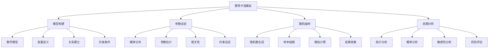

# 蒙特卡洛模拟

## 🎯 学习目标
掌握蒙特卡洛模拟理论和方法，学会运用蒙特卡洛模拟进行风险分析和决策支持，提升决策的科学性和准确性。

## 📊 蒙特卡洛模拟框架

### 模拟要素

## 🏗️ 模型构建

### 数学模型
**模型类型**：
- **确定性模型**：确定性数学模型
- **随机性模型**：随机性数学模型
- **混合模型**：确定性随机混合模型
- **动态模型**：动态数学模型

**模型选择**：
- **问题特征**：根据问题特征选择
- **数据特征**：根据数据特征选择
- **精度要求**：根据精度要求选择
- **计算复杂度**：根据计算复杂度选择

**模型验证**：
- **模型检验**：模型有效性检验
- **参数检验**：参数合理性检验
- **结果检验**：结果合理性检验
- **敏感性检验**：敏感性分析检验

### 变量定义
**变量类型**：
- **输入变量**：模型输入变量
- **输出变量**：模型输出变量
- **中间变量**：模型中间变量
- **控制变量**：模型控制变量

**变量关系**：
- **线性关系**：变量间线性关系
- **非线性关系**：变量间非线性关系
- **相关关系**：变量间相关关系
- **因果关系**：变量间因果关系

**变量约束**：
- **范围约束**：变量取值范围约束
- **逻辑约束**：变量逻辑关系约束
- **物理约束**：物理规律约束
- **经济约束**：经济规律约束

### 关系建立
**函数关系**：
- **显式函数**：显式函数关系
- **隐式函数**：隐式函数关系
- **分段函数**：分段函数关系
- **复合函数**：复合函数关系

**方程关系**：
- **代数方程**：代数方程关系
- **微分方程**：微分方程关系
- **积分方程**：积分方程关系
- **差分方程**：差分方程关系

**逻辑关系**：
- **条件关系**：条件逻辑关系
- **循环关系**：循环逻辑关系
- **分支关系**：分支逻辑关系
- **递归关系**：递归逻辑关系

## ⚙️ 参数设定

### 概率分布
**分布类型**：
- **正态分布**：正态概率分布
- **均匀分布**：均匀概率分布
- **指数分布**：指数概率分布
- **对数正态分布**：对数正态分布

**分布选择**：
- **数据拟合**：根据数据拟合分布
- **理论分析**：根据理论选择分布
- **经验判断**：根据经验选择分布
- **敏感性分析**：通过敏感性分析选择

**分布参数**：
- **均值参数**：分布均值参数
- **方差参数**：分布方差参数
- **形状参数**：分布形状参数
- **位置参数**：分布位置参数

### 参数估计
**估计方法**：
- **矩估计**：矩估计方法
- **最大似然估计**：最大似然估计
- **贝叶斯估计**：贝叶斯估计方法
- **非参数估计**：非参数估计方法

**估计精度**：
- **估计误差**：参数估计误差
- **置信区间**：参数置信区间
- **显著性检验**：参数显著性检验
- **稳健性检验**：估计稳健性检验

**参数更新**：
- **参数修正**：参数修正方法
- **参数优化**：参数优化方法
- **参数验证**：参数验证方法
- **参数调整**：参数调整方法

### 相关性
**相关类型**：
- **线性相关**：线性相关关系
- **非线性相关**：非线性相关关系
- **正相关**：正相关关系
- **负相关**：负相关关系

**相关度量**：
- **相关系数**：相关系数度量
- **协方差**：协方差度量
- **互信息**：互信息度量
- **条件概率**：条件概率度量

**相关建模**：
- **相关矩阵**：相关矩阵建模
- **协方差矩阵**：协方差矩阵建模
- **Copula函数**：Copula函数建模
- **多元分布**：多元分布建模

## 🎲 随机抽样

### 随机数生成
**生成方法**：
- **线性同余法**：线性同余生成器
- **梅森旋转算法**：梅森旋转算法
- **逆变换法**：逆变换方法
- **接受拒绝法**：接受拒绝方法

**随机数质量**：
- **均匀性**：随机数均匀性
- **独立性**：随机数独立性
- **周期性**：随机数周期性
- **相关性**：随机数相关性

**随机数检验**：
- **统计检验**：随机数统计检验
- **均匀性检验**：均匀性检验
- **独立性检验**：独立性检验
- **周期性检验**：周期性检验

### 样本抽取
**抽样方法**：
- **简单随机抽样**：简单随机抽样
- **分层抽样**：分层抽样方法
- **系统抽样**：系统抽样方法
- **整群抽样**：整群抽样方法

**样本大小**：
- **样本容量**：样本容量确定
- **统计功效**：统计功效分析
- **精度要求**：精度要求分析
- **成本考虑**：成本效益分析

**抽样策略**：
- **抽样设计**：抽样设计方案
- **抽样实施**：抽样实施过程
- **抽样监控**：抽样过程监控
- **抽样评估**：抽样效果评估

### 模拟计算
**计算过程**：
- **初始化**：模拟计算初始化
- **迭代计算**：迭代计算过程
- **收敛判断**：收敛性判断
- **结果输出**：计算结果输出

**计算优化**：
- **算法优化**：计算算法优化
- **并行计算**：并行计算技术
- **内存优化**：内存使用优化
- **速度优化**：计算速度优化

**计算精度**：
- **数值精度**：数值计算精度
- **舍入误差**：舍入误差控制
- **截断误差**：截断误差控制
- **累积误差**：累积误差控制

## 📊 结果分析

### 统计分析
**描述统计**：
- **均值分析**：结果均值分析
- **方差分析**：结果方差分析
- **分布分析**：结果分布分析
- **分位数分析**：结果分位数分析

**推断统计**：
- **置信区间**：结果置信区间
- **假设检验**：假设检验分析
- **参数估计**：参数估计分析
- **预测区间**：预测区间分析

**多元分析**：
- **相关分析**：结果相关分析
- **回归分析**：结果回归分析
- **主成分分析**：主成分分析
- **聚类分析**：聚类分析

### 概率分析
**概率分布**：
- **概率密度**：概率密度函数
- **累积概率**：累积概率函数
- **分位数**：概率分位数
- **概率区间**：概率区间分析

**风险度量**：
- **VaR**：风险价值度量
- **CVaR**：条件风险价值
- **期望损失**：期望损失度量
- **最大损失**：最大损失度量

**概率计算**：
- **概率计算**：概率值计算
- **条件概率**：条件概率计算
- **联合概率**：联合概率计算
- **边际概率**：边际概率计算

### 敏感性分析
**敏感性指标**：
- **敏感性系数**：敏感性系数
- **弹性系数**：弹性系数
- **影响因子**：影响因子分析
- **关键变量**：关键变量识别

**敏感性方法**：
- **局部敏感性**：局部敏感性分析
- **全局敏感性**：全局敏感性分析
- **参数敏感性**：参数敏感性分析
- **模型敏感性**：模型敏感性分析

**敏感性应用**：
- **风险识别**：风险因素识别
- **决策支持**：决策支持分析
- **参数优化**：参数优化分析
- **模型改进**：模型改进分析

### 风险评估
**风险识别**：
- **风险识别**：风险因素识别
- **风险分类**：风险类型分类
- **风险等级**：风险等级评估
- **风险概率**：风险概率评估

**风险量化**：
- **风险度量**：风险量化度量
- **风险模型**：风险量化模型
- **风险指标**：风险量化指标
- **风险阈值**：风险阈值设定

**风险管理**：
- **风险控制**：风险控制措施
- **风险转移**：风险转移策略
- **风险规避**：风险规避策略
- **风险接受**：风险接受策略

## 💡 实践应用

### 蒙特卡洛模拟实施流程
1. **问题定义**：定义分析问题
2. **模型构建**：构建数学模型
3. **参数设定**：设定模型参数
4. **模拟计算**：进行模拟计算
5. **结果分析**：分析模拟结果

### 应用领域
**金融领域**：
- **投资组合**：投资组合风险分析
- **期权定价**：期权定价模型
- **信用风险**：信用风险评估
- **市场风险**：市场风险分析

**工程领域**：
- **可靠性分析**：系统可靠性分析
- **质量控制**：质量控制分析
- **设计优化**：设计参数优化
- **故障分析**：故障模式分析

**商业领域**：
- **项目评估**：项目风险评估
- **需求预测**：需求预测分析
- **成本分析**：成本不确定性分析
- **决策支持**：决策支持分析

### 案例分析
**选择案例**：如投资项目风险评估
**分析维度**：
- 模型构建：投资现金流模型、风险因素模型
- 参数设定：收益率分布、成本分布、时间分布
- 模拟计算：蒙特卡洛模拟计算
- 结果分析：风险概率、VaR分析、敏感性分析

## 🧠 学习要点

### 费曼学习法应用
1. **选择概念**：蒙特卡洛模拟
2. **简化解释**：用简单语言解释蒙特卡洛模拟
3. **识别盲点**：找出理解不足的地方
4. **重新学习**：针对盲点深入学习

### 刻意练习要点
- **模型构建**：提升模型构建能力
- **参数设定**：提升参数设定能力
- **模拟计算**：提升模拟计算能力
- **结果分析**：提升结果分析能力

## 🔗 关联学习

### 前置知识
- [[02-敏感性分析]] - 敏感性分析
- [[01-决策树分析]] - 决策树分析
- [[01-风险评估]] - 风险评估

### 后续学习
- [[04-情景规划]] - 情景规划
- [[01-投资组合理论]] - 投资组合理论
- [[01-风险管理]] - 风险管理

### 实践应用
- 风险分析建模
- 决策支持分析
- 不确定性量化
- 预测分析应用

## 🎯 学习检验

### 理解检验
- [ ] 能够理解蒙特卡洛模拟原理
- [ ] 能够构建模拟模型
- [ ] 能够设定模型参数
- [ ] 能够分析模拟结果

### 应用检验
- [ ] 能够构建具体模拟模型
- [ ] 能够进行模拟计算
- [ ] 能够分析风险概率
- [ ] 能够支持决策制定

---
**下一步**：[[04-情景规划]] - 情景规划
