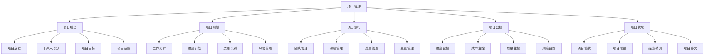

# 项目管理基础

## 🎯 学习目标
掌握项目管理的基本理论和方法，学会项目管理工具和技术，提升项目管理能力。

## 📊 项目管理框架

### 管理要素

## 🚀 项目启动

### 项目章程
**章程内容**：
- **项目背景**：项目背景描述
- **项目目标**：项目目标设定
- **项目范围**：项目范围界定
- **项目约束**：项目约束条件

**章程制定**：
- **需求分析**：项目需求分析
- **目标设定**：项目目标设定
- **范围界定**：项目范围界定
- **约束识别**：项目约束识别

**章程批准**：
- **章程审查**：项目章程审查
- **章程批准**：项目章程批准
- **章程发布**：项目章程发布
- **章程执行**：项目章程执行

### 干系人识别
**干系人类型**：
- **项目发起人**：项目发起人
- **项目团队**：项目团队成员
- **客户**：项目客户
- **供应商**：项目供应商

**干系人分析**：
- **利益分析**：干系人利益分析
- **影响分析**：干系人影响分析
- **期望分析**：干系人期望分析
- **关系分析**：干系人关系分析

**干系人管理**：
- **干系人登记**：干系人登记册
- **沟通计划**：干系人沟通计划
- **参与计划**：干系人参与计划
- **管理策略**：干系人管理策略

### 项目目标
**目标设定**：
- **SMART原则**：目标设定SMART原则
- **目标层次**：目标层次结构
- **目标优先级**：目标优先级排序
- **目标可测量性**：目标可测量性

**目标管理**：
- **目标分解**：目标分解方法
- **目标跟踪**：目标跟踪方法
- **目标调整**：目标调整方法
- **目标评估**：目标评估方法

### 项目范围
**范围定义**：
- **范围说明**：项目范围说明
- **范围边界**：项目范围边界
- **范围标准**：项目范围标准
- **范围验收**：项目范围验收

**范围管理**：
- **范围控制**：项目范围控制
- **范围变更**：项目范围变更
- **范围验证**：项目范围验证
- **范围确认**：项目范围确认

## 📋 项目规划

### 工作分解
**WBS结构**：
- **工作包**：工作包定义
- **工作层级**：工作层级结构
- **工作关系**：工作关系分析
- **工作责任**：工作责任分配

**分解方法**：
- **功能分解**：按功能分解
- **阶段分解**：按阶段分解
- **产品分解**：按产品分解
- **混合分解**：混合分解方法

**分解原则**：
- **完整性**：分解完整性原则
- **独立性**：分解独立性原则
- **可测量性**：分解可测量性原则
- **可管理性**：分解可管理性原则

### 进度计划
**进度规划**：
- **活动定义**：活动定义方法
- **活动排序**：活动排序方法
- **活动估算**：活动估算方法
- **进度制定**：进度制定方法

**进度工具**：
- **甘特图**：甘特图工具
- **网络图**：网络图工具
- **关键路径**：关键路径方法
- **资源平衡**：资源平衡方法

**进度控制**：
- **进度监控**：进度监控方法
- **进度调整**：进度调整方法
- **进度报告**：进度报告方法
- **进度优化**：进度优化方法

### 资源计划
**资源识别**：
- **人力资源**：人力资源识别
- **物质资源**：物质资源识别
- **技术资源**：技术资源识别
- **资金资源**：资金资源识别

**资源规划**：
- **资源需求**：资源需求分析
- **资源分配**：资源分配方法
- **资源平衡**：资源平衡方法
- **资源优化**：资源优化方法

**资源管理**：
- **资源获取**：资源获取方法
- **资源使用**：资源使用方法
- **资源监控**：资源监控方法
- **资源释放**：资源释放方法

### 风险管理
**风险识别**：
- **风险类型**：风险类型识别
- **风险来源**：风险来源识别
- **风险影响**：风险影响识别
- **风险概率**：风险概率识别

**风险评估**：
- **风险分析**：风险分析方法
- **风险等级**：风险等级评估
- **风险优先级**：风险优先级排序
- **风险矩阵**：风险矩阵工具

**风险应对**：
- **风险规避**：风险规避策略
- **风险减轻**：风险减轻策略
- **风险转移**：风险转移策略
- **风险接受**：风险接受策略

## ⚙️ 项目执行

### 团队管理
**团队建设**：
- **团队组建**：团队组建方法
- **团队发展**：团队发展阶段
- **团队激励**：团队激励方法
- **团队协作**：团队协作方法

**团队沟通**：
- **沟通计划**：团队沟通计划
- **沟通方式**：团队沟通方式
- **沟通技巧**：团队沟通技巧
- **沟通效果**：团队沟通效果

**团队绩效**：
- **绩效目标**：团队绩效目标
- **绩效评估**：团队绩效评估
- **绩效改进**：团队绩效改进
- **绩效激励**：团队绩效激励

### 沟通管理
**沟通规划**：
- **沟通需求**：沟通需求分析
- **沟通方式**：沟通方式选择
- **沟通频率**：沟通频率设定
- **沟通责任**：沟通责任分配

**沟通执行**：
- **信息收集**：信息收集方法
- **信息分发**：信息分发方法
- **信息存储**：信息存储方法
- **信息检索**：信息检索方法

**沟通监控**：
- **沟通效果**：沟通效果监控
- **沟通问题**：沟通问题识别
- **沟通改进**：沟通改进方法
- **沟通优化**：沟通优化方法

### 质量管理
**质量规划**：
- **质量标准**：质量标准制定
- **质量目标**：质量目标设定
- **质量计划**：质量计划制定
- **质量责任**：质量责任分配

**质量保证**：
- **质量体系**：质量体系建立
- **质量流程**：质量流程设计
- **质量工具**：质量工具应用
- **质量培训**：质量培训实施

**质量控制**：
- **质量检查**：质量检查方法
- **质量测试**：质量测试方法
- **质量评审**：质量评审方法
- **质量改进**：质量改进方法

### 变更管理
**变更识别**：
- **变更来源**：变更来源识别
- **变更类型**：变更类型识别
- **变更影响**：变更影响分析
- **变更评估**：变更评估方法

**变更控制**：
- **变更申请**：变更申请流程
- **变更审批**：变更审批流程
- **变更实施**：变更实施流程
- **变更验证**：变更验证流程

**变更管理**：
- **变更记录**：变更记录管理
- **变更跟踪**：变更跟踪管理
- **变更报告**：变更报告管理
- **变更学习**：变更学习管理

## 📊 项目监控

### 进度监控
**监控指标**：
- **进度指标**：项目进度指标
- **里程碑**：项目里程碑
- **关键路径**：关键路径监控
- **进度偏差**：进度偏差分析

**监控方法**：
- **进度报告**：进度报告方法
- **进度会议**：进度会议方法
- **进度评审**：进度评审方法
- **进度调整**：进度调整方法

**监控工具**：
- **进度仪表板**：进度仪表板工具
- **进度图表**：进度图表工具
- **进度分析**：进度分析工具
- **进度预测**：进度预测工具

### 成本监控
**监控指标**：
- **成本指标**：项目成本指标
- **预算执行**：预算执行情况
- **成本偏差**：成本偏差分析
- **成本趋势**：成本趋势分析

**监控方法**：
- **成本报告**：成本报告方法
- **成本分析**：成本分析方法
- **成本控制**：成本控制方法
- **成本优化**：成本优化方法

**监控工具**：
- **成本仪表板**：成本仪表板工具
- **成本图表**：成本图表工具
- **成本分析**：成本分析工具
- **成本预测**：成本预测工具

### 质量监控
**监控指标**：
- **质量指标**：项目质量指标
- **质量标准**：质量标准执行
- **质量偏差**：质量偏差分析
- **质量趋势**：质量趋势分析

**监控方法**：
- **质量检查**：质量检查方法
- **质量测试**：质量测试方法
- **质量评审**：质量评审方法
- **质量改进**：质量改进方法

**监控工具**：
- **质量仪表板**：质量仪表板工具
- **质量图表**：质量图表工具
- **质量分析**：质量分析工具
- **质量预测**：质量预测工具

### 风险监控
**监控指标**：
- **风险指标**：项目风险指标
- **风险状态**：风险状态监控
- **风险趋势**：风险趋势分析
- **风险影响**：风险影响分析

**监控方法**：
- **风险检查**：风险检查方法
- **风险评审**：风险评审方法
- **风险报告**：风险报告方法
- **风险应对**：风险应对方法

**监控工具**：
- **风险仪表板**：风险仪表板工具
- **风险图表**：风险图表工具
- **风险分析**：风险分析工具
- **风险预测**：风险预测工具

## 🏁 项目收尾

### 项目验收
**验收准备**：
- **验收标准**：项目验收标准
- **验收计划**：项目验收计划
- **验收团队**：项目验收团队
- **验收流程**：项目验收流程

**验收执行**：
- **功能验收**：功能验收方法
- **性能验收**：性能验收方法
- **质量验收**：质量验收方法
- **文档验收**：文档验收方法

**验收结果**：
- **验收报告**：项目验收报告
- **验收结论**：项目验收结论
- **验收问题**：验收问题处理
- **验收确认**：项目验收确认

### 项目总结
**总结内容**：
- **项目回顾**：项目回顾总结
- **目标达成**：目标达成情况
- **经验教训**：项目经验教训
- **改进建议**：项目改进建议

**总结方法**：
- **总结会议**：项目总结会议
- **总结报告**：项目总结报告
- **总结分析**：项目总结分析
- **总结分享**：项目总结分享

### 经验教训
**经验收集**：
- **成功经验**：项目成功经验
- **失败教训**：项目失败教训
- **最佳实践**：项目最佳实践
- **改进建议**：项目改进建议

**经验应用**：
- **经验分享**：项目经验分享
- **经验传承**：项目经验传承
- **经验应用**：项目经验应用
- **经验创新**：项目经验创新

### 项目移交
**移交准备**：
- **移交计划**：项目移交计划
- **移交清单**：项目移交清单
- **移交标准**：项目移交标准
- **移交流程**：项目移交流程

**移交执行**：
- **产品移交**：项目产品移交
- **文档移交**：项目文档移交
- **知识移交**：项目知识移交
- **责任移交**：项目责任移交

**移交确认**：
- **移交确认**：项目移交确认
- **移交验收**：项目移交验收
- **移交完成**：项目移交完成
- **移交跟踪**：项目移交跟踪

## 💡 实践应用

### 项目管理流程
1. **项目启动**：项目启动阶段
2. **项目规划**：项目规划阶段
3. **项目执行**：项目执行阶段
4. **项目监控**：项目监控阶段
5. **项目收尾**：项目收尾阶段

### 案例分析
**选择案例**：如软件开发项目
**管理维度**：
- 项目启动：项目章程、干系人识别、目标设定、范围界定
- 项目规划：工作分解、进度计划、资源计划、风险管理
- 项目执行：团队管理、沟通管理、质量管理、变更管理
- 项目监控：进度监控、成本监控、质量监控、风险监控
- 项目收尾：项目验收、项目总结、经验教训、项目移交

## 🧠 学习要点

### 费曼学习法应用
1. **选择概念**：项目管理
2. **简化解释**：用简单语言解释项目管理
3. **识别盲点**：找出理解不足的地方
4. **重新学习**：针对盲点深入学习

### 刻意练习要点
- **管理框架**：掌握项目管理框架
- **管理方法**：掌握项目管理方法
- **管理工具**：掌握项目管理工具
- **管理技能**：掌握项目管理技能

## 🔗 关联学习

### 前置知识
- [[01-商业学概论]] - 商业学基础
- [[01-运营管理概论]] - 运营管理
- [[01-战略管理概论]] - 战略管理

### 后续学习
- [[02-敏捷管理]] - 敏捷管理
- [[03-风险管理]] - 风险管理
- [[04-变更管理]] - 变更管理

### 实践应用
- 项目规划管理
- 项目执行管理
- 项目监控管理
- 项目收尾管理

## 🎯 学习检验

### 理解检验
- [ ] 能够解释项目管理概念
- [ ] 能够掌握项目管理框架
- [ ] 能够应用项目管理方法
- [ ] 能够使用项目管理工具

### 应用检验
- [ ] 能够规划具体项目
- [ ] 能够执行项目管理
- [ ] 能够监控项目进展
- [ ] 能够收尾项目工作

---
**下一步**：[[02-敏捷管理]] - 敏捷管理
