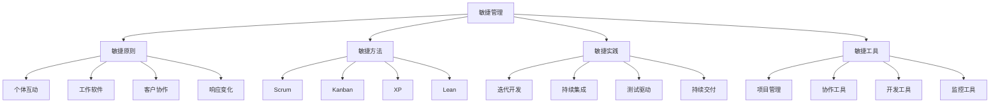

# 敏捷管理

## 🎯 学习目标
掌握敏捷管理理论和方法，学会运用敏捷管理提升项目效率和团队协作，适应快速变化的环境需求。

## 📊 敏捷管理框架

### 管理要素

## 🎯 敏捷原则

### 个体互动
**团队协作**：
- **自组织团队**：自组织团队建设
- **跨职能团队**：跨职能团队协作
- **团队沟通**：团队沟通机制
- **团队信任**：团队信任建立

**个体价值**：
- **个体尊重**：个体价值尊重
- **个体发展**：个体能力发展
- **个体激励**：个体动机激励
- **个体责任**：个体责任承担

**互动机制**：
- **面对面沟通**：面对面沟通优先
- **开放沟通**：开放透明沟通
- **反馈机制**：及时反馈机制
- **冲突解决**：冲突解决机制

### 工作软件
**软件价值**：
- **可工作软件**：可工作软件交付
- **软件质量**：软件质量保证
- **软件测试**：软件测试驱动
- **软件维护**：软件维护管理

**交付节奏**：
- **频繁交付**：频繁软件交付
- **增量交付**：增量功能交付
- **持续交付**：持续交付流程
- **价值交付**：价值导向交付

**质量保证**：
- **质量内建**：质量内建机制
- **持续测试**：持续测试实践
- **代码质量**：代码质量管理
- **技术债务**：技术债务管理

### 客户协作
**客户参与**：
- **客户参与**：客户全程参与
- **需求理解**：需求深度理解
- **反馈收集**：客户反馈收集
- **价值确认**：价值确认机制

**协作方式**：
- **定期沟通**：定期客户沟通
- **演示反馈**：演示反馈机制
- **需求调整**：需求调整机制
- **期望管理**：客户期望管理

**价值创造**：
- **价值识别**：客户价值识别
- **价值交付**：客户价值交付
- **价值验证**：客户价值验证
- **价值优化**：客户价值优化

### 响应变化
**变化适应**：
- **变化接受**：变化接受态度
- **变化响应**：快速变化响应
- **变化学习**：变化学习能力
- **变化创新**：变化创新实践

**灵活机制**：
- **灵活计划**：灵活计划制定
- **灵活执行**：灵活执行机制
- **灵活调整**：灵活调整机制
- **灵活决策**：灵活决策机制

**持续改进**：
- **持续学习**：持续学习机制
- **持续优化**：持续优化实践
- **持续创新**：持续创新实践
- **持续适应**：持续适应能力

## 🚀 敏捷方法

### Scrum
**Scrum框架**：
- **角色定义**：Scrum角色定义
- **事件安排**：Scrum事件安排
- **工件管理**：Scrum工件管理
- **规则遵循**：Scrum规则遵循

**Scrum角色**：
- **Product Owner**：产品负责人
- **Scrum Master**：Scrum主管
- **Development Team**：开发团队
- **Stakeholders**：利益相关者

**Scrum事件**：
- **Sprint Planning**：冲刺计划
- **Daily Scrum**：每日站会
- **Sprint Review**：冲刺评审
- **Sprint Retrospective**：冲刺回顾

**Scrum工件**：
- **Product Backlog**：产品待办事项
- **Sprint Backlog**：冲刺待办事项
- **Increment**：增量产品
- **Definition of Done**：完成定义

### Kanban
**Kanban原则**：
- **可视化工作**：工作流程可视化
- **限制在制品**：限制在制品数量
- **管理工作流**：管理工作流程
- **持续改进**：持续改进实践

**Kanban板**：
- **看板设计**：看板设计原则
- **列定义**：看板列定义
- **卡片管理**：卡片管理方法
- **流程优化**：流程优化实践

**Kanban指标**：
- **周期时间**：周期时间指标
- **吞吐量**：吞吐量指标
- **在制品**：在制品指标
- **效率指标**：效率相关指标

**Kanban实践**：
- **拉动系统**：拉动式生产
- **连续流**：连续流管理
- **瓶颈识别**：瓶颈识别管理
- **流程改进**：流程改进实践

### XP
**XP价值观**：
- **沟通**：团队沟通价值
- **简单**：简单设计价值
- **反馈**：及时反馈价值
- **勇气**：面对变化勇气

**XP实践**：
- **结对编程**：结对编程实践
- **测试驱动**：测试驱动开发
- **重构**：代码重构实践
- **持续集成**：持续集成实践

**XP技术**：
- **单元测试**：单元测试技术
- **集成测试**：集成测试技术
- **验收测试**：验收测试技术
- **自动化测试**：自动化测试技术

**XP管理**：
- **计划游戏**：计划游戏方法
- **小发布**：小发布策略
- **隐喻**：系统隐喻使用
- **编码标准**：编码标准制定

### Lean
**Lean原则**：
- **价值定义**：价值定义原则
- **价值流**：价值流分析
- **流动**：价值流动管理
- **拉动**：拉动式生产

**浪费消除**：
- **过度生产**：消除过度生产
- **等待时间**：消除等待时间
- **运输浪费**：消除运输浪费
- **库存浪费**：消除库存浪费

**流程优化**：
- **流程分析**：流程分析技术
- **流程改进**：流程改进方法
- **流程标准化**：流程标准化
- **流程监控**：流程监控机制

**持续改进**：
- **Kaizen**：持续改进文化
- **PDCA循环**：PDCA改进循环
- **5S管理**：5S现场管理
- **价值工程**：价值工程方法

## 🛠️ 敏捷实践

### 迭代开发
**迭代规划**：
- **迭代周期**：迭代周期设定
- **迭代目标**：迭代目标设定
- **迭代计划**：迭代计划制定
- **迭代资源**：迭代资源配置

**迭代执行**：
- **迭代执行**：迭代执行管理
- **迭代监控**：迭代执行监控
- **迭代调整**：迭代计划调整
- **迭代交付**：迭代成果交付

**迭代回顾**：
- **迭代回顾**：迭代回顾会议
- **经验总结**：经验教训总结
- **改进建议**：改进建议提出
- **下轮规划**：下轮迭代规划

### 持续集成
**集成策略**：
- **频繁集成**：频繁代码集成
- **自动化集成**：自动化集成流程
- **快速反馈**：快速集成反馈
- **质量保证**：集成质量保证

**集成工具**：
- **版本控制**：版本控制工具
- **构建工具**：自动化构建工具
- **测试工具**：自动化测试工具
- **部署工具**：自动化部署工具

**集成管理**：
- **集成监控**：集成过程监控
- **集成报告**：集成状态报告
- **集成优化**：集成流程优化
- **集成维护**：集成系统维护

### 测试驱动
**TDD实践**：
- **红绿重构**：红绿重构循环
- **测试先行**：测试先行开发
- **测试覆盖**：测试覆盖率管理
- **测试质量**：测试质量保证

**测试策略**：
- **单元测试**：单元测试策略
- **集成测试**：集成测试策略
- **系统测试**：系统测试策略
- **验收测试**：验收测试策略

**测试管理**：
- **测试计划**：测试计划制定
- **测试执行**：测试执行管理
- **测试报告**：测试报告生成
- **测试改进**：测试过程改进

### 持续交付
**交付流程**：
- **自动化构建**：自动化构建流程
- **自动化测试**：自动化测试流程
- **自动化部署**：自动化部署流程
- **自动化监控**：自动化监控流程

**交付策略**：
- **蓝绿部署**：蓝绿部署策略
- **金丝雀发布**：金丝雀发布策略
- **功能开关**：功能开关策略
- **回滚机制**：快速回滚机制

**交付管理**：
- **交付监控**：交付过程监控
- **交付质量**：交付质量保证
- **交付优化**：交付流程优化
- **交付改进**：交付能力改进

## 🔧 敏捷工具

### 项目管理
**项目管理工具**：
- **Jira**：Jira项目管理
- **Azure DevOps**：Azure DevOps
- **Trello**：Trello看板管理
- **Asana**：Asana任务管理

**工具选择**：
- **需求分析**：工具需求分析
- **功能对比**：工具功能对比
- **成本评估**：工具成本评估
- **团队适配**：团队适配性评估

**工具实施**：
- **工具部署**：工具部署实施
- **团队培训**：团队工具培训
- **流程适配**：流程工具适配
- **效果评估**：工具效果评估

### 协作工具
**沟通工具**：
- **Slack**：Slack团队沟通
- **Microsoft Teams**：Teams协作
- **钉钉**：钉钉企业沟通
- **飞书**：飞书协作平台

**文档工具**：
- **Confluence**：Confluence文档
- **Notion**：Notion知识管理
- **语雀**：语雀文档协作
- **石墨文档**：石墨文档协作

**会议工具**：
- **Zoom**：Zoom视频会议
- **腾讯会议**：腾讯会议
- **钉钉会议**：钉钉会议
- **飞书会议**：飞书会议

### 开发工具
**开发环境**：
- **IDE工具**：集成开发环境
- **代码编辑器**：代码编辑器
- **版本控制**：Git版本控制
- **包管理**：包管理工具

**测试工具**：
- **单元测试**：单元测试工具
- **集成测试**：集成测试工具
- **性能测试**：性能测试工具
- **安全测试**：安全测试工具

**部署工具**：
- **容器化**：Docker容器化
- **编排工具**：Kubernetes编排
- **CI/CD**：CI/CD工具链
- **监控工具**：应用监控工具

### 监控工具
**性能监控**：
- **APM工具**：应用性能监控
- **系统监控**：系统资源监控
- **日志监控**：日志分析监控
- **业务监控**：业务指标监控

**质量监控**：
- **代码质量**：代码质量监控
- **测试质量**：测试质量监控
- **交付质量**：交付质量监控
- **用户反馈**：用户反馈监控

**监控管理**：
- **监控策略**：监控策略制定
- **告警机制**：告警机制设置
- **监控优化**：监控系统优化
- **监控改进**：监控能力改进

## 💡 实践应用

### 敏捷管理实施流程
1. **敏捷准备**：敏捷转型准备
2. **方法选择**：敏捷方法选择
3. **团队建设**：敏捷团队建设
4. **实践实施**：敏捷实践实施
5. **持续改进**：持续改进优化

### 应用领域
**软件开发**：
- **产品开发**：软件产品开发
- **系统集成**：系统集成项目
- **定制开发**：定制软件开发
- **维护升级**：软件维护升级

**项目管理**：
- **项目管理**：通用项目管理
- **产品管理**：产品项目管理
- **运营管理**：运营项目管理
- **创新管理**：创新项目管理

**组织管理**：
- **组织转型**：组织敏捷转型
- **团队管理**：敏捷团队管理
- **文化变革**：敏捷文化变革
- **能力建设**：敏捷能力建设

### 案例分析
**选择案例**：如Spotify敏捷实践
**分析维度**：
- 敏捷原则：个体互动、工作软件、客户协作、响应变化
- 敏捷方法：Scrum、Kanban、XP、Lean
- 敏捷实践：迭代开发、持续集成、测试驱动、持续交付
- 敏捷工具：项目管理、协作工具、开发工具、监控工具

## 🧠 学习要点

### 费曼学习法应用
1. **选择概念**：敏捷管理
2. **简化解释**：用简单语言解释敏捷管理
3. **识别盲点**：找出理解不足的地方
4. **重新学习**：针对盲点深入学习

### 刻意练习要点
- **原则理解**：理解敏捷原则
- **方法掌握**：掌握敏捷方法
- **实践应用**：应用敏捷实践
- **工具使用**：熟练使用敏捷工具

## 🔗 关联学习

### 前置知识
- [[01-项目管理基础]] - 项目管理基础
- [[01-团队管理]] - 团队管理
- [[01-流程设计与管理]] - 流程管理

### 后续学习
- [[03-风险管理]] - 风险管理
- [[04-变更管理]] - 变更管理
- [[01-数字化转型]] - 数字化转型

### 实践应用
- 敏捷项目管理
- 敏捷团队建设
- 敏捷流程优化
- 敏捷组织转型

## 🎯 学习检验

### 理解检验
- [ ] 能够理解敏捷原则
- [ ] 能够掌握敏捷方法
- [ ] 能够应用敏捷实践
- [ ] 能够使用敏捷工具

### 应用检验
- [ ] 能够实施敏捷管理
- [ ] 能够建设敏捷团队
- [ ] 能够优化敏捷流程
- [ ] 能够改进敏捷效果

---
**下一步**：[[03-风险管理]] - 风险管理
