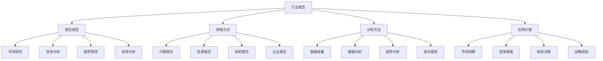

# 行业报告

## 🎯 学习目标
了解行业报告类型和获取方式，学会通过行业报告分析市场趋势和竞争格局，提升行业认知和商业洞察能力。

## 📊 行业报告框架

### 报告要素

## 📋 报告类型

### 市场研究
**市场规模**：
- **总体规模**：行业总体市场规模
- **细分市场**：细分市场规模分析
- **区域市场**：区域市场规模分析
- **增长趋势**：市场规模增长趋势

**市场结构**：
- **市场集中度**：市场集中度分析
- **竞争格局**：市场竞争格局
- **价值链**：行业价值链分析
- **盈利模式**：行业盈利模式

**消费者分析**：
- **消费者画像**：目标消费者画像
- **消费行为**：消费者行为分析
- **消费趋势**：消费趋势分析
- **消费偏好**：消费者偏好分析

**渠道分析**：
- **销售渠道**：销售渠道分析
- **渠道效率**：渠道效率分析
- **渠道趋势**：渠道发展趋势
- **渠道创新**：渠道创新模式

### 竞争分析
**竞争对手**：
- **主要竞争对手**：主要竞争对手分析
- **竞争地位**：竞争地位分析
- **竞争优势**：竞争优势分析
- **竞争劣势**：竞争劣势分析

**竞争策略**：
- **价格策略**：价格竞争策略
- **产品策略**：产品竞争策略
- **营销策略**：营销竞争策略
- **渠道策略**：渠道竞争策略

**竞争动态**：
- **竞争变化**：竞争格局变化
- **新进入者**：新进入者分析
- **退出者**：退出者分析
- **并购重组**：并购重组分析

**竞争趋势**：
- **竞争趋势**：竞争发展趋势
- **竞争强度**：竞争强度变化
- **竞争模式**：竞争模式变化
- **竞争创新**：竞争创新趋势

### 趋势预测
**技术趋势**：
- **技术发展**：技术发展趋势
- **技术突破**：技术突破预测
- **技术应用**：技术应用趋势
- **技术标准**：技术标准趋势

**市场趋势**：
- **需求趋势**：市场需求趋势
- **供给趋势**：市场供给趋势
- **价格趋势**：市场价格趋势
- **结构趋势**：市场结构趋势

**政策趋势**：
- **政策方向**：政策发展方向
- **政策影响**：政策影响预测
- **政策变化**：政策变化预测
- **政策机会**：政策机会分析

**社会趋势**：
- **社会变化**：社会变化趋势
- **文化趋势**：文化发展趋势
- **生活方式**：生活方式变化
- **价值观念**：价值观念变化

### 投资分析
**投资机会**：
- **投资热点**：投资热点分析
- **投资机会**：投资机会识别
- **投资风险**：投资风险分析
- **投资回报**：投资回报预测

**投资环境**：
- **宏观环境**：宏观投资环境
- **行业环境**：行业投资环境
- **政策环境**：政策投资环境
- **市场环境**：市场投资环境

**投资策略**：
- **投资策略**：投资策略建议
- **投资时机**：投资时机分析
- **投资方式**：投资方式选择
- **投资组合**：投资组合建议

**投资案例**：
- **成功案例**：成功投资案例
- **失败案例**：失败投资案例
- **案例分析**：投资案例分析
- **经验总结**：投资经验总结

## 🎯 获取方式

### 付费报告
**专业机构**：
- **咨询公司**：麦肯锡、贝恩、BCG等
- **研究机构**：艾瑞、易观、QuestMobile等
- **投资银行**：高盛、摩根士丹利、瑞银等
- **评级机构**：标普、穆迪、惠誉等

**报告特点**：
- **数据权威**：数据来源权威
- **分析深入**：分析内容深入
- **更新及时**：更新频率及时
- **专业性强**：专业性强

**获取渠道**：
- **官网购买**：官方网站购买
- **代理渠道**：代理机构购买
- **订阅服务**：订阅服务获取
- **定制报告**：定制报告服务

**成本考虑**：
- **价格较高**：价格相对较高
- **价值评估**：价值评估重要
- **预算规划**：预算规划重要
- **ROI分析**：投资回报分析

### 免费报告
**政府机构**：
- **统计局**：国家统计局报告
- **商务部**：商务部行业报告
- **工信部**：工信部行业报告
- **发改委**：发改委行业报告

**行业协会**：
- **行业组织**：行业协会报告
- **专业协会**：专业协会报告
- **商会组织**：商会组织报告
- **联盟组织**：联盟组织报告

**企业发布**：
- **上市公司**：上市公司年报
- **企业白皮书**：企业白皮书
- **企业研究**：企业研究报告
- **企业观点**：企业观点报告

**学术机构**：
- **大学研究**：大学研究报告
- **研究机构**：研究机构报告
- **智库报告**：智库研究报告
- **学术论文**：学术论文报告

### 政府报告
**政策报告**：
- **政策解读**：政策解读报告
- **政策影响**：政策影响分析
- **政策趋势**：政策趋势分析
- **政策建议**：政策建议报告

**统计报告**：
- **统计数据**：统计数据报告
- **统计分析**：统计分析报告
- **统计趋势**：统计趋势分析
- **统计预测**：统计预测报告

**规划报告**：
- **发展规划**：发展规划报告
- **产业规划**：产业规划报告
- **区域规划**：区域规划报告
- **专项规划**：专项规划报告

**监管报告**：
- **监管政策**：监管政策报告
- **监管动态**：监管动态报告
- **监管趋势**：监管趋势分析
- **监管建议**：监管建议报告

### 企业报告
**年报季报**：
- **年度报告**：企业年度报告
- **季度报告**：企业季度报告
- **中期报告**：企业中期报告
- **临时报告**：企业临时报告

**战略报告**：
- **战略规划**：企业战略规划
- **战略执行**：战略执行报告
- **战略调整**：战略调整报告
- **战略评估**：战略评估报告

**业务报告**：
- **业务分析**：业务分析报告
- **业务发展**：业务发展报告
- **业务创新**：业务创新报告
- **业务转型**：业务转型报告

**社会责任**：
- **社会责任报告**：企业社会责任报告
- **可持续发展**：可持续发展报告
- **ESG报告**：ESG报告
- **公益报告**：公益事业报告

## 🔍 分析方法

### 数据收集
**数据来源**：
- **一手数据**：调研获得一手数据
- **二手数据**：公开二手数据
- **内部数据**：企业内部数据
- **外部数据**：外部机构数据

**数据质量**：
- **数据准确性**：数据准确性验证
- **数据完整性**：数据完整性检查
- **数据时效性**：数据时效性评估
- **数据可靠性**：数据可靠性评估

**数据整理**：
- **数据清洗**：数据清洗处理
- **数据标准化**：数据标准化处理
- **数据分类**：数据分类整理
- **数据存储**：数据存储管理

### 数据分析
**描述性分析**：
- **数据描述**：数据基本描述
- **趋势分析**：数据趋势分析
- **分布分析**：数据分布分析
- **对比分析**：数据对比分析

**推断性分析**：
- **相关分析**：数据相关分析
- **回归分析**：数据回归分析
- **因子分析**：数据因子分析
- **聚类分析**：数据聚类分析

**预测性分析**：
- **时间序列**：时间序列分析
- **趋势预测**：趋势预测分析
- **模型预测**：模型预测分析
- **情景分析**：情景分析预测

### 趋势分析
**趋势识别**：
- **上升趋势**：上升趋势识别
- **下降趋势**：下降趋势识别
- **波动趋势**：波动趋势识别
- **周期趋势**：周期趋势识别

**趋势分析**：
- **趋势强度**：趋势强度分析
- **趋势持续性**：趋势持续性分析
- **趋势变化点**：趋势变化点分析
- **趋势影响因素**：趋势影响因素分析

**趋势预测**：
- **短期预测**：短期趋势预测
- **中期预测**：中期趋势预测
- **长期预测**：长期趋势预测
- **情景预测**：情景趋势预测

### 结论提炼
**关键发现**：
- **重要发现**：重要发现提炼
- **关键洞察**：关键洞察提炼
- **核心结论**：核心结论提炼
- **主要建议**：主要建议提炼

**结论验证**：
- **数据支撑**：数据支撑验证
- **逻辑验证**：逻辑推理验证
- **案例验证**：案例验证分析
- **专家验证**：专家意见验证

**结论应用**：
- **决策支持**：决策支持应用
- **战略制定**：战略制定应用
- **投资决策**：投资决策应用
- **风险控制**：风险控制应用

## 💡 应用价值

### 市场洞察
**市场机会**：
- **机会识别**：市场机会识别
- **机会评估**：市场机会评估
- **机会把握**：市场机会把握
- **机会创造**：市场机会创造

**市场风险**：
- **风险识别**：市场风险识别
- **风险评估**：市场风险评估
- **风险控制**：市场风险控制
- **风险应对**：市场风险应对

**市场定位**：
- **定位分析**：市场定位分析
- **定位策略**：市场定位策略
- **定位实施**：市场定位实施
- **定位调整**：市场定位调整

### 竞争情报
**竞争分析**：
- **竞争格局**：竞争格局分析
- **竞争策略**：竞争策略分析
- **竞争优势**：竞争优势分析
- **竞争威胁**：竞争威胁分析

**竞争应对**：
- **竞争策略**：竞争应对策略
- **竞争合作**：竞争合作策略
- **竞争创新**：竞争创新策略
- **竞争防御**：竞争防御策略

**竞争预测**：
- **竞争趋势**：竞争趋势预测
- **竞争变化**：竞争变化预测
- **竞争机会**：竞争机会预测
- **竞争风险**：竞争风险预测

### 投资决策
**投资分析**：
- **投资机会**：投资机会分析
- **投资风险**：投资风险分析
- **投资回报**：投资回报分析
- **投资时机**：投资时机分析

**投资策略**：
- **投资策略**：投资策略制定
- **投资组合**：投资组合优化
- **投资管理**：投资管理策略
- **投资退出**：投资退出策略

**投资执行**：
- **投资实施**：投资实施执行
- **投资监控**：投资监控管理
- **投资调整**：投资调整优化
- **投资评估**：投资效果评估

### 战略规划
**战略分析**：
- **环境分析**：外部环境分析
- **资源分析**：内部资源分析
- **能力分析**：核心能力分析
- **优势分析**：竞争优势分析

**战略制定**：
- **战略目标**：战略目标制定
- **战略选择**：战略选择决策
- **战略规划**：战略规划制定
- **战略实施**：战略实施计划

**战略执行**：
- **战略实施**：战略实施执行
- **战略监控**：战略监控管理
- **战略调整**：战略调整优化
- **战略评估**：战略效果评估

## 🧠 学习要点

### 费曼学习法应用
1. **选择概念**：行业报告
2. **简化解释**：用简单语言解释行业报告
3. **识别盲点**：找出理解不足的地方
4. **重新学习**：针对盲点深入学习

### 刻意练习要点
- **报告获取**：提升报告获取能力
- **数据分析**：提升数据分析能力
- **趋势分析**：提升趋势分析能力
- **结论提炼**：提升结论提炼能力

## 🔗 关联学习

### 前置知识
- [[02-实习机会]] - 实习机会
- [[01-商业环境分析]] - 商业环境分析
- [[01-竞争环境分析]] - 竞争环境分析

### 后续学习
- [[01-投资决策]] - 投资决策
- [[01-战略管理概论]] - 战略管理
- [[01-市场调研方法]] - 市场调研

### 实践应用
- 行业分析实践
- 竞争分析实践
- 投资分析实践
- 战略规划实践

## 🎯 学习检验

### 理解检验
- [ ] 能够了解各类行业报告
- [ ] 能够获取行业报告
- [ ] 能够分析行业报告
- [ ] 能够应用行业报告

### 应用检验
- [ ] 能够选择合适的报告
- [ ] 能够分析报告数据
- [ ] 能够提炼关键结论
- [ ] 能够支持决策制定

---
**下一步**：[[01-投资决策]] - 投资决策
