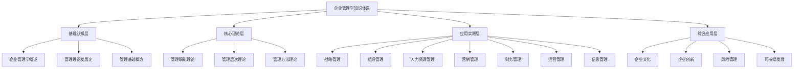

# 企业管理学学习路径图

## 📚 学习路径概览

## 🎯 学习阶段规划

### 第一阶段：基础认知（1-2周）
- **目标**：建立企业管理学基本概念框架
- **重点**：理解管理的本质、发展历程和基础理论
- **产出**：[[企业管理学定义与内涵]]、[[管理理论演进脉络图]]

### 第二阶段：核心理论（2-3周）
- **目标**：掌握管理职能、层次和方法理论
- **重点**：深入理解计划、组织、领导、控制四大职能
- **产出**：[[管理职能整合]]、[[思维导图-管理职能理论]]

### 第三阶段：应用实践（4-6周）
- **目标**：掌握各管理领域的实践技能
- **重点**：战略制定、组织设计、人力资源管理等
- **产出**：各模块的[[实践练习]]和[[工具实操指南]]

### 第四阶段：综合应用（2-3周）
- **目标**：整合知识，形成综合管理能力
- **重点**：企业文化、创新管理、风险管理等
- **产出**：[[综合案例分析]]、[[知识体系总结]]

## 📈 学习进度跟踪

| 阶段 | 模块 | 预计时间 | 完成状态 | 掌握程度 |
|------|------|----------|----------|----------|
| 基础认知 | 企业管理学概述 | 3天 | ⏳ | - |
| 基础认知 | 管理理论发展史 | 4天 | ⏳ | - |
| 基础认知 | 管理基础概念 | 3天 | ⏳ | - |
| 核心理论 | 管理职能理论 | 5天 | ⏳ | - |
| 核心理论 | 管理层次理论 | 3天 | ⏳ | - |
| 核心理论 | 管理方法理论 | 4天 | ⏳ | - |

## 🔗 相关链接

- [[知识难度标识]] - 了解各模块学习难度
- [[学习进度跟踪]] - 记录学习进度
- [[学习目标设定]] - 制定个人学习目标
- [[知识体系总览]] - 整体知识框架

## 💡 学习建议

1. **循序渐进**：按照路径图顺序学习，确保基础扎实
2. **理论结合实践**：每个模块都要完成相应的实践练习
3. **定期复习**：使用[[知识卡片]]和[[记忆口诀]]巩固记忆
4. **案例学习**：通过[[经典案例]]和[[失败案例]]加深理解
5. **工具应用**：熟练掌握各种[[分析工具]]和[[决策工具]]

---
*更新时间：2024年*
*学习路径图将根据学习进度动态调整*
