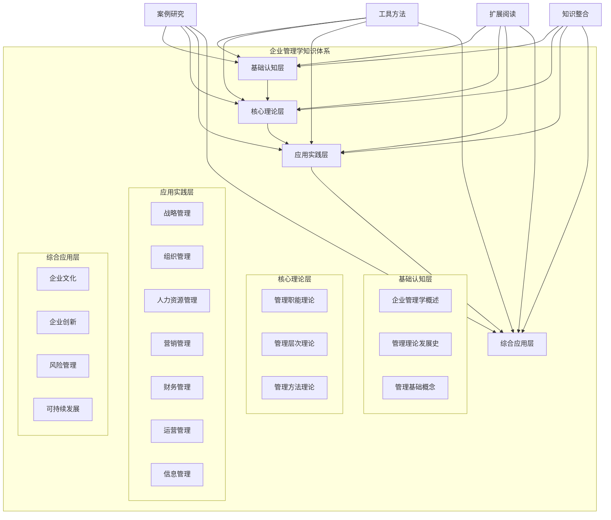

# 知识体系总览

## 🏗️ 整体架构图



## 📚 知识体系结构

### 第一层：基础认知层
**目标**：建立企业管理学基本概念框架
**特点**：概念性、基础性、理论性
**内容**：
- [[企业管理学概述]] - 学科定义、特征、体系
- [[管理理论发展史]] - 理论演进、发展脉络
- [[管理基础概念]] - 基本概念、角色技能、环境伦理

### 第二层：核心理论层
**目标**：掌握管理核心理论和原理
**特点**：理论性、系统性、逻辑性
**内容**：
- [[管理职能理论]] - 计划、组织、领导、控制
- [[管理层次理论]] - 战略、战术、作业管理
- [[管理方法理论]] - 系统、权变、科学、人本管理

### 第三层：应用实践层
**目标**：掌握各管理领域的实践技能
**特点**：实践性、应用性、技能性
**内容**：
- [[战略管理]] - 战略分析、制定、实施
- [[组织管理]] - 结构设计、行为分析、组织发展
- [[人力资源管理]] - 规划、招聘、培训、绩效、薪酬
- [[营销管理]] - 市场分析、策略制定、客户关系
- [[财务管理]] - 财务分析、投资决策、融资决策
- [[运营管理]] - 生产管理、质量管理、供应链管理
- [[信息管理]] - 信息系统、数据管理、数字化转型

### 第四层：综合应用层
**目标**：整合知识，形成综合管理能力
**特点**：综合性、整合性、创新性
**内容**：
- [[企业文化]] - 文化内涵、类型、建设、管理
- [[企业创新]] - 创新理论、类型、过程、绩效
- [[风险管理]] - 风险识别、控制、预警、体系
- [[可持续发展]] - 理念、战略、实践、评估

## 🔗 知识关联网络

### 横向关联
- **理论联系**：各层理论相互支撑，形成完整体系
- **方法互通**：不同领域的方法可以相互借鉴
- **工具共享**：管理工具可以跨领域应用

### 纵向关联
- **层次递进**：从基础到应用，层层深入
- **能力提升**：从认知到实践，能力逐步提升
- **知识整合**：从分散到整合，形成综合能力

## 📊 知识体系统计

### 模块分布
| 层级 | 模块数 | 占比 | 主要特点 |
|------|--------|------|----------|
| 基础认知层 | 3 | 12.5% | 概念性、基础性 |
| 核心理论层 | 3 | 12.5% | 理论性、系统性 |
| 应用实践层 | 7 | 29.2% | 实践性、应用性 |
| 综合应用层 | 4 | 16.7% | 综合性、整合性 |
| 支撑模块 | 7 | 29.1% | 辅助性、支撑性 |
| **总计** | **24** | **100%** | **完整体系** |

### 知识点分布
| 类型 | 数量 | 占比 | 说明 |
|------|------|------|------|
| 基础概念 | 50+ | 25% | 基本概念和定义 |
| 理论原理 | 60+ | 30% | 管理理论和原理 |
| 实践技能 | 70+ | 35% | 实践技能和方法 |
| 工具方法 | 20+ | 10% | 管理工具和技巧 |
| **总计** | **200+** | **100%** | **完整知识体系** |

## 🎯 学习路径规划

### 学习顺序
1. **基础认知层** → 2. **核心理论层** → 3. **应用实践层** → 4. **综合应用层**

### 学习重点
- **基础阶段**：建立概念框架，理解基本原理
- **理论阶段**：深入理解理论，掌握核心原理
- **实践阶段**：掌握实践技能，提高应用能力
- **综合阶段**：整合知识体系，形成综合能力

### 学习策略
- **循序渐进**：按照层次顺序学习
- **理论结合实践**：理论与实践相结合
- **案例学习**：通过案例加深理解
- **工具应用**：熟练掌握管理工具

## 📈 能力发展路径

### 认知能力发展
```
基础概念 → 理论理解 → 实践应用 → 综合创新
```

### 技能能力发展
```
概念识别 → 理论分析 → 实践操作 → 综合管理
```

### 思维能力发展
```
线性思维 → 系统思维 → 创新思维 → 战略思维
```

## 🔍 知识体系特点

### 1. 系统性
- **完整体系**：覆盖企业管理学各个领域
- **逻辑清晰**：层次分明，逻辑严密
- **结构合理**：从基础到应用，层层递进

### 2. 实用性
- **理论指导**：理论指导实践
- **实践验证**：实践验证理论
- **工具支撑**：工具支撑应用

### 3. 创新性
- **前沿理论**：包含最新管理理论
- **创新方法**：提供创新管理方法
- **发展趋势**：关注管理发展趋势

### 4. 可操作性
- **具体方法**：提供具体操作方法
- **实用工具**：提供实用管理工具
- **案例指导**：提供案例指导

## 🎓 学习成果预期

### 知识成果
- 掌握200+个知识点
- 理解24个核心模块
- 熟悉15+个管理工具

### 能力成果
- 具备系统思维能力
- 具备实践应用能力
- 具备综合分析能力

### 技能成果
- 能够独立分析问题
- 能够制定解决方案
- 能够指导实践应用

## 🔗 相关链接

- [[学习路径图]] - 查看完整学习路径
- [[知识难度标识]] - 了解各模块难度
- [[学习进度跟踪]] - 记录学习进度
- [[学习目标设定]] - 制定个人学习目标

---
*更新时间：2024年*
*知识体系将根据学习反馈持续优化*
