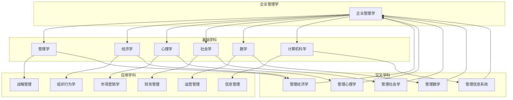
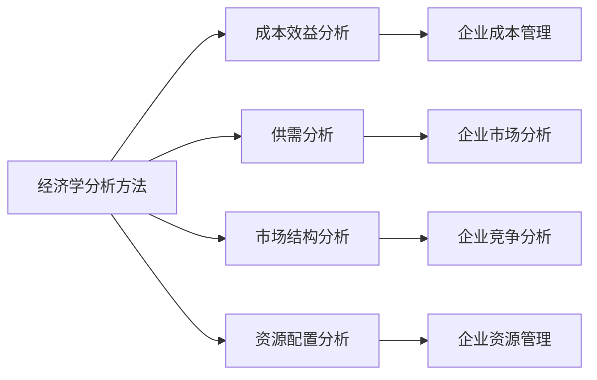
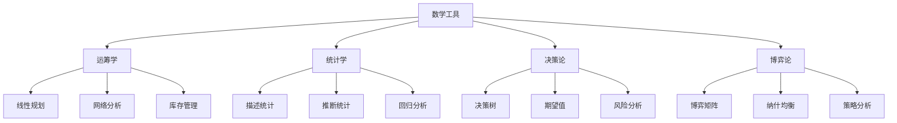
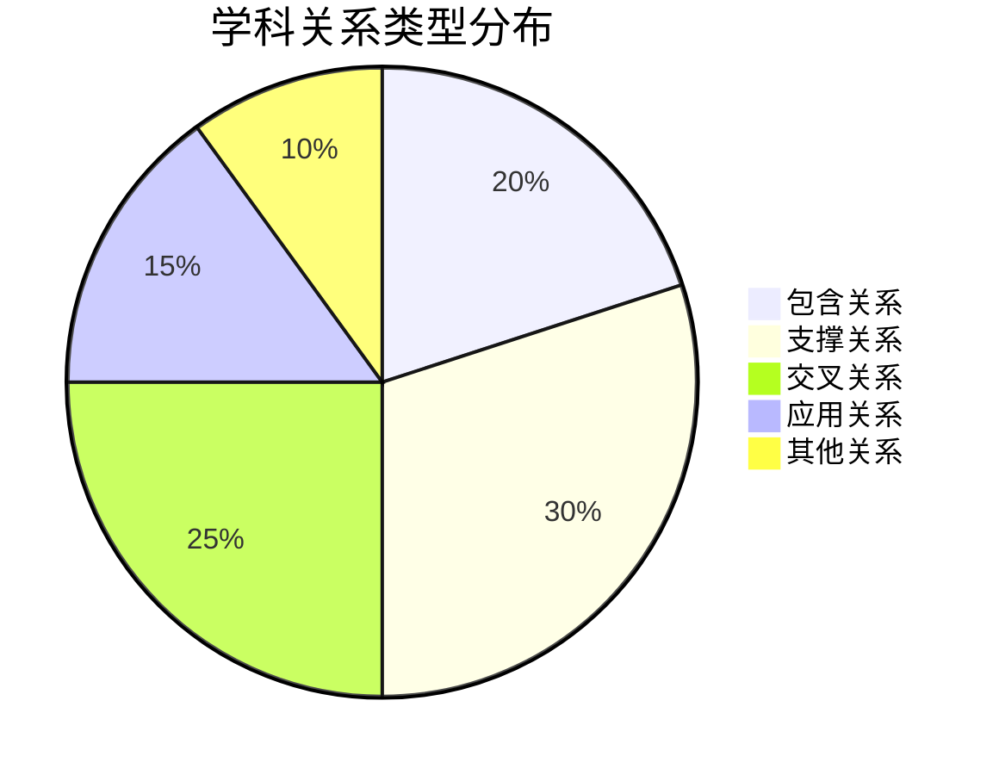

# 企业管理学与其他学科关系

## 🔗 学科关系网络图

### 整体关系结构
企业管理学与其他学科形成复杂的网络关系：

## 📚 与基础学科的关系

### 1. 与管理学的关系

#### 包含关系
- **企业管理学**是**管理学**的重要分支
- **管理学**为**企业管理学**提供理论基础
- **企业管理学**将**管理学**理论应用于企业实践

#### 理论支撑
| 管理学理论 | 企业管理学应用 | 具体体现 |
|------------|----------------|----------|
| 管理职能理论 | 企业四大职能 | 计划、组织、领导、控制 |
| 管理层次理论 | 企业管理层次 | 战略、战术、作业管理 |
| 管理方法理论 | 企业管理方法 | 系统、权变、科学、人本管理 |
| 管理环境理论 | 企业环境分析 | 外部环境、内部环境分析 |

#### 实践应用
- **管理原理** → **企业管理原理**
- **管理方法** → **企业管理方法**
- **管理技术** → **企业管理技术**
- **管理工具** → **企业管理工具**

### 2. 与经济学的关系

#### 理论基础
- **微观经济学**：企业行为分析
- **宏观经济学**：宏观经济环境
- **产业经济学**：产业结构分析
- **制度经济学**：制度环境分析

#### 分析方法

#### 应用领域
- **企业战略**：基于经济学理论制定战略
- **企业定价**：运用经济学原理定价
- **企业投资**：运用经济学方法投资决策
- **企业竞争**：运用经济学理论分析竞争

### 3. 与心理学的关系

#### 理论基础
- **组织心理学**：组织行为分析
- **管理心理学**：管理行为分析
- **消费心理学**：消费者行为分析
- **社会心理学**：社会行为分析

#### 应用领域
| 心理学理论 | 企业管理应用 | 具体体现 |
|------------|--------------|----------|
| 动机理论 | 员工激励 | 需求层次理论、双因素理论 |
| 学习理论 | 员工培训 | 行为主义、认知主义 |
| 群体理论 | 团队管理 | 群体动力学、团队建设 |
| 领导理论 | 领导管理 | 领导特质、领导行为 |

#### 实践应用
- **员工激励**：运用心理学理论激励员工
- **团队建设**：运用心理学理论建设团队
- **领导管理**：运用心理学理论管理领导
- **客户服务**：运用心理学理论服务客户

### 4. 与社会学的关系

#### 理论基础
- **组织社会学**：组织社会分析
- **管理社会学**：管理社会分析
- **企业文化**：企业文化分析
- **社会责任**：社会责任分析

#### 应用领域
- **企业文化**：基于社会学理论建设企业文化
- **社会责任**：基于社会学理论履行社会责任
- **组织变革**：基于社会学理论推动组织变革
- **社会影响**：基于社会学理论分析社会影响

### 5. 与数学的关系

#### 理论基础
- **运筹学**：优化决策
- **统计学**：数据分析
- **决策论**：决策分析
- **博弈论**：竞争分析

#### 应用工具

### 6. 与计算机科学的关系

#### 理论基础
- **管理信息系统**：信息系统管理
- **数据挖掘**：数据挖掘技术
- **人工智能**：人工智能应用
- **网络技术**：网络技术应用

#### 应用领域
- **信息系统**：基于计算机科学建设信息系统
- **数据分析**：基于计算机科学进行数据分析
- **人工智能**：基于计算机科学应用人工智能
- **数字化转型**：基于计算机科学推动数字化转型

## 🔄 学科交叉融合

### 1. 管理经济学
- **理论基础**：管理学 + 经济学
- **研究内容**：企业经济行为分析
- **应用领域**：企业战略、定价、投资
- **主要方法**：成本效益分析、市场分析

### 2. 管理心理学
- **理论基础**：管理学 + 心理学
- **研究内容**：管理行为心理分析
- **应用领域**：员工激励、团队建设、领导管理
- **主要方法**：行为分析、心理测试

### 3. 管理社会学
- **理论基础**：管理学 + 社会学
- **研究内容**：管理社会现象分析
- **应用领域**：企业文化、社会责任、组织变革
- **主要方法**：社会调查、文化分析

### 4. 管理数学
- **理论基础**：管理学 + 数学
- **研究内容**：管理问题数学建模
- **应用领域**：决策分析、优化管理、风险管理
- **主要方法**：数学建模、统计分析

### 5. 管理信息系统
- **理论基础**：管理学 + 计算机科学
- **研究内容**：信息系统管理
- **应用领域**：信息系统建设、数据分析、数字化转型
- **主要方法**：系统分析、数据挖掘

## 📊 学科关系强度分析

### 关系强度矩阵
| 学科 | 管理学 | 经济学 | 心理学 | 社会学 | 数学 | 计算机科学 |
|------|--------|--------|--------|--------|------|------------|
| 企业管理学 | ⭐⭐⭐⭐⭐ | ⭐⭐⭐⭐ | ⭐⭐⭐ | ⭐⭐⭐ | ⭐⭐ | ⭐⭐ |
| 管理学 | - | ⭐⭐⭐ | ⭐⭐ | ⭐⭐ | ⭐⭐ | ⭐⭐ |
| 经济学 | ⭐⭐⭐ | - | ⭐⭐ | ⭐⭐ | ⭐⭐⭐ | ⭐⭐ |
| 心理学 | ⭐⭐ | ⭐⭐ | - | ⭐⭐⭐ | ⭐ | ⭐ |
| 社会学 | ⭐⭐ | ⭐⭐ | ⭐⭐⭐ | - | ⭐ | ⭐ |
| 数学 | ⭐⭐ | ⭐⭐⭐ | ⭐ | ⭐ | - | ⭐⭐⭐ |
| 计算机科学 | ⭐⭐ | ⭐⭐ | ⭐ | ⭐ | ⭐⭐⭐ | - |

### 关系类型分析

## 🎯 学科关系应用

### 1. 学习指导
- **多学科学习**：学习相关学科知识
- **交叉学习**：学习交叉学科知识
- **应用学习**：学习学科应用知识
- **整合学习**：整合多学科知识

### 2. 研究指导
- **跨学科研究**：进行跨学科研究
- **交叉研究**：进行交叉学科研究
- **应用研究**：进行应用学科研究
- **整合研究**：进行整合学科研究

### 3. 实践指导
- **多学科应用**：应用多学科知识
- **交叉应用**：应用交叉学科知识
- **系统应用**：系统应用学科知识
- **创新应用**：创新应用学科知识

## 📚 学习要点总结

### 核心关系
1. **包含关系**：企业管理学包含于管理学
2. **支撑关系**：基础学科支撑企业管理学
3. **交叉关系**：形成交叉学科
4. **应用关系**：理论应用于实践

### 关键理解
- 企业管理学是多学科交叉的综合性学科
- 各学科为企业管理学提供不同支撑
- 学科交叉融合产生新的理论和方法
- 理论与实践相结合促进学科发展

### 实践应用
- 运用多学科知识分析问题
- 结合交叉学科理论解决问题
- 整合学科知识指导实践
- 创新学科应用推动发展

## 🔗 相关链接

- [[企业管理学定义与内涵]] - 企业管理学基本概念
- [[企业管理学基本特征]] - 企业管理学特征
- [[企业管理学学科体系]] - 学科体系结构
- [[思维导图-企业管理学概述]] - 可视化知识结构

## 📚 延伸阅读

- [[管理的基本概念]] - 管理基础概念
- [[管理者角色与技能]] - 管理者要求
- [[管理环境分析]] - 管理环境
- [[管理伦理与社会责任]] - 管理伦理

---
*更新时间：2024年*
*内容将根据学习反馈持续优化*
