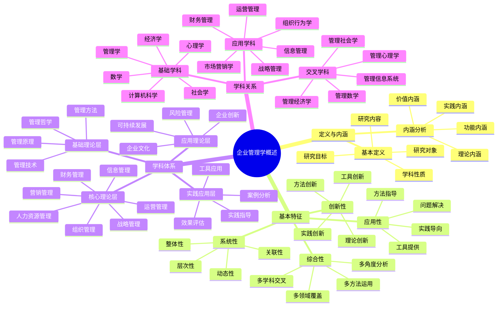
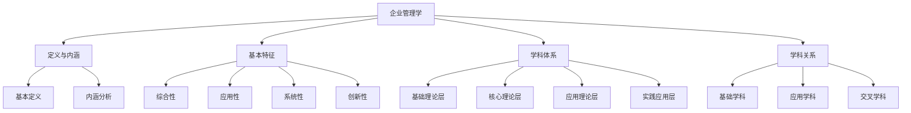
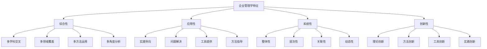
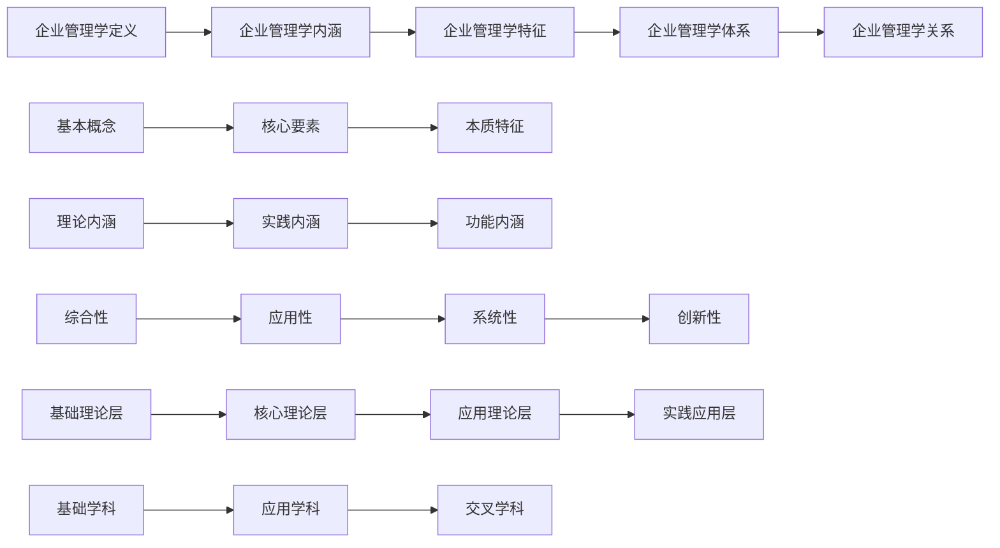
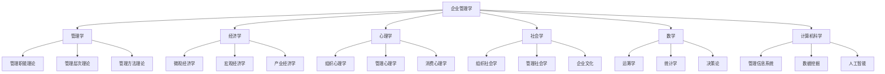

# 思维导图-企业管理学概述

## 🧠 企业管理学概述思维导图

### 核心概念图

## 📊 知识结构分析

### 1. 概念层次结构

### 2. 特征关系网络

## 🔍 关键概念解析

### 1. 企业管理学定义
- **核心概念**：研究企业经营管理活动规律的科学
- **关键要素**：企业、管理、规律、科学
- **本质特征**：综合性、应用性、系统性、创新性

### 2. 企业管理学内涵
- **理论内涵**：管理理论、组织理论、决策理论、控制理论
- **实践内涵**：管理实践、管理技能、管理工具、管理方法
- **功能内涵**：计划功能、组织功能、领导功能、控制功能

### 3. 企业管理学特征
- **综合性**：多学科交叉融合
- **应用性**：实践导向，问题解决
- **系统性**：整体性、层次性、关联性
- **创新性**：理论、方法、工具创新

## 📈 学习路径规划

### 1. 概念学习路径

### 2. 理解层次递进
- **第一层**：基本概念理解
- **第二层**：内涵特征理解
- **第三层**：体系结构理解
- **第四层**：关系网络理解
- **第五层**：综合应用理解

## 🎯 记忆要点

### 1. 核心概念记忆
- **企业管理学**：研究企业经营管理活动规律的科学
- **四大特征**：综合性、应用性、系统性、创新性
- **四大功能**：计划、组织、领导、控制
- **四大层次**：基础理论、核心理论、应用理论、实践应用

### 2. 关系网络记忆
- **包含关系**：企业管理学包含于管理学
- **支撑关系**：基础学科支撑企业管理学
- **交叉关系**：形成交叉学科
- **应用关系**：理论应用于实践

### 3. 特征理解记忆
- **综合性**：多学科交叉融合
- **应用性**：实践导向，问题解决
- **系统性**：整体性、层次性、关联性
- **创新性**：理论、方法、工具创新

## 📊 知识关联图

### 1. 内部关联

### 2. 外部关联

## 🔗 相关链接

### 内部链接
- [[企业管理学定义与内涵]] - 详细定义和内涵
- [[企业管理学基本特征]] - 基本特征分析
- [[企业管理学学科体系]] - 学科体系结构
- [[企业管理学与其他学科关系]] - 学科关系分析

### 外部链接
- [[管理的基本概念]] - 管理基础概念
- [[管理者角色与技能]] - 管理者要求
- [[管理环境分析]] - 管理环境
- [[管理伦理与社会责任]] - 管理伦理

## 📚 学习建议

### 1. 学习顺序
1. **概念理解**：先理解基本概念
2. **特征分析**：分析基本特征
3. **体系构建**：构建学科体系
4. **关系梳理**：梳理学科关系
5. **综合应用**：综合应用知识

### 2. 学习方法
- **思维导图**：使用思维导图整理知识
- **概念图**：使用概念图理解关系
- **案例分析**：通过案例分析理解应用
- **实践练习**：通过实践练习巩固知识

### 3. 记忆技巧
- **关键词记忆**：记忆关键词
- **关联记忆**：通过关联记忆
- **重复记忆**：通过重复记忆
- **应用记忆**：通过应用记忆

---
*更新时间：2024年*
*思维导图将根据学习反馈持续优化*
