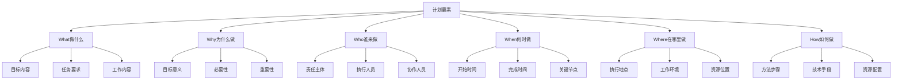
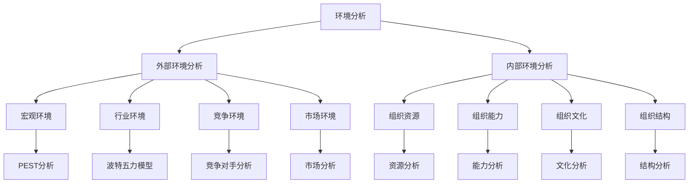

# 计划职能理论

## 📋 计划职能概述

### 基本定义
**计划职能**是管理四大职能之首，是指确定组织目标、制定实现目标的战略和方案，并安排实施步骤的管理活动。

### 核心特征
- **前瞻性**：面向未来，预测趋势
- **目标性**：以目标为导向
- **系统性**：系统规划，统筹安排
- **可行性**：切实可行，可操作

## 🎯 计划的基本要素

### 1. 计划要素构成

#### 5W1H要素

### 2. 计划层次结构

#### 战略计划
- **时间跨度**：3-5年或更长
- **范围**：整个组织
- **内容**：组织使命、愿景、战略目标
- **特点**：方向性、长期性、全局性

#### 战术计划
- **时间跨度**：1-3年
- **范围**：部门或业务单元
- **内容**：部门目标、策略、资源配置
- **特点**：协调性、中期性、部门性

#### 作业计划
- **时间跨度**：1年以内
- **范围**：具体工作或项目
- **内容**：具体任务、时间安排、资源配置
- **特点**：操作性、短期性、具体性

## 📊 计划类型分析

### 1. 按时间分类

#### 长期计划
- **时间跨度**：5年以上
- **特点**：战略性、方向性
- **内容**：长期目标、战略规划
- **作用**：指导组织发展方向

#### 中期计划
- **时间跨度**：1-5年
- **特点**：战术性、协调性
- **内容**：中期目标、策略规划
- **作用**：连接战略与作业

#### 短期计划
- **时间跨度**：1年以内
- **特点**：作业性、操作性
- **内容**：短期目标、具体任务
- **作用**：指导具体执行

### 2. 按范围分类

#### 综合计划
- **范围**：整个组织
- **特点**：全面性、整体性
- **内容**：组织总体目标
- **作用**：统筹全局

#### 部门计划
- **范围**：特定部门
- **特点**：专业性、针对性
- **内容**：部门目标、任务
- **作用**：指导部门工作

#### 项目计划
- **范围**：特定项目
- **特点**：项目性、临时性
- **内容**：项目目标、任务
- **作用**：指导项目实施

### 3. 按性质分类

#### 指导性计划
- **特点**：方向性、灵活性
- **内容**：原则、方针、政策
- **作用**：提供指导原则

#### 指令性计划
- **特点**：强制性、具体性
- **内容**：具体任务、要求
- **作用**：强制执行

## 🔄 计划制定过程

### 1. 计划制定步骤

#### 第一步：环境分析

#### 第二步：目标设定
- **目标层次**：总目标、分目标、子目标
- **目标类型**：定量目标、定性目标
- **目标要求**：SMART原则
- **目标平衡**：短期与长期、局部与整体

#### 第三步：方案制定
- **方案设计**：多种方案设计
- **方案评估**：方案可行性评估
- **方案选择**：最优方案选择
- **方案优化**：方案优化完善

#### 第四步：资源配置
- **资源识别**：识别所需资源
- **资源评估**：评估资源状况
- **资源分配**：合理分配资源
- **资源保障**：确保资源保障

#### 第五步：实施安排
- **时间安排**：制定时间计划
- **责任分工**：明确责任分工
- **协调机制**：建立协调机制
- **监控机制**：建立监控机制

### 2. 计划制定方法

#### 自上而下法
- **特点**：高层制定，逐级分解
- **优点**：统一性强，协调性好
- **缺点**：缺乏参与，执行困难
- **适用**：集权型组织

#### 自下而上法
- **特点**：基层制定，逐级汇总
- **优点**：参与性强，执行性好
- **缺点**：协调困难，统一性差
- **适用**：分权型组织

#### 上下结合法
- **特点**：上下结合，双向沟通
- **优点**：兼顾统一与参与
- **缺点**：过程复杂，时间较长
- **适用**：现代组织

## 📈 计划工具与技术

### 1. 计划工具

#### 甘特图
- **功能**：显示项目进度
- **特点**：直观、易懂
- **适用**：项目管理
- **优点**：时间关系清晰

#### 网络图
- **功能**：显示任务关系
- **特点**：逻辑关系明确
- **适用**：复杂项目
- **优点**：关键路径清晰

#### 平衡计分卡
- **功能**：平衡多个目标
- **特点**：四个维度平衡
- **适用**：战略管理
- **优点**：目标平衡性好

### 2. 计划技术

#### 预测技术
- **定性预测**：专家判断、市场调研
- **定量预测**：时间序列、回归分析
- **混合预测**：定性定量结合
- **情景分析**：多种情景分析

#### 决策技术
- **确定型决策**：线性规划、动态规划
- **风险型决策**：期望值法、决策树
- **不确定型决策**：乐观法、悲观法、后悔值法
- **多目标决策**：层次分析法、模糊决策

## 🎯 计划实施与控制

### 1. 计划实施

#### 实施准备
- **组织准备**：建立实施组织
- **人员准备**：配备实施人员
- **资源准备**：准备实施资源
- **制度准备**：建立实施制度

#### 实施过程
- **启动实施**：启动计划实施
- **过程监控**：监控实施过程
- **问题处理**：处理实施问题
- **调整优化**：调整优化计划

#### 实施保障
- **领导支持**：获得领导支持
- **资源保障**：确保资源保障
- **制度保障**：建立制度保障
- **文化保障**：营造文化氛围

### 2. 计划控制

#### 控制类型
- **事前控制**：预防性控制
- **事中控制**：过程性控制
- **事后控制**：结果性控制
- **全程控制**：全过程控制

#### 控制方法
- **目标控制**：以目标为导向
- **过程控制**：控制实施过程
- **结果控制**：控制实施结果
- **偏差控制**：控制实施偏差

#### 控制机制
- **监控机制**：建立监控机制
- **反馈机制**：建立反馈机制
- **调整机制**：建立调整机制
- **改进机制**：建立改进机制

## 📊 计划效果评估

### 1. 评估指标

#### 定量指标
- **完成率**：计划完成率
- **时间指标**：时间完成情况
- **质量指标**：质量达标情况
- **成本指标**：成本控制情况

#### 定性指标
- **目标达成度**：目标达成程度
- **效果满意度**：效果满意程度
- **影响程度**：对组织影响程度
- **改进程度**：改进提升程度

### 2. 评估方法

#### 对比评估
- **目标对比**：与目标对比
- **历史对比**：与历史对比
- **同行对比**：与同行对比
- **标准对比**：与标准对比

#### 综合评估
- **多维度评估**：多维度综合评估
- **权重评估**：加权综合评估
- **层次评估**：分层次评估
- **动态评估**：动态过程评估

## 🔍 计划管理问题与对策

### 1. 常见问题

#### 计划制定问题
- **目标不明确**：目标模糊不清
- **缺乏可行性**：计划不可行
- **缺乏协调性**：计划不协调
- **缺乏灵活性**：计划缺乏灵活性

#### 计划实施问题
- **执行不力**：执行不到位
- **资源不足**：资源保障不足
- **协调困难**：协调配合困难
- **监控不力**：监控不到位

### 2. 解决对策

#### 制定对策
- **明确目标**：明确具体目标
- **提高可行性**：提高计划可行性
- **加强协调**：加强计划协调
- **增强灵活性**：增强计划灵活性

#### 实施对策
- **强化执行**：强化计划执行
- **保障资源**：保障资源供给
- **加强协调**：加强协调配合
- **完善监控**：完善监控机制

## 🎯 学习要点总结

### 核心概念
1. **计划职能**：确定目标、制定方案、安排实施的管理活动
2. **计划要素**：5W1H要素构成
3. **计划层次**：战略计划、战术计划、作业计划
4. **计划类型**：按时间、范围、性质分类
5. **计划过程**：环境分析、目标设定、方案制定、资源配置、实施安排
6. **计划工具**：甘特图、网络图、平衡计分卡

### 关键理解
- 计划职能是管理四大职能之首
- 计划具有前瞻性、目标性、系统性、可行性
- 计划制定需要科学的方法和工具
- 计划实施需要有效的控制和评估

### 实践应用
- 运用计划理论指导计划制定
- 使用计划工具提高计划质量
- 建立计划控制机制确保实施
- 评估计划效果持续改进

## 🔗 相关链接

- [[组织职能理论]] - 组织职能理论
- [[领导职能理论]] - 领导职能理论
- [[控制职能理论]] - 控制职能理论
- [[管理职能整合]] - 管理职能整合

## 📚 延伸阅读

- [[战略规划]] - 战略规划方法
- [[项目管理]] - 项目管理理论
- [[目标管理]] - 目标管理理论
- [[决策理论]] - 决策理论

---
*更新时间：2024年*
*内容将根据学习反馈持续优化*
