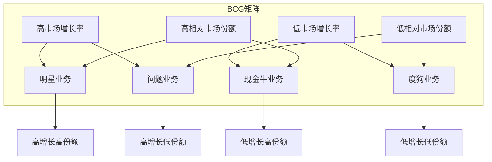
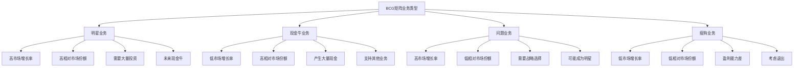

# BCG矩阵

## 📊 BCG矩阵概述

### 基本定义
**BCG矩阵**（Boston Consulting Group Matrix）是由波士顿咨询公司开发的一种战略分析工具，通过市场增长率和相对市场份额两个维度，分析企业业务组合，为资源配置和战略决策提供指导。

### 核心特征
- **二维分析**：市场增长率 × 相对市场份额
- **业务分类**：将业务分为四类
- **资源配置**：指导资源配置决策
- **战略指导**：提供战略选择建议

## 📈 BCG矩阵结构

### 1. 矩阵框架

#### BCG矩阵结构


#### 矩阵维度
- **市场增长率**：衡量市场发展潜力
- **相对市场份额**：衡量竞争地位

### 2. 业务类型

#### 四种业务类型


#### 业务特征
- **明星业务**：高增长高份额，需要投资
- **现金牛业务**：低增长高份额，产生现金
- **问题业务**：高增长低份额，需要选择
- **瘦狗业务**：低增长低份额，考虑退出

## 🔍 BCG矩阵分析

### 1. 分析步骤

#### 分析过程
```mermaid
graph TB
    A[BCG矩阵分析] --> B[数据收集]
    A --> C[指标计算]
    A --> D[矩阵构建]
    A --> E[业务分类]
    A --> F[战略制定]
    
    B --> B1[市场数据]
    B --> B2[竞争数据]
    B --> B3[财务数据]
    B --> B4[业务数据]
    
    C --> C1[市场增长率]
    C --> C2[相对市场份额]
    C --> C3[业务规模]
    C --> C4[盈利能力]
    
    D --> D1[绘制矩阵]
    D --> D2[标注业务]
    D --> D3[计算比例]
    D --> D4[分析位置"]
    
    E --> E1[明星业务]
    E --> E2[现金牛业务]
    E --> E3[问题业务]
    E --> E4[瘦狗业务"]
    
    F --> F1[投资策略]
    F --> F2[发展策略]
    F --> F3[维持策略]
    F --> F4[退出策略"]
```

#### 分析要点
- **数据准确性**：确保数据准确可靠
- **指标合理性**：选择合理分析指标
- **分类准确性**：准确分类业务类型
- **战略针对性**：制定针对性战略

### 2. 指标计算

#### 市场增长率
- **计算公式**：市场增长率 = (当年市场规模 - 去年市场规模) / 去年市场规模 × 100%
- **计算周期**：通常使用年度数据
- **基准选择**：选择行业平均增长率作为基准
- **数据来源**：行业报告、市场研究、统计数据

#### 相对市场份额
- **计算公式**：相对市场份额 = 企业市场份额 / 最大竞争对手市场份额
- **计算基准**：以最大竞争对手为基准
- **数据来源**：市场调研、竞争分析、财务数据
- **更新频率**：定期更新数据

## 📊 BCG矩阵应用

### 1. 战略制定

#### 明星业务战略
- **投资策略**：加大投资力度
- **发展策略**：快速发展业务
- **市场策略**：扩大市场份额
- **技术策略**：技术创新投入

#### 现金牛业务战略
- **维持策略**：维持市场地位
- **现金策略**：最大化现金产生
- **投资策略**：适度投资维持
- **退出策略**：适时考虑退出

#### 问题业务战略
- **选择策略**：战略选择决策
- **投资策略**：选择性投资
- **发展策略**：重点发展潜力业务
- **退出策略**：退出无潜力业务

#### 瘦狗业务战略
- **退出策略**：考虑退出市场
- **收缩策略**：收缩业务规模
- **转型策略**：业务转型发展
- **维持策略**：维持基本运营

### 2. 资源配置

#### 资源配置原则
- **明星业务**：优先配置资源
- **现金牛业务**：适度配置资源
- **问题业务**：选择性配置资源
- **瘦狗业务**：最小化资源配置

#### 资源配置策略
```mermaid
graph TB
    A[资源配置策略] --> B[明星业务]
    A --> C[现金牛业务]
    A --> D[问题业务]
    A --> E[瘦狗业务]
    
    B --> B1[大量投资]
    B --> B2[人才投入]
    B --> B3[技术投入]
    B --> B4[市场投入"]
    
    C --> C1[适度投资]
    C --> C2[维持投入"]
    C --> C3[效率提升"]
    C --> C4[现金管理"]
    
    D --> D1[选择性投资"]
    D --> D2[重点投入"]
    D --> D3[风险控制"]
    D --> D4[效果评估"]
    
    E --> E1[最小投资"]
    E --> E2[维持运营"]
    E --> E3[退出准备"]
    E --> E4[资源回收"]
```

### 3. 投资决策

#### 投资优先级
- **第一优先级**：明星业务
- **第二优先级**：有潜力的问题业务
- **第三优先级**：现金牛业务
- **第四优先级**：瘦狗业务

#### 投资策略
- **明星业务**：加大投资，快速发展
- **现金牛业务**：适度投资，维持地位
- **问题业务**：选择性投资，重点发展
- **瘦狗业务**：最小投资，考虑退出

## 📈 BCG矩阵案例

### 1. 企业案例

#### 案例背景
某多元化企业拥有多个业务单元，需要进行业务组合分析。

#### 业务分析
**明星业务**：
- 智能手机业务：市场增长率15%，相对市场份额1.2
- 云计算业务：市场增长率20%，相对市场份额0.8

**现金牛业务**：
- 传统手机业务：市场增长率2%，相对市场份额1.5
- 软件业务：市场增长率3%，相对市场份额1.8

**问题业务**：
- 平板电脑业务：市场增长率12%，相对市场份额0.3
- 智能家居业务：市场增长率18%，相对市场份额0.2

**瘦狗业务**：
- 传统电脑业务：市场增长率-5%，相对市场份额0.4
- 打印机业务：市场增长率-2%，相对市场份额0.6

#### 战略建议
**明星业务战略**：
- 智能手机业务：加大投资，扩大产能
- 云计算业务：增加研发投入，提升技术

**现金牛业务战略**：
- 传统手机业务：维持现状，最大化现金
- 软件业务：适度投资，维持优势

**问题业务战略**：
- 平板电脑业务：选择性投资，重点发展
- 智能家居业务：加大投资，快速发展

**瘦狗业务战略**：
- 传统电脑业务：考虑退出市场
- 打印机业务：收缩规模，维持运营

### 2. 行业案例

#### 案例背景
某汽车行业企业进行业务组合分析。

#### 业务分析
**明星业务**：
- 新能源汽车：市场增长率25%，相对市场份额1.1
- 智能驾驶：市场增长率30%，相对市场份额0.9

**现金牛业务**：
- 传统汽车：市场增长率1%，相对市场份额1.6
- 汽车金融：市场增长率2%，相对市场份额1.4

**问题业务**：
- 共享出行：市场增长率15%，相对市场份额0.4
- 汽车后市场：市场增长率8%，相对市场份额0.5

**瘦狗业务**：
- 传统零部件：市场增长率-3%，相对市场份额0.7
- 汽车租赁：市场增长率-1%，相对市场份额0.6

#### 战略建议
**明星业务战略**：
- 新能源汽车：加大投资，扩大产能
- 智能驾驶：增加研发投入，提升技术

**现金牛业务战略**：
- 传统汽车：维持现状，最大化现金
- 汽车金融：适度投资，维持优势

**问题业务战略**：
- 共享出行：选择性投资，重点发展
- 汽车后市场：加大投资，快速发展

**瘦狗业务战略**：
- 传统零部件：考虑退出市场
- 汽车租赁：收缩规模，维持运营

## 🎯 BCG矩阵工具

### 1. 分析工具

#### 工具类型
- **Excel模板**：BCG矩阵Excel模板
- **在线工具**：在线BCG矩阵工具
- **软件工具**：专业分析软件
- **手工工具**：手工绘制矩阵

#### 工具特点
- **易用性**：操作简单易用
- **准确性**：计算结果准确
- **可视化**：图表清晰直观
- **灵活性**：灵活调整参数

### 2. 分析技巧

#### 分析技巧
- **数据收集**：全面收集相关数据
- **指标计算**：准确计算各项指标
- **分类分析**：准确分类业务类型
- **战略制定**：制定针对性战略

#### 注意事项
- **数据质量**：确保数据质量
- **指标选择**：选择合适指标
- **分类标准**：明确分类标准
- **战略执行**：有效执行战略

## 🔍 BCG矩阵局限性

### 1. 主要局限性

#### 理论局限
- **简化假设**：简化现实情况
- **二维分析**：仅考虑两个维度
- **静态分析**：缺乏动态分析
- **行业差异**：忽略行业差异

#### 实践局限
- **数据要求**：数据要求较高
- **主观判断**：存在主观判断
- **环境变化**：环境变化影响
- **执行困难**：战略执行困难

### 2. 改进方法

#### 理论改进
- **多维度分析**：增加分析维度
- **动态分析**：进行动态分析
- **行业定制**：行业定制化
- **环境适应**：适应环境变化

#### 实践改进
- **数据完善**：完善数据收集
- **方法改进**：改进分析方法
- **工具升级**：升级分析工具
- **执行优化**：优化战略执行

## 📚 学习要点总结

### 核心概念
1. **BCG矩阵**：市场增长率 × 相对市场份额分析工具
2. **业务类型**：明星、现金牛、问题、瘦狗业务
3. **分析步骤**：数据收集、指标计算、矩阵构建、业务分类
4. **战略应用**：投资策略、资源配置、发展策略
5. **分析工具**：Excel模板、在线工具、专业软件
6. **局限性**：理论局限、实践局限

### 关键理解
- BCG矩阵是业务组合分析的重要工具
- 四种业务类型需要不同战略
- 分析需要准确的数据和指标
- 应用需要考虑局限性和改进方法

### 实践应用
- 运用BCG矩阵分析业务组合
- 制定基于BCG矩阵的战略
- 使用分析工具提高分析质量
- 注意分析局限性和改进方法

## 🔗 相关链接

- [[SWOT分析工具]] - SWOT分析工具
- [[波特五力模型]] - 波特五力模型
- [[价值链分析]] - 价值链分析
- [[分析工具使用指南]] - 分析工具使用指南

## 📚 延伸阅读

- [[战略规划]] - 战略规划方法
- [[战略选择]] - 战略选择理论
- [[战略实施]] - 战略实施理论
- [[战略评估]] - 战略评估方法

---
*更新时间：2024年*
*内容将根据学习反馈持续优化*
