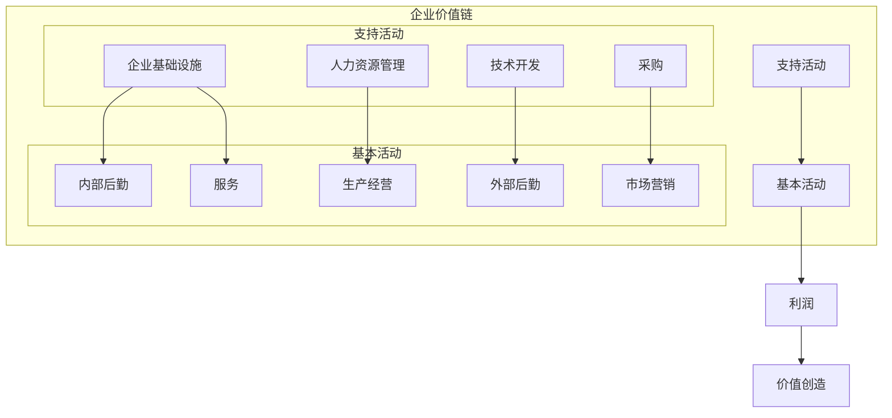

# 价值链分析

## 🔗 价值链分析概述

### 基本定义
**价值链分析**（Value Chain Analysis）是由迈克尔·波特提出的战略分析工具，通过分析企业内部价值创造活动，识别竞争优势来源，为战略制定和资源配置提供指导。

### 核心特征
- **价值导向**：以价值创造为导向
- **活动分析**：分析价值创造活动
- **竞争优势**：识别竞争优势来源
- **战略指导**：指导战略制定

## 📊 价值链结构

### 1. 价值链框架

#### 价值链结构


#### 活动分类
- **基本活动**：直接创造价值的活动
- **支持活动**：支撑基本活动的活动
- **价值创造**：通过活动创造价值
- **利润获取**：通过价值创造获取利润

### 2. 基本活动

#### 基本活动结构
```mermaid
graph TB
    A[基本活动] --> B[内部后勤]
    A --> C[生产经营]
    A --> D[外部后勤]
    A --> E[市场营销]
    A --> F[服务]
    
    B --> B1[原材料接收]
    B --> B2[库存管理"]
    B --> B3[物料配送"]
    B --> B4[质量控制"]
    
    C --> C1[生产计划"]
    C --> C2[生产执行"]
    C --> C3[质量控制"]
    C --> C4[设备维护"]
    
    D --> D1[成品储存"]
    D --> D2[订单处理"]
    D --> D3[物流配送"]
    D --> D4[客户交付"]
    
    E --> E1[市场调研"]
    E --> E2[产品推广"]
    E --> E3[销售管理"]
    E --> E4[渠道管理"]
    
    F --> F1[安装调试"]
    F --> F2[维修保养"]
    F --> F3[客户培训"]
    F --> F4[技术支持"]
```

#### 活动内容
- **内部后勤**：原材料接收、库存管理、物料配送
- **生产经营**：生产计划、生产执行、质量控制
- **外部后勤**：成品储存、订单处理、物流配送
- **市场营销**：市场调研、产品推广、销售管理
- **服务**：安装调试、维修保养、客户培训

### 3. 支持活动

#### 支持活动结构
```mermaid
graph TB
    A[支持活动] --> B[企业基础设施]
    A --> C[人力资源管理]
    A --> D[技术开发]
    A --> E[采购]
    
    B --> B1[战略规划"]
    B --> B2[财务管理"]
    B --> B3[信息系统"]
    B --> B4[法律事务"]
    
    C --> C1[人员招聘"]
    C --> C2[培训开发"]
    C --> C3[绩效管理"]
    C --> C4[薪酬福利"]
    
    D --> D1[产品研发"]
    D --> D2[工艺改进"]
    D --> D3[技术引进"]
    D --> D4[知识产权"]
    
    E --> E1[供应商管理"]
    E --> E2[采购计划"]
    E --> E3[合同管理"]
    E --> E4[质量控制"]
```

#### 活动内容
- **企业基础设施**：战略规划、财务管理、信息系统
- **人力资源管理**：人员招聘、培训开发、绩效管理
- **技术开发**：产品研发、工艺改进、技术引进
- **采购**：供应商管理、采购计划、合同管理

## 🔍 价值链分析

### 1. 分析步骤

#### 分析过程
```mermaid
graph TB
    A[价值链分析] --> B[活动识别]
    A --> C[成本分析]
    A --> D[价值分析"]
    A --> E[优势识别"]
    A --> F[战略制定"]
    
    B --> B1[基本活动识别"]
    B --> B2[支持活动识别"]
    B --> B3[活动分类"]
    B --> B4[活动关系"]
    
    C --> C1[成本核算"]
    C --> C2[成本分配"]
    C --> C3[成本比较"]
    C --> C4[成本优化"]
    
    D --> D1[价值创造"]
    D --> D2[价值传递"]
    D --> D3[价值实现"]
    D --> D4[价值评估"]
    
    E --> E1[成本优势"]
    E --> E2[差异化优势"]
    E --> E3[创新优势"]
    E --> E4[服务优势"]
    
    F --> F1[成本领先策略"]
    F --> F2[差异化策略"]
    F --> F3[集中化策略"]
    F --> F4[创新策略"]
```

#### 分析要点
- **活动识别**：全面识别价值活动
- **成本分析**：深入分析活动成本
- **价值分析**：分析价值创造过程
- **优势识别**：识别竞争优势来源
- **战略制定**：制定针对性战略

### 2. 分析方法

#### 成本分析
- **成本核算**：核算各活动成本
- **成本分配**：分配间接成本
- **成本比较**：与竞争对手比较
- **成本优化**：优化成本结构

#### 价值分析
- **价值创造**：分析价值创造过程
- **价值传递**：分析价值传递机制
- **价值实现**：分析价值实现方式
- **价值评估**：评估价值创造效果

## 📈 价值链应用

### 1. 竞争优势识别

#### 成本优势
- **成本控制**：控制各环节成本
- **效率提升**：提高活动效率
- **规模经济**：利用规模经济
- **经验曲线**：利用经验曲线

#### 差异化优势
- **产品差异化**：产品功能、质量差异化
- **服务差异化**：服务质量、方式差异化
- **品牌差异化**：品牌形象、价值差异化
- **渠道差异化**：渠道网络、服务差异化

### 2. 战略制定

#### 成本领先战略
- **成本控制**：严格控制各环节成本
- **效率提升**：提高运营效率
- **规模扩张**：扩大生产规模
- **技术改进**：改进生产技术

#### 差异化战略
- **产品创新**：持续产品创新
- **服务提升**：提升服务质量
- **品牌建设**：加强品牌建设
- **渠道优化**：优化渠道网络

### 3. 资源配置

#### 资源配置原则
- **价值导向**：以价值创造为导向
- **优势强化**：强化核心优势
- **短板补齐**：补齐关键短板
- **效率优化**：优化资源配置效率

#### 资源配置策略
```mermaid
graph TB
    A[资源配置策略] --> B[核心活动"]
    A --> C[关键活动"]
    A --> D[一般活动"]
    A --> E[辅助活动"]
    
    B --> B1[重点投入"]
    B --> B2[人才投入"]
    B --> B3[技术投入"]
    B --> B4[资金投入"]
    
    C --> C1[适度投入"]
    C --> C2[优化投入"]
    C --> C3[效率投入"]
    C --> C4[效果投入"]
    
    D --> D1[维持投入"]
    D --> D2[标准投入"]
    D --> D3[控制投入"]
    D --> D4[监控投入"]
    
    E --> E1[最小投入"]
    E --> E2[外包投入"]
    E --> E3[合作投入"]
    E --> E4[共享投入"]
```

## 📊 价值链案例

### 1. 制造企业案例

#### 案例背景
某汽车制造企业进行价值链分析。

#### 价值链分析
**基本活动**：
- **内部后勤**：原材料接收、库存管理、物料配送
- **生产经营**：生产计划、生产执行、质量控制
- **外部后勤**：成品储存、订单处理、物流配送
- **市场营销**：市场调研、产品推广、销售管理
- **服务**：安装调试、维修保养、客户培训

**支持活动**：
- **企业基础设施**：战略规划、财务管理、信息系统
- **人力资源管理**：人员招聘、培训开发、绩效管理
- **技术开发**：产品研发、工艺改进、技术引进
- **采购**：供应商管理、采购计划、合同管理

#### 优势识别
**成本优势**：
- 生产规模大，成本控制好
- 供应链管理效率高
- 自动化程度高，人工成本低

**差异化优势**：
- 产品技术领先
- 品牌影响力强
- 服务质量高

#### 战略建议
- **成本领先**：继续控制成本，提高效率
- **差异化**：加强技术创新，提升品牌
- **集中化**：专注核心业务，外包非核心业务

### 2. 服务企业案例

#### 案例背景
某金融服务企业进行价值链分析。

#### 价值链分析
**基本活动**：
- **内部后勤**：信息接收、数据处理、内部协调
- **生产经营**：产品设计、服务提供、质量控制
- **外部后勤**：客户服务、交易处理、资金清算
- **市场营销**：市场调研、产品推广、客户关系
- **服务**：客户咨询、技术支持、售后服务

**支持活动**：
- **企业基础设施**：战略规划、风险管理、合规管理
- **人力资源管理**：人员招聘、培训开发、绩效管理
- **技术开发**：系统开发、产品创新、技术升级
- **采购**：供应商管理、采购计划、合同管理

#### 优势识别
**成本优势**：
- 规模效应明显
- 系统自动化程度高
- 运营效率高

**差异化优势**：
- 产品创新能力强
- 客户服务质量高
- 风险管理能力强

#### 战略建议
- **差异化**：加强产品创新，提升服务质量
- **成本控制**：优化运营流程，提高效率
- **风险管理**：加强风险管理，提升竞争力

## 🎯 价值链工具

### 1. 分析工具

#### 工具类型
- **价值链模板**：价值链分析模板
- **成本分析工具**：成本分析工具
- **价值分析工具**：价值分析工具
- **竞争优势工具**：竞争优势分析工具

#### 工具特点
- **系统性**：系统分析价值链
- **可视化**：图表清晰直观
- **定量化**：定量分析成本价值
- **实用性**：实用性强

### 2. 分析技巧

#### 分析技巧
- **活动识别**：全面识别价值活动
- **成本分析**：深入分析活动成本
- **价值分析**：分析价值创造过程
- **优势识别**：识别竞争优势来源

#### 注意事项
- **活动完整**：确保活动识别完整
- **成本准确**：确保成本分析准确
- **价值客观**：保持价值分析客观
- **战略可行**：确保战略制定可行

## 🔍 价值链局限性

### 1. 主要局限性

#### 理论局限
- **静态分析**：缺乏动态分析
- **内部视角**：忽略外部环境
- **简化假设**：简化现实情况
- **行业差异**：行业差异较大

#### 实践局限
- **数据要求**：数据要求较高
- **主观判断**：存在主观判断
- **成本核算**：成本核算复杂
- **执行困难**：战略执行困难

### 2. 改进方法

#### 理论改进
- **动态分析**：进行动态分析
- **外部视角**：增加外部环境分析
- **复杂模型**：使用复杂模型
- **行业定制**：行业定制化

#### 实践改进
- **数据完善**：完善数据收集
- **方法改进**：改进分析方法
- **工具升级**：升级分析工具
- **执行优化**：优化战略执行

## 📚 学习要点总结

### 核心概念
1. **价值链分析**：企业内部价值创造活动分析
2. **基本活动**：直接创造价值的活动
3. **支持活动**：支撑基本活动的活动
4. **分析步骤**：活动识别、成本分析、价值分析、优势识别
5. **战略应用**：竞争优势识别、战略制定、资源配置
6. **局限性**：理论局限、实践局限

### 关键理解
- 价值链分析是识别竞争优势的重要工具
- 基本活动和支持活动共同创造价值
- 分析需要系统性和客观性
- 应用需要考虑局限性和改进方法

### 实践应用
- 运用价值链分析识别竞争优势
- 制定基于价值链分析的策略
- 使用分析工具提高分析质量
- 注意分析局限性和改进方法

## 🔗 相关链接

- [[SWOT分析工具]] - SWOT分析工具
- [[波特五力模型]] - 波特五力模型
- [[BCG矩阵]] - BCG矩阵
- [[分析工具使用指南]] - 分析工具使用指南

## 📚 延伸阅读

- [[战略规划]] - 战略规划方法
- [[战略选择]] - 战略选择理论
- [[战略实施]] - 战略实施理论
- [[战略评估]] - 战略评估方法

---
*更新时间：2024年*
*内容将根据学习反馈持续优化*
