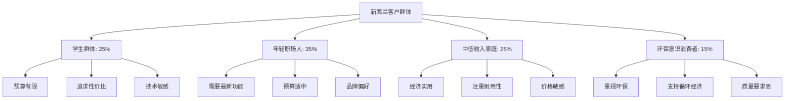
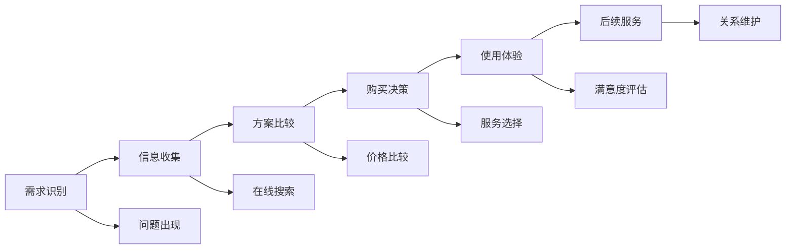
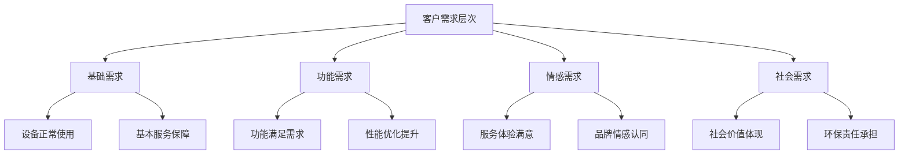
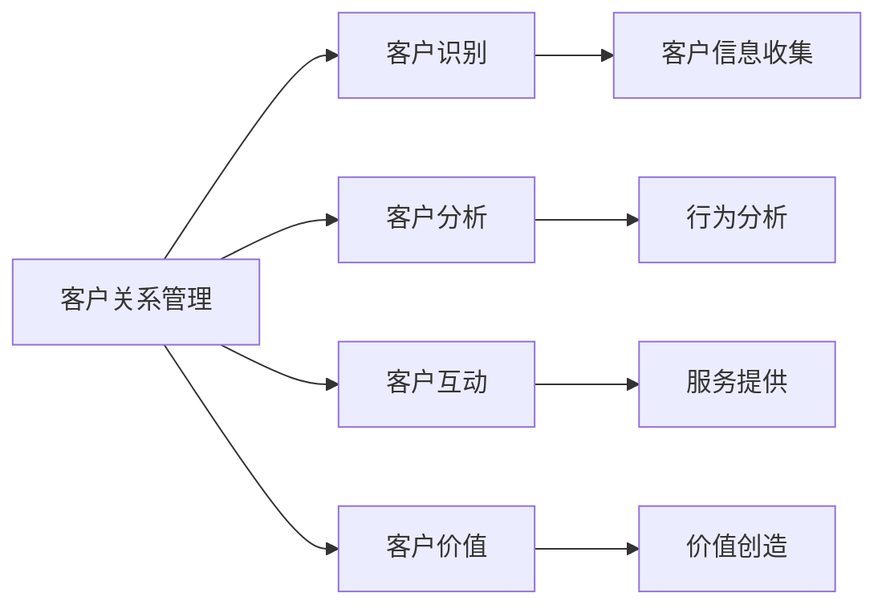

# 客户画像分析

## 新西兰手机维修与二手机销售客户群体分析

### 客户群体概览

### 主要客户群体详解

#### 1. 学生群体（25%）

**基本特征**：
- **年龄范围**：16-25岁
- **收入水平**：月收入500-1500纽币
- **教育背景**：高中、大学在读
- **居住地区**：主要集中在大城市

**消费特点**：

| 消费特征 | 具体表现 | 影响因素 |
|----------|----------|----------|
| **预算限制** | 严格控制支出，寻求性价比 | 收入有限，依赖家庭支持 |
| **技术敏感** | 关注最新技术和功能 | 年轻群体，技术接受度高 |
| **品牌偏好** | 偏好知名品牌，但价格敏感 | 社交影响，品牌认知 |
| **购买决策** | 决策周期短，冲动消费较多 | 缺乏经验，易受推荐影响 |

**服务需求**：
- **维修服务**：基础维修，价格敏感
- **二手机**：入门级设备，功能满足基本需求
- **配件**：保护配件，价格实惠
- **服务方式**：偏好在线咨询，快速服务

**营销策略**：
- 价格优惠和促销活动
- 社交媒体营销
- 学生专属优惠
- 快速响应服务

#### 2. 年轻职场人（35%）

**基本特征**：
- **年龄范围**：25-35岁
- **收入水平**：月收入3000-6000纽币
- **职业背景**：白领、技术人员、服务业
- **居住地区**：城市中心区域

**消费特点**：

| 消费特征 | 具体表现 | 影响因素 |
|----------|----------|----------|
| **功能需求** | 需要最新功能，性能要求高 | 工作需要，社交需求 |
| **品牌忠诚** | 对特定品牌有忠诚度 | 使用习惯，品牌认知 |
| **服务要求** | 对服务质量要求较高 | 工作繁忙，时间宝贵 |
| **购买决策** | 理性决策，比较分析 | 有一定经验，注重性价比 |

**服务需求**：
- **维修服务**：专业维修，质量保证
- **二手机**：中高端设备，功能全面
- **配件**：原装配件，质量保证
- **服务方式**：预约服务，专业咨询

**营销策略**：
- 专业服务定位
- 品牌价值营销
- 便捷服务体验
- 技术优势展示

#### 3. 中低收入家庭（25%）

**基本特征**：
- **年龄范围**：30-50岁
- **收入水平**：月收入2000-4000纽币
- **家庭结构**：有子女的家庭
- **居住地区**：城市郊区、小城镇

**消费特点**：

| 消费特征 | 具体表现 | 影响因素 |
|----------|----------|----------|
| **经济实用** | 注重实用性，性价比优先 | 家庭支出压力，预算限制 |
| **耐用性** | 希望设备使用时间长 | 更换成本考虑，实用主义 |
| **价格敏感** | 对价格变化敏感 | 收入水平，家庭负担 |
| **购买决策** | 谨慎决策，多方比较 | 经验丰富，理性消费 |

**服务需求**：
- **维修服务**：基础维修，价格合理
- **二手机**：经济实用，功能满足需求
- **配件**：兼容配件，价格实惠
- **服务方式**：本地服务，信任关系

**营销策略**：
- 价格优势宣传
- 本地化服务
- 家庭优惠套餐
- 信任关系建立

#### 4. 环保意识消费者（15%）

**基本特征**：
- **年龄范围**：25-45岁
- **收入水平**：月收入4000-8000纽币
- **教育背景**：高等教育，环保意识强
- **居住地区**：环保意识强的社区

**消费特点**：

| 消费特征 | 具体表现 | 影响因素 |
|----------|----------|----------|
| **环保理念** | 重视资源循环利用 | 环保意识，社会责任 |
| **质量要求** | 对产品质量要求高 | 环保理念，长期使用 |
| **品牌选择** | 偏好环保品牌 | 价值观驱动，品牌认同 |
| **购买决策** | 基于价值观决策 | 环保理念，社会责任 |

**服务需求**：
- **维修服务**：专业维修，环保处理
- **二手机**：高质量二手机，环保认证
- **配件**：环保配件，可持续材料
- **服务方式**：环保服务，透明流程

**营销策略**：
- 环保理念宣传
- 可持续发展展示
- 环保认证强调
- 社会责任体现

## 客户行为分析

### 购买决策过程

### 客户行为特征

#### 1. 信息收集行为
- **在线搜索**：主要通过Google搜索相关信息
- **社交媒体**：通过Facebook、Instagram了解
- **朋友推荐**：重视朋友和家人的推荐
- **实体店咨询**：到实体店了解详细信息

#### 2. 购买决策因素
| 决策因素 | 重要性 | 具体表现 | 影响程度 |
|----------|--------|----------|----------|
| **价格** | 高 | 价格透明，性价比高 | 40% |
| **质量** | 高 | 服务质量，产品质量 | 30% |
| **便利性** | 中 | 服务便利，响应快速 | 15% |
| **信任度** | 中 | 品牌信任，服务可靠 | 15% |

#### 3. 服务偏好
- **服务方式**：偏好面对面服务，但也接受在线服务
- **响应时间**：期望快速响应，及时解决问题
- **服务质量**：要求专业、可靠的服务质量
- **后续服务**：重视售后服务和长期关系

## 客户需求分析

### 核心需求识别

#### 1. 功能需求
- **基础功能**：通话、短信、上网等基本功能
- **高级功能**：拍照、游戏、社交等高级功能
- **专业功能**：工作相关、学习相关专业功能
- **创新功能**：最新技术、创新应用功能

#### 2. 情感需求
- **安全感**：设备安全，数据安全
- **归属感**：品牌认同，社区归属
- **成就感**：技术掌握，问题解决
- **便利感**：生活便利，工作高效

#### 3. 社会需求
- **社交需求**：社交网络，沟通交流
- **身份表达**：品牌选择，形象展示
- **环保责任**：环保意识，社会责任
- **经济理性**：性价比，经济实用

### 需求层次分析

## 客户价值分析

### 客户价值评估

#### 1. 客户生命周期价值
| 客户类型 | 首次购买价值 | 年度价值 | 生命周期价值 | 推荐价值 |
|----------|-------------|----------|-------------|----------|
| **学生群体** | 200-500纽币 | 300-800纽币 | 1000-3000纽币 | 500-1500纽币 |
| **年轻职场人** | 500-1200纽币 | 800-2000纽币 | 3000-8000纽币 | 1000-3000纽币 |
| **中低收入家庭** | 300-800纽币 | 500-1500纽币 | 2000-5000纽币 | 800-2000纽币 |
| **环保意识消费者** | 600-1500纽币 | 1000-2500纽币 | 4000-10000纽币 | 1500-4000纽币 |

#### 2. 客户价值驱动因素
- **购买频率**：客户购买服务的频率
- **购买金额**：单次购买的平均金额
- **忠诚度**：客户对品牌的忠诚程度
- **推荐意愿**：客户推荐他人的意愿

### 客户价值提升策略

#### 1. 客户获取策略
- **目标客户识别**：精准识别目标客户群体
- **营销渠道优化**：优化营销渠道和方式
- **价值主张明确**：明确价值主张和优势
- **首次体验优化**：优化首次服务体验

#### 2. 客户保留策略
- **服务质量提升**：持续提升服务质量
- **客户关系维护**：建立长期客户关系
- **个性化服务**：提供个性化服务
- **客户反馈响应**：及时响应客户反馈

#### 3. 客户价值提升策略
- **交叉销售**：向现有客户销售相关服务
- **升级销售**：引导客户购买更高价值服务
- **增值服务**：提供增值服务增加价值
- **会员计划**：建立会员计划增加粘性

## 客户满意度分析

### 满意度影响因素

#### 1. 服务质量因素
| 服务维度 | 重要性 | 满意度水平 | 改进重点 |
|----------|--------|------------|----------|
| **技术质量** | 高 | 4.2/5 | 技术培训，设备升级 |
| **服务态度** | 高 | 4.5/5 | 服务培训，态度改善 |
| **响应速度** | 中 | 4.0/5 | 流程优化，效率提升 |
| **价格合理性** | 中 | 3.8/5 | 价格透明，价值体现 |

#### 2. 客户体验因素
- **服务环境**：店面环境，服务氛围
- **服务流程**：服务流程，等待时间
- **沟通效果**：沟通质量，信息传达
- **问题解决**：问题解决，满意度

### 满意度提升策略

#### 1. 服务质量提升
- **技术培训**：提升员工技术水平
- **服务标准**：建立服务标准体系
- **质量控制**：实施质量控制体系
- **持续改进**：基于反馈持续改进

#### 2. 客户体验优化
- **环境改善**：改善服务环境
- **流程优化**：优化服务流程
- **沟通培训**：提升沟通技巧
- **问题预防**：预防问题发生

## 客户关系管理策略

### 客户关系管理框架

### 客户关系管理实施

#### 1. 客户信息管理
- **信息收集**：收集客户基本信息
- **信息更新**：定期更新客户信息
- **信息分析**：分析客户信息价值
- **信息保护**：保护客户隐私信息

#### 2. 客户互动管理
- **沟通渠道**：建立多种沟通渠道
- **互动频率**：确定合适的互动频率
- **互动内容**：设计有价值的互动内容
- **互动效果**：评估互动效果

#### 3. 客户价值管理
- **价值识别**：识别客户价值
- **价值提升**：提升客户价值
- **价值维护**：维护客户价值
- **价值评估**：评估客户价值

## 对从业者的建议

### 客户服务策略
1. **客户细分**：根据客户特征进行细分
2. **个性化服务**：提供个性化服务
3. **价值创造**：为客户创造价值
4. **关系维护**：建立长期客户关系

### 营销策略优化
1. **目标定位**：明确目标客户群体
2. **价值主张**：明确价值主张
3. **渠道选择**：选择合适营销渠道
4. **效果评估**：评估营销效果

### 服务质量提升
1. **标准建立**：建立服务标准
2. **培训实施**：实施员工培训
3. **质量控制**：实施质量控制
4. **持续改进**：持续改进服务

---
**相关链接**：
- [[01-基础认知层/02-业务认知/01-核心业务模块概述|核心业务模块概述]]
- [[02-理解应用层/01-客户服务/01-客户接待流程|客户接待流程]]
- [[03-高级应用层/01-业务整合/03-客户生命周期管理|客户生命周期管理]]

*最后更新：2024年*
*适用市场：新西兰*
