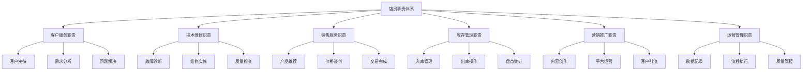
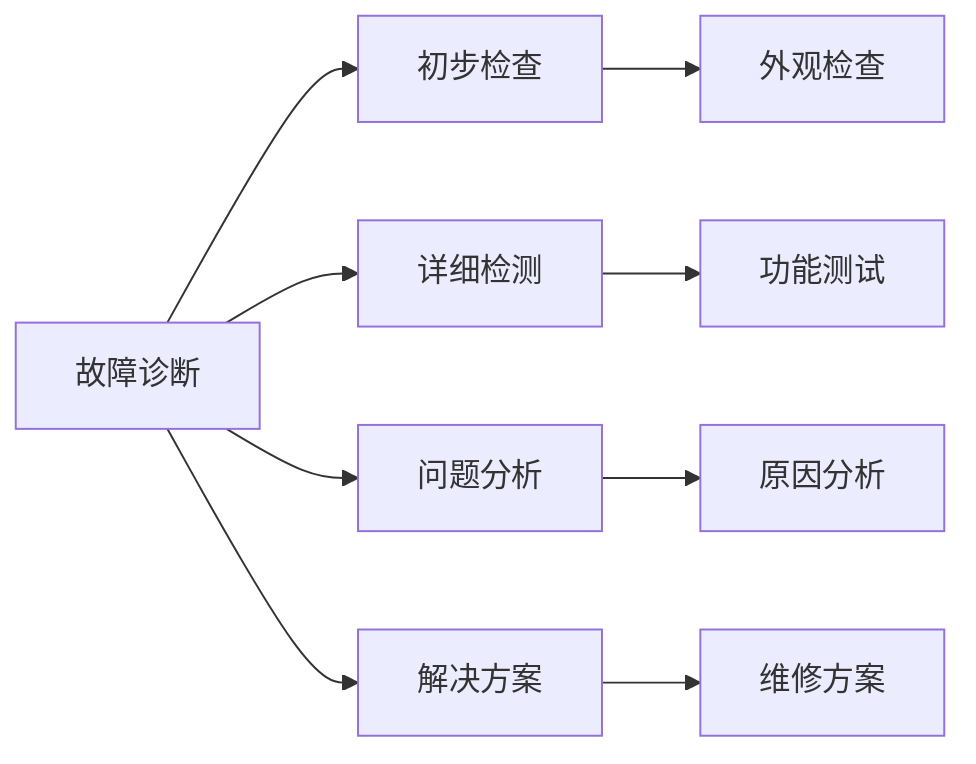
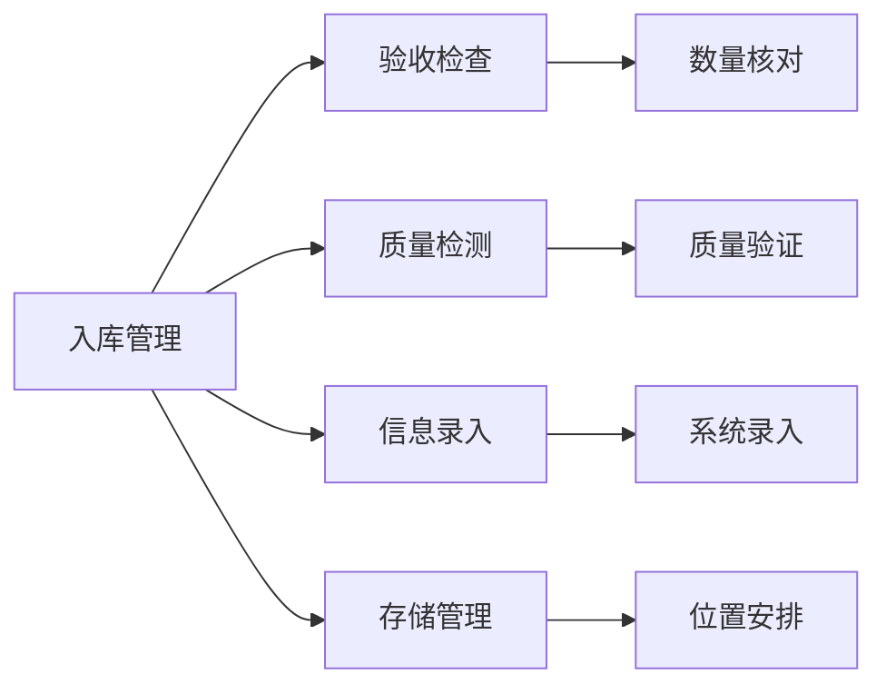
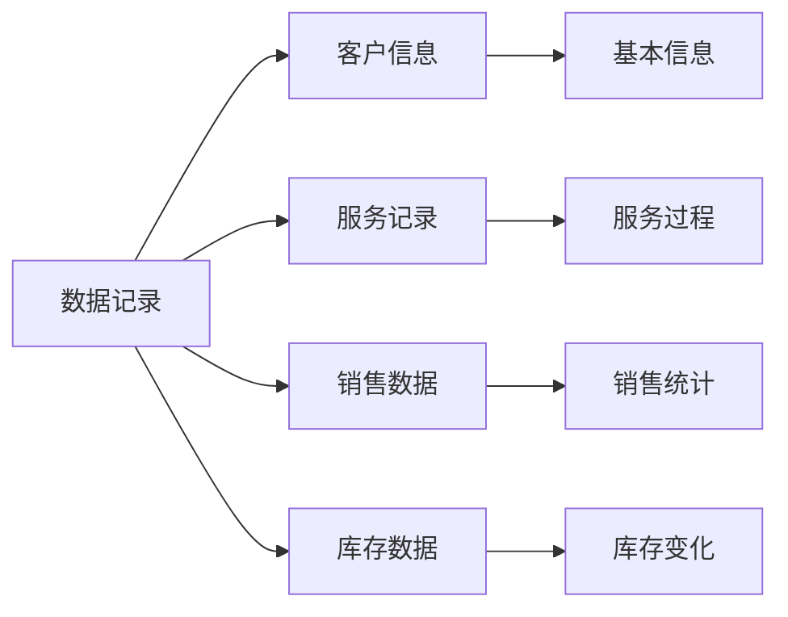
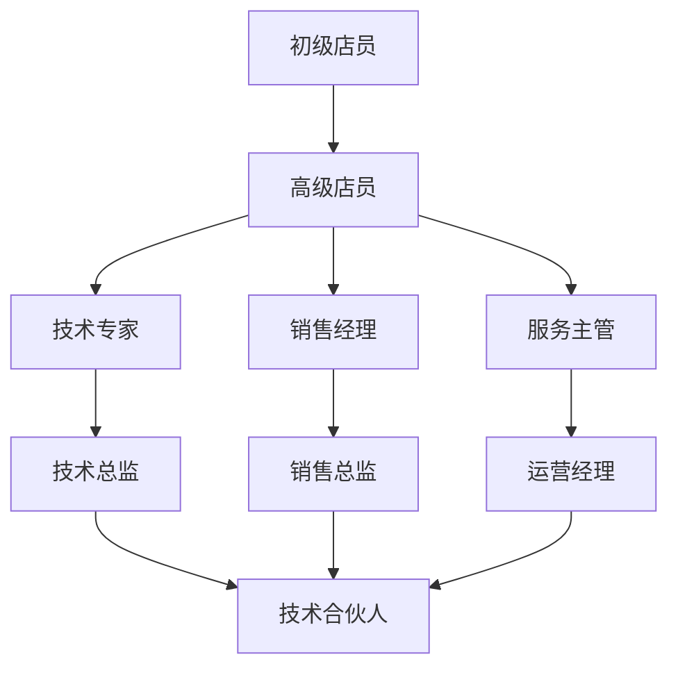

# 店员职责清单

## 新西兰手机维修与二手机销售店员职责体系

### 职责体系架构

### 核心职责详解

#### 1. 客户服务职责

**客户接待职责**：

| 职责项目 | 具体要求 | 执行标准 | 考核指标 |
|----------|----------|----------|----------|
| **热情接待** | 主动问候，微笑服务 | 客户满意度>4.5/5 | 客户反馈 |
| **需求了解** | 深入了解客户需求 | 需求识别准确率>90% | 需求分析报告 |
| **问题解答** | 专业解答客户问题 | 问题解决率>95% | 问题解决记录 |
| **服务引导** | 引导客户选择合适服务 | 服务匹配度>85% | 服务选择统计 |

**客户维护职责**：
- **关系维护**：建立长期客户关系
- **满意度管理**：确保客户满意度
- **投诉处理**：及时处理客户投诉
- **后续服务**：提供后续跟踪服务

**服务标准要求**：
- 使用标准服务用语
- 保持专业服务态度
- 及时响应客户需求
- 提供个性化服务

#### 2. 技术维修职责

**故障诊断职责**：

**具体诊断要求**：
- **初步检查**：快速识别问题类型
- **详细检测**：全面了解故障情况
- **问题分析**：分析问题根本原因
- **解决方案**：制定维修解决方案

**维修实施职责**：
- **维修操作**：按照标准流程维修
- **质量保证**：确保维修质量
- **安全操作**：遵守安全操作规程
- **记录管理**：完整记录维修过程

**质量检查职责**：
- **功能测试**：全面测试设备功能
- **质量验证**：验证维修质量
- **客户验收**：确保客户满意
- **保修服务**：提供保修服务

#### 3. 销售服务职责

**产品推荐职责**：

| 销售环节 | 职责要求 | 执行标准 | 成功指标 |
|----------|----------|----------|----------|
| **需求分析** | 深入了解客户需求 | 需求分析准确率>90% | 需求匹配度 |
| **产品匹配** | 推荐合适产品 | 产品匹配度>85% | 推荐成功率 |
| **功能展示** | 展示产品功能特点 | 功能展示完整率>95% | 客户理解度 |
| **价格说明** | 透明说明价格信息 | 价格透明度100% | 价格接受度 |

**销售技巧要求**：
- **沟通技巧**：有效沟通技巧
- **谈判技巧**：价格谈判技巧
- **成交技巧**：促进成交技巧
- **服务技巧**：优质服务技巧

**售后服务职责**：
- **产品交付**：确保产品正确交付
- **使用指导**：提供使用指导
- **问题解决**：解决使用问题
- **关系维护**：维护客户关系

#### 4. 库存管理职责

**入库管理职责**：

**具体入库要求**：
- **验收检查**：检查产品数量和质量
- **质量检测**：检测产品功能状态
- **信息录入**：录入产品信息到系统
- **存储管理**：合理安排存储位置

**出库操作职责**：
- **订单处理**：处理客户订单
- **产品准备**：准备出库产品
- **质量检查**：检查出库产品质量
- **交付确认**：确认产品交付

**盘点统计职责**：
- **定期盘点**：定期盘点库存
- **数据统计**：统计库存数据
- **差异分析**：分析库存差异
- **报告制作**：制作库存报告

#### 5. 营销推广职责

**内容创作职责**：

| 内容类型 | 创作要求 | 质量标准 | 发布频率 |
|----------|----------|----------|----------|
| **产品介绍** | 突出产品特点 | 内容准确，图片清晰 | 每周2-3篇 |
| **技术分享** | 分享维修技巧 | 技术准确，实用性强 | 每周1-2篇 |
| **客户案例** | 展示成功案例 | 真实可信，效果明显 | 每周1篇 |
| **行业资讯** | 分享行业动态 | 信息及时，价值高 | 每周1篇 |

**平台运营职责**：
- **社交媒体**：运营Facebook、Instagram等
- **内容发布**：定期发布优质内容
- **互动回复**：及时回复客户评论
- **粉丝维护**：维护粉丝关系

**客户引流职责**：
- **线上引流**：通过线上渠道引流
- **线下推广**：通过线下活动推广
- **口碑营销**：通过客户推荐营销
- **合作推广**：与其他商家合作推广

#### 6. 运营管理职责

**数据记录职责**：

**具体记录要求**：
- **客户信息**：记录客户基本信息
- **服务记录**：记录服务过程
- **销售数据**：记录销售数据
- **库存数据**：记录库存变化

**流程执行职责**：
- **标准流程**：按照标准流程执行
- **质量控制**：确保服务质量
- **效率提升**：提高工作效率
- **持续改进**：持续改进工作

**质量管控职责**：
- **质量标准**：执行质量标准
- **质量检查**：进行质量检查
- **问题处理**：处理质量问题
- **改进措施**：实施改进措施

## 职责执行标准

### 服务标准

#### 1. 客户服务标准
- **响应时间**：客户咨询5分钟内响应
- **服务态度**：热情、专业、耐心
- **问题解决**：问题解决率>95%
- **客户满意度**：客户满意度>4.5/5

#### 2. 技术维修标准
- **诊断准确率**：故障诊断准确率>90%
- **维修质量**：维修质量合格率>98%
- **维修时间**：平均维修时间<2天
- **返修率**：返修率<3%

#### 3. 销售服务标准
- **推荐准确率**：产品推荐准确率>85%
- **成交率**：销售成交率>60%
- **客户满意度**：客户满意度>4.3/5
- **售后服务**：售后服务响应时间<24小时

#### 4. 库存管理标准
- **入库准确率**：入库准确率>99%
- **出库及时率**：出库及时率>95%
- **盘点准确率**：盘点准确率>98%
- **库存周转率**：库存周转率>6次/年

### 工作标准

#### 1. 工作时间标准
- **工作时间**：按照排班表工作
- **出勤率**：出勤率>95%
- **加班管理**：合理安排加班
- **休假管理**：按照休假制度执行

#### 2. 工作质量标准
- **工作准确性**：工作准确率>95%
- **工作效率**：工作效率持续提升
- **工作创新**：持续改进工作方法
- **团队协作**：良好团队协作

#### 3. 学习发展标准
- **技能提升**：持续提升专业技能
- **知识更新**：及时更新行业知识
- **培训参与**：积极参与培训
- **经验分享**：分享工作经验

## 职责考核体系

### 考核指标

#### 1. 客户服务考核
| 考核指标 | 权重 | 目标值 | 考核周期 |
|----------|------|--------|----------|
| **客户满意度** | 30% | >4.5/5 | 月度 |
| **问题解决率** | 25% | >95% | 月度 |
| **响应时间** | 20% | <5分钟 | 月度 |
| **客户投诉** | 25% | <2% | 月度 |

#### 2. 技术维修考核
| 考核指标 | 权重 | 目标值 | 考核周期 |
|----------|------|--------|----------|
| **诊断准确率** | 30% | >90% | 月度 |
| **维修质量** | 30% | >98% | 月度 |
| **维修效率** | 20% | <2天 | 月度 |
| **返修率** | 20% | <3% | 月度 |

#### 3. 销售服务考核
| 考核指标 | 权重 | 目标值 | 考核周期 |
|----------|------|--------|----------|
| **销售业绩** | 40% | 完成目标 | 月度 |
| **成交率** | 25% | >60% | 月度 |
| **客户满意度** | 20% | >4.3/5 | 月度 |
| **售后服务** | 15% | 及时响应 | 月度 |

#### 4. 库存管理考核
| 考核指标 | 权重 | 目标值 | 考核周期 |
|----------|------|--------|----------|
| **入库准确率** | 30% | >99% | 月度 |
| **出库及时率** | 25% | >95% | 月度 |
| **盘点准确率** | 25% | >98% | 月度 |
| **库存周转率** | 20% | >6次/年 | 季度 |

### 考核方法

#### 1. 定量考核
- **数据统计**：通过系统数据统计
- **指标对比**：与目标值对比
- **趋势分析**：分析指标变化趋势
- **排名比较**：与其他员工比较

#### 2. 定性考核
- **客户反馈**：收集客户反馈
- **同事评价**：同事相互评价
- **主管评价**：主管综合评价
- **自我评价**：员工自我评价

#### 3. 综合考核
- **360度评价**：全方位评价
- **平衡计分卡**：多维度评价
- **关键事件法**：关键事件评价
- **行为观察**：行为观察评价

## 职责发展路径

### 职业发展阶梯

### 发展要求

#### 1. 初级店员发展要求
- **基础技能**：掌握基础服务技能
- **学习能力**：具备学习能力
- **工作态度**：积极工作态度
- **团队协作**：良好团队协作

#### 2. 高级店员发展要求
- **专业技能**：掌握专业技能
- **经验积累**：积累工作经验
- **问题解决**：具备问题解决能力
- **客户关系**：建立客户关系

#### 3. 技术专家发展要求
- **技术深度**：深入掌握技术
- **创新能力**：具备创新能力
- **培训能力**：具备培训能力
- **技术领导**：技术领导能力

#### 4. 管理岗位发展要求
- **管理技能**：掌握管理技能
- **领导能力**：具备领导能力
- **战略思维**：具备战略思维
- **团队建设**：团队建设能力

## 对从业者的建议

### 职责履行建议
1. **明确职责**：明确自己的职责范围
2. **标准执行**：按照标准执行职责
3. **持续改进**：持续改进工作方法
4. **团队协作**：良好团队协作

### 职业发展建议
1. **技能提升**：持续提升专业技能
2. **经验积累**：积累丰富工作经验
3. **学习成长**：持续学习成长
4. **目标规划**：制定职业发展目标

### 绩效提升建议
1. **目标明确**：明确工作目标
2. **方法优化**：优化工作方法
3. **效率提升**：提高工作效率
4. **质量保证**：保证工作质量

---
**相关链接**：
- [[01-基础认知层/03-岗位认知/02-技能要求标准|技能要求标准]]
- [[01-基础认知层/03-岗位认知/03-职业发展路径|职业发展路径]]
- [[02-理解应用层/01-客户服务/01-客户接待流程|客户接待流程]]

*最后更新：2024年*
*适用市场：新西兰*
