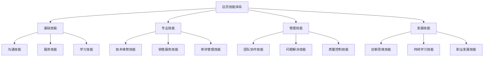
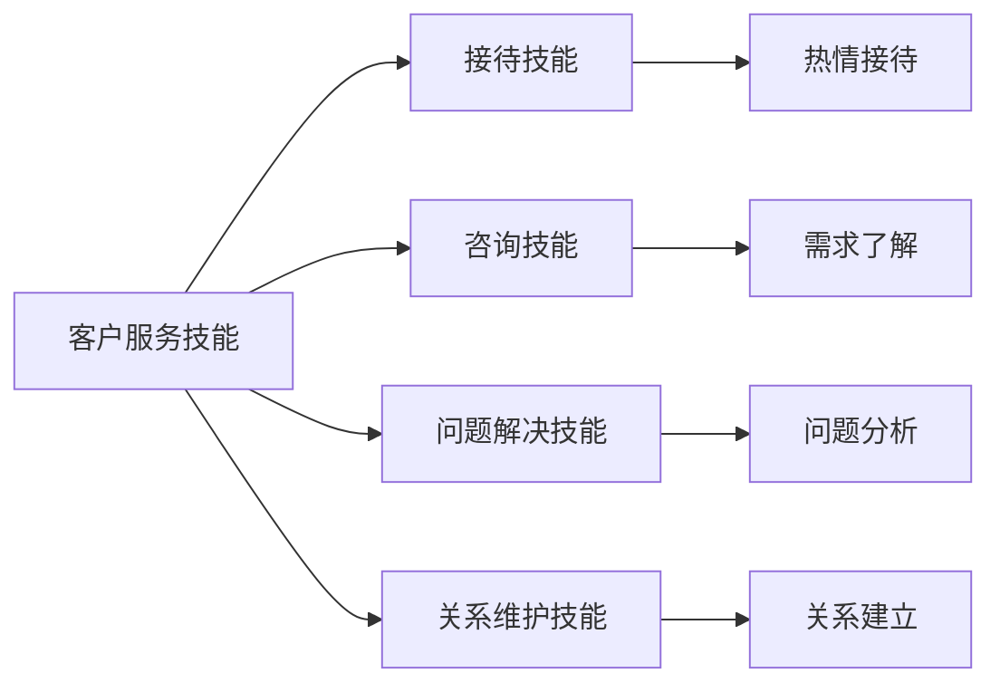
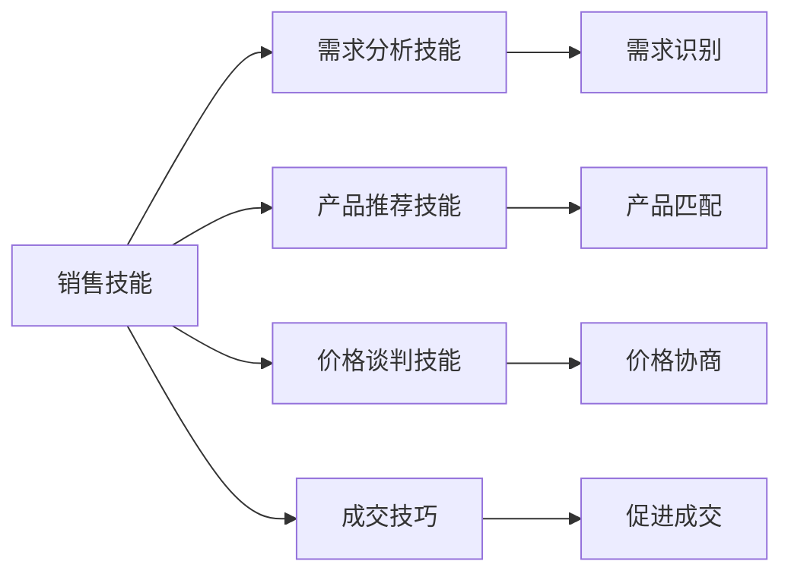
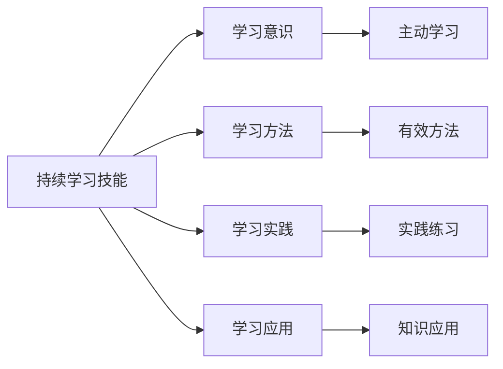

# 技能要求标准

## 新西兰手机维修与二手机销售店员技能体系

### 技能体系架构

### 基础技能要求

#### 1. 沟通技能

**语言沟通技能**：

| 技能要求 | 具体要求 | 评估标准 | 提升方法 |
|----------|----------|----------|----------|
| **英语沟通** | 流利英语交流 | 雅思6.0或同等水平 | 语言培训，实践练习 |
| **专业术语** | 掌握行业术语 | 术语掌握率>90% | 专业学习，实际应用 |
| **表达清晰** | 清晰表达观点 | 表达准确率>95% | 演讲训练，沟通练习 |
| **倾听理解** | 有效倾听理解 | 理解准确率>90% | 倾听训练，理解练习 |

**非语言沟通技能**：
- **肢体语言**：恰当使用肢体语言
- **面部表情**：保持友好面部表情
- **眼神交流**：适当眼神交流
- **空间距离**：保持合适空间距离

**跨文化沟通技能**：
- **文化理解**：理解不同文化背景
- **文化适应**：适应多元文化环境
- **文化敏感**：保持文化敏感性
- **文化尊重**：尊重文化差异

#### 2. 服务技能

**客户服务技能**：

**具体服务要求**：
- **接待技能**：热情、专业、高效接待
- **咨询技能**：深入了解客户需求
- **问题解决**：快速有效解决问题
- **关系维护**：建立长期客户关系

**服务质量标准**：
- **响应时间**：客户咨询5分钟内响应
- **服务态度**：热情、专业、耐心
- **问题解决**：问题解决率>95%
- **客户满意度**：客户满意度>4.5/5

#### 3. 学习技能

**学习能力要求**：
- **快速学习**：快速掌握新知识技能
- **持续学习**：持续学习行业知识
- **实践应用**：将学习内容应用到实践
- **知识分享**：分享学习成果

**学习方法技能**：
- **主动学习**：主动寻求学习机会
- **系统学习**：系统学习专业知识
- **实践学习**：通过实践学习技能
- **反思学习**：反思总结学习经验

### 专业技能要求

#### 1. 技术维修技能

**硬件维修技能**：

| 技能类型 | 技能要求 | 熟练程度 | 认证要求 |
|----------|----------|----------|----------|
| **屏幕维修** | 掌握屏幕更换技术 | 高级 | 专业认证 |
| **电池更换** | 掌握电池更换技术 | 中级 | 基础认证 |
| **主板维修** | 掌握主板维修技术 | 高级 | 专业认证 |
| **摄像头维修** | 掌握摄像头维修技术 | 中级 | 基础认证 |

**软件维修技能**：
- **系统升级**：掌握系统升级技术
- **病毒清除**：掌握病毒清除技术
- **数据恢复**：掌握数据恢复技术
- **性能优化**：掌握性能优化技术

**诊断技能**：
- **故障诊断**：快速准确诊断故障
- **问题分析**：深入分析问题原因
- **解决方案**：制定有效解决方案
- **质量验证**：验证维修质量

#### 2. 销售服务技能

**销售技能**：

**具体销售要求**：
- **需求分析**：深入了解客户需求
- **产品推荐**：推荐合适产品
- **价格谈判**：合理价格谈判
- **成交技巧**：促进客户成交

**销售业绩标准**：
- **销售目标**：完成月度销售目标
- **成交率**：销售成交率>60%
- **客户满意度**：客户满意度>4.3/5
- **客户维护**：维护客户关系

#### 3. 库存管理技能

**库存操作技能**：
- **入库管理**：掌握入库操作流程
- **出库管理**：掌握出库操作流程
- **盘点技能**：掌握盘点操作技能
- **数据管理**：掌握库存数据管理

**库存分析技能**：
- **需求预测**：预测库存需求
- **库存优化**：优化库存结构
- **成本控制**：控制库存成本
- **风险管控**：管控库存风险

### 管理技能要求

#### 1. 团队协作技能

**协作能力要求**：
- **团队合作**：良好团队合作能力
- **沟通协调**：有效沟通协调能力
- **冲突解决**：解决团队冲突能力
- **支持配合**：支持配合团队工作

**协作技能标准**：
- **合作态度**：积极合作态度
- **沟通效果**：沟通效果良好
- **冲突处理**：有效处理冲突
- **团队贡献**：为团队做出贡献

#### 2. 问题解决技能

**问题分析技能**：

| 问题类型 | 分析要求 | 解决方法 | 解决标准 |
|----------|----------|----------|----------|
| **技术问题** | 深入分析技术原因 | 技术方案解决 | 问题解决率>95% |
| **服务问题** | 分析服务流程问题 | 流程优化解决 | 客户满意度>4.5/5 |
| **销售问题** | 分析销售障碍 | 销售策略调整 | 销售目标完成 |
| **管理问题** | 分析管理漏洞 | 管理制度完善 | 管理效率提升 |

**问题解决流程**：
1. **问题识别**：准确识别问题
2. **问题分析**：深入分析问题
3. **方案制定**：制定解决方案
4. **方案实施**：实施解决方案
5. **效果评估**：评估解决效果

#### 3. 质量控制技能

**质量意识要求**：
- **质量观念**：树立质量第一观念
- **质量标准**：严格执行质量标准
- **质量检查**：主动进行质量检查
- **质量改进**：持续改进质量

**质量控制技能**：
- **质量检测**：掌握质量检测技能
- **质量分析**：分析质量问题
- **质量改进**：实施质量改进
- **质量预防**：预防质量问题

### 发展技能要求

#### 1. 创新思维技能

**创新意识要求**：
- **创新思维**：具备创新思维
- **创新实践**：勇于创新实践
- **创新学习**：学习创新方法
- **创新分享**：分享创新成果

**创新能力要求**：
- **问题创新**：创新解决问题方法
- **服务创新**：创新服务模式
- **技术创新**：创新技术应用
- **管理创新**：创新管理方法

#### 2. 持续学习技能

**学习能力要求**：

**具体学习要求**：
- **学习意识**：保持学习意识
- **学习方法**：掌握有效学习方法
- **学习实践**：通过实践学习
- **学习应用**：将学习应用到工作

#### 3. 职业发展技能

**职业规划技能**：
- **目标设定**：设定职业发展目标
- **路径规划**：规划职业发展路径
- **能力提升**：提升职业发展能力
- **机会把握**：把握职业发展机会

**职业发展要求**：
- **专业技能**：持续提升专业技能
- **管理技能**：发展管理技能
- **领导技能**：培养领导技能
- **创业技能**：培养创业技能

## 技能评估体系

### 评估方法

#### 1. 技能测试
- **理论测试**：测试理论知识掌握
- **实践测试**：测试实际操作技能
- **案例分析**：测试问题解决能力
- **情景模拟**：测试实际工作能力

#### 2. 绩效评估
- **工作表现**：评估工作表现
- **客户反馈**：收集客户反馈
- **同事评价**：同事相互评价
- **主管评价**：主管综合评价

#### 3. 360度评估
- **自我评估**：员工自我评估
- **同事评估**：同事相互评估
- **客户评估**：客户服务评估
- **主管评估**：主管综合评估

### 评估标准

#### 1. 技能等级标准
| 技能等级 | 技能要求 | 评估标准 | 发展建议 |
|----------|----------|----------|----------|
| **初级** | 掌握基础技能 | 60-70分 | 加强基础训练 |
| **中级** | 熟练应用技能 | 70-80分 | 提升应用能力 |
| **高级** | 精通专业技能 | 80-90分 | 发展专业深度 |
| **专家** | 创新应用技能 | 90-100分 | 培养创新能力 |

#### 2. 技能发展路径
- **基础技能**：掌握基础技能
- **专业技能**：发展专业技能
- **管理技能**：培养管理技能
- **领导技能**：发展领导技能

## 技能提升策略

### 提升方法

#### 1. 培训学习
- **内部培训**：参加内部培训
- **外部培训**：参加外部培训
- **在线学习**：利用在线学习平台
- **专业认证**：获得专业认证

#### 2. 实践锻炼
- **工作实践**：通过工作实践提升
- **项目参与**：参与项目锻炼
- **轮岗学习**：通过轮岗学习
- **导师指导**：接受导师指导

#### 3. 经验积累
- **工作经验**：积累工作经验
- **案例学习**：学习成功案例
- **错误总结**：总结错误经验
- **最佳实践**：学习最佳实践

### 提升计划

#### 1. 个人发展计划
- **技能评估**：评估当前技能水平
- **目标设定**：设定技能提升目标
- **计划制定**：制定技能提升计划
- **执行跟踪**：跟踪计划执行情况

#### 2. 组织支持计划
- **培训资源**：提供培训资源
- **学习机会**：创造学习机会
- **导师制度**：建立导师制度
- **激励机制**：建立激励机制

## 对从业者的建议

### 技能发展建议
1. **基础技能**：扎实掌握基础技能
2. **专业技能**：深入发展专业技能
3. **管理技能**：逐步培养管理技能
4. **发展技能**：持续提升发展技能

### 学习方法建议
1. **主动学习**：保持主动学习态度
2. **实践应用**：将学习应用到实践
3. **经验总结**：总结学习经验
4. **持续改进**：持续改进学习方法

### 职业发展建议
1. **目标明确**：明确职业发展目标
2. **路径规划**：规划职业发展路径
3. **能力提升**：持续提升职业能力
4. **机会把握**：把握职业发展机会

---
**相关链接**：
- [[01-基础认知层/03-岗位认知/01-店员职责清单|店员职责清单]]
- [[01-基础认知层/03-岗位认知/03-职业发展路径|职业发展路径]]
- [[08-培训体系/03-技能提升培训/01-专业技能提升培训|专业技能提升培训]]

*最后更新：2024年*
*适用市场：新西兰*

