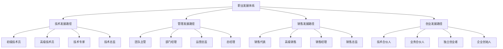

# 职业发展路径

## 新西兰手机维修与二手机销售职业发展体系

### 职业发展架构

### 技术发展路径

#### 1. 初级技术员（0-2年）

**岗位职责**：
- 基础维修操作
- 简单故障诊断
- 客户服务支持
- 学习技术知识

**技能要求**：
- 基础维修技能
- 基本沟通技能
- 学习能力
- 团队协作能力

**发展目标**：
- 掌握基础维修技术
- 提升服务质量
- 积累工作经验
- 建立客户关系

**薪资水平**：18-25纽币/小时

#### 2. 高级技术员（2-5年）

**岗位职责**：
- 复杂故障维修
- 技术问题解决
- 客户技术咨询
- 新人培训指导

**技能要求**：
- 高级维修技能
- 问题解决能力
- 培训指导能力
- 客户服务能力

**发展目标**：
- 精通维修技术
- 提升问题解决能力
- 培养培训能力
- 建立技术声誉

**薪资水平**：25-35纽币/小时

#### 3. 技术专家（5-8年）

**岗位职责**：
- 技术难题解决
- 技术标准制定
- 技术培训实施
- 技术研发支持

**技能要求**：
- 专家级技术技能
- 技术研发能力
- 培训设计能力
- 技术领导能力

**发展目标**：
- 成为技术专家
- 制定技术标准
- 培养技术团队
- 推动技术创新

**薪资水平**：35-50纽币/小时

#### 4. 技术总监（8年以上）

**岗位职责**：
- 技术战略规划
- 技术团队管理
- 技术标准制定
- 技术合作伙伴关系

**技能要求**：
- 技术战略思维
- 团队管理能力
- 技术领导能力
- 商业理解能力

**发展目标**：
- 技术战略领导
- 技术团队建设
- 技术生态构建
- 技术商业价值

**薪资水平**：50-80纽币/小时

### 管理发展路径

#### 1. 团队主管（2-4年）

**岗位职责**：
- 团队日常管理
- 工作分配协调
- 质量监督检查
- 团队绩效管理

**技能要求**：
- 基础管理技能
- 团队协作能力
- 沟通协调能力
- 问题解决能力

**发展目标**：
- 掌握管理基础
- 提升团队效率
- 建立管理经验
- 培养领导能力

**薪资水平**：25-35纽币/小时

#### 2. 部门经理（4-7年）

**岗位职责**：
- 部门运营管理
- 业务流程优化
- 人员招聘培训
- 预算成本控制

**技能要求**：
- 中级管理技能
- 业务流程管理
- 人员管理能力
- 财务管理能力

**发展目标**：
- 精通部门管理
- 优化业务流程
- 建设高效团队
- 控制运营成本

**薪资水平**：35-50纽币/小时

#### 3. 运营总监（7-10年）

**岗位职责**：
- 整体运营管理
- 战略规划实施
- 跨部门协调
- 运营效率提升

**技能要求**：
- 高级管理技能
- 战略规划能力
- 跨部门协调能力
- 运营优化能力

**发展目标**：
- 运营战略领导
- 跨部门协作
- 运营效率优化
- 组织能力建设

**薪资水平**：50-80纽币/小时

#### 4. 总经理（10年以上）

**岗位职责**：
- 企业战略制定
- 整体经营管理
- 重大决策制定
- 外部关系维护

**技能要求**：
- 战略思维能力
- 全面管理能力
- 决策判断能力
- 外部关系能力

**发展目标**：
- 企业战略领导
- 全面经营管理
- 重大决策制定
- 企业价值创造

**薪资水平**：80-150纽币/小时

### 销售发展路径

#### 1. 销售代表（0-2年）

**岗位职责**：
- 客户开发维护
- 产品销售推广
- 销售目标达成
- 客户关系建立

**技能要求**：
- 基础销售技能
- 客户沟通能力
- 产品知识掌握
- 服务意识

**发展目标**：
- 掌握销售技能
- 建立客户关系
- 达成销售目标
- 提升服务质量

**薪资水平**：20-30纽币/小时

#### 2. 高级销售（2-5年）

**岗位职责**：
- 大客户开发
- 复杂销售项目
- 销售策略制定
- 新人销售指导

**技能要求**：
- 高级销售技能
- 大客户管理能力
- 销售策略能力
- 培训指导能力

**发展目标**：
- 精通销售技能
- 开发大客户
- 制定销售策略
- 培养销售团队

**薪资水平**：30-45纽币/小时

#### 3. 销售经理（5-8年）

**岗位职责**：
- 销售团队管理
- 销售目标制定
- 销售策略实施
- 市场开发拓展

**技能要求**：
- 团队管理能力
- 销售战略能力
- 市场分析能力
- 客户关系管理

**发展目标**：
- 销售团队领导
- 销售目标达成
- 市场拓展成功
- 客户关系维护

**薪资水平**：45-70纽币/小时

#### 4. 销售总监（8年以上）

**岗位职责**：
- 销售战略制定
- 销售体系构建
- 销售团队建设
- 销售绩效管理

**技能要求**：
- 销售战略思维
- 销售体系设计
- 团队建设能力
- 绩效管理能力

**发展目标**：
- 销售战略领导
- 销售体系优化
- 销售团队建设
- 销售绩效提升

**薪资水平**：70-120纽币/小时

### 创业发展路径

#### 1. 技术合伙人（5-8年）

**创业模式**：
- 技术入股合作
- 技术咨询服务
- 技术培训服务
- 技术产品开发

**技能要求**：
- 专业技术能力
- 商业理解能力
- 合作协调能力
- 风险承受能力

**发展目标**：
- 技术价值实现
- 商业合作成功
- 技术品牌建立
- 技术生态构建

**收入水平**：50-100纽币/小时

#### 2. 业务合伙人（5-8年）

**创业模式**：
- 业务合作经营
- 业务咨询服务
- 业务培训服务
- 业务产品开发

**技能要求**：
- 业务管理能力
- 市场开发能力
- 合作协调能力
- 风险承受能力

**发展目标**：
- 业务价值实现
- 市场拓展成功
- 业务品牌建立
- 业务生态构建

**收入水平**：50-100纽币/小时

#### 3. 独立创业者（8-10年）

**创业模式**：
- 独立开店经营
- 独立咨询服务
- 独立培训服务
- 独立产品开发

**技能要求**：
- 全面管理能力
- 市场开发能力
- 风险承受能力
- 创新思维能力

**发展目标**：
- 独立经营成功
- 市场地位建立
- 品牌价值实现
- 业务规模扩大

**收入水平**：100-200纽币/小时

#### 4. 企业创始人（10年以上）

**创业模式**：
- 企业创立经营
- 企业战略制定
- 企业文化建设
- 企业生态构建

**技能要求**：
- 战略思维能力
- 全面管理能力
- 创新领导能力
- 风险承受能力

**发展目标**：
- 企业创立成功
- 企业价值实现
- 企业品牌建立
- 企业生态构建

**收入水平**：200-500纽币/小时

## 职业发展支持体系

### 培训支持

#### 1. 内部培训
- **新员工培训**：入职基础培训
- **技能培训**：专业技能培训
- **管理培训**：管理技能培训
- **领导力培训**：领导力发展培训

#### 2. 外部培训
- **专业认证**：行业专业认证
- **管理课程**：管理发展课程
- **技术课程**：技术提升课程
- **商业课程**：商业发展课程

#### 3. 在线学习
- **在线课程**：在线学习平台
- **视频培训**：视频培训资源
- **电子书籍**：电子学习资源
- **行业资讯**：行业信息更新

### 导师支持

#### 1. 内部导师
- **技术导师**：技术发展指导
- **管理导师**：管理发展指导
- **销售导师**：销售发展指导
- **职业导师**：职业发展指导

#### 2. 外部导师
- **行业专家**：行业专家指导
- **商业导师**：商业发展指导
- **创业导师**：创业发展指导
- **成功人士**：成功经验分享

### 实践支持

#### 1. 轮岗实践
- **跨部门轮岗**：跨部门经验积累
- **项目参与**：项目实践经验
- **临时任务**：临时任务锻炼
- **挑战性工作**：挑战性工作机会

#### 2. 外部实践
- **行业交流**：行业交流活动
- **商业竞赛**：商业竞赛参与
- **创业实践**：创业实践机会
- **志愿服务**：志愿服务经验

## 职业发展规划

### 个人发展规划

#### 1. 自我评估
- **技能评估**：评估当前技能水平
- **兴趣评估**：评估职业兴趣
- **价值观评估**：评估职业价值观
- **能力评估**：评估职业能力

#### 2. 目标设定
- **短期目标**：1-2年发展目标
- **中期目标**：3-5年发展目标
- **长期目标**：5-10年发展目标
- **终极目标**：职业发展终极目标

#### 3. 路径规划
- **发展路径**：选择合适发展路径
- **关键节点**：识别关键发展节点
- **里程碑**：设定发展里程碑
- **时间规划**：制定时间规划

#### 4. 行动计划
- **技能提升**：制定技能提升计划
- **经验积累**：制定经验积累计划
- **网络建设**：制定人脉建设计划
- **机会把握**：制定机会把握计划

### 组织发展规划

#### 1. 人才规划
- **人才需求**：分析人才需求
- **人才供给**：分析人才供给
- **人才缺口**：识别人才缺口
- **人才策略**：制定人才策略

#### 2. 发展通道
- **发展通道**：设计发展通道
- **晋升标准**：制定晋升标准
- **评估体系**：建立评估体系
- **激励机制**：建立激励机制

#### 3. 支持体系
- **培训体系**：建立培训体系
- **导师体系**：建立导师体系
- **实践体系**：建立实践体系
- **评估体系**：建立评估体系

## 对从业者的建议

### 职业发展建议
1. **明确目标**：明确职业发展目标
2. **选择路径**：选择合适发展路径
3. **持续学习**：持续学习提升能力
4. **把握机会**：把握职业发展机会

### 能力提升建议
1. **基础技能**：扎实掌握基础技能
2. **专业技能**：深入发展专业技能
3. **管理技能**：逐步培养管理技能
4. **领导技能**：持续提升领导技能

### 职业规划建议
1. **自我认知**：深入了解自己
2. **市场分析**：分析市场机会
3. **目标设定**：设定合理目标
4. **行动计划**：制定行动计划

---
**相关链接**：
- [[01-基础认知层/03-岗位认知/01-店员职责清单|店员职责清单]]
- [[01-基础认知层/03-岗位认知/02-技能要求标准|技能要求标准]]
- [[08-培训体系/01-新员工培训/01-入职培训计划|入职培训计划]]

*最后更新：2024年*
*适用市场：新西兰*

