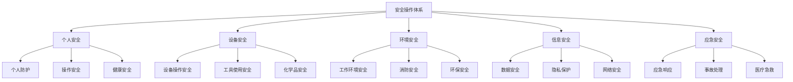
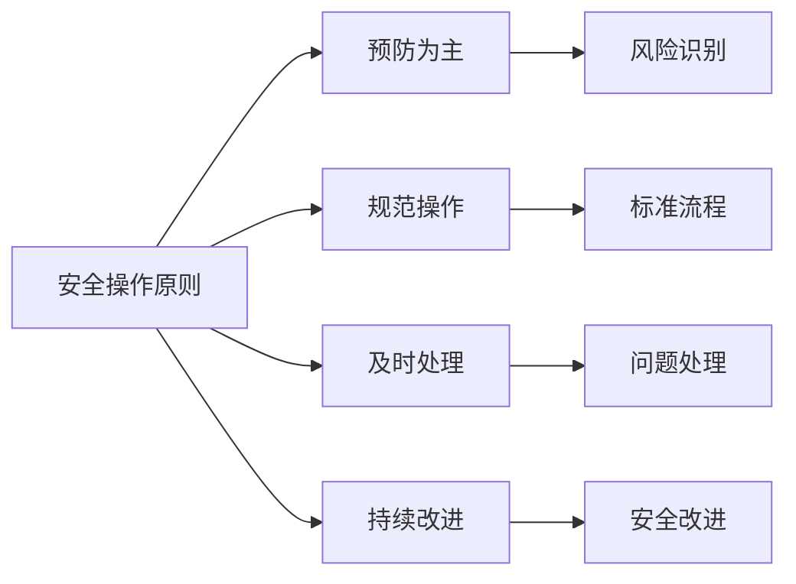
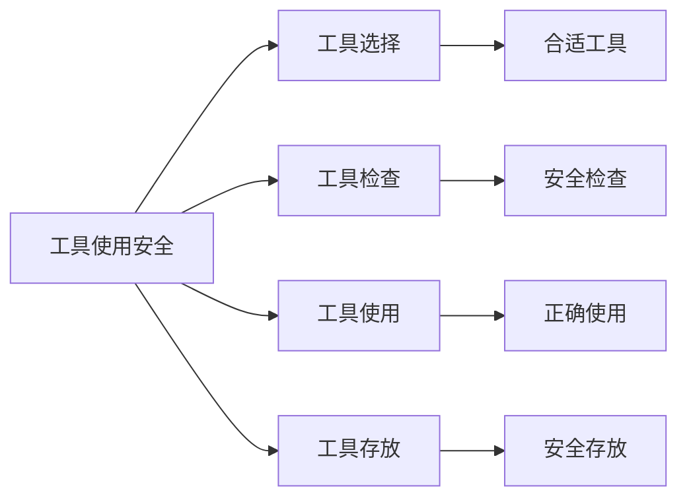
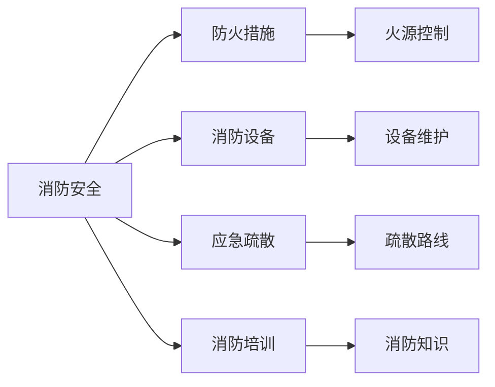
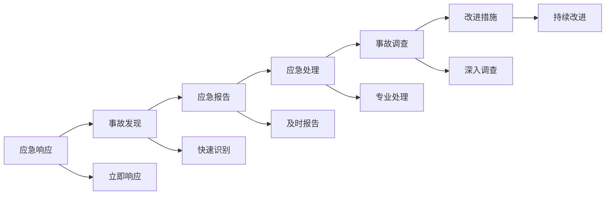

# 安全操作规范

## 新西兰手机维修与二手机销售安全操作体系

### 安全操作架构

### 个人安全规范

#### 1. 个人防护要求

**防护设备使用**：

| 防护设备 | 使用场景 | 使用要求 | 维护要求 |
|----------|----------|----------|----------|
| **防护眼镜** | 维修操作，化学品使用 | 必须佩戴，确保清晰 | 定期清洁，及时更换 |
| **防护手套** | 设备操作，化学品接触 | 选择合适材质，确保防护 | 定期检查，及时更换 |
| **防护口罩** | 粉尘环境，化学品使用 | 选择合适类型，正确佩戴 | 定期更换，妥善保存 |
| **防护服** | 特殊操作，化学品使用 | 选择合适材质，完整覆盖 | 定期清洗，及时更换 |

**个人卫生要求**：
- **手部清洁**：操作前后必须洗手
- **工作服清洁**：保持工作服清洁
- **个人物品**：个人物品不得带入工作区
- **健康检查**：定期进行健康检查

#### 2. 操作安全规范

**安全操作原则**：

**具体操作要求**：
- **操作前检查**：操作前检查设备和环境
- **操作中注意**：操作中保持注意力集中
- **操作后清理**：操作后清理工作区域
- **异常情况处理**：发现异常立即停止操作

**操作禁止事项**：
- **禁止违规操作**：禁止违反安全操作规程
- **禁止疲劳操作**：禁止疲劳状态下操作
- **禁止酒后操作**：禁止酒后操作设备
- **禁止单独操作**：危险操作不得单独进行

#### 3. 健康安全要求

**健康管理要求**：
- **定期体检**：定期进行健康体检
- **健康记录**：建立健康记录档案
- **职业病防护**：加强职业病防护
- **心理健康**：关注心理健康状况

**工作强度管理**：
- **工作时间**：合理安排工作时间
- **工作强度**：控制工作强度
- **休息时间**：保证充足休息时间
- **工作环境**：改善工作环境

### 设备安全规范

#### 1. 设备操作安全

**设备操作要求**：

| 设备类型 | 操作要求 | 安全措施 | 应急处理 |
|----------|----------|----------|----------|
| **维修设备** | 专业培训，持证操作 | 定期检查，安全防护 | 立即停止，报告处理 |
| **检测设备** | 标准操作，准确使用 | 设备校准，环境控制 | 设备故障，停止使用 |
| **工具设备** | 正确使用，定期维护 | 工具检查，安全存放 | 工具损坏，立即更换 |
| **电气设备** | 专业操作，安全防护 | 绝缘保护，接地保护 | 电气故障，立即断电 |

**设备维护要求**：
- **定期检查**：定期检查设备状态
- **定期维护**：定期维护设备
- **故障处理**：及时处理设备故障
- **更新升级**：及时更新设备

#### 2. 工具使用安全

**工具使用规范**：

**工具使用要求**：
- **工具选择**：选择合适工具
- **工具检查**：使用前检查工具
- **正确使用**：按照正确方法使用
- **安全存放**：使用后安全存放

**工具维护要求**：
- **定期检查**：定期检查工具状态
- **定期维护**：定期维护工具
- **及时更换**：及时更换损坏工具
- **专业维修**：专业工具专业维修

#### 3. 化学品安全

**化学品使用要求**：

| 化学品类型 | 使用要求 | 安全措施 | 应急处理 |
|----------|----------|----------|----------|
| **清洁剂** | 按说明书使用 | 通风使用，防护设备 | 立即清洗，医疗处理 |
| **溶剂** | 专业操作，安全防护 | 防火防爆，通风良好 | 立即撤离，消防处理 |
| **胶水** | 适量使用，安全操作 | 防护设备，通风使用 | 立即清洗，医疗处理 |
| **其他化学品** | 按安全要求使用 | 安全防护，环境控制 | 按应急程序处理 |

**化学品管理要求**：
- **安全存放**：安全存放化学品
- **标识管理**：正确标识化学品
- **使用记录**：记录化学品使用
- **废物处理**：正确处理化学废物

### 环境安全规范

#### 1. 工作环境安全

**环境安全要求**：

| 环境要素 | 安全要求 | 控制措施 | 监测方法 |
|----------|----------|----------|----------|
| **温度** | 适宜温度范围 | 空调控制，通风系统 | 温度监测，定期检查 |
| **湿度** | 适宜湿度范围 | 除湿设备，通风控制 | 湿度监测，定期检查 |
| **照明** | 充足照明条件 | 照明设备，自然采光 | 照明检查，定期维护 |
| **通风** | 良好通风条件 | 通风设备，空气流通 | 空气质量监测 |

**环境维护要求**：
- **环境清洁**：保持环境清洁
- **环境整理**：定期整理环境
- **环境检查**：定期检查环境
- **环境改善**：持续改善环境

#### 2. 消防安全

**消防安全要求**：

**防火措施要求**：
- **火源控制**：严格控制火源
- **易燃物品**：安全存放易燃物品
- **电气安全**：确保电气安全
- **吸烟控制**：严格控制吸烟

**消防设备要求**：
- **消防设备**：配备足够消防设备
- **设备检查**：定期检查消防设备
- **设备维护**：定期维护消防设备
- **设备使用**：培训消防设备使用

#### 3. 环保安全

**环保要求**：
- **废物分类**：正确分类废物
- **废物处理**：正确处理废物
- **资源节约**：节约使用资源
- **污染控制**：控制环境污染

**环保措施**：
- **环保设备**：使用环保设备
- **环保工艺**：采用环保工艺
- **环保材料**：使用环保材料
- **环保管理**：加强环保管理

### 信息安全规范

#### 1. 数据安全

**数据保护要求**：

| 数据类型 | 保护要求 | 安全措施 | 应急处理 |
|----------|----------|----------|----------|
| **客户数据** | 严格保密，安全存储 | 加密存储，访问控制 | 数据泄露，立即处理 |
| **设备数据** | 安全处理，彻底清除 | 专业清除，安全销毁 | 数据恢复，专业处理 |
| **业务数据** | 安全存储，定期备份 | 备份系统，访问控制 | 数据丢失，恢复处理 |
| **财务数据** | 严格保密，安全传输 | 加密传输，权限控制 | 数据泄露，立即处理 |

**数据安全措施**：
- **数据加密**：对敏感数据加密
- **访问控制**：控制数据访问权限
- **数据备份**：定期备份重要数据
- **数据销毁**：安全销毁不需要的数据

#### 2. 隐私保护

**隐私保护要求**：
- **隐私政策**：制定隐私保护政策
- **客户同意**：获得客户明确同意
- **数据最小化**：最小化收集数据
- **用途限制**：限制数据使用用途

**隐私保护措施**：
- **隐私培训**：员工隐私保护培训
- **隐私检查**：定期隐私保护检查
- **隐私改进**：持续改进隐私保护
- **隐私合规**：确保隐私保护合规

#### 3. 网络安全

**网络安全要求**：
- **网络安全**：确保网络安全
- **系统安全**：确保系统安全
- **设备安全**：确保设备安全
- **数据安全**：确保数据安全

**网络安全措施**：
- **防火墙**：使用防火墙保护
- **杀毒软件**：使用杀毒软件
- **系统更新**：及时更新系统
- **安全培训**：网络安全培训

### 应急安全规范

#### 1. 应急响应

**应急响应程序**：

**应急响应要求**：
- **快速响应**：快速响应应急事件
- **专业处理**：专业处理应急事件
- **及时报告**：及时报告应急事件
- **持续改进**：持续改进应急能力

#### 2. 事故处理

**事故处理程序**：
1. **事故发现**：及时发现事故
2. **现场保护**：保护事故现场
3. **人员救助**：救助受伤人员
4. **事故报告**：报告事故情况
5. **事故调查**：调查事故原因
6. **责任认定**：认定事故责任
7. **改进措施**：制定改进措施

**事故处理要求**：
- **及时处理**：及时处理事故
- **专业处理**：专业处理事故
- **完整记录**：完整记录事故
- **经验总结**：总结事故经验

#### 3. 医疗急救

**医疗急救要求**：
- **急救知识**：掌握基本急救知识
- **急救设备**：配备急救设备
- **急救培训**：接受急救培训
- **急救联系**：建立急救联系

**急救程序**：
1. **伤情评估**：评估伤情严重程度
2. **急救处理**：进行急救处理
3. **医疗联系**：联系医疗救护
4. **现场保护**：保护现场证据
5. **记录报告**：记录和报告情况

## 安全培训体系

### 培训内容

#### 1. 基础安全培训
- **安全意识**：培养安全意识
- **安全知识**：学习安全知识
- **安全技能**：掌握安全技能
- **安全法规**：了解安全法规

#### 2. 专业安全培训
- **设备安全**：设备安全操作
- **化学品安全**：化学品安全使用
- **电气安全**：电气安全操作
- **消防安全**：消防安全知识

#### 3. 应急安全培训
- **应急响应**：应急响应程序
- **事故处理**：事故处理方法
- **医疗急救**：医疗急救技能
- **疏散逃生**：疏散逃生技能

### 培训方法

#### 1. 理论培训
- **课堂培训**：集中课堂培训
- **在线培训**：在线学习培训
- **视频培训**：视频教学培训
- **手册培训**：安全手册学习

#### 2. 实践培训
- **实操培训**：实际操作培训
- **模拟培训**：模拟场景培训
- **演练培训**：应急演练培训
- **考核培训**：安全考核培训

## 安全监督体系

### 监督机制

#### 1. 内部监督
- **安全检查**：定期安全检查
- **安全审计**：定期安全审计
- **安全评估**：定期安全评估
- **安全改进**：持续安全改进

#### 2. 外部监督
- **政府监督**：接受政府监督
- **行业监督**：接受行业监督
- **客户监督**：接受客户监督
- **社会监督**：接受社会监督

### 监督方法

#### 1. 定期检查
- **日常检查**：日常安全检查
- **周度检查**：周度安全检查
- **月度检查**：月度安全检查
- **年度检查**：年度安全检查

#### 2. 专项检查
- **设备检查**：专项设备检查
- **环境检查**：专项环境检查
- **安全检查**：专项安全检查
- **合规检查**：专项合规检查

## 对从业者的建议

### 安全意识培养
1. **安全第一**：树立安全第一意识
2. **预防为主**：坚持预防为主原则
3. **责任意识**：强化安全责任意识
4. **持续学习**：持续学习安全知识

### 安全操作实践
1. **规范操作**：严格按照规范操作
2. **安全防护**：正确使用安全防护
3. **风险识别**：及时识别安全风险
4. **应急处理**：掌握应急处理方法

### 安全责任担当
1. **个人责任**：承担个人安全责任
2. **团队责任**：承担团队安全责任
3. **社会责任**：承担社会责任
4. **持续改进**：持续改进安全水平

---
**相关链接**：
- [[01-基础认知层/03-岗位认知/04-工作标准规范|工作标准规范]]
- [[04-工具模板/02-检查清单/05-安全操作检查清单|安全操作检查清单]]
- [[08-培训体系/01-新员工培训/04-安全操作培训|安全操作培训]]

*最后更新：2024年*
*适用市场：新西兰*
