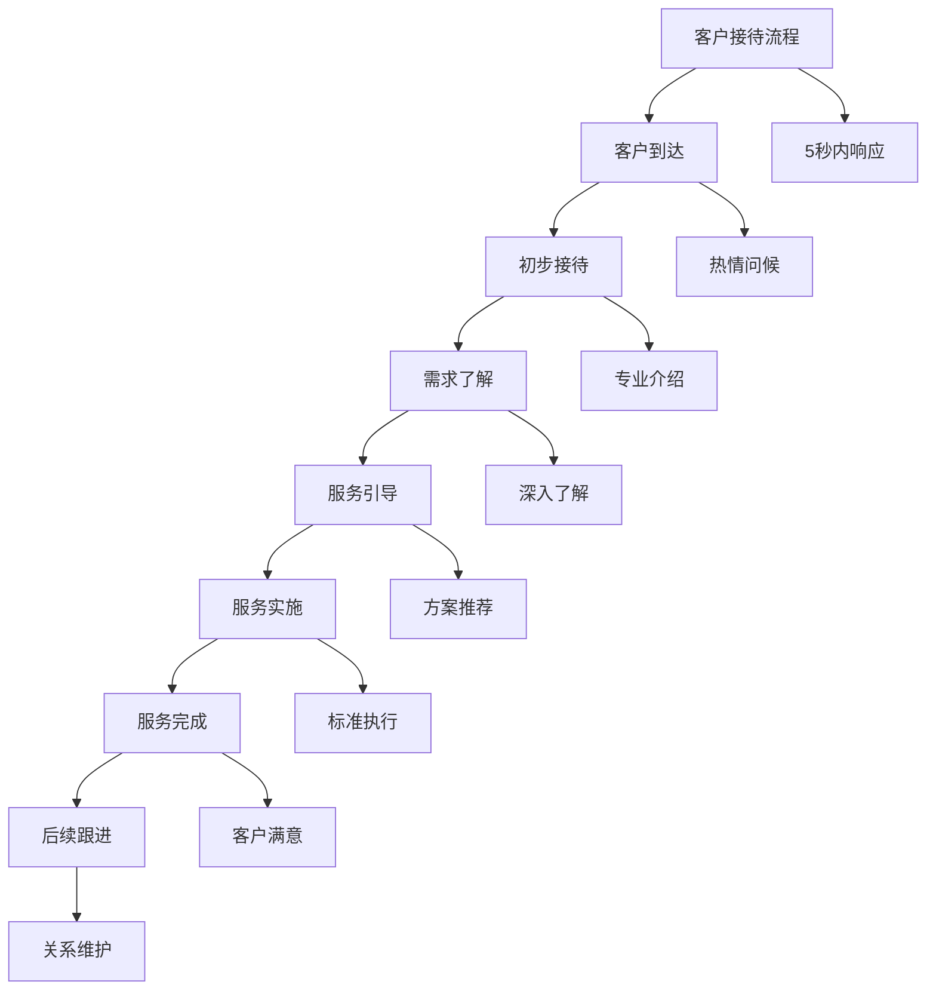
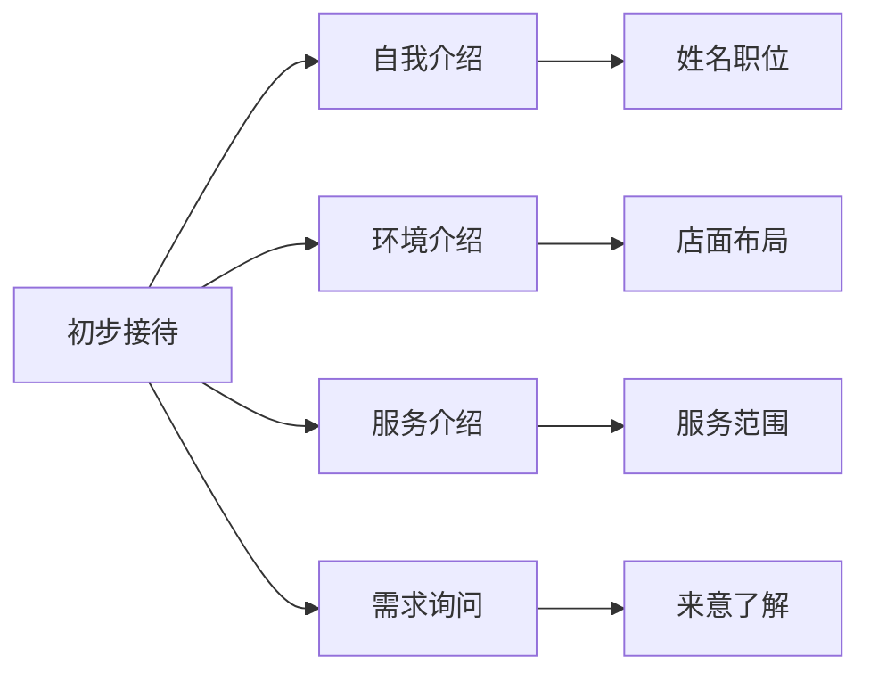
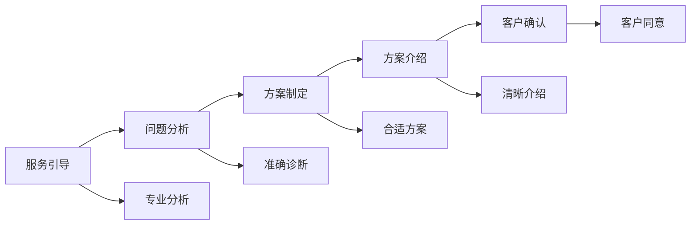
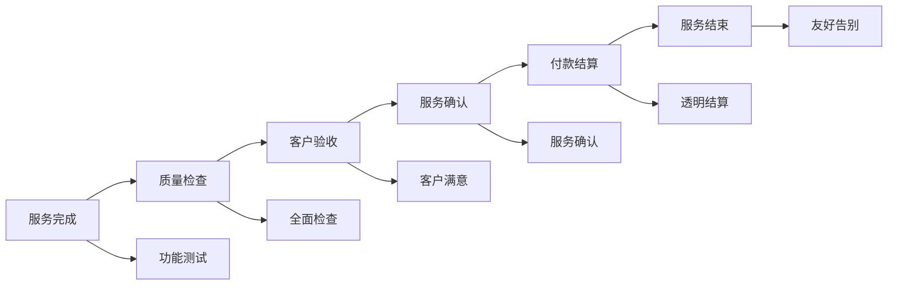
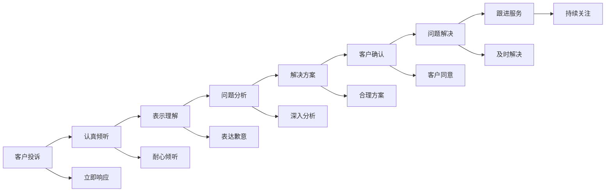

# 客户接待流程

## 新西兰手机维修与二手机销售客户接待标准流程

### 客户接待流程架构

### 详细接待流程

#### 1. 客户到达阶段（0-30秒）

**接待标准**：

| 接待要素 | 标准要求 | 具体表现 | 评估标准 |
|----------|----------|----------|----------|
| **响应时间** | 5秒内响应 | 立即抬头，微笑问候 | 响应时间<5秒 |
| **问候方式** | 热情专业 | "您好，欢迎光临！" | 客户感受良好 |
| **身体语言** | 积极正面 | 站立迎接，眼神交流 | 肢体语言专业 |
| **环境准备** | 整洁有序 | 工作区域整洁，工具就位 | 环境专业整洁 |

**关键动作**：
- 立即停止手头工作，抬头看向客户
- 保持微笑，主动问候
- 站立迎接，保持适当距离
- 确认客户身份和来意

#### 2. 初步接待阶段（30秒-2分钟）

**接待内容**：

**具体步骤**：
1. **自我介绍**："您好，我是[姓名]，是这里的[职位]"
2. **环境介绍**：简要介绍店面布局和服务区域
3. **服务介绍**：介绍主要服务项目
4. **需求询问**："请问今天需要什么帮助？"

**接待技巧**：
- 使用客户姓名（如果知道）
- 保持眼神交流
- 语速适中，表达清晰
- 观察客户反应，调整沟通方式

#### 3. 需求了解阶段（2-5分钟）

**需求了解方法**：

| 了解方法 | 具体技巧 | 应用场景 | 注意事项 |
|----------|----------|----------|----------|
| **开放式提问** | "请告诉我您的具体情况" | 初步了解 | 避免引导性提问 |
| **封闭式提问** | "是屏幕问题还是电池问题？" | 确认细节 | 逐步缩小范围 |
| **倾听技巧** | 专注倾听，适时回应 | 深入了解 | 避免打断客户 |
| **观察技巧** | 观察客户表情和肢体语言 | 判断情绪 | 注意非语言信号 |

**需求了解内容**：
- **问题描述**：客户遇到的具体问题
- **设备信息**：设备型号、购买时间、使用情况
- **期望结果**：客户希望达到的效果
- **时间要求**：客户的时间安排
- **预算考虑**：客户的价格敏感度

**需求记录**：
- 使用标准表格记录客户需求
- 确保信息准确完整
- 客户确认信息无误
- 建立客户档案

#### 4. 服务引导阶段（5-10分钟）

**服务方案制定**：

**方案介绍内容**：
- **问题分析**：详细分析客户问题
- **解决方案**：提供具体解决方案
- **服务流程**：说明服务流程和时间
- **价格说明**：透明说明价格构成
- **质量保证**：说明质量保证措施

**引导技巧**：
- 用简单语言解释技术问题
- 提供多个选择方案
- 突出方案的优势
- 回答客户的疑问
- 确认客户理解

#### 5. 服务实施阶段（根据服务类型）

**服务实施要求**：

| 服务类型 | 实施要求 | 质量标准 | 时间要求 |
|----------|----------|----------|----------|
| **维修服务** | 专业操作，质量保证 | 功能正常，外观完美 | 按承诺时间完成 |
| **销售服务** | 产品展示，功能演示 | 产品匹配，客户满意 | 及时响应，快速成交 |
| **咨询服务** | 专业建议，详细解答 | 建议准确，解答完整 | 耐心细致，及时响应 |
| **回收服务** | 专业评估，公平定价 | 评估准确，价格合理 | 快速评估，即时报价 |

**实施过程管理**：
- 定期向客户汇报进度
- 遇到问题及时沟通
- 确保服务质量
- 保持工作区域整洁

#### 6. 服务完成阶段

**服务完成检查**：

**完成检查项目**：
- **功能测试**：全面测试设备功能
- **外观检查**：检查外观是否完美
- **客户验收**：客户亲自验收
- **服务确认**：确认服务完成
- **付款结算**：透明结算费用
- **服务结束**：友好告别

#### 7. 后续跟进阶段

**跟进内容**：

| 跟进类型 | 跟进时间 | 跟进内容 | 跟进目的 |
|----------|----------|----------|----------|
| **即时跟进** | 服务完成后 | 确认客户满意度 | 确保客户满意 |
| **短期跟进** | 1-3天后 | 使用情况询问 | 问题预防 |
| **中期跟进** | 1-2周后 | 使用体验了解 | 关系维护 |
| **长期跟进** | 1-3个月后 | 需求变化了解 | 业务拓展 |

**跟进方法**：
- 电话回访
- 短信问候
- 邮件联系
- 社交媒体互动

## 接待质量标准

### 服务质量指标

#### 1. 响应时间标准
- **客户到达响应**：5秒内响应
- **电话咨询响应**：3声内接听
- **在线咨询响应**：10分钟内回复
- **邮件咨询响应**：2小时内回复

#### 2. 服务态度标准
- **热情程度**：客户满意度>4.5/5
- **专业程度**：专业表现评分>4.3/5
- **耐心程度**：耐心服务评分>4.4/5
- **友好程度**：友好服务评分>4.5/5

#### 3. 服务效率标准
- **需求了解时间**：5分钟内完成
- **方案制定时间**：10分钟内完成
- **服务实施时间**：按承诺时间完成
- **问题解决时间**：24小时内解决

### 客户满意度标准

#### 1. 满意度指标
- **整体满意度**：>4.5/5
- **服务态度满意度**：>4.6/5
- **服务质量满意度**：>4.4/5
- **响应速度满意度**：>4.3/5

#### 2. 满意度提升措施
- **定期培训**：提升服务技能
- **客户反馈**：收集客户反馈
- **持续改进**：基于反馈改进
- **服务创新**：创新服务方式

## 特殊情况处理

### 客户投诉处理

**投诉处理流程**：

**投诉处理原则**：
- **立即响应**：立即响应客户投诉
- **认真倾听**：认真倾听客户意见
- **表示理解**：表示理解和歉意
- **快速解决**：快速有效解决问题
- **持续跟进**：持续跟进服务效果

### 紧急情况处理

**紧急情况类型**：
- **设备紧急故障**：影响客户重要工作
- **客户情绪激动**：客户情绪失控
- **技术难题**：遇到技术难题
- **设备损坏**：意外损坏客户设备

**紧急处理程序**：
1. **保持冷静**：保持冷静和专业
2. **立即响应**：立即响应紧急情况
3. **专业处理**：专业处理紧急问题
4. **及时沟通**：及时与客户沟通
5. **寻求支持**：必要时寻求上级支持
6. **记录情况**：记录紧急情况处理过程

## 接待技能提升

### 沟通技能提升

#### 1. 语言沟通技能
- **表达清晰**：清晰表达观点
- **语速适中**：控制语速
- **语调友好**：保持友好语调
- **用词准确**：使用准确词汇

#### 2. 非语言沟通技能
- **肢体语言**：恰当使用肢体语言
- **面部表情**：保持友好表情
- **眼神交流**：适当眼神交流
- **空间距离**：保持合适距离

#### 3. 倾听技能
- **专注倾听**：专注倾听客户
- **理解确认**：确认理解客户意思
- **适时回应**：适时回应客户
- **避免打断**：避免打断客户

### 服务技能提升

#### 1. 专业服务技能
- **专业知识**：掌握专业知识
- **服务技巧**：掌握服务技巧
- **问题解决**：提升问题解决能力
- **客户关系**：建立良好客户关系

#### 2. 个性化服务技能
- **客户识别**：识别客户类型
- **需求分析**：分析客户需求
- **服务定制**：定制个性化服务
- **关系维护**：维护客户关系

## 对从业者的建议

### 接待技能建议
1. **专业形象**：保持专业形象
2. **热情服务**：提供热情服务
3. **耐心细致**：耐心细致服务
4. **持续改进**：持续改进服务

### 客户关系建议
1. **建立信任**：建立客户信任
2. **维护关系**：维护客户关系
3. **价值创造**：为客户创造价值
4. **长期合作**：建立长期合作关系

### 服务质量建议
1. **标准执行**：严格执行服务标准
2. **质量保证**：确保服务质量
3. **客户满意**：确保客户满意
4. **持续改进**：持续改进服务质量

---
**相关链接**：
- [[02-理解应用层/01-客户服务/02-沟通技巧指南|沟通技巧指南]]
- [[02-理解应用层/01-客户服务/03-投诉处理流程|投诉处理流程]]
- [[04-工具模板/01-工作流程/01-客户接待流程模板|客户接待流程模板]]

*最后更新：2024年*
*适用市场：新西兰*
