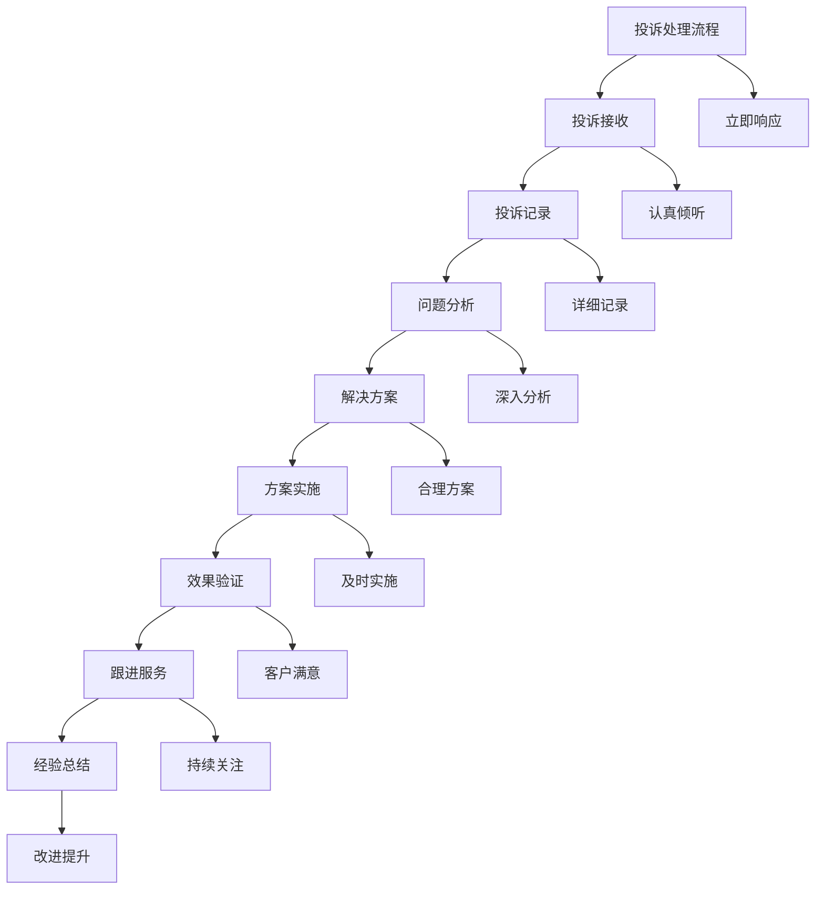
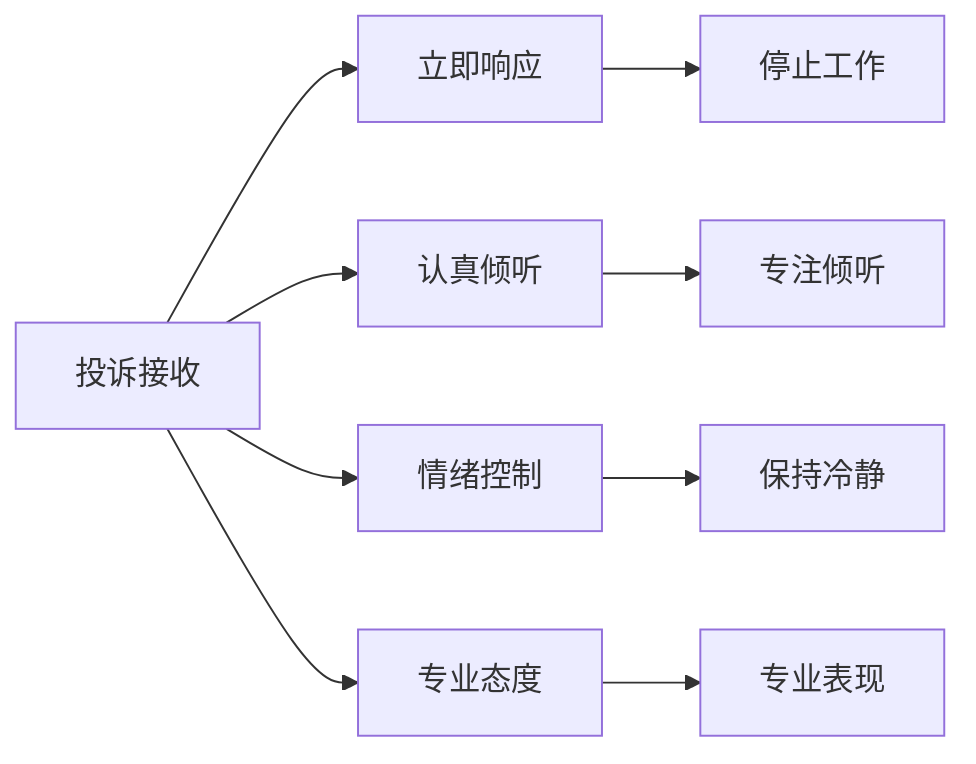
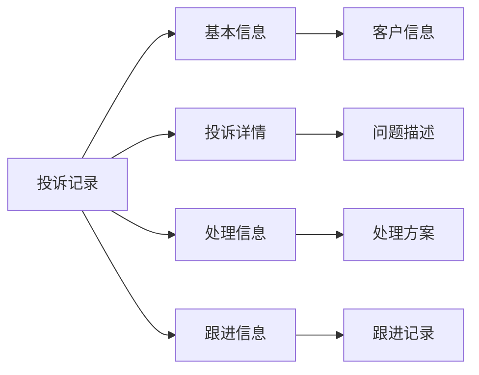
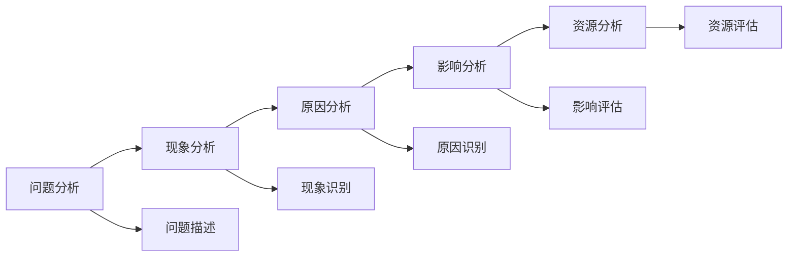
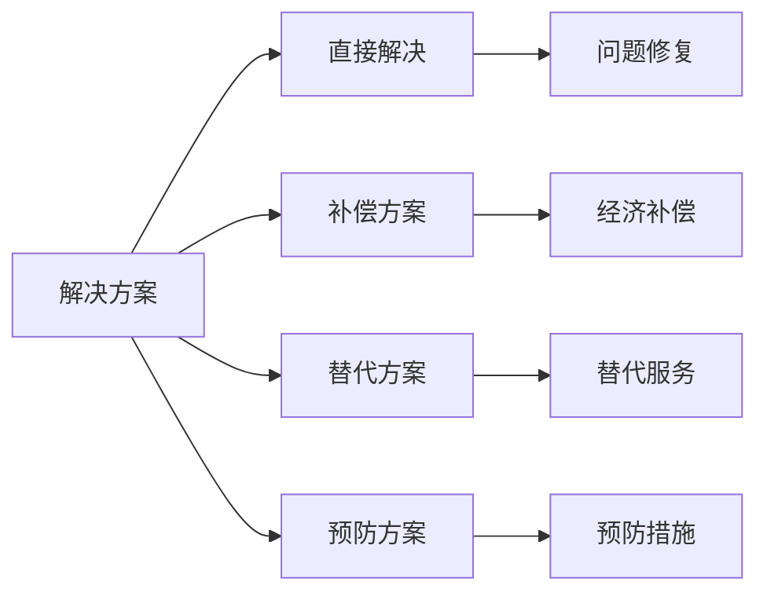
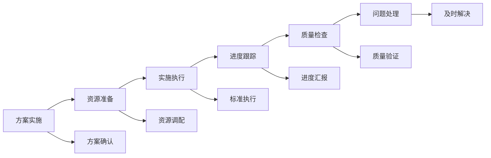
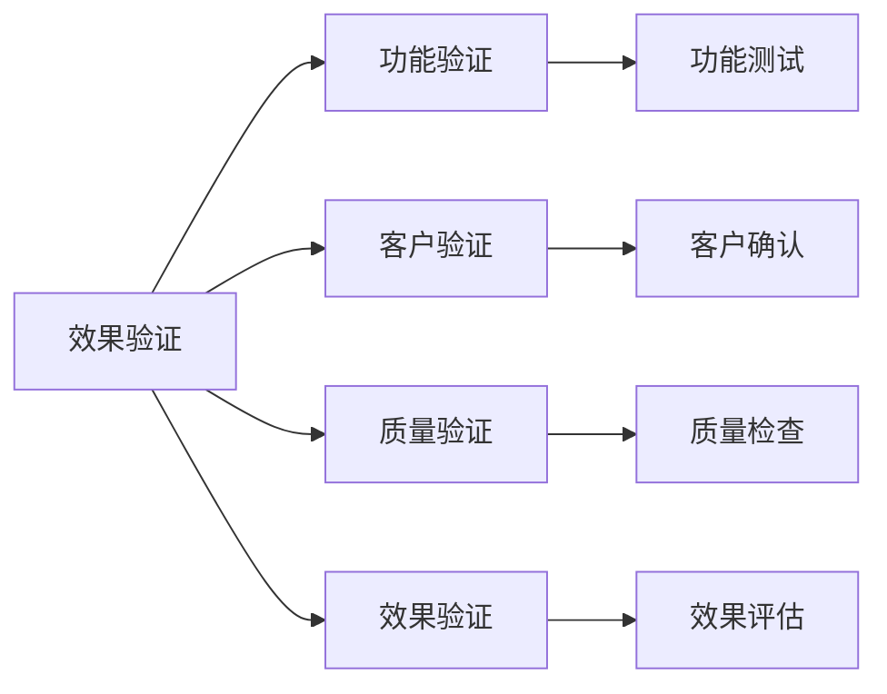
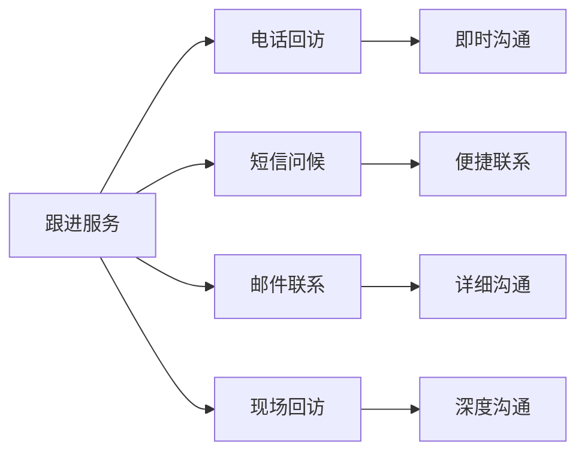
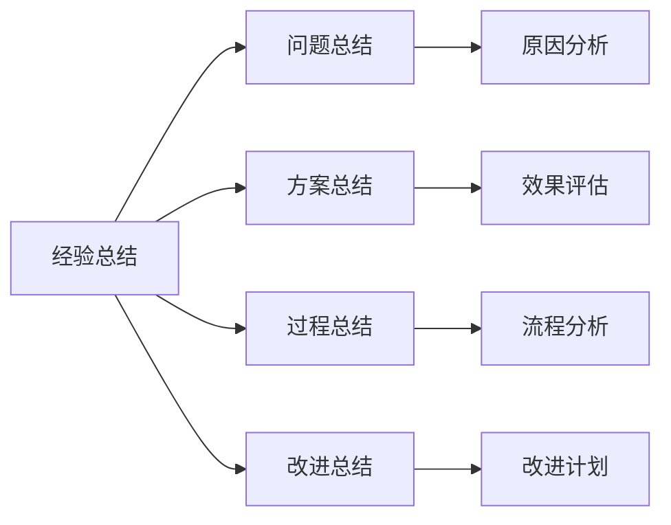

# 投诉处理流程

## 新西兰手机维修与二手机销售投诉处理标准流程

### 投诉处理流程架构

### 详细处理流程

#### 1. 投诉接收阶段（0-5分钟）

**接收标准**：

| 接收要素 | 标准要求 | 具体表现 | 评估标准 |
|----------|----------|----------|----------|
| **响应时间** | 立即响应 | 停止其他工作，专注客户 | 响应时间<30秒 |
| **接待态度** | 认真专业 | 保持冷静，专业态度 | 客户感受良好 |
| **倾听技巧** | 专注倾听 | 全神贯注，不打断客户 | 客户表达完整 |
| **情绪控制** | 保持冷静 | 不受客户情绪影响 | 保持专业冷静 |

**接收技巧**：

**具体接收步骤**：
1. **立即响应**：立即停止手头工作，转向客户
2. **专业接待**：保持专业态度，不受情绪影响
3. **认真倾听**：全神贯注倾听客户投诉
4. **记录要点**：记录投诉的关键信息
5. **表示理解**：表达对客户处境的理解

#### 2. 投诉记录阶段（5-10分钟）

**记录内容要求**：

| 记录项目 | 记录要求 | 具体内容 | 重要性 |
|----------|----------|----------|--------|
| **客户信息** | 完整准确 | 姓名、联系方式、客户编号 | 高 |
| **投诉时间** | 精确记录 | 投诉发生的具体时间 | 高 |
| **投诉内容** | 详细完整 | 投诉的具体内容和原因 | 高 |
| **客户期望** | 明确记录 | 客户希望达到的结果 | 高 |
| **处理人员** | 明确记录 | 负责处理的人员信息 | 中 |
| **处理状态** | 实时更新 | 当前处理状态和进度 | 中 |

**记录格式标准**：

**记录质量控制**：
- **信息完整**：确保信息记录完整
- **信息准确**：确保信息记录准确
- **信息及时**：及时记录投诉信息
- **信息保密**：保护客户隐私信息

#### 3. 问题分析阶段（10-20分钟）

**分析维度**：

| 分析维度 | 分析内容 | 分析方法 | 分析结果 |
|----------|----------|----------|----------|
| **问题性质** | 问题类型和严重程度 | 分类分析，严重程度评估 | 问题分类，优先级确定 |
| **问题原因** | 问题产生的根本原因 | 因果分析，根因分析 | 原因识别，责任认定 |
| **影响范围** | 问题影响的范围和程度 | 影响分析，范围评估 | 影响评估，处理范围 |
| **解决难度** | 问题解决的难度和复杂度 | 难度评估，资源需求 | 难度等级，资源规划 |

**分析方法**：

**分析工具应用**：
- **5W1H分析**：What、Why、When、Where、Who、How
- **鱼骨图分析**：分析问题根本原因
- **SWOT分析**：分析问题解决的优势和劣势
- **优先级矩阵**：确定问题处理优先级

#### 4. 解决方案制定阶段（20-30分钟）

**方案制定原则**：

| 制定原则 | 具体要求 | 应用方法 | 效果评估 |
|----------|----------|----------|----------|
| **客户导向** | 以客户满意为目标 | 客户需求分析，满意度评估 | 客户满意度提升 |
| **快速响应** | 快速制定解决方案 | 标准化流程，经验应用 | 响应时间缩短 |
| **合理可行** | 方案合理且可执行 | 资源评估，可行性分析 | 方案执行成功率 |
| **成本控制** | 控制解决成本 | 成本效益分析，预算控制 | 成本控制效果 |

**方案类型**：

**方案评估标准**：
- **客户接受度**：客户对方案的接受程度
- **执行可行性**：方案执行的可行性
- **成本效益**：方案的成本效益比
- **长期效果**：方案的长期效果

#### 5. 方案实施阶段（30分钟-2小时）

**实施要求**：

| 实施要素 | 具体要求 | 执行标准 | 质量控制 |
|----------|----------|----------|----------|
| **实施速度** | 快速实施解决方案 | 按承诺时间实施 | 时间控制，进度跟踪 |
| **实施质量** | 高质量实施解决方案 | 按标准流程实施 | 质量检查，效果验证 |
| **客户沟通** | 及时沟通实施进度 | 定期汇报进度 | 客户知情，满意度 |
| **问题处理** | 及时处理实施中的问题 | 快速响应，有效解决 | 问题解决，顺利实施 |

**实施过程管理**：

**实施质量控制**：
- **标准执行**：严格按照标准执行
- **质量检查**：定期检查实施质量
- **客户确认**：及时确认客户满意度
- **问题处理**：及时处理实施问题

#### 6. 效果验证阶段（2-4小时）

**验证内容**：

| 验证项目 | 验证要求 | 验证方法 | 验证标准 |
|----------|----------|----------|----------|
| **问题解决** | 确认问题完全解决 | 功能测试，客户确认 | 问题解决率100% |
| **客户满意** | 确认客户满意度 | 满意度调查，客户反馈 | 客户满意度>4.5/5 |
| **质量保证** | 确认解决方案质量 | 质量检查，标准验证 | 质量标准100%符合 |
| **长期效果** | 确认长期效果 | 跟踪观察，效果评估 | 长期效果良好 |

**验证方法**：

**验证标准**：
- **功能正常**：所有功能正常工作
- **客户满意**：客户对解决方案满意
- **质量达标**：解决方案质量达标
- **效果持续**：解决方案效果持续

#### 7. 跟进服务阶段（1-7天）

**跟进内容**：

| 跟进类型 | 跟进时间 | 跟进内容 | 跟进目的 |
|----------|----------|----------|----------|
| **即时跟进** | 解决后立即 | 确认客户满意度 | 确保客户满意 |
| **短期跟进** | 1-2天后 | 使用情况询问 | 问题预防 |
| **中期跟进** | 3-5天后 | 使用体验了解 | 关系维护 |
| **长期跟进** | 1-2周后 | 需求变化了解 | 业务拓展 |

**跟进方法**：

**跟进标准**：
- **及时跟进**：及时进行跟进服务
- **内容完整**：跟进内容完整
- **客户满意**：确保客户满意
- **关系维护**：维护客户关系

#### 8. 经验总结阶段（1-3天）

**总结内容**：

| 总结项目 | 总结要求 | 总结方法 | 总结应用 |
|----------|----------|----------|----------|
| **问题分析** | 分析问题根本原因 | 根因分析，经验总结 | 问题预防 |
| **解决方案** | 总结解决方案效果 | 效果评估，方案优化 | 方案改进 |
| **处理过程** | 总结处理过程经验 | 过程分析，流程优化 | 流程改进 |
| **改进措施** | 制定改进措施 | 改进计划，措施实施 | 持续改进 |

**总结方法**：

## 投诉处理标准

### 处理时间标准

#### 1. 响应时间标准
- **投诉接收**：30秒内响应
- **问题分析**：20分钟内完成
- **方案制定**：30分钟内完成
- **方案实施**：按承诺时间完成
- **效果验证**：2小时内完成

#### 2. 解决时间标准
- **简单问题**：2小时内解决
- **一般问题**：24小时内解决
- **复杂问题**：72小时内解决
- **特殊问题**：按具体情况确定

### 质量标准

#### 1. 处理质量标准
- **问题解决率**：>95%
- **客户满意度**：>4.5/5
- **处理及时率**：>98%
- **重复投诉率**：<5%

#### 2. 服务质量标准
- **服务态度**：专业、耐心、友好
- **沟通效果**：清晰、准确、及时
- **解决方案**：合理、可行、有效
- **跟进服务**：及时、完整、持续

## 特殊情况处理

### 严重投诉处理

**严重投诉标准**：
- **客户情绪激动**：客户情绪失控
- **问题影响重大**：问题影响客户重要工作
- **媒体关注**：投诉可能引起媒体关注
- **法律风险**：投诉可能涉及法律问题

**处理程序**：
1. **立即上报**：立即上报上级主管
2. **专业处理**：由专业团队处理
3. **法律咨询**：必要时寻求法律咨询
4. **媒体应对**：准备媒体应对方案
5. **客户沟通**：及时与客户沟通
6. **记录完整**：完整记录处理过程

### 重复投诉处理

**重复投诉识别**：
- **同一客户**：同一客户多次投诉
- **同一问题**：同一问题多次出现
- **同一服务**：同一服务多次投诉
- **同一时间**：同一时间段多次投诉

**处理策略**：
- **深入分析**：深入分析重复原因
- **系统解决**：系统解决根本问题
- **预防措施**：制定预防措施
- **持续改进**：持续改进服务质量

## 投诉预防措施

### 预防策略

#### 1. 服务质量提升
- **服务标准**：提高服务标准
- **员工培训**：加强员工培训
- **质量控制**：加强质量控制
- **客户沟通**：改善客户沟通

#### 2. 问题预防
- **风险识别**：识别潜在风险
- **预防措施**：制定预防措施
- **监控系统**：建立监控系统
- **预警机制**：建立预警机制

#### 3. 客户关系维护
- **客户教育**：教育客户正确使用
- **定期沟通**：定期与客户沟通
- **问题预警**：提前预警潜在问题
- **关系维护**：维护良好客户关系

## 对从业者的建议

### 投诉处理建议
1. **保持冷静**：保持冷静和专业
2. **认真倾听**：认真倾听客户投诉
3. **快速响应**：快速响应客户投诉
4. **有效解决**：有效解决客户问题

### 服务质量建议
1. **预防为主**：预防投诉发生
2. **持续改进**：持续改进服务质量
3. **客户满意**：确保客户满意
4. **关系维护**：维护客户关系

### 技能提升建议
1. **沟通技巧**：提升沟通技巧
2. **问题解决**：提升问题解决能力
3. **情绪管理**：提升情绪管理能力
4. **专业能力**：提升专业能力

---
**相关链接**：
- [[02-理解应用层/01-客户服务/01-客户接待流程|客户接待流程]]
- [[02-理解应用层/01-客户服务/02-沟通技巧指南|沟通技巧指南]]
- [[07-运营监督体系/04-客户满意度监督/02-客户投诉监督机制|客户投诉监督机制]]

*最后更新：2024年*
*适用市场：新西兰*
