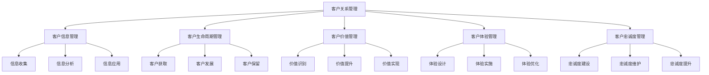
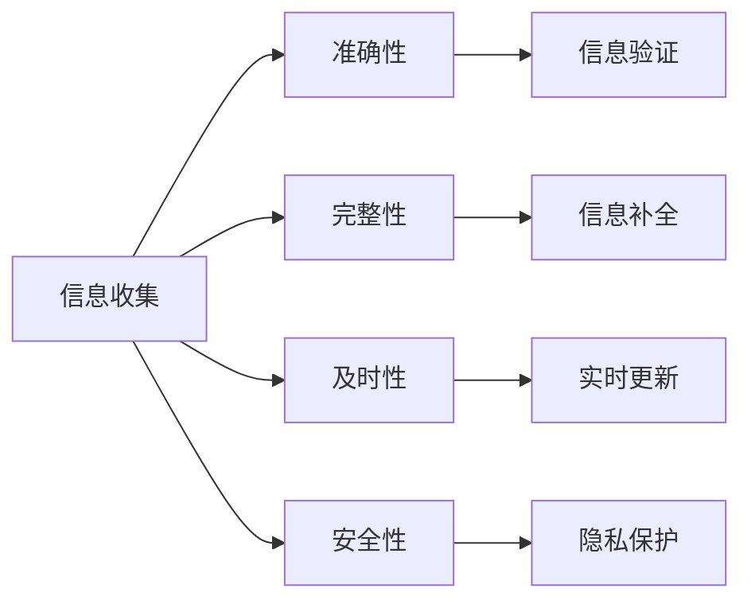
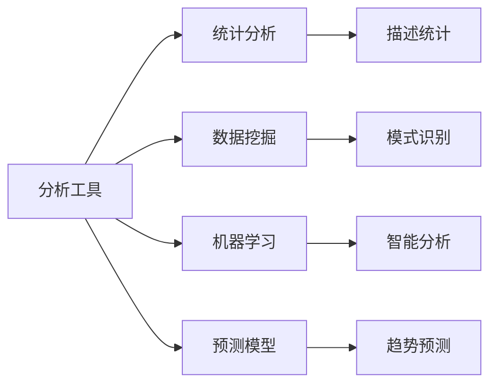
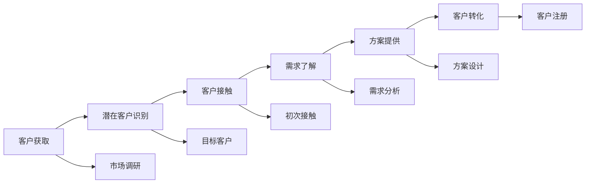
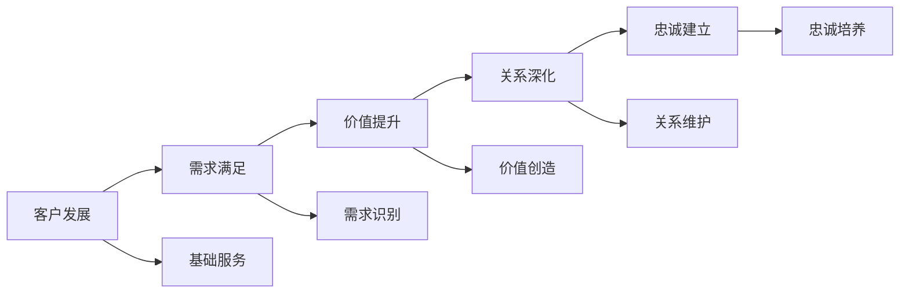
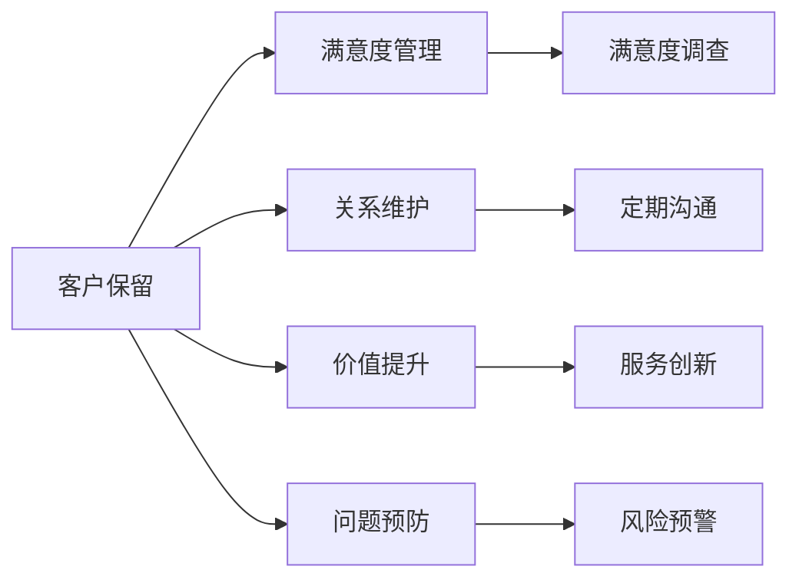
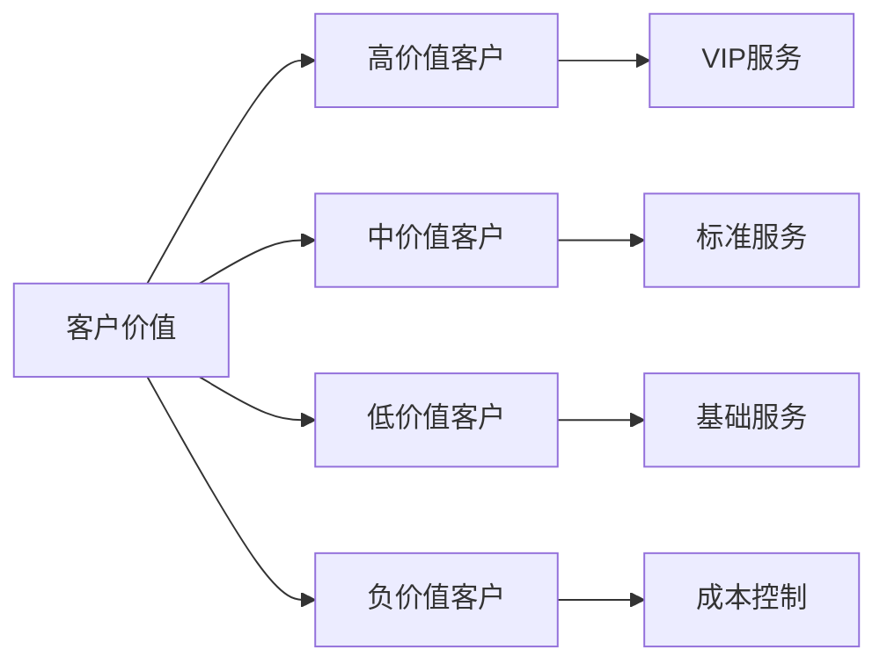
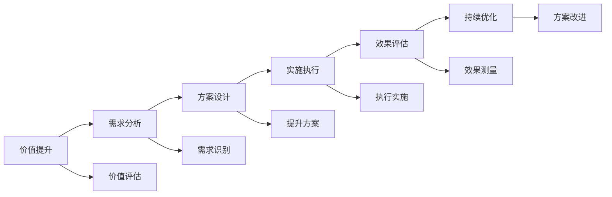
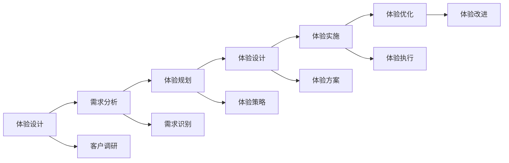
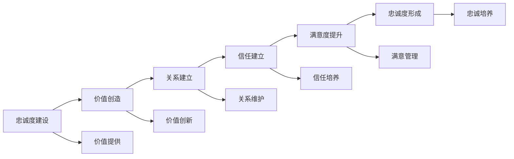

# 客户关系管理

## 新西兰手机维修与二手机销售客户关系管理体系

### 客户关系管理架构

### 客户信息管理

#### 1. 客户信息收集

**信息收集内容**：

| 信息类型 | 收集内容 | 收集方法 | 更新频率 |
|----------|----------|----------|----------|
| **基本信息** | 姓名、联系方式、地址 | 客户登记，系统录入 | 实时更新 |
| **设备信息** | 设备型号、购买时间、使用情况 | 服务记录，设备检测 | 每次服务更新 |
| **服务信息** | 服务历史、问题记录、满意度 | 服务记录，客户反馈 | 每次服务更新 |
| **行为信息** | 购买行为、服务偏好、沟通记录 | 行为分析，数据挖掘 | 每月更新 |
| **价值信息** | 消费金额、频率、推荐价值 | 财务分析，价值评估 | 每季度更新 |

**信息收集标准**：

**信息质量控制**：
- **信息验证**：验证信息准确性
- **信息补全**：补全缺失信息
- **信息更新**：及时更新信息
- **信息清理**：清理无效信息

#### 2. 客户信息分析

**分析维度**：

| 分析维度 | 分析内容 | 分析方法 | 分析结果 |
|----------|----------|----------|----------|
| **价值分析** | 客户价值评估，价值分类 | 价值模型，统计分析 | 客户价值等级 |
| **行为分析** | 购买行为，服务行为 | 行为分析，模式识别 | 行为模式分类 |
| **需求分析** | 需求识别，需求预测 | 需求分析，预测模型 | 需求优先级 |
| **风险分析** | 流失风险，信用风险 | 风险模型，预警系统 | 风险等级评估 |

**分析工具应用**：

#### 3. 客户信息应用

**应用场景**：

| 应用场景 | 应用内容 | 应用方法 | 应用效果 |
|----------|----------|----------|----------|
| **个性化服务** | 基于客户信息的个性化服务 | 客户画像，服务定制 | 服务满意度提升 |
| **精准营销** | 基于客户行为的精准营销 | 行为分析，营销策略 | 营销效果提升 |
| **风险控制** | 基于客户风险的风险控制 | 风险模型，预警系统 | 风险控制效果 |
| **决策支持** | 基于客户数据的决策支持 | 数据分析，决策模型 | 决策质量提升 |

### 客户生命周期管理

#### 1. 客户获取阶段

**获取策略**：

| 获取渠道 | 获取方法 | 目标客户 | 获取成本 |
|----------|----------|----------|----------|
| **线上渠道** | 网站、社交媒体、在线广告 | 年轻客户，技术敏感客户 | 中等成本 |
| **线下渠道** | 门店、展会、推荐 | 本地客户，信任敏感客户 | 较高成本 |
| **推荐渠道** | 客户推荐，合作伙伴推荐 | 高质量客户，信任客户 | 低成本 |
| **广告渠道** | 传统广告，数字广告 | 大众客户，品牌敏感客户 | 高成本 |

**获取流程**：

**获取效果评估**：
- **获取数量**：新客户获取数量
- **获取质量**：新客户质量评估
- **获取成本**：客户获取成本
- **转化率**：潜在客户转化率

#### 2. 客户发展阶段

**发展策略**：

| 发展阶段 | 发展目标 | 发展策略 | 发展指标 |
|----------|----------|----------|----------|
| **新客户** | 建立信任，了解需求 | 优质服务，关系建立 | 满意度>4.0，复购率>30% |
| **成长客户** | 增加消费，提升价值 | 交叉销售，服务升级 | 消费增长>20%，推荐率>40% |
| **成熟客户** | 稳定关系，深度合作 | 个性化服务，价值共创 | 忠诚度>4.5，生命周期价值增长 |
| **VIP客户** | 深度绑定，长期合作 | 专属服务，战略合作 | 长期合作，高价值贡献 |

**发展路径**：

#### 3. 客户保留阶段

**保留策略**：

| 保留策略 | 策略内容 | 实施方法 | 保留效果 |
|----------|----------|----------|----------|
| **服务质量** | 提升服务质量，确保客户满意 | 服务标准化，质量监控 | 满意度提升，流失率降低 |
| **关系维护** | 维护客户关系，建立情感连接 | 定期沟通，个性化服务 | 关系稳定，忠诚度提升 |
| **价值创造** | 持续创造价值，满足客户需求 | 创新服务，价值提升 | 价值感知提升，粘性增强 |
| **问题解决** | 快速解决问题，预防问题发生 | 问题处理，预防措施 | 问题解决率提升，投诉减少 |

**保留措施**：

### 客户价值管理

#### 1. 客户价值识别

**价值识别模型**：

| 价值维度 | 价值指标 | 权重 | 计算方法 |
|----------|----------|------|----------|
| **当前价值** | 年度消费金额 | 40% | 直接计算 |
| **潜在价值** | 未来消费潜力 | 30% | 预测模型 |
| **推荐价值** | 推荐新客户价值 | 20% | 推荐分析 |
| **战略价值** | 品牌价值，市场价值 | 10% | 综合评估 |

**价值分类标准**：

#### 2. 客户价值提升

**价值提升策略**：

| 提升策略 | 策略内容 | 实施方法 | 预期效果 |
|----------|----------|----------|----------|
| **消费提升** | 增加消费频率和金额 | 交叉销售，升级销售 | 消费增长20-30% |
| **服务升级** | 升级服务等级和质量 | 个性化服务，专属服务 | 满意度提升0.5分 |
| **关系深化** | 深化客户关系，增加粘性 | 关系维护，情感连接 | 忠诚度提升30% |
| **价值共创** | 与客户共创价值 | 合作创新，价值分享 | 长期价值增长 |

**价值提升实施**：

#### 3. 客户价值实现

**价值实现方式**：

| 实现方式 | 实现内容 | 实现方法 | 实现效果 |
|----------|----------|----------|----------|
| **直接价值** | 直接消费带来的价值 | 销售增长，利润提升 | 收入增长，利润提升 |
| **间接价值** | 推荐、口碑带来的价值 | 推荐营销，口碑传播 | 品牌价值，市场拓展 |
| **长期价值** | 长期合作带来的价值 | 长期协议，战略合作 | 稳定收入，市场地位 |
| **战略价值** | 战略意义带来的价值 | 战略合作，市场影响 | 市场地位，竞争优势 |

### 客户体验管理

#### 1. 客户体验设计

**体验设计原则**：

| 设计原则 | 原则内容 | 设计方法 | 设计效果 |
|----------|----------|----------|----------|
| **客户中心** | 以客户为中心设计体验 | 客户调研，需求分析 | 客户满意度提升 |
| **一致性** | 保持体验的一致性 | 标准化设计，统一标准 | 品牌形象统一 |
| **个性化** | 提供个性化体验 | 个性化设计，定制服务 | 客户粘性提升 |
| **创新性** | 不断创新体验方式 | 创新设计，技术应用 | 竞争优势提升 |

**体验设计流程**：

#### 2. 客户体验实施

**体验实施要素**：

| 实施要素 | 实施内容 | 实施方法 | 实施标准 |
|----------|----------|----------|----------|
| **服务流程** | 优化服务流程，提升效率 | 流程设计，流程优化 | 流程标准化，效率提升 |
| **服务质量** | 提升服务质量，确保满意 | 质量管控，服务标准 | 质量达标，客户满意 |
| **服务环境** | 改善服务环境，提升体验 | 环境设计，环境优化 | 环境舒适，体验良好 |
| **服务人员** | 提升服务人员素质 | 人员培训，技能提升 | 服务专业，态度友好 |

#### 3. 客户体验优化

**体验优化方法**：

| 优化方法 | 优化内容 | 优化技术 | 优化效果 |
|----------|----------|----------|----------|
| **数据分析** | 分析客户体验数据 | 数据分析，数据挖掘 | 问题识别，改进方向 |
| **客户反馈** | 收集客户反馈意见 | 反馈收集，意见分析 | 问题发现，改进建议 |
| **持续改进** | 持续改进体验质量 | 改进流程，改进措施 | 体验质量持续提升 |
| **创新应用** | 应用新技术新方法 | 技术创新，方法创新 | 体验创新，竞争优势 |

### 客户忠诚度管理

#### 1. 忠诚度建设

**忠诚度建设策略**：

| 建设策略 | 策略内容 | 实施方法 | 建设效果 |
|----------|----------|----------|----------|
| **价值创造** | 持续为客户创造价值 | 价值创新，价值提升 | 价值感知提升，忠诚度增强 |
| **关系建立** | 建立深厚客户关系 | 关系维护，情感连接 | 关系稳定，忠诚度提升 |
| **信任建立** | 建立客户信任 | 诚信服务，透明沟通 | 信任度提升，忠诚度增强 |
| **满意度提升** | 提升客户满意度 | 服务质量，问题解决 | 满意度提升，忠诚度增强 |

**忠诚度建设路径**：

#### 2. 忠诚度维护

**忠诚度维护措施**：

| 维护措施 | 措施内容 | 实施方法 | 维护效果 |
|----------|----------|----------|----------|
| **持续价值** | 持续提供价值 | 价值创新，价值提升 | 价值持续，忠诚度稳定 |
| **关系维护** | 维护客户关系 | 定期沟通，关系维护 | 关系稳定，忠诚度维护 |
| **问题预防** | 预防问题发生 | 风险预警，问题预防 | 问题减少，忠诚度稳定 |
| **满意度管理** | 管理客户满意度 | 满意度监控，满意度提升 | 满意度稳定，忠诚度维护 |

#### 3. 忠诚度提升

**忠诚度提升方法**：

| 提升方法 | 方法内容 | 实施技术 | 提升效果 |
|----------|----------|----------|----------|
| **会员计划** | 实施会员计划 | 会员制度，会员权益 | 会员粘性，忠诚度提升 |
| **积分奖励** | 实施积分奖励 | 积分系统，奖励机制 | 参与度提升，忠诚度增强 |
| **专属服务** | 提供专属服务 | 个性化服务，专属权益 | 专属体验，忠诚度提升 |
| **情感连接** | 建立情感连接 | 情感营销，情感服务 | 情感认同，忠诚度增强 |

## 客户关系管理效果评估

### 评估指标

#### 1. 客户关系指标
- **客户满意度**：>4.5/5
- **客户忠诚度**：>4.0/5
- **客户保留率**：>85%
- **客户推荐率**：>60%

#### 2. 业务价值指标
- **客户生命周期价值**：持续增长
- **客户价值增长率**：>20%
- **交叉销售率**：>30%
- **客户获取成本**：持续降低

#### 3. 运营效率指标
- **客户服务效率**：持续提升
- **客户响应时间**：<5分钟
- **问题解决率**：>95%
- **客户投诉率**：<2%

## 对从业者的建议

### 客户关系管理建议
1. **系统化管理**：建立系统化的客户关系管理体系
2. **数据驱动**：基于数据进行客户关系管理
3. **个性化服务**：提供个性化的客户服务
4. **持续改进**：持续改进客户关系管理

### 技能提升建议
1. **数据分析**：提升客户数据分析能力
2. **沟通技巧**：提升客户沟通技巧
3. **服务技能**：提升客户服务技能
4. **关系维护**：提升客户关系维护能力

### 工具应用建议
1. **CRM系统**：熟练使用CRM系统
2. **数据分析工具**：掌握数据分析工具
3. **沟通工具**：熟练使用沟通工具
4. **服务工具**：掌握客户服务工具

---
**相关链接**：
- [[02-理解应用层/01-客户服务/04-客户维护策略|客户维护策略]]
- [[03-高级应用层/01-业务整合/03-客户生命周期管理|客户生命周期管理]]
- [[07-运营监督体系/04-客户满意度监督/01-客户满意度调查方法|客户满意度调查方法]]

*最后更新：2024年*
*适用市场：新西兰*
