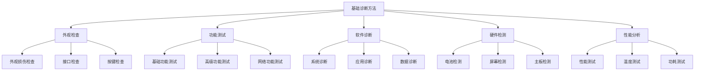
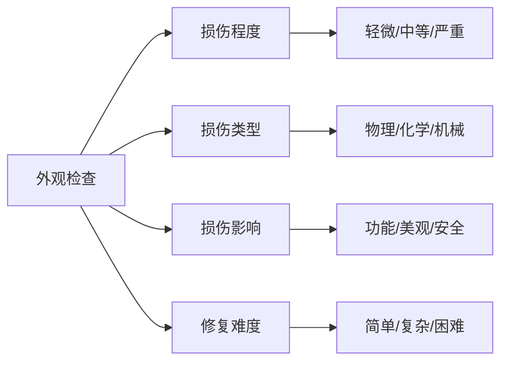
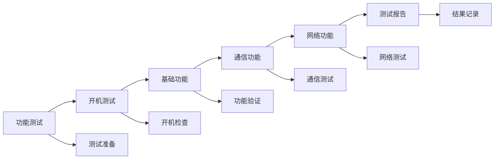
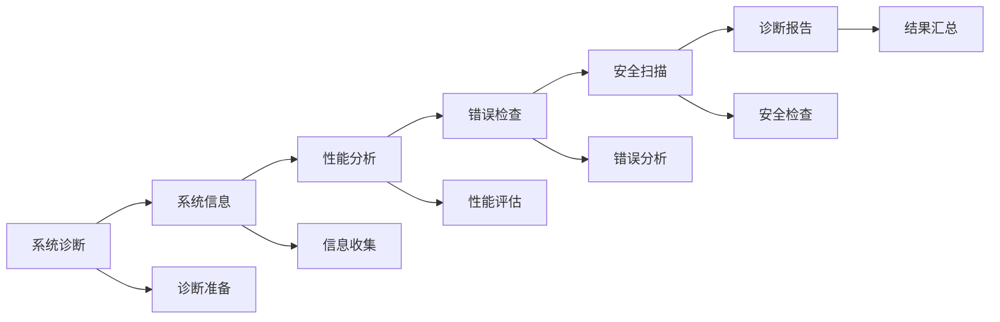
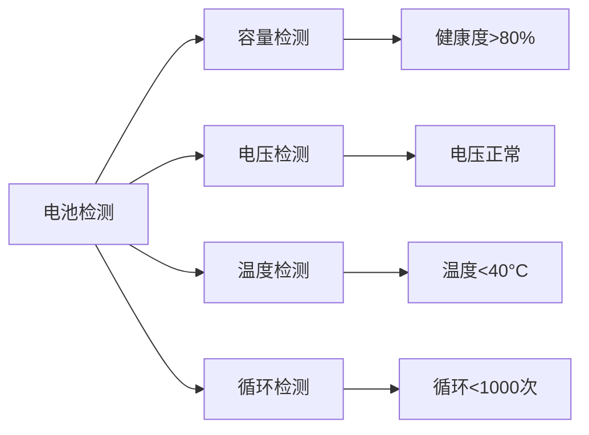

# 基础诊断方法

## 新西兰手机维修基础诊断技术体系

### 诊断方法架构

### 外观检查方法

#### 1. 外观损伤检查

**检查项目**：

| 检查部位 | 检查内容 | 检查方法 | 损伤类型 |
|----------|----------|----------|----------|
| **屏幕** | 裂纹、划痕、黑点 | 目视检查，光线照射 | 外屏破裂、内屏损坏、触摸失灵 |
| **后盖** | 划痕、凹陷、裂纹 | 目视检查，触摸检查 | 后盖破损、摄像头损坏、指纹识别故障 |
| **边框** | 变形、划痕、掉漆 | 目视检查，触摸检查 | 边框变形、按键损坏、接口故障 |
| **摄像头** | 镜头划痕、进灰 | 目视检查，拍照测试 | 镜头损坏、对焦故障、拍照模糊 |

**检查标准**：

**检查记录**：
- **损伤描述**：详细描述损伤情况
- **损伤位置**：准确标注损伤位置
- **损伤程度**：评估损伤严重程度
- **修复建议**：提供修复建议和方案

#### 2. 接口检查

**接口检查项目**：

| 接口类型 | 检查内容 | 检查方法 | 常见问题 |
|----------|----------|----------|----------|
| **充电接口** | 接口清洁、接触良好 | 目视检查，充电测试 | 接口脏污、接触不良、充电慢 |
| **耳机接口** | 接口清洁、接触良好 | 目视检查，音频测试 | 接口脏污、接触不良、音频异常 |
| **SIM卡槽** | 卡槽完整、接触良好 | 目视检查，SIM测试 | 卡槽损坏、接触不良、信号差 |
| **存储卡槽** | 卡槽完整、接触良好 | 目视检查，存储测试 | 卡槽损坏、接触不良、存储异常 |

**检查工具**：
- **放大镜**：检查接口细节
- **手电筒**：照明检查
- **清洁工具**：清洁接口
- **测试工具**：功能测试

#### 3. 按键检查

**按键检查项目**：

| 按键类型 | 检查内容 | 检查方法 | 常见问题 |
|----------|----------|----------|----------|
| **电源键** | 按键响应、触感正常 | 按键测试，触感检查 | 按键失灵、触感异常、响应慢 |
| **音量键** | 按键响应、触感正常 | 按键测试，触感检查 | 按键失灵、触感异常、响应慢 |
| **Home键** | 按键响应、触感正常 | 按键测试，触感检查 | 按键失灵、触感异常、响应慢 |
| **其他按键** | 按键响应、触感正常 | 按键测试，触感检查 | 按键失灵、触感异常、响应慢 |

### 功能测试方法

#### 1. 基础功能测试

**测试项目**：

| 功能类型 | 测试内容 | 测试方法 | 测试标准 |
|----------|----------|----------|----------|
| **开机功能** | 正常开机、启动时间 | 开机测试，时间测量 | 开机正常，启动时间<30秒 |
| **通话功能** | 拨打电话、接听电话 | 通话测试，音质检查 | 通话清晰，音质良好 |
| **短信功能** | 发送短信、接收短信 | 短信测试，内容检查 | 短信正常，内容准确 |
| **网络功能** | 数据连接、WiFi连接 | 网络测试，速度测试 | 网络连接正常，速度达标 |

**测试流程**：

#### 2. 高级功能测试

**测试项目**：

| 功能类型 | 测试内容 | 测试方法 | 测试标准 |
|----------|----------|----------|----------|
| **拍照功能** | 前后摄像头、拍照质量 | 拍照测试，质量检查 | 拍照清晰，功能正常 |
| **录像功能** | 视频录制、画质检查 | 录像测试，画质检查 | 录像清晰，功能正常 |
| **音频功能** | 扬声器、麦克风、耳机 | 音频测试，音质检查 | 音频清晰，功能正常 |
| **传感器功能** | 重力感应、距离感应 | 传感器测试，功能检查 | 传感器正常，功能准确 |

#### 3. 网络功能测试

**测试项目**：

| 网络类型 | 测试内容 | 测试方法 | 测试标准 |
|----------|----------|----------|----------|
| **移动网络** | 4G/5G连接、信号强度 | 网络测试，信号测试 | 网络连接正常，信号良好 |
| **WiFi网络** | WiFi连接、信号强度 | WiFi测试，信号测试 | WiFi连接正常，信号良好 |
| **蓝牙功能** | 蓝牙连接、数据传输 | 蓝牙测试，传输测试 | 蓝牙连接正常，传输稳定 |
| **GPS功能** | 定位精度、导航功能 | GPS测试，定位测试 | 定位准确，导航正常 |

### 软件诊断方法

#### 1. 系统诊断

**诊断项目**：

| 诊断类型 | 诊断内容 | 诊断方法 | 诊断工具 |
|----------|----------|----------|----------|
| **系统版本** | 系统版本、更新状态 | 系统信息查看 | 系统设置，第三方工具 |
| **系统性能** | CPU使用率、内存使用 | 性能监控 | 系统监控，第三方工具 |
| **系统错误** | 系统错误、崩溃记录 | 错误日志分析 | 系统日志，第三方工具 |
| **系统安全** | 安全状态、病毒扫描 | 安全扫描 | 安全软件，第三方工具 |

**诊断流程**：

#### 2. 应用诊断

**诊断项目**：

| 诊断类型 | 诊断内容 | 诊断方法 | 诊断工具 |
|----------|----------|----------|----------|
| **应用状态** | 应用运行状态、崩溃情况 | 应用监控 | 系统监控，第三方工具 |
| **应用性能** | 应用响应速度、资源使用 | 性能测试 | 性能测试工具 |
| **应用兼容性** | 应用兼容性、冲突情况 | 兼容性测试 | 兼容性测试工具 |
| **应用数据** | 应用数据完整性、备份状态 | 数据检查 | 数据检查工具 |

#### 3. 数据诊断

**诊断项目**：

| 诊断类型 | 诊断内容 | 诊断方法 | 诊断工具 |
|----------|----------|----------|----------|
| **数据完整性** | 数据完整性、损坏情况 | 数据扫描 | 数据扫描工具 |
| **数据备份** | 备份状态、备份完整性 | 备份检查 | 备份检查工具 |
| **数据恢复** | 恢复可能性、恢复方法 | 恢复测试 | 恢复测试工具 |
| **数据安全** | 数据安全、加密状态 | 安全检查 | 安全检查工具 |

### 硬件检测方法

#### 1. 电池检测

**检测项目**：

| 检测类型 | 检测内容 | 检测方法 | 检测工具 |
|----------|----------|----------|----------|
| **电池容量** | 电池容量、健康度 | 容量测试 | 电池测试仪，软件工具 |
| **电池电压** | 电池电压、充电电压 | 电压测试 | 万用表，电池测试仪 |
| **电池温度** | 电池温度、充电温度 | 温度测试 | 温度计，软件工具 |
| **电池循环** | 充电循环次数、寿命 | 循环测试 | 软件工具，系统信息 |

**检测标准**：

#### 2. 屏幕检测

**检测项目**：

| 检测类型 | 检测内容 | 检测方法 | 检测工具 |
|----------|----------|----------|----------|
| **显示效果** | 亮度、对比度、色彩 | 显示测试 | 显示测试软件，目视检查 |
| **触摸功能** | 触摸响应、精度 | 触摸测试 | 触摸测试软件，功能测试 |
| **屏幕损伤** | 裂纹、黑点、亮点 | 外观检查 | 目视检查，放大镜 |
| **屏幕性能** | 刷新率、响应时间 | 性能测试 | 性能测试软件，专业工具 |

#### 3. 主板检测

**检测项目**：

| 检测类型 | 检测内容 | 检测方法 | 检测工具 |
|----------|----------|----------|----------|
| **主板外观** | 主板外观、元件状态 | 目视检查 | 放大镜，显微镜 |
| **主板功能** | 主板功能、信号测试 | 功能测试 | 专业测试设备 |
| **主板温度** | 主板温度、散热效果 | 温度测试 | 温度计，热成像仪 |
| **主板电压** | 主板电压、电流测试 | 电压测试 | 万用表，示波器 |

### 性能分析方法

#### 1. 性能测试

**测试项目**：

| 测试类型 | 测试内容 | 测试方法 | 测试工具 |
|----------|----------|----------|----------|
| **CPU性能** | CPU使用率、处理速度 | 性能测试 | 性能测试软件，基准测试 |
| **内存性能** | 内存使用率、读写速度 | 内存测试 | 内存测试软件，基准测试 |
| **存储性能** | 存储速度、读写性能 | 存储测试 | 存储测试软件，基准测试 |
| **图形性能** | 图形处理、游戏性能 | 图形测试 | 图形测试软件，游戏测试 |

#### 2. 温度测试

**测试项目**：

| 测试类型 | 测试内容 | 测试方法 | 测试工具 |
|----------|----------|----------|----------|
| **CPU温度** | CPU温度、散热效果 | 温度监控 | 温度监控软件，温度计 |
| **电池温度** | 电池温度、充电温度 | 温度监控 | 温度监控软件，温度计 |
| **主板温度** | 主板温度、元件温度 | 温度监控 | 热成像仪，温度计 |
| **整体温度** | 设备整体温度分布 | 温度分析 | 热成像仪，温度分析软件 |

#### 3. 功耗测试

**测试项目**：

| 测试类型 | 测试内容 | 测试方法 | 测试工具 |
|----------|----------|----------|----------|
| **待机功耗** | 待机状态功耗 | 功耗测试 | 功耗测试仪，软件工具 |
| **使用功耗** | 使用状态功耗 | 功耗测试 | 功耗测试仪，软件工具 |
| **充电功耗** | 充电状态功耗 | 功耗测试 | 功耗测试仪，软件工具 |
| **功耗分析** | 功耗分布、优化建议 | 功耗分析 | 功耗分析软件，专业工具 |

## 诊断工具和设备

### 基础工具

#### 1. 检测工具
- **万用表**：电压、电流、电阻测试
- **示波器**：信号波形分析
- **温度计**：温度测量
- **放大镜**：细节检查

#### 2. 测试工具
- **电池测试仪**：电池性能测试
- **屏幕测试仪**：屏幕功能测试
- **信号发生器**：信号测试
- **负载测试仪**：负载测试

### 专业设备

#### 1. 检测设备
- **热成像仪**：温度分布检测
- **显微镜**：微观检查
- **X光机**：内部结构检查
- **超声波检测仪**：内部缺陷检测

#### 2. 测试设备
- **综合测试仪**：综合功能测试
- **性能测试仪**：性能基准测试
- **兼容性测试仪**：兼容性测试
- **可靠性测试仪**：可靠性测试

## 诊断报告和记录

### 诊断报告格式

#### 1. 报告内容
- **设备信息**：设备型号、序列号、购买时间
- **问题描述**：客户描述的问题
- **诊断结果**：详细的诊断结果
- **修复建议**：修复方案和建议
- **费用估算**：修复费用估算
- **时间估算**：修复时间估算

#### 2. 报告标准
- **信息完整**：信息记录完整
- **描述准确**：描述准确清晰
- **建议合理**：建议合理可行
- **格式规范**：格式统一规范

### 诊断记录管理

#### 1. 记录内容
- **诊断过程**：详细的诊断过程
- **测试数据**：测试数据和结果
- **问题分析**：问题分析和判断
- **解决方案**：解决方案和措施

#### 2. 记录管理
- **记录保存**：妥善保存诊断记录
- **记录更新**：及时更新诊断记录
- **记录查询**：便于查询和检索
- **记录分析**：定期分析诊断记录

## 对从业者的建议

### 诊断技能建议
1. **系统学习**：系统学习诊断技术
2. **实践操作**：通过实践提升技能
3. **工具使用**：熟练使用诊断工具
4. **经验积累**：积累诊断经验

### 诊断方法建议
1. **标准化诊断**：建立标准化诊断流程
2. **系统化诊断**：系统化进行诊断
3. **准确性诊断**：确保诊断准确性
4. **效率化诊断**：提高诊断效率

### 诊断质量建议
1. **质量保证**：确保诊断质量
2. **持续改进**：持续改进诊断方法
3. **技术创新**：应用新技术新方法
4. **专业发展**：提升专业诊断水平

---
**相关链接**：
- [[02-理解应用层/02-技术维修/02-常见故障处理|常见故障处理]]
- [[02-理解应用层/02-技术维修/03-维修流程标准|维修流程标准]]
- [[04-工具模板/02-检查清单/02-设备检测清单|设备检测清单]]

*最后更新：2024年*
*适用市场：新西兰*

