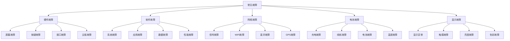
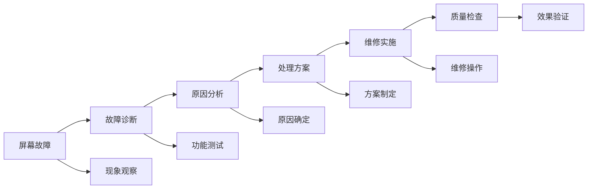
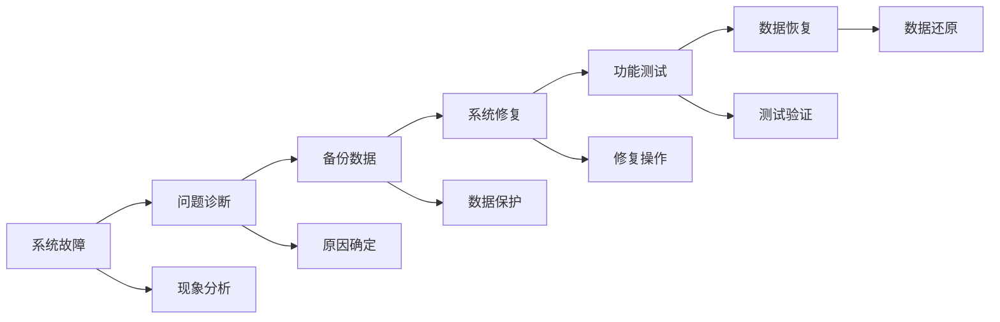
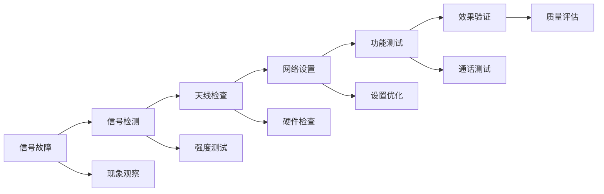

# 常见故障处理

## 新西兰手机维修常见故障处理指南

### 故障分类体系

### 硬件故障处理

#### 1. 屏幕故障处理

**常见屏幕故障**：

| 故障类型 | 故障现象 | 可能原因 | 处理方法 |
|----------|----------|----------|----------|
| **屏幕破裂** | 屏幕有裂纹，显示异常 | 外力撞击，跌落 | 更换屏幕总成 |
| **屏幕黑屏** | 屏幕无显示，背光不亮 | 屏幕损坏，排线故障 | 检查排线，更换屏幕 |
| **屏幕花屏** | 屏幕显示异常，色彩错乱 | 屏幕损坏，主板故障 | 检查主板，更换屏幕 |
| **屏幕闪烁** | 屏幕闪烁，亮度不稳定 | 屏幕故障，电源问题 | 检查电源，更换屏幕 |

**处理流程**：

**处理步骤**：
1. **故障诊断**：观察故障现象，进行功能测试
2. **原因分析**：分析故障原因，确定故障类型
3. **处理方案**：制定处理方案，准备维修工具
4. **维修实施**：按照方案进行维修操作
5. **质量检查**：检查维修质量，验证修复效果

#### 2. 按键故障处理

**常见按键故障**：

| 故障类型 | 故障现象 | 可能原因 | 处理方法 |
|----------|----------|----------|----------|
| **按键失灵** | 按键无响应，功能失效 | 按键损坏，排线故障 | 更换按键，检查排线 |
| **按键卡死** | 按键按下后无法弹起 | 按键机械故障，异物卡住 | 清洁按键，更换按键 |
| **按键触感异常** | 按键触感变差，反馈异常 | 按键老化，机械磨损 | 更换按键，调整触感 |
| **按键误触** | 按键自动触发，误操作 | 按键短路，软件故障 | 检查电路，软件修复 |

**处理要点**：
- **安全操作**：确保操作安全，避免二次损坏
- **工具使用**：使用专业工具，避免损坏设备
- **质量保证**：确保维修质量，测试功能正常
- **客户沟通**：及时沟通维修进度，说明维修情况

#### 3. 接口故障处理

**常见接口故障**：

| 故障类型 | 故障现象 | 可能原因 | 处理方法 |
|----------|----------|----------|----------|
| **充电接口故障** | 无法充电，充电慢 | 接口脏污，接触不良 | 清洁接口，更换接口 |
| **耳机接口故障** | 耳机无声音，接触不良 | 接口损坏，接触不良 | 清洁接口，更换接口 |
| **数据接口故障** | 无法传输数据，连接异常 | 接口损坏，驱动问题 | 检查接口，更新驱动 |
| **SIM卡槽故障** | 无法识别SIM卡，信号差 | 卡槽损坏，接触不良 | 清洁卡槽，更换卡槽 |

**处理注意事项**：
- **接口清洁**：使用专业清洁工具，避免损坏接口
- **接触检查**：检查接触点，确保接触良好
- **功能测试**：维修后进行功能测试，确保正常
- **防护措施**：采取防护措施，避免静电损坏

#### 4. 主板故障处理

**常见主板故障**：

| 故障类型 | 故障现象 | 可能原因 | 处理方法 |
|----------|----------|----------|----------|
| **主板不开机** | 设备无法开机，无响应 | 主板损坏，电源故障 | 检查电源，更换主板 |
| **主板死机** | 设备死机，无法操作 | 主板过热，元件故障 | 检查散热，更换元件 |
| **主板重启** | 设备频繁重启，不稳定 | 主板故障，软件问题 | 检查主板，软件修复 |
| **主板发热** | 主板过热，温度异常 | 散热不良，元件故障 | 改善散热，更换元件 |

**处理要求**：
- **专业操作**：需要专业技术人员操作
- **环境要求**：在无尘环境中操作
- **工具要求**：使用专业维修工具
- **质量要求**：确保维修质量，测试功能

### 软件故障处理

#### 1. 系统故障处理

**常见系统故障**：

| 故障类型 | 故障现象 | 可能原因 | 处理方法 |
|----------|----------|----------|----------|
| **系统卡顿** | 系统运行缓慢，响应慢 | 系统垃圾，内存不足 | 清理垃圾，释放内存 |
| **系统崩溃** | 系统崩溃，无法使用 | 系统损坏，硬件故障 | 系统修复，硬件检查 |
| **系统更新失败** | 系统更新失败，无法升级 | 网络问题，存储空间不足 | 检查网络，清理空间 |
| **系统启动失败** | 系统无法启动，黑屏 | 系统损坏，硬件故障 | 系统重装，硬件检查 |

**处理流程**：

**处理步骤**：
1. **问题诊断**：分析系统问题，确定故障类型
2. **备份数据**：备份重要数据，防止数据丢失
3. **系统修复**：进行系统修复，解决系统问题
4. **功能测试**：测试系统功能，确保正常运行
5. **数据恢复**：恢复用户数据，确保数据完整

#### 2. 应用故障处理

**常见应用故障**：

| 故障类型 | 故障现象 | 可能原因 | 处理方法 |
|----------|----------|----------|----------|
| **应用崩溃** | 应用崩溃，无法使用 | 应用损坏，兼容性问题 | 重新安装，更新应用 |
| **应用卡顿** | 应用运行缓慢，响应慢 | 应用问题，系统资源不足 | 优化应用，释放资源 |
| **应用无法安装** | 应用无法安装，安装失败 | 存储空间不足，权限问题 | 清理空间，检查权限 |
| **应用数据丢失** | 应用数据丢失，无法恢复 | 应用问题，系统问题 | 数据恢复，应用修复 |

**处理要点**：
- **数据保护**：保护用户数据，避免数据丢失
- **兼容性检查**：检查应用兼容性，确保正常运行
- **权限管理**：管理应用权限，确保安全使用
- **性能优化**：优化应用性能，提升用户体验

#### 3. 数据故障处理

**常见数据故障**：

| 故障类型 | 故障现象 | 可能原因 | 处理方法 |
|----------|----------|----------|----------|
| **数据丢失** | 数据丢失，无法访问 | 误删除，系统故障 | 数据恢复，系统修复 |
| **数据损坏** | 数据损坏，无法使用 | 存储故障，系统问题 | 数据修复，系统检查 |
| **数据无法访问** | 数据无法访问，权限问题 | 权限问题，系统问题 | 权限修复，系统检查 |
| **数据同步失败** | 数据同步失败，数据不一致 | 网络问题，服务问题 | 检查网络，修复服务 |

**处理注意事项**：
- **数据安全**：确保数据安全，避免数据泄露
- **备份恢复**：使用备份恢复数据，确保数据完整
- **权限管理**：管理数据权限，确保数据安全
- **同步检查**：检查数据同步，确保数据一致

### 网络故障处理

#### 1. 信号故障处理

**常见信号故障**：

| 故障类型 | 故障现象 | 可能原因 | 处理方法 |
|----------|----------|----------|----------|
| **信号弱** | 信号强度弱，通话质量差 | 天线故障，网络问题 | 检查天线，网络设置 |
| **信号不稳定** | 信号不稳定，时断时续 | 天线故障，网络问题 | 检查天线，网络优化 |
| **无信号** | 无信号，无法通话 | 天线故障，SIM卡问题 | 检查天线，更换SIM卡 |
| **信号干扰** | 信号干扰，通话异常 | 环境干扰，设备问题 | 改善环境，检查设备 |

**处理流程**：

#### 2. WiFi故障处理

**常见WiFi故障**：

| 故障类型 | 故障现象 | 可能原因 | 处理方法 |
|----------|----------|----------|----------|
| **WiFi无法连接** | 无法连接WiFi网络 | 密码错误，网络问题 | 检查密码，网络设置 |
| **WiFi连接不稳定** | WiFi连接不稳定，经常断开 | 信号弱，网络问题 | 改善信号，网络优化 |
| **WiFi速度慢** | WiFi速度慢，网络延迟 | 网络拥堵，设备问题 | 网络优化，设备检查 |
| **WiFi无法搜索** | 无法搜索到WiFi网络 | WiFi模块故障，系统问题 | 检查模块，系统修复 |

#### 3. 蓝牙故障处理

**常见蓝牙故障**：

| 故障类型 | 故障现象 | 可能原因 | 处理方法 |
|----------|----------|----------|----------|
| **蓝牙无法连接** | 无法连接蓝牙设备 | 设备不兼容，距离过远 | 检查兼容性，调整距离 |
| **蓝牙连接不稳定** | 蓝牙连接不稳定，经常断开 | 信号干扰，设备问题 | 改善环境，检查设备 |
| **蓝牙传输慢** | 蓝牙传输速度慢 | 设备问题，环境干扰 | 检查设备，改善环境 |
| **蓝牙无法搜索** | 无法搜索到蓝牙设备 | 蓝牙模块故障，系统问题 | 检查模块，系统修复 |

### 电池故障处理

#### 1. 充电故障处理

**常见充电故障**：

| 故障类型 | 故障现象 | 可能原因 | 处理方法 |
|----------|----------|----------|----------|
| **无法充电** | 设备无法充电，充电无反应 | 充电接口故障，充电器问题 | 检查接口，更换充电器 |
| **充电慢** | 充电速度慢，充电时间长 | 充电器功率低，接口问题 | 更换充电器，检查接口 |
| **充电异常** | 充电异常，充电不稳定 | 电池故障，充电电路问题 | 检查电池，修复电路 |
| **充电发热** | 充电时设备发热严重 | 电池故障，充电器问题 | 检查电池，更换充电器 |

**处理要点**：
- **安全第一**：确保充电安全，避免安全事故
- **设备检查**：检查充电设备和接口
- **电池状态**：检查电池状态和健康度
- **充电环境**：确保充电环境安全

#### 2. 续航故障处理

**常见续航故障**：

| 故障类型 | 故障现象 | 可能原因 | 处理方法 |
|----------|----------|----------|----------|
| **续航时间短** | 电池续航时间短，耗电快 | 电池老化，应用耗电 | 更换电池，优化应用 |
| **电量显示异常** | 电量显示不准确，跳变 | 电池故障，系统问题 | 检查电池，系统修复 |
| **突然关机** | 设备突然关机，电量不足 | 电池故障，系统问题 | 检查电池，系统检查 |
| **充电循环异常** | 充电循环异常，充电次数不准确 | 电池故障，系统问题 | 检查电池，系统修复 |

### 显示故障处理

#### 1. 显示异常处理

**常见显示异常**：

| 故障类型 | 故障现象 | 可能原因 | 处理方法 |
|----------|----------|----------|----------|
| **显示花屏** | 屏幕显示花屏，色彩错乱 | 屏幕故障，主板问题 | 检查屏幕，检查主板 |
| **显示黑屏** | 屏幕黑屏，无显示 | 屏幕故障，背光问题 | 检查屏幕，检查背光 |
| **显示白屏** | 屏幕白屏，无内容显示 | 屏幕故障，系统问题 | 检查屏幕，系统检查 |
| **显示闪烁** | 屏幕闪烁，亮度不稳定 | 屏幕故障，电源问题 | 检查屏幕，检查电源 |

#### 2. 触摸故障处理

**常见触摸故障**：

| 故障类型 | 故障现象 | 可能原因 | 处理方法 |
|----------|----------|----------|----------|
| **触摸失灵** | 触摸无响应，无法操作 | 触摸屏故障，系统问题 | 检查触摸屏，系统检查 |
| **触摸不准确** | 触摸位置不准确，偏移 | 触摸屏故障，校准问题 | 检查触摸屏，重新校准 |
| **触摸延迟** | 触摸响应延迟，反应慢 | 触摸屏故障，系统问题 | 检查触摸屏，系统优化 |
| **触摸误触** | 触摸误触，自动操作 | 触摸屏故障，系统问题 | 检查触摸屏，系统检查 |

## 故障处理流程

### 标准处理流程

#### 1. 故障接收
- **客户描述**：详细了解客户描述的问题
- **初步判断**：初步判断故障类型和严重程度
- **记录信息**：记录故障信息和客户信息
- **预约时间**：预约维修时间

#### 2. 故障诊断
- **外观检查**：检查设备外观和损伤情况
- **功能测试**：测试设备各项功能
- **专业检测**：使用专业工具进行检测
- **问题分析**：分析问题原因和解决方案

#### 3. 方案制定
- **解决方案**：制定详细的解决方案
- **费用估算**：估算维修费用
- **时间估算**：估算维修时间
- **客户确认**：与客户确认维修方案

#### 4. 维修实施
- **准备工作**：准备维修工具和材料
- **维修操作**：按照方案进行维修
- **质量检查**：检查维修质量
- **功能测试**：测试设备功能

#### 5. 交付验收
- **客户验收**：客户验收维修结果
- **使用指导**：指导客户正确使用
- **保修说明**：说明保修政策
- **后续服务**：提供后续服务支持

## 对从业者的建议

### 故障处理建议
1. **系统诊断**：系统化进行故障诊断
2. **安全操作**：确保维修操作安全
3. **质量保证**：确保维修质量
4. **客户沟通**：及时与客户沟通

### 技能提升建议
1. **技术学习**：持续学习新技术
2. **经验积累**：积累故障处理经验
3. **工具使用**：熟练使用维修工具
4. **问题解决**：提升问题解决能力

### 服务质量建议
1. **专业服务**：提供专业维修服务
2. **及时响应**：及时响应客户需求
3. **质量保证**：确保维修质量
4. **客户满意**：确保客户满意

---
**相关链接**：
- [[02-理解应用层/02-技术维修/01-基础诊断方法|基础诊断方法]]
- [[02-理解应用层/02-技术维修/03-维修流程标准|维修流程标准]]
- [[05-案例库/02-问题解决/02-技术难题解决案例|技术难题解决案例]]

*最后更新：2024年*
*适用市场：新西兰*

