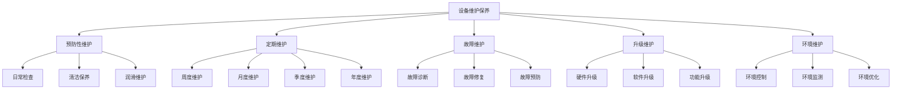
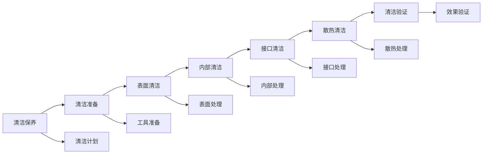
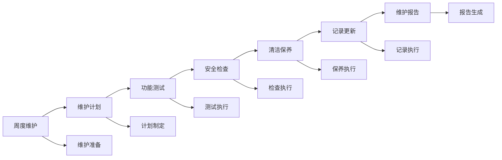
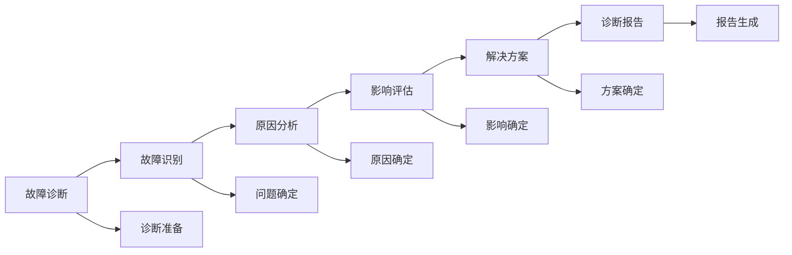
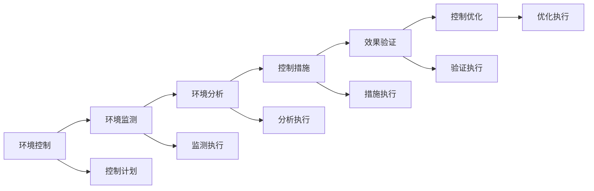

# 设备维护保养

## 新西兰手机维修设备维护保养体系

### 设备维护保养架构

### 预防性维护

#### 1. 日常检查

**检查项目**：

| 检查类型 | 检查内容 | 检查方法 | 检查标准 |
|----------|----------|----------|----------|
| **外观检查** | 设备外观，损伤情况 | 目视检查，触摸检查 | 外观完好，无损伤 |
| **功能检查** | 设备功能，运行状态 | 功能测试，状态检查 | 功能正常，状态良好 |
| **安全检查** | 安全状态，风险识别 | 安全检查，风险评估 | 安全可靠，风险可控 |
| **环境检查** | 环境状态，条件适宜 | 环境检查，条件评估 | 环境适宜，条件良好 |

**检查流程**：

**检查标准**：
- **检查频率**：每日检查一次
- **检查时间**：工作开始前30分钟
- **检查人员**：设备使用人员
- **检查记录**：详细记录检查结果

#### 2. 清洁保养

**清洁项目**：

| 清洁类型 | 清洁内容 | 清洁方法 | 清洁标准 |
|----------|----------|----------|----------|
| **表面清洁** | 设备表面，灰尘清理 | 软布擦拭，清洁剂使用 | 表面干净，无灰尘 |
| **内部清洁** | 设备内部，灰尘清理 | 压缩空气，专业清洁 | 内部清洁，无积尘 |
| **接口清洁** | 接口清洁，接触良好 | 专业清洁，接触检查 | 接口清洁，接触良好 |
| **散热清洁** | 散热器清洁，散热良好 | 散热器清洁，散热检查 | 散热良好，温度正常 |

**清洁要求**：

**清洁标准**：
- **清洁频率**：每周清洁一次
- **清洁时间**：工作结束后进行
- **清洁工具**：专业清洁工具
- **清洁效果**：设备干净，功能正常

#### 3. 润滑维护

**润滑项目**：

| 润滑类型 | 润滑内容 | 润滑方法 | 润滑标准 |
|----------|----------|----------|----------|
| **机械润滑** | 机械部件，润滑保养 | 专业润滑油，润滑检查 | 润滑良好，运行顺畅 |
| **轴承润滑** | 轴承部件，润滑保养 | 轴承润滑脂，润滑检查 | 轴承润滑，运行正常 |
| **传动润滑** | 传动部件，润滑保养 | 传动润滑油，润滑检查 | 传动润滑，传动顺畅 |
| **密封润滑** | 密封部件，润滑保养 | 密封润滑剂，润滑检查 | 密封良好，无泄漏 |

### 定期维护

#### 1. 周度维护

**维护项目**：

| 维护类型 | 维护内容 | 维护方法 | 维护标准 |
|----------|----------|----------|----------|
| **功能测试** | 设备功能，全面测试 | 功能测试，性能检查 | 功能正常，性能达标 |
| **安全检查** | 安全状态，全面检查 | 安全检查，风险评估 | 安全可靠，风险可控 |
| **清洁保养** | 设备清洁，深度保养 | 深度清洁，专业保养 | 设备清洁，状态良好 |
| **记录更新** | 维护记录，状态更新 | 记录更新，状态记录 | 记录完整，状态准确 |

**维护流程**：

#### 2. 月度维护

**维护项目**：

| 维护类型 | 维护内容 | 维护方法 | 维护标准 |
|----------|----------|----------|----------|
| **性能测试** | 设备性能，全面测试 | 性能测试，基准测试 | 性能达标，基准符合 |
| **校准检查** | 设备校准，精度检查 | 校准检查，精度验证 | 校准准确，精度达标 |
| **部件检查** | 关键部件，详细检查 | 部件检查，状态评估 | 部件完好，状态良好 |
| **预防更换** | 预防性更换，部件更新 | 预防更换，部件更新 | 更换及时，部件新 |

#### 3. 季度维护

**维护项目**：

| 维护类型 | 维护内容 | 维护方法 | 维护标准 |
|----------|----------|----------|----------|
| **全面检查** | 设备全面，深度检查 | 全面检查，深度分析 | 检查全面，分析深入 |
| **性能优化** | 性能优化，效率提升 | 性能优化，效率提升 | 性能优化，效率提升 |
| **升级评估** | 升级需求，升级评估 | 升级评估，需求分析 | 升级合理，需求明确 |
| **维护计划** | 维护计划，计划更新 | 计划更新，计划优化 | 计划合理，更新及时 |

#### 4. 年度维护

**维护项目**：

| 维护类型 | 维护内容 | 维护方法 | 维护标准 |
|----------|----------|----------|----------|
| **全面检修** | 设备全面，深度检修 | 全面检修，深度维护 | 检修全面，维护深入 |
| **性能评估** | 性能评估，状态评估 | 性能评估，状态分析 | 评估准确，分析深入 |
| **升级决策** | 升级决策，投资决策 | 升级决策，投资分析 | 决策合理，投资有效 |
| **维护总结** | 维护总结，经验总结 | 维护总结，经验提炼 | 总结完整，经验价值 |

### 故障维护

#### 1. 故障诊断

**诊断要求**：

| 诊断要素 | 诊断要求 | 诊断方法 | 诊断标准 |
|----------|----------|----------|----------|
| **故障识别** | 故障识别，问题确定 | 故障识别，问题分析 | 识别准确，问题明确 |
| **原因分析** | 原因分析，根因确定 | 原因分析，根因分析 | 分析准确，根因明确 |
| **影响评估** | 影响评估，损失评估 | 影响评估，损失分析 | 评估准确，损失合理 |
| **解决方案** | 解决方案，修复方案 | 方案制定，修复计划 | 方案合理，修复有效 |

**诊断流程**：

#### 2. 故障修复

**修复要求**：

| 修复要素 | 修复要求 | 修复方法 | 修复标准 |
|----------|----------|----------|----------|
| **修复质量** | 修复质量，效果保证 | 专业修复，质量保证 | 质量达标，效果明显 |
| **修复时间** | 修复时间，效率保证 | 时间控制，效率提升 | 时间合理，效率高 |
| **修复成本** | 修复成本，成本控制 | 成本控制，效益分析 | 成本合理，效益好 |
| **修复安全** | 修复安全，风险控制 | 安全控制，风险管控 | 安全可靠，风险可控 |

#### 3. 故障预防

**预防措施**：

| 预防类型 | 预防内容 | 预防方法 | 预防标准 |
|----------|----------|----------|----------|
| **故障预防** | 故障预防，问题预防 | 预防措施，问题预防 | 预防有效，问题减少 |
| **风险控制** | 风险控制，风险管控 | 风险控制，风险管控 | 风险可控，管控有效 |
| **维护优化** | 维护优化，维护改进 | 维护优化，维护改进 | 维护优化，改进明显 |
| **经验总结** | 经验总结，经验积累 | 经验总结，经验积累 | 总结完整，经验价值 |

### 升级维护

#### 1. 硬件升级

**升级要求**：

| 升级要素 | 升级要求 | 升级方法 | 升级标准 |
|----------|----------|----------|----------|
| **升级需求** | 升级需求，需求分析 | 需求分析，需求评估 | 需求明确，分析准确 |
| **升级方案** | 升级方案，方案设计 | 方案设计，方案评估 | 方案合理，设计科学 |
| **升级实施** | 升级实施，实施执行 | 实施执行，实施监控 | 实施顺利，监控有效 |
| **升级验证** | 升级验证，效果验证 | 效果验证，性能验证 | 验证准确，效果明显 |

**升级流程**：

#### 2. 软件升级

**升级要求**：

| 升级要素 | 升级要求 | 升级方法 | 升级标准 |
|----------|----------|----------|----------|
| **软件版本** | 软件版本，版本管理 | 版本管理，版本控制 | 版本最新，管理规范 |
| **功能升级** | 功能升级，功能增强 | 功能增强，功能优化 | 功能增强，优化明显 |
| **性能升级** | 性能升级，性能提升 | 性能提升，性能优化 | 性能提升，优化有效 |
| **安全升级** | 安全升级，安全增强 | 安全增强，安全防护 | 安全增强，防护有效 |

#### 3. 功能升级

**升级要求**：

| 升级要素 | 升级要求 | 升级方法 | 升级标准 |
|----------|----------|----------|----------|
| **功能扩展** | 功能扩展，功能增加 | 功能增加，功能扩展 | 功能增加，扩展有效 |
| **功能优化** | 功能优化，功能改进 | 功能改进，功能优化 | 功能改进，优化明显 |
| **功能集成** | 功能集成，功能整合 | 功能整合，功能集成 | 功能整合，集成有效 |
| **功能创新** | 功能创新，功能开发 | 功能开发，功能创新 | 功能开发，创新有效 |

### 环境维护

#### 1. 环境控制

**控制要求**：

| 控制要素 | 控制要求 | 控制方法 | 控制标准 |
|----------|----------|----------|----------|
| **温度控制** | 温度控制，温度适宜 | 温度控制，温度监测 | 温度适宜，控制有效 |
| **湿度控制** | 湿度控制，湿度适宜 | 湿度控制，湿度监测 | 湿度适宜，控制有效 |
| **清洁控制** | 清洁控制，环境清洁 | 清洁控制，清洁监测 | 环境清洁，控制有效 |
| **安全控制** | 安全控制，环境安全 | 安全控制，安全监测 | 环境安全，控制有效 |

**控制流程**：

#### 2. 环境监测

**监测要求**：

| 监测要素 | 监测要求 | 监测方法 | 监测标准 |
|----------|----------|----------|----------|
| **温度监测** | 温度监测，温度记录 | 温度监测，温度记录 | 监测准确，记录完整 |
| **湿度监测** | 湿度监测，湿度记录 | 湿度监测，湿度记录 | 监测准确，记录完整 |
| **清洁监测** | 清洁监测，清洁记录 | 清洁监测，清洁记录 | 监测准确，记录完整 |
| **安全监测** | 安全监测，安全记录 | 安全监测，安全记录 | 监测准确，记录完整 |

#### 3. 环境优化

**优化要求**：

| 优化要素 | 优化要求 | 优化方法 | 优化标准 |
|----------|----------|----------|----------|
| **环境改善** | 环境改善，环境优化 | 环境改善，环境优化 | 环境改善，优化有效 |
| **效率提升** | 效率提升，效率优化 | 效率提升，效率优化 | 效率提升，优化明显 |
| **成本控制** | 成本控制，成本优化 | 成本控制，成本优化 | 成本控制，优化有效 |
| **质量保证** | 质量保证，质量优化 | 质量保证，质量优化 | 质量保证，优化有效 |

## 维护保养工具

### 维护工具

#### 1. 检查工具
- **万用表**：电气检查
- **温度计**：温度测量
- **湿度计**：湿度测量
- **压力表**：压力测量

#### 2. 清洁工具
- **压缩空气**：内部清洁
- **清洁剂**：表面清洁
- **软布**：擦拭清洁
- **毛刷**：细节清洁

#### 3. 润滑工具
- **润滑油**：机械润滑
- **润滑脂**：轴承润滑
- **润滑枪**：润滑工具
- **润滑泵**：自动润滑

### 维护设备

#### 1. 检测设备
- **性能测试仪**：性能测试
- **校准设备**：设备校准
- **诊断设备**：故障诊断
- **监测设备**：环境监测

#### 2. 维护设备
- **维护工具**：专业维护
- **清洁设备**：专业清洁
- **润滑设备**：专业润滑
- **升级设备**：设备升级

## 维护保养记录

### 记录内容

#### 1. 维护记录
- **维护时间**：维护时间记录
- **维护内容**：维护内容记录
- **维护人员**：维护人员记录
- **维护结果**：维护结果记录

#### 2. 保养记录
- **保养时间**：保养时间记录
- **保养内容**：保养内容记录
- **保养人员**：保养人员记录
- **保养效果**：保养效果记录

#### 3. 故障记录
- **故障时间**：故障时间记录
- **故障现象**：故障现象记录
- **故障原因**：故障原因记录
- **故障处理**：故障处理记录

### 记录管理

#### 1. 记录保存
- **电子记录**：电子化保存
- **纸质记录**：纸质备份
- **云端存储**：云端备份
- **本地存储**：本地备份

#### 2. 记录查询
- **快速查询**：快速检索
- **条件查询**：条件筛选
- **历史查询**：历史记录
- **统计查询**：统计分析

## 对从业者的建议

### 维护保养建议
1. **预防为主**：预防性维护为主
2. **定期维护**：定期进行维护
3. **专业维护**：专业维护保养
4. **记录完整**：维护记录完整

### 技能提升建议
1. **维护技能**：提升维护技能
2. **诊断能力**：提升诊断能力
3. **工具使用**：熟练使用工具
4. **经验积累**：积累维护经验

### 管理建议
1. **计划管理**：制定维护计划
2. **过程控制**：控制维护过程
3. **质量保证**：保证维护质量
4. **持续改进**：持续改进维护

---
**相关链接**：
- [[02-理解应用层/02-技术维修/04-质量管控体系|质量管控体系]]
- [[04-工具模板/02-检查清单/04-设备维护检查清单|设备维护检查清单]]
- [[07-运营监督体系/01-质量监督/03-产品质量监督机制|产品质量监督机制]]

*最后更新：2024年*
*适用市场：新西兰*

