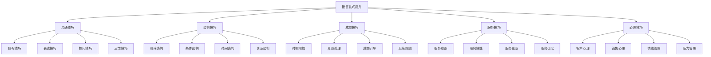
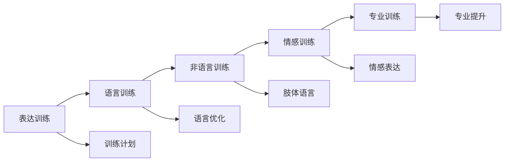
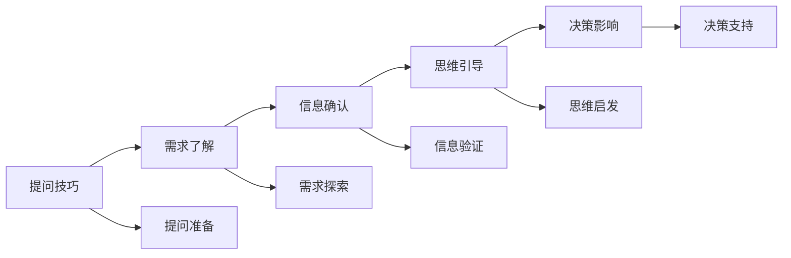
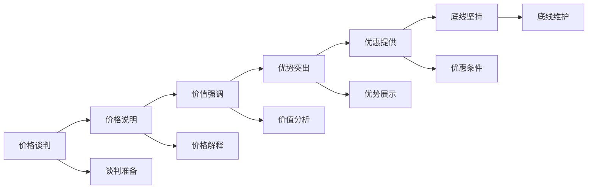
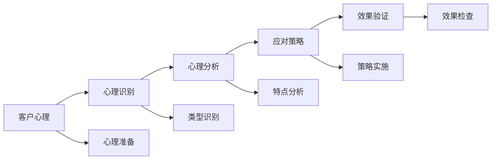

# 销售技巧提升

## 新西兰手机维修与二手机销售技巧提升体系

### 销售技巧架构

### 沟通技巧

#### 1. 倾听技巧

**倾听层次**：

| 倾听层次 | 倾听内容 | 倾听方法 | 倾听效果 |
|----------|----------|----------|----------|
| **表面倾听** | 听到话语内容 | 被动接收 | 理解表面意思 |
| **理解倾听** | 理解话语含义 | 主动理解 | 理解深层含义 |
| **共情倾听** | 感受客户情感 | 情感共鸣 | 建立情感连接 |
| **专业倾听** | 专业需求分析 | 专业判断 | 准确识别需求 |

**倾听技巧要点**：

**倾听实践方法**：
- **保持专注**：全神贯注，避免分心
- **积极回应**：点头、眼神交流、适当回应
- **理解确认**：重复关键信息，确认理解
- **情感共鸣**：理解客户情感，表达同理心

#### 2. 表达技巧

**表达要素**：

| 表达要素 | 表达内容 | 表达方法 | 表达效果 |
|----------|----------|----------|----------|
| **语言表达** | 用词准确，逻辑清晰 | 专业术语，通俗解释 | 表达清晰，理解容易 |
| **非语言表达** | 肢体语言，表情动作 | 自然得体，专业形象 | 形象专业，信任建立 |
| **情感表达** | 情感传递，情绪感染 | 真诚热情，适度表达 | 情感连接，关系建立 |
| **专业表达** | 专业知识，专业建议 | 专业准确，有说服力 | 专业形象，权威建立 |

**表达技巧训练**：

**表达实践方法**：
- **语言优化**：用词准确，表达简洁
- **逻辑清晰**：结构清楚，层次分明
- **情感适度**：真诚热情，不过度
- **专业准确**：专业术语，准确解释

#### 3. 提问技巧

**提问类型**：

| 提问类型 | 提问目的 | 提问方法 | 提问效果 |
|----------|----------|----------|----------|
| **开放性问题** | 了解需求，获取信息 | 什么、为什么、如何 | 信息丰富，需求明确 |
| **封闭性问题** | 确认信息，引导选择 | 是否、选择、确认 | 信息确认，选择引导 |
| **引导性问题** | 引导思考，影响决策 | 假设、如果、考虑 | 思维引导，决策影响 |
| **确认性问题** | 确认理解，避免误解 | 重复、总结、确认 | 理解准确，避免误解 |

**提问技巧应用**：

**提问实践方法**：
- **循序渐进**：从开放到封闭，逐步深入
- **目的明确**：每个问题都有明确目的
- **时机恰当**：在合适时机提出合适问题
- **方式自然**：提问自然，不显突兀

#### 4. 反馈技巧

**反馈类型**：

| 反馈类型 | 反馈内容 | 反馈方法 | 反馈效果 |
|----------|----------|----------|----------|
| **理解反馈** | 确认理解，避免误解 | 重复、总结、确认 | 理解准确，沟通顺畅 |
| **情感反馈** | 情感回应，建立连接 | 同理心，情感共鸣 | 情感连接，关系建立 |
| **专业反馈** | 专业建议，价值提供 | 专业分析，建议提供 | 专业形象，价值体现 |
| **行动反馈** | 行动建议，下一步指导 | 具体建议，行动指导 | 行动明确，进展顺利 |

### 谈判技巧

#### 1. 价格谈判

**价格谈判策略**：

| 策略类型 | 策略内容 | 实施方法 | 预期效果 |
|----------|----------|----------|----------|
| **价值强调** | 强调产品价值，性价比 | 价值分析，对比说明 | 价值认知，价格接受 |
| **优势突出** | 突出产品优势，独特性 | 优势展示，特色说明 | 优势认知，选择倾向 |
| **优惠提供** | 提供合理优惠，促销 | 优惠条件，促销活动 | 价格优势，购买决策 |
| **底线坚持** | 坚持价格底线，不妥协 | 底线明确，坚持原则 | 利润保证，价格合理 |

**价格谈判流程**：

**价格谈判技巧**：
- **价值先行**：先谈价值，再谈价格
- **对比分析**：与竞品对比，突出优势
- **分步让利**：逐步让利，保持主动
- **时间压力**：适当施加时间压力

#### 2. 条件谈判

**条件谈判要素**：

| 谈判要素 | 谈判内容 | 谈判方法 | 谈判效果 |
|----------|----------|----------|----------|
| **付款条件** | 付款方式，付款时间 | 条件协商，方式选择 | 条件合理，双方接受 |
| **交付条件** | 交付时间，交付方式 | 时间协商，方式确定 | 交付及时，方式合适 |
| **服务条件** | 服务内容，服务标准 | 服务协商，标准确定 | 服务完善，标准明确 |
| **保修条件** | 保修期限，保修范围 | 保修协商，范围确定 | 保修合理，范围明确 |

**条件谈判技巧**：
- **条件交换**：用条件换条件，实现双赢
- **优先级排序**：明确条件优先级，重点突破
- **让步策略**：有计划让步，保持主动
- **底线维护**：坚持重要条件，不轻易妥协

#### 3. 时间谈判

**时间谈判策略**：

| 策略类型 | 策略内容 | 实施方法 | 预期效果 |
|----------|----------|----------|----------|
| **时间压力** | 施加时间压力，促进决策 | 限时优惠，库存紧张 | 决策加速，成交促进 |
| **时间缓冲** | 提供时间缓冲，考虑充分 | 考虑时间，不急于决策 | 决策理性，满意度高 |
| **时间控制** | 控制谈判时间，提高效率 | 时间管理，节奏控制 | 效率提升，效果更好 |
| **时间利用** | 充分利用时间，建立关系 | 时间投资，关系建立 | 关系建立，长期合作 |

### 成交技巧

#### 1. 时机把握

**成交时机识别**：

| 时机类型 | 识别信号 | 把握方法 | 把握效果 |
|----------|----------|----------|----------|
| **需求明确** | 需求表达清晰，问题具体 | 需求确认，问题解答 | 需求满足，购买意愿 |
| **价格接受** | 价格讨论深入，接受度高 | 价格确认，价值强调 | 价格合理，接受度高 |
| **产品满意** | 产品体验良好，满意度高 | 产品确认，优势强调 | 产品满意，选择确定 |
| **信任建立** | 信任关系建立，沟通顺畅 | 信任巩固，关系维护 | 信任建立，决策支持 |

**时机把握技巧**：

**时机把握实践**：
- **观察敏锐**：敏锐观察客户信号
- **判断准确**：准确判断成交时机
- **行动果断**：果断采取成交行动
- **效果验证**：验证成交效果

#### 2. 异议处理

**异议类型**：

| 异议类型 | 异议内容 | 处理方法 | 处理效果 |
|----------|----------|----------|----------|
| **价格异议** | 价格太高，预算不足 | 价值强调，优惠提供 | 价格接受，价值认知 |
| **质量异议** | 质量担心，品牌疑虑 | 质量保证，品牌介绍 | 质量信任，品牌认知 |
| **服务异议** | 服务担心，售后疑虑 | 服务承诺，案例展示 | 服务信任，售后放心 |
| **时间异议** | 时间不合适，考虑时间 | 时间调整，考虑支持 | 时间合适，决策支持 |

**异议处理流程**：

**异议处理技巧**：
- **倾听理解**：认真倾听，理解异议
- **分析原因**：分析异议根本原因
- **提供方案**：提供针对性解决方案
- **确认效果**：确认异议处理效果

#### 3. 成交引导

**成交引导方法**：

| 引导方法 | 引导内容 | 引导技巧 | 引导效果 |
|----------|----------|----------|----------|
| **假设成交** | 假设客户已决定购买 | 假设性问题，购买确认 | 购买意愿，决策支持 |
| **选择成交** | 提供选择，引导决策 | 选择性问题，决策引导 | 决策明确，选择确定 |
| **紧迫成交** | 创造紧迫感，促进决策 | 限时优惠，库存紧张 | 决策加速，成交促进 |
| **利益成交** | 强调利益，价值驱动 | 利益分析，价值强调 | 价值认知，购买动机 |

**成交引导技巧**：
- **自然引导**：引导自然，不显突兀
- **利益驱动**：强调客户利益
- **选择明确**：提供明确选择
- **行动支持**：支持客户行动

### 服务技巧

#### 1. 服务意识

**服务意识要素**：

| 意识要素 | 意识内容 | 意识体现 | 意识效果 |
|----------|----------|----------|----------|
| **客户至上** | 客户需求优先，客户满意 | 服务态度，服务行为 | 客户满意，关系建立 |
| **主动服务** | 主动发现需求，主动提供服务 | 主动行为，主动沟通 | 服务及时，需求满足 |
| **专业服务** | 专业能力，专业建议 | 专业表现，专业建议 | 专业形象，信任建立 |
| **持续服务** | 持续关注，持续改进 | 持续沟通，持续优化 | 关系维护，长期合作 |

**服务意识培养**：

#### 2. 服务技能

**服务技能要求**：

| 技能类型 | 技能内容 | 技能要求 | 技能效果 |
|----------|----------|----------|----------|
| **沟通技能** | 有效沟通，理解客户 | 沟通技巧，理解能力 | 沟通顺畅，理解准确 |
| **问题解决** | 问题识别，解决方案 | 分析能力，解决能力 | 问题解决，客户满意 |
| **产品知识** | 产品了解，专业建议 | 专业知识，建议能力 | 专业形象，价值提供 |
| **服务创新** | 服务创新，服务优化 | 创新能力，优化能力 | 服务提升，竞争优势 |

#### 3. 服务创新

**服务创新方向**：

| 创新方向 | 创新内容 | 创新方法 | 创新效果 |
|----------|----------|----------|----------|
| **服务方式** | 服务方式创新，服务体验 | 方式创新，体验优化 | 体验提升，满意度高 |
| **服务内容** | 服务内容扩展，增值服务 | 内容扩展，价值增加 | 价值提升，竞争力强 |
| **服务技术** | 服务技术应用，效率提升 | 技术应用，效率优化 | 效率提升，成本降低 |
| **服务管理** | 服务管理优化，质量提升 | 管理优化，质量改进 | 质量提升，客户满意 |

### 心理技巧

#### 1. 客户心理

**客户心理分析**：

| 心理类型 | 心理特点 | 心理需求 | 应对策略 |
|----------|----------|----------|----------|
| **理性型** | 理性分析，逻辑思维 | 数据支持，逻辑论证 | 数据展示，逻辑分析 |
| **感性型** | 情感驱动，感性决策 | 情感共鸣，体验感受 | 情感连接，体验提供 |
| **谨慎型** | 谨慎决策，风险规避 | 风险控制，安全保障 | 风险说明，安全保障 |
| **冲动型** | 冲动决策，快速行动 | 即时满足，快速响应 | 快速响应，即时满足 |

**客户心理应对**：

#### 2. 销售心理

**销售心理管理**：

| 心理要素 | 心理内容 | 管理方法 | 管理效果 |
|----------|----------|----------|----------|
| **自信心** | 销售自信，专业自信 | 能力提升，经验积累 | 自信建立，表现提升 |
| **耐心** | 销售耐心，服务耐心 | 心态调整，耐心培养 | 耐心建立，服务提升 |
| **抗压能力** | 压力承受，挫折应对 | 压力管理，挫折处理 | 抗压能力，韧性提升 |
| **学习心态** | 持续学习，不断改进 | 学习计划，改进措施 | 能力提升，业绩改善 |

#### 3. 情绪管理

**情绪管理技巧**：

| 管理技巧 | 管理内容 | 管理方法 | 管理效果 |
|----------|----------|----------|----------|
| **情绪识别** | 情绪状态，情绪变化 | 自我观察，情绪监控 | 情绪认知，状态了解 |
| **情绪调节** | 情绪调节，情绪控制 | 调节方法，控制技巧 | 情绪稳定，表现稳定 |
| **情绪表达** | 情绪表达，情绪沟通 | 表达技巧，沟通方法 | 情绪传达，关系建立 |
| **情绪转化** | 情绪转化，情绪利用 | 转化技巧，利用方法 | 情绪积极，效果提升 |

## 技巧提升方法

### 学习提升

#### 1. 理论学习
- **销售理论**：学习销售理论知识
- **心理学理论**：学习客户心理学
- **沟通理论**：学习沟通技巧理论
- **谈判理论**：学习谈判技巧理论

#### 2. 实践训练
- **模拟训练**：模拟销售场景训练
- **角色扮演**：角色扮演练习
- **案例分析**：分析成功案例
- **经验总结**：总结实践经验

#### 3. 反馈改进
- **自我反思**：定期自我反思
- **他人反馈**：寻求他人反馈
- **业绩分析**：分析销售业绩
- **持续改进**：持续改进提升

### 技能评估

#### 1. 技能测试
- **理论知识测试**：测试理论知识掌握
- **实践技能测试**：测试实践技能水平
- **综合能力测试**：测试综合能力水平
- **业绩表现测试**：测试业绩表现水平

#### 2. 技能认证
- **内部认证**：内部技能认证
- **外部认证**：外部专业认证
- **行业认证**：行业标准认证
- **持续认证**：持续技能认证

## 对从业者的建议

### 技能提升建议
1. **系统学习**：建立完整技能体系
2. **实践应用**：结合实际工作应用
3. **持续改进**：持续改进提升
4. **经验分享**：团队经验分享

### 心态管理建议
1. **积极心态**：保持积极销售心态
2. **学习心态**：保持持续学习心态
3. **服务心态**：保持客户服务心态
4. **成长心态**：保持个人成长心态

### 职业发展建议
1. **技能发展**：持续发展专业技能
2. **经验积累**：积累丰富工作经验
3. **网络建设**：建设专业人脉网络
4. **职业规划**：制定职业发展规划

---
**相关链接**：
- [[02-理解应用层/03-销售服务/01-销售流程标准|销售流程标准]]
- [[02-理解应用层/03-销售服务/02-产品知识掌握|产品知识掌握]]
- [[04-工具模板/01-销售工具/02-销售技巧训练表|销售技巧训练表]]

*最后更新：2024年*
*适用市场：新西兰*
