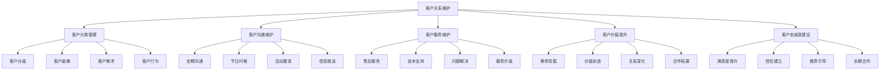
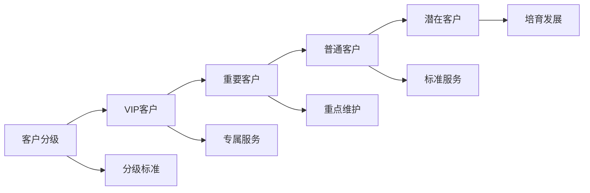
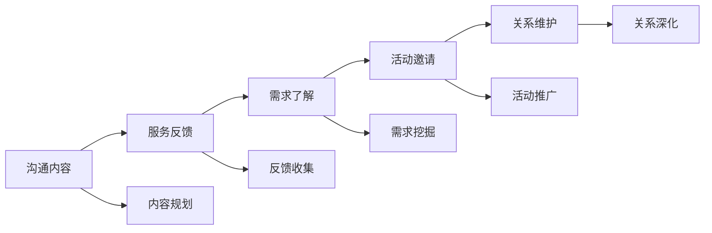
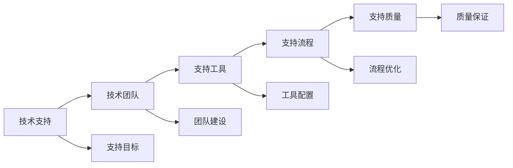
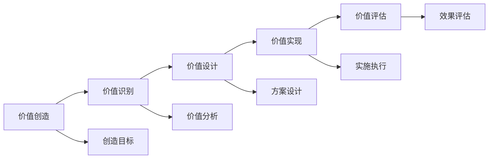
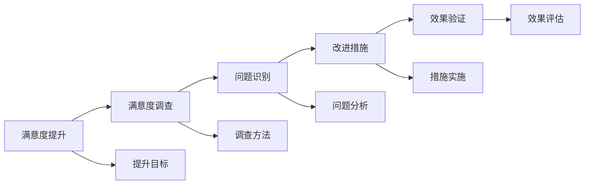
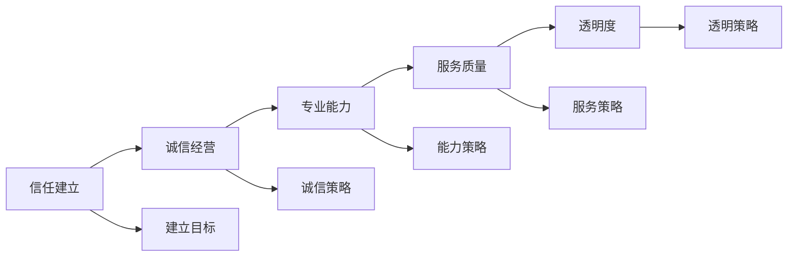
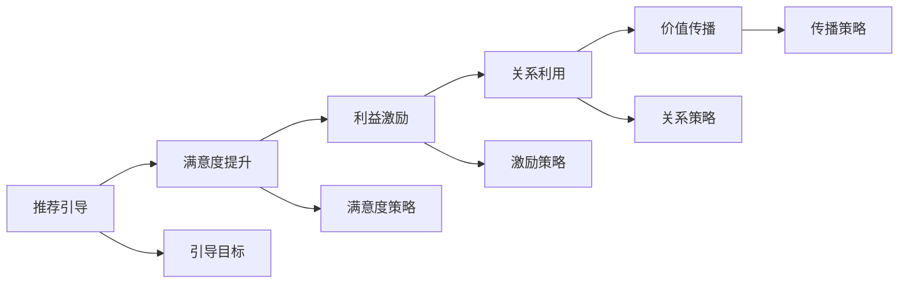

# 客户关系维护

## 新西兰手机维修与二手机销售客户关系维护体系

### 客户关系维护架构

### 客户分类管理

#### 1. 客户分级

**分级标准**：

| 客户级别 | 分级标准 | 客户特征 | 维护策略 |
|----------|----------|----------|----------|
| **VIP客户** | 年消费>$2000，忠诚度高 | 高价值，高忠诚度 | 专属服务，优先支持 |
| **重要客户** | 年消费$1000-2000，潜力大 | 中等价值，有潜力 | 重点维护，价值提升 |
| **普通客户** | 年消费$500-1000，基础需求 | 基础价值，稳定需求 | 标准服务，关系维护 |
| **潜在客户** | 年消费<$500，新客户 | 低价值，有潜力 | 培育发展，价值挖掘 |

**分级管理策略**：

**分级维护要点**：
- **VIP客户**：专属客户经理，24小时服务热线
- **重要客户**：定期回访，个性化服务
- **普通客户**：标准服务流程，定期沟通
- **潜在客户**：培育计划，价值引导

#### 2. 客户画像

**画像要素**：

| 画像维度 | 画像内容 | 数据来源 | 应用价值 |
|----------|----------|----------|----------|
| **基本信息** | 年龄、性别、职业、收入 | 客户登记，消费记录 | 基础了解，服务定制 |
| **消费行为** | 消费频率，消费金额，消费偏好 | 交易记录，行为分析 | 行为预测，需求预判 |
| **产品偏好** | 品牌偏好，功能偏好，价格敏感度 | 购买记录，反馈信息 | 产品推荐，营销精准 |
| **服务需求** | 服务类型，服务频率，服务要求 | 服务记录，需求分析 | 服务优化，需求满足 |

**客户画像应用**：

**画像维护要点**：
- **数据更新**：定期更新客户数据
- **画像优化**：持续优化画像模型
- **应用验证**：验证画像应用效果
- **隐私保护**：保护客户隐私信息

#### 3. 客户需求

**需求类型**：

| 需求类型 | 需求内容 | 需求特点 | 满足策略 |
|----------|----------|----------|----------|
| **显性需求** | 明确表达的需求 | 直接明确，易于识别 | 直接满足，快速响应 |
| **隐性需求** | 未明确表达的需求 | 潜在需求，需要挖掘 | 需求挖掘，主动发现 |
| **未来需求** | 未来可能的需求 | 发展趋势，前瞻性 | 需求预测，提前准备 |
| **变化需求** | 需求变化趋势 | 动态变化，需要跟踪 | 需求跟踪，及时调整 |

**需求分析方法**：

**需求管理要点**：
- **需求收集**：多渠道收集客户需求
- **需求分析**：深入分析需求本质
- **需求优先级**：确定需求优先级
- **需求满足**：制定需求满足方案

### 客户沟通维护

#### 1. 定期沟通

**沟通频率**：

| 客户级别 | 沟通频率 | 沟通方式 | 沟通内容 |
|----------|----------|----------|----------|
| **VIP客户** | 每周1次 | 电话、微信、面谈 | 服务反馈，需求了解，关系维护 |
| **重要客户** | 每月2次 | 电话、微信、邮件 | 服务跟进，需求了解，活动邀请 |
| **普通客户** | 每月1次 | 微信、邮件、短信 | 服务提醒，活动通知，节日问候 |
| **潜在客户** | 每季度1次 | 微信、邮件 | 产品介绍，活动邀请，关系建立 |

**沟通内容规划**：

**沟通技巧要点**：
- **沟通时机**：选择合适沟通时机
- **沟通方式**：选择合适沟通方式
- **沟通内容**：准备有价值沟通内容
- **沟通效果**：确保沟通效果

#### 2. 节日问候

**节日类型**：

| 节日类型 | 节日时间 | 问候方式 | 问候内容 |
|----------|----------|----------|----------|
| **传统节日** | 春节、中秋节、端午节 | 微信、短信、电话 | 节日祝福，健康祝愿 |
| **西方节日** | 圣诞节、新年、情人节 | 微信、邮件、卡片 | 节日祝福，快乐祝愿 |
| **个人节日** | 生日、结婚纪念日 | 电话、微信、礼物 | 个人祝福，特殊关怀 |
| **商业节日** | 店庆、促销活动 | 微信、邮件、邀请 | 活动邀请，优惠信息 |

**节日问候策略**：

**问候要点**：
- **个性化**：根据客户特点个性化问候
- **及时性**：在合适时间发送问候
- **真诚性**：表达真诚的祝福和关怀
- **价值性**：提供有价值的节日信息

#### 3. 活动邀请

**活动类型**：

| 活动类型 | 活动内容 | 邀请对象 | 邀请方式 |
|----------|----------|----------|----------|
| **产品发布会** | 新产品发布，技术展示 | VIP客户，重要客户 | 电话邀请，专属邀请 |
| **促销活动** | 优惠促销，特价活动 | 所有客户 | 微信推送，邮件通知 |
| **技术讲座** | 技术分享，使用指导 | 技术爱好者，专业客户 | 微信邀请，邮件邀请 |
| **客户聚会** | 客户交流，关系维护 | VIP客户，重要客户 | 电话邀请，面谈邀请 |

**活动邀请策略**：

**邀请要点**：
- **目标明确**：明确邀请目标和对象
- **内容吸引**：制作吸引人的邀请内容
- **方式合适**：选择合适的邀请方式
- **跟进及时**：及时跟进邀请效果

### 客户服务维护

#### 1. 售后服务

**服务类型**：

| 服务类型 | 服务内容 | 服务标准 | 服务效果 |
|----------|----------|----------|----------|
| **维修服务** | 产品维修，故障处理 | 24小时内响应，3天内完成 | 问题解决，客户满意 |
| **退换货服务** | 产品退换，质量保证 | 7天无理由退换，15天质量问题退换 | 权益保障，信任建立 |
| **技术支持** | 技术咨询，使用指导 | 即时响应，专业解答 | 问题解决，使用顺畅 |
| **配件服务** | 配件供应，配件维修 | 现货供应，快速维修 | 需求满足，服务完善 |

**服务流程优化**：

**服务要点**：
- **响应速度**：快速响应客户需求
- **服务质量**：保证服务质量标准
- **服务态度**：保持良好服务态度
- **服务跟踪**：跟踪服务效果

#### 2. 技术支持

**支持内容**：

| 支持类型 | 支持内容 | 支持方式 | 支持效果 |
|----------|----------|----------|----------|
| **使用指导** | 产品使用，功能操作 | 电话指导，视频指导 | 使用顺畅，功能掌握 |
| **故障诊断** | 故障分析，问题定位 | 远程诊断，现场诊断 | 问题定位，解决方向 |
| **升级服务** | 系统升级，功能升级 | 在线升级，现场升级 | 功能提升，体验改善 |
| **培训服务** | 产品培训，技能培训 | 在线培训，现场培训 | 技能提升，使用熟练 |

**技术支持体系**：

**支持要点**：
- **专业能力**：提升技术支持专业能力
- **响应速度**：快速响应技术支持需求
- **解决方案**：提供有效解决方案
- **持续改进**：持续改进技术支持

#### 3. 问题解决

**问题类型**：

| 问题类型 | 问题内容 | 解决方法 | 解决效果 |
|----------|----------|----------|----------|
| **产品质量问题** | 产品缺陷，功能异常 | 产品更换，功能修复 | 问题解决，质量保证 |
| **服务质量问题** | 服务态度，服务效率 | 服务改进，人员培训 | 服务提升，客户满意 |
| **沟通问题** | 信息传达，理解偏差 | 沟通优化，信息澄清 | 沟通顺畅，理解准确 |
| **流程问题** | 流程复杂，效率低下 | 流程优化，效率提升 | 流程简化，效率提高 |

**问题解决流程**：

**解决要点**：
- **快速响应**：快速响应问题
- **深入分析**：深入分析问题原因
- **有效解决**：提供有效解决方案
- **预防措施**：制定预防措施

### 客户价值提升

#### 1. 需求挖掘

**挖掘方法**：

| 挖掘方法 | 挖掘内容 | 挖掘技巧 | 挖掘效果 |
|----------|----------|----------|----------|
| **深度访谈** | 深入了解客户需求 | 开放性问题，引导技巧 | 需求明确，深度了解 |
| **行为分析** | 分析客户行为模式 | 数据分析，行为跟踪 | 行为预测，需求预判 |
| **反馈收集** | 收集客户反馈信息 | 问卷调查，意见收集 | 反馈及时，需求发现 |
| **市场调研** | 调研市场需求趋势 | 市场分析，趋势预测 | 趋势把握，需求前瞻 |

**需求挖掘策略**：

**挖掘要点**：
- **主动挖掘**：主动发现客户需求
- **深度挖掘**：深入挖掘潜在需求
- **系统挖掘**：系统化挖掘需求
- **持续挖掘**：持续挖掘需求变化

#### 2. 价值创造

**价值类型**：

| 价值类型 | 价值内容 | 创造方法 | 创造效果 |
|----------|----------|----------|----------|
| **产品价值** | 产品功能，产品性能 | 产品优化，功能增强 | 产品价值提升，客户满意 |
| **服务价值** | 服务质量，服务体验 | 服务创新，体验优化 | 服务价值提升，客户忠诚 |
| **信息价值** | 专业信息，市场信息 | 信息提供，知识分享 | 信息价值提供，客户依赖 |
| **关系价值** | 人脉关系，合作机会 | 关系建立，合作促进 | 关系价值创造，长期合作 |

**价值创造策略**：

**创造要点**：
- **客户导向**：以客户需求为导向
- **价值导向**：以价值创造为导向
- **创新导向**：以创新为驱动
- **持续导向**：持续创造价值

#### 3. 关系深化

**深化策略**：

| 深化策略 | 策略内容 | 实施方法 | 深化效果 |
|----------|----------|----------|----------|
| **信任建立** | 建立客户信任 | 诚信经营，承诺兑现 | 信任建立，关系稳定 |
| **情感连接** | 建立情感连接 | 真诚关怀，情感交流 | 情感连接，关系亲密 |
| **利益共享** | 共享利益价值 | 合作共赢，利益分享 | 利益共享，关系牢固 |
| **长期合作** | 建立长期合作 | 战略合作，长期规划 | 长期合作，关系持久 |

**关系深化方法**：

**深化要点**：
- **真诚对待**：真诚对待客户
- **持续投入**：持续投入关系建设
- **价值提供**：持续提供价值
- **长期规划**：制定长期关系规划

### 客户忠诚度建设

#### 1. 满意度提升

**满意度要素**：

| 满意度要素 | 要素内容 | 提升方法 | 提升效果 |
|----------|----------|----------|----------|
| **产品质量** | 产品性能，产品可靠性 | 质量提升，性能优化 | 质量满意，产品信任 |
| **服务质量** | 服务态度，服务效率 | 服务培训，流程优化 | 服务满意，服务信任 |
| **价格合理性** | 价格透明，性价比高 | 价格优化，价值强调 | 价格满意，价值认知 |
| **购买体验** | 购买过程，购买感受 | 体验优化，过程简化 | 体验满意，购买愉悦 |

**满意度提升策略**：

**提升要点**：
- **定期调查**：定期进行满意度调查
- **问题识别**：及时识别满意度问题
- **改进措施**：制定有效改进措施
- **效果验证**：验证改进效果

#### 2. 信任建立

**信任要素**：

| 信任要素 | 要素内容 | 建立方法 | 建立效果 |
|----------|----------|----------|----------|
| **诚信经营** | 诚实守信，承诺兑现 | 诚信文化，承诺管理 | 诚信信任，关系稳定 |
| **专业能力** | 专业水平，技术能力 | 能力提升，专业认证 | 专业信任，技术依赖 |
| **服务质量** | 服务标准，服务承诺 | 服务提升，标准执行 | 服务信任，质量保证 |
| **透明度** | 信息透明，过程透明 | 信息公开，过程透明 | 透明信任，信息可靠 |

**信任建立方法**：

**建立要点**：
- **诚信为本**：以诚信为根本
- **专业能力**：提升专业能力
- **服务承诺**：兑现服务承诺
- **信息透明**：保持信息透明

#### 3. 推荐引导

**推荐策略**：

| 推荐策略 | 策略内容 | 实施方法 | 推荐效果 |
|----------|----------|----------|----------|
| **满意度驱动** | 高满意度自然推荐 | 满意度提升，体验优化 | 自然推荐，口碑传播 |
| **利益激励** | 推荐奖励，利益分享 | 推荐计划，奖励机制 | 主动推荐，推荐增加 |
| **关系利用** | 利用客户关系网络 | 关系挖掘，网络利用 | 关系推荐，网络扩展 |
| **价值传播** | 传播产品服务价值 | 价值宣传，案例分享 | 价值认知，推荐动机 |

**推荐引导方法**：

**引导要点**：
- **自然引导**：自然引导推荐行为
- **价值驱动**：以价值驱动推荐
- **关系利用**：充分利用客户关系
- **持续激励**：持续激励推荐行为

## 客户关系管理系统

### 系统功能

#### 1. 客户信息管理
- **基本信息**：客户基本信息管理
- **消费记录**：消费历史记录管理
- **服务记录**：服务历史记录管理
- **沟通记录**：沟通历史记录管理

#### 2. 客户分类管理
- **客户分级**：客户等级分类管理
- **客户标签**：客户标签分类管理
- **客户画像**：客户画像分析管理
- **客户行为**：客户行为分析管理

#### 3. 客户沟通管理
- **沟通计划**：客户沟通计划管理
- **沟通记录**：客户沟通记录管理
- **沟通效果**：客户沟通效果管理
- **沟通优化**：客户沟通优化管理

### 系统工具

#### 1. CRM系统
- **客户管理**：客户信息管理系统
- **销售管理**：销售过程管理系统
- **服务管理**：客户服务管理系统
- **分析报告**：客户分析报告系统

#### 2. 沟通工具
- **微信管理**：微信客户管理工具
- **邮件系统**：邮件客户管理工具
- **电话系统**：电话客户管理工具
- **短信系统**：短信客户管理工具

## 对从业者的建议

### 关系维护建议
1. **客户导向**：以客户需求为导向
2. **价值创造**：持续为客户创造价值
3. **关系投资**：长期投资客户关系
4. **服务创新**：不断创新客户服务

### 技能提升建议
1. **沟通技能**：提升客户沟通技能
2. **服务技能**：提升客户服务技能
3. **分析技能**：提升客户分析技能
4. **管理技能**：提升客户管理技能

### 管理建议
1. **系统管理**：建立系统化客户管理
2. **数据管理**：建立数据化客户管理
3. **流程管理**：建立流程化客户管理
4. **团队管理**：建立团队化客户管理

---
**相关链接**：
- [[02-理解应用层/01-客户服务/05-客户关系管理|客户关系管理]]
- [[02-理解应用层/03-销售服务/01-销售流程标准|销售流程标准]]
- [[04-工具模板/03-客户管理/01-客户关系维护计划|客户关系维护计划]]

*最后更新：2024年*
*适用市场：新西兰*
