# 技术应用创新

## 新西兰手机维修与二手机销售技术应用创新体系

### 技术应用创新架构

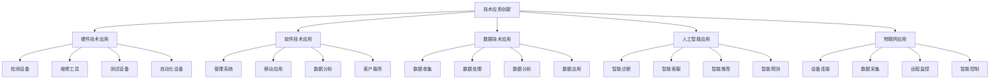

### 硬件技术应用

#### 1. 检测设备技术

**技术特点**：

| 技术类型 | 技术内容 | 技术优势 | 应用场景 |
|----------|----------|----------|----------|
| **自动化检测** | 自动检测，智能分析 | 效率高，准确性强 | 批量检测，质量保证 |
| **无损检测** | 无损检测，非破坏性 | 保护设备，检测全面 | 精密检测，设备保护 |
| **实时检测** | 实时监测，即时反馈 | 响应快，问题及时发现 | 生产监控，质量控制 |
| **远程检测** | 远程检测，云端分析 | 不受地域限制，专家支持 | 远程诊断，技术支持 |

**检测设备升级**：

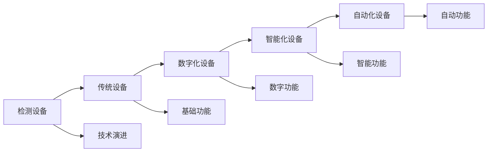

**技术应用要点**：
- **精度提升**：提高检测精度和准确性
- **效率优化**：提升检测效率和速度
- **功能扩展**：扩展检测功能和范围
- **成本控制**：控制设备成本和维护成本

#### 2. 维修工具技术

**技术特点**：

| 技术类型 | 技术内容 | 技术优势 | 应用场景 |
|----------|----------|----------|----------|
| **精密工具** | 高精度工具，微米级精度 | 精度高，质量好 | 精密维修，质量保证 |
| **智能工具** | 智能控制，自动调节 | 操作简单，效果稳定 | 复杂维修，技术保障 |
| **多功能工具** | 一机多用，功能集成 | 效率高，成本低 | 多功能维修，效率提升 |
| **无线工具** | 无线连接，便携操作 | 操作灵活，效率高 | 移动维修，灵活作业 |

**维修工具创新**：

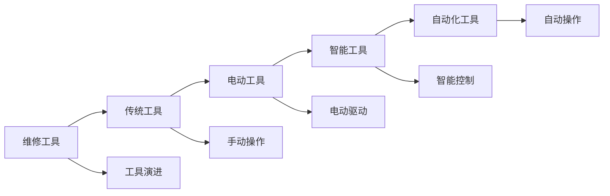

**创新方向**：
- **智能化**：工具智能化，自动控制
- **精密化**：提高工具精度和稳定性
- **集成化**：功能集成，一机多用
- **便携化**：轻量化，便携化设计

#### 3. 测试设备技术

**技术特点**：

| 技术类型 | 技术内容 | 技术优势 | 应用场景 |
|----------|----------|----------|----------|
| **自动化测试** | 自动测试，批量测试 | 效率高，一致性好 | 批量测试，质量保证 |
| **多功能测试** | 多参数测试，综合测试 | 测试全面，数据完整 | 综合测试，全面评估 |
| **实时测试** | 实时监测，即时反馈 | 响应快，问题及时发现 | 实时监控，质量控制 |
| **云端测试** | 云端分析，远程测试 | 不受地域限制，专家支持 | 远程测试，技术支持 |

**测试设备应用**：

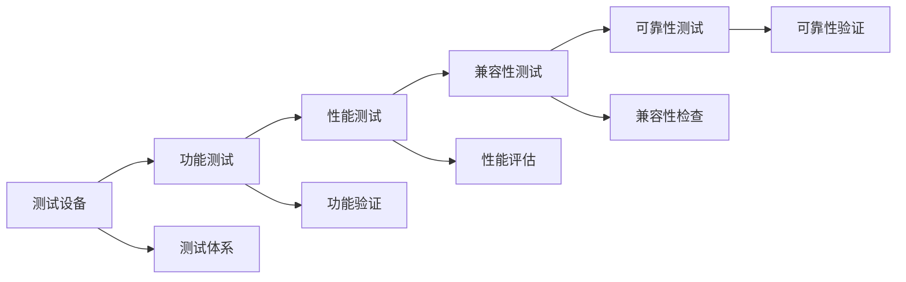

### 软件技术应用

#### 1. 管理系统技术

**技术特点**：

| 技术类型 | 技术内容 | 技术优势 | 应用场景 |
|----------|----------|----------|----------|
| **ERP系统** | 企业资源规划，全面管理 | 管理全面，效率高 | 企业管理，资源优化 |
| **CRM系统** | 客户关系管理，客户服务 | 客户管理，关系维护 | 客户服务，关系管理 |
| **WMS系统** | 仓库管理系统，库存管理 | 库存优化，效率提升 | 库存管理，仓储优化 |
| **TMS系统** | 任务管理系统，工作管理 | 任务管理，效率提升 | 工作管理，任务跟踪 |

**管理系统架构**：

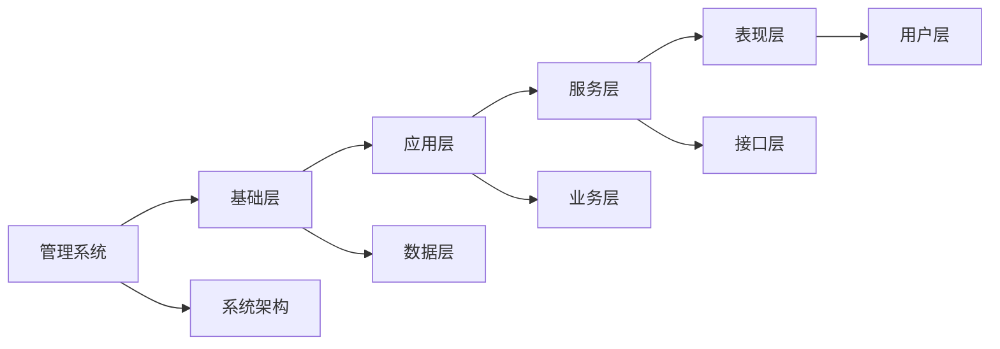

**系统功能设计**：
- **数据管理**：数据收集，数据存储，数据管理
- **流程管理**：流程设计，流程执行，流程优化
- **权限管理**：用户权限，角色管理，安全控制
- **报表管理**：报表生成，数据分析，决策支持

#### 2. 移动应用技术

**技术特点**：

| 技术类型 | 技术内容 | 技术优势 | 应用场景 |
|----------|----------|----------|----------|
| **原生应用** | 原生开发，性能优化 | 性能好，体验佳 | 核心功能，高性能需求 |
| **混合应用** | 混合开发，跨平台 | 开发效率高，成本低 | 快速开发，跨平台需求 |
| **Web应用** | Web技术，浏览器访问 | 跨平台，易维护 | 轻量级应用，快速部署 |
| **小程序** | 小程序开发，平台生态 | 轻量级，易传播 | 轻量级功能，社交传播 |

**移动应用功能**：

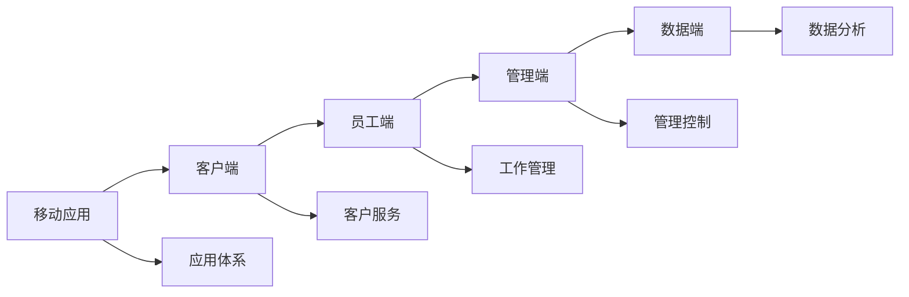

**应用功能设计**：
- **客户服务**：在线咨询，服务预约，进度查询
- **工作管理**：任务管理，工作记录，绩效管理
- **数据管理**：数据收集，数据分析，报表生成
- **沟通协作**：内部沟通，客户沟通，协作工具

#### 3. 数据分析技术

**技术特点**：

| 技术类型 | 技术内容 | 技术优势 | 应用场景 |
|----------|----------|----------|----------|
| **实时分析** | 实时数据处理，即时分析 | 响应快，决策及时 | 实时监控，即时决策 |
| **预测分析** | 数据预测，趋势分析 | 预测准确，决策支持 | 需求预测，趋势分析 |
| **关联分析** | 数据关联，关系分析 | 发现规律，洞察深入 | 客户分析，产品分析 |
| **可视化分析** | 数据可视化，图表展示 | 直观易懂，决策支持 | 数据展示，报告生成 |

**数据分析流程**：

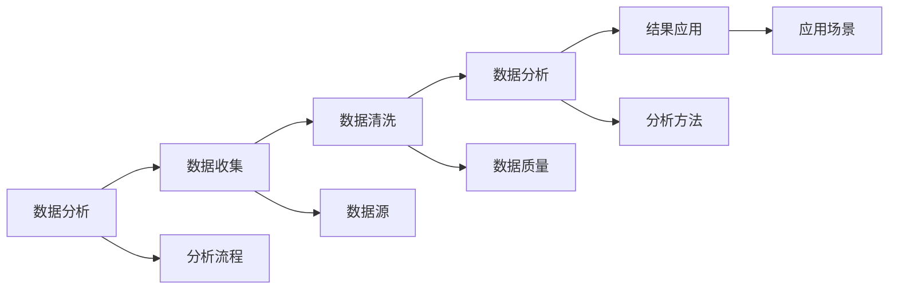

### 数据技术应用

#### 1. 大数据技术

**技术特点**：

| 技术类型 | 技术内容 | 技术优势 | 应用场景 |
|----------|----------|----------|----------|
| **数据存储** | 分布式存储，海量数据 | 存储容量大，扩展性好 | 海量数据，历史数据 |
| **数据处理** | 分布式计算，并行处理 | 处理速度快，效率高 | 批量处理，实时处理 |
| **数据挖掘** | 模式发现，知识提取 | 发现规律，洞察深入 | 客户分析，市场分析 |
| **数据应用** | 数据驱动，智能决策 | 决策科学，效果显著 | 业务决策，战略规划 |

**大数据应用架构**：

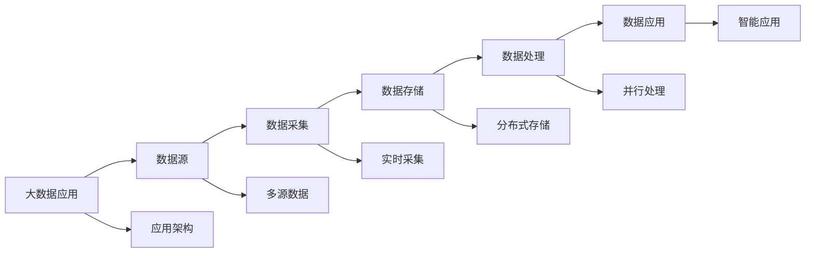

#### 2. 云计算技术

**技术特点**：

| 技术类型 | 技术内容 | 技术优势 | 应用场景 |
|----------|----------|----------|----------|
| **基础设施** | IaaS，基础设施即服务 | 成本低，扩展性好 | 基础设施，资源管理 |
| **平台服务** | PaaS，平台即服务 | 开发效率高，维护简单 | 应用开发，平台管理 |
| **软件服务** | SaaS，软件即服务 | 使用简单，成本低 | 业务应用，软件服务 |
| **混合云** | 公有云+私有云 | 灵活性好，安全性高 | 混合部署，安全控制 |

**云计算应用**：

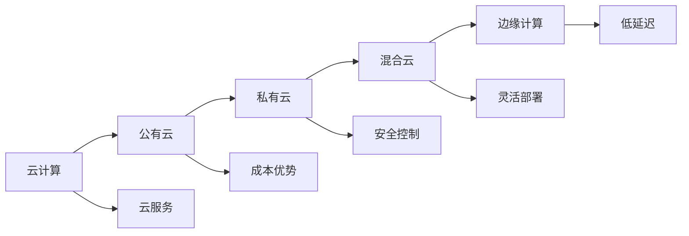

### 人工智能应用

#### 1. 机器学习应用

**技术特点**：

| 技术类型 | 技术内容 | 技术优势 | 应用场景 |
|----------|----------|----------|----------|
| **监督学习** | 有标签数据，预测模型 | 预测准确，效果稳定 | 需求预测，价格预测 |
| **无监督学习** | 无标签数据，模式发现 | 发现规律，洞察深入 | 客户细分，异常检测 |
| **强化学习** | 环境交互，策略优化 | 自适应强，效果优化 | 决策优化，策略调整 |
| **深度学习** | 神经网络，复杂模式 | 处理复杂，效果显著 | 图像识别，自然语言 |

**机器学习应用场景**：

#### 2. 自然语言处理

**技术特点**：

| 技术类型 | 技术内容 | 技术优势 | 应用场景 |
|----------|----------|----------|----------|
| **文本分析** | 文本理解，情感分析 | 理解准确，分析深入 | 客户反馈，市场分析 |
| **语音识别** | 语音转文字，语音理解 | 交互自然，使用方便 | 语音客服，语音输入 |
| **机器翻译** | 自动翻译，多语言支持 | 翻译准确，效率高 | 多语言服务，国际化 |
| **对话系统** | 智能对话，自然交互 | 交互自然，体验好 | 智能客服，语音助手 |

**NLP应用架构**：

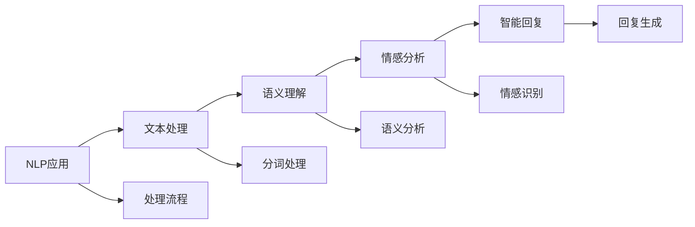

### 物联网应用

#### 1. 设备连接技术

**技术特点**：

| 技术类型 | 技术内容 | 技术优势 | 应用场景 |
|----------|----------|----------|----------|
| **传感器网络** | 传感器连接，数据采集 | 数据丰富，实时性好 | 环境监测，设备监控 |
| **无线连接** | WiFi，蓝牙，LoRa | 连接灵活，部署简单 | 移动设备，远程监控 |
| **边缘计算** | 边缘处理，本地计算 | 延迟低，响应快 | 实时控制，本地处理 |
| **云端集成** | 云端管理，远程控制 | 集中管理，远程操作 | 设备管理，远程监控 |

**物联网架构**：

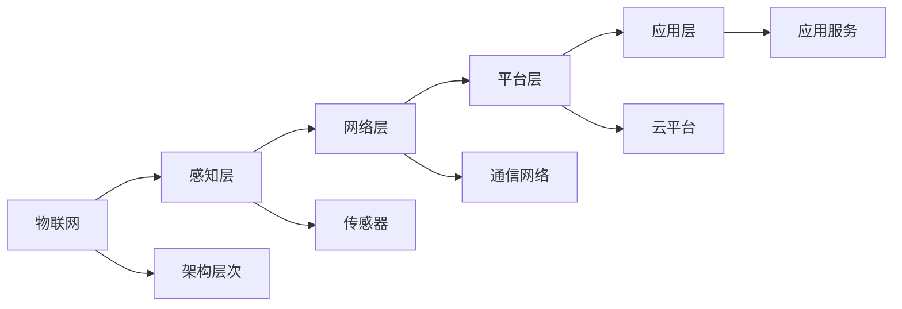

#### 2. 智能设备应用

**应用特点**：

| 应用类型 | 应用内容 | 应用优势 | 应用场景 |
|----------|----------|----------|----------|
| **智能检测** | 自动检测，智能分析 | 检测准确，效率高 | 质量检测，故障诊断 |
| **智能控制** | 自动控制，智能调节 | 控制精确，响应快 | 设备控制，环境控制 |
| **智能监控** | 实时监控，异常报警 | 监控全面，及时响应 | 设备监控，安全监控 |
| **智能维护** | 预测维护，自动维护 | 维护及时，成本低 | 设备维护，预防维护 |

## 技术应用创新实施

### 技术选型策略

#### 1. 技术评估
- **技术成熟度**：评估技术成熟度和稳定性
- **技术成本**：评估技术成本和投资回报
- **技术风险**：评估技术风险和实施难度
- **技术兼容性**：评估技术兼容性和集成性

#### 2. 技术实施
- **分阶段实施**：分阶段实施，降低风险
- **试点验证**：小范围试点，验证效果
- **逐步推广**：逐步推广，扩大应用
- **持续优化**：持续优化，提升效果

### 技术团队建设

#### 1. 人才配置
- **技术专家**：引进技术专家，提供技术指导
- **开发团队**：建设开发团队，负责技术开发
- **运维团队**：建设运维团队，负责技术运维
- **培训体系**：建立培训体系，提升技术能力

#### 2. 技术管理
- **技术标准**：建立技术标准，规范技术应用
- **技术文档**：完善技术文档，便于技术管理
- **技术评估**：建立技术评估机制，持续改进
- **技术安全**：加强技术安全，保护技术资产

## 对从业者的建议

### 技术学习建议
1. **持续学习**：持续学习新技术，新方法
2. **实践应用**：结合实际工作，实践应用
3. **技术交流**：参与技术交流，分享经验
4. **技术认证**：获得技术认证，提升能力

### 技术应用建议
1. **需求导向**：以业务需求为导向选择技术
2. **渐进实施**：渐进式实施，降低风险
3. **效果评估**：评估技术应用效果
4. **持续优化**：持续优化技术应用

### 技术管理建议
1. **技术规划**：制定技术发展规划
2. **技术投入**：合理投入技术资源
3. **技术安全**：加强技术安全管理
4. **技术创新**：鼓励技术创新和应用

---
**相关链接**：
- [[03-高级应用层/01-业务创新/01-服务模式创新|服务模式创新]]
- [[03-高级应用层/01-业务创新/03-商业模式创新|商业模式创新]]
- [[04-工具模板/05-创新工具/02-技术应用评估表|技术应用评估表]]

*最后更新：2024年*
*适用市场：新西兰*

