# 销售话术模板

## 新西兰手机维修与二手机销售话术模板体系

### 话术模板架构

```mermaid
graph TD
    A[销售话术模板] --> B[开场话术]
    A --> C[需求了解话术]
    A --> D[产品介绍话术]
    A --> E[异议处理话术]
    A --> F[成交话术]
    A --> G[售后服务话术]
    
    B --> B1[问候话术]
    B --> B2[自我介绍话术]
    B --> B3[破冰话术]
    B --> B4[建立信任话术]
    
    C --> C1[开放性问题话术]
    C --> C2[封闭性问题话术]
    C --> C3[引导性问题话术]
    C --> C4[确认性问题话术]
    
    D --> D1[产品优势话术]
    D --> D2[功能特点话术]
    D --> D3[价值强调话术]
    D --> D4[对比分析话术]
    
    E --> E1[价格异议话术]
    E --> E2[质量异议话术]
    E --> E3[服务异议话术]
    E --> E4[时间异议话术]
    
    F --> F1[假设成交话术]
    F --> F2[选择成交话术]
    F --> F3[紧迫成交话术]
    F --> F4[利益成交话术]
    
    G --> G1[使用指导话术]
    G --> G2[问题解答话术]
    G --> G3[关系维护话术]
    G --> G4[推荐引导话术]
```



### 开场话术

#### 1. 问候话术

**标准问候话术**：

| 场景 | 话术内容 | 使用要点 | 预期效果 |
|------|----------|----------|----------|
| **初次见面** | "您好，欢迎光临！我是[姓名]，很高兴为您服务。" | 热情友好，自我介绍 | 建立第一印象，开始沟通 |
| **老客户** | "您好，[客户姓名]！很高兴再次见到您，最近怎么样？" | 记住客户，关心问候 | 关系维护，客户满意 |
| **电话咨询** | "您好，我是[姓名]，来自[公司名]，请问有什么可以帮助您的吗？" | 礼貌专业，明确身份 | 建立信任，了解需求 |
| **在线咨询** | "您好，欢迎咨询！我是您的专属顾问[姓名]，有什么可以为您服务的吗？" | 专业形象，服务导向 | 专业形象，服务开始 |

**问候话术技巧**：

```mermaid
graph LR
    A[问候话术] --> B[热情友好]
    B --> C[专业形象]
    C --> D[服务导向]
    D --> E[建立信任]
    
    A --> A1[话术要素]
    B --> B1[态度积极]
    C --> C1[形象专业"]
    D --> D1[服务意识"]
    E --> E1[信任建立"]
```

**使用要点**：
- **语调**：热情友好，声音清晰
- **表情**：面带微笑，眼神交流
- **姿态**：站姿端正，手势自然
- **时机**：客户进店后立即问候

#### 2. 自我介绍话术

**自我介绍模板**：

| 介绍要素 | 话术内容 | 介绍重点 | 介绍效果 |
|----------|----------|----------|----------|
| **姓名介绍** | "我是[姓名]，您可以叫我[昵称]。" | 姓名清晰，称呼方便 | 身份明确，关系建立 |
| **职位介绍** | "我是这里的[职位]，专门负责[业务范围]。" | 职位明确，专业领域 | 专业形象，权威建立 |
| **经验介绍** | "我从事这个行业已经[年限]年了，对[专业领域]比较熟悉。" | 经验丰富，专业可信 | 专业可信，信任建立 |
| **服务介绍** | "我会为您提供专业的[服务内容]，确保您满意。" | 服务承诺，价值提供 | 服务承诺，价值认知 |

**自我介绍话术示例**：

```mermaid
graph LR
    A[自我介绍] --> B[基本信息"]
    B --> C[专业背景"]
    C --> D[服务承诺"]
    D --> E[价值提供"]
    
    A --> A1[介绍结构"]
    B --> B1[姓名职位"]
    C --> C1[经验能力"]
    D --> D1[服务内容"]
    E --> E1[价值承诺"]
```

#### 3. 破冰话术

**破冰话术类型**：

| 破冰类型 | 话术内容 | 使用场景 | 破冰效果 |
|----------|----------|----------|----------|
| **天气话题** | "今天天气真不错，您是从哪里过来的？" | 初次见面，轻松话题 | 气氛轻松，关系建立 |
| **产品话题** | "您手上这款手机看起来很不错，用了多久了？" | 产品相关，专业话题 | 专业形象，需求了解 |
| **服务话题** | "您之前有来过我们店吗？对我们的服务感觉怎么样？" | 服务相关，体验话题 | 服务了解，关系建立 |
| **兴趣话题** | "您平时喜欢用手机做什么？拍照还是游戏？" | 兴趣相关，个人话题 | 个人了解，关系深入 |

**破冰话术技巧**：

```mermaid
graph LR
    A[破冰话术] --> B[话题选择"]
    B --> C[时机把握"]
    C --> D[方式自然"]
    D --> E[效果评估"]
    
    A --> A1[破冰技巧"]
    B --> B1[合适话题"]
    C --> C1[合适时机"]
    D --> D1[自然方式"]
    E --> E1[效果确认"]
```

### 需求了解话术

#### 1. 开放性问题话术

**开放性问题模板**：

| 问题类型 | 话术内容 | 问题目的 | 预期回答 |
|----------|----------|----------|----------|
| **需求了解** | "您今天来是想了解什么产品呢？" | 了解基本需求 | 产品需求，服务需求 |
| **使用情况** | "您平时主要用手机做什么？" | 了解使用习惯 | 使用习惯，功能需求 |
| **预算了解** | "您大概的预算范围是多少？" | 了解价格预期 | 价格预期，预算范围 |
| **时间了解** | "您希望什么时候能够拿到产品？" | 了解时间需求 | 时间需求，紧急程度 |

**开放性问题技巧**：

```mermaid
graph LR
    A[开放性问题] --> B[问题设计"]
    B --> C[提问方式"]
    C --> D[倾听技巧"]
    D --> E[信息收集"]
    
    A --> A1[提问技巧"]
    B --> B1[问题明确"]
    C --> C1[方式自然"]
    D --> D1[专注倾听"]
    E --> E1[信息完整"]
```

#### 2. 封闭性问题话术

**封闭性问题模板**：

| 问题类型 | 话术内容 | 问题目的 | 预期回答 |
|----------|----------|----------|----------|
| **确认需求** | "您是需要维修手机还是购买新手机？" | 确认基本需求 | 是/否，明确需求 |
| **功能确认** | "您觉得这个功能对您重要吗？" | 确认功能重要性 | 重要/不重要，功能价值 |
| **价格确认** | "这个价格在您的预算范围内吗？" | 确认价格接受度 | 是/否，价格接受 |
| **时间确认** | "您今天就能决定吗？" | 确认决策时间 | 是/否，决策时间 |

#### 3. 引导性问题话术

**引导性问题模板**：

| 问题类型 | 话术内容 | 问题目的 | 引导方向 |
|----------|----------|----------|----------|
| **价值引导** | "您觉得手机的质量和价格哪个更重要？" | 引导价值认知 | 质量价值，性价比 |
| **选择引导** | "您更倾向于选择哪个品牌？" | 引导品牌选择 | 品牌偏好，产品选择 |
| **决策引导** | "如果您今天决定购买，我可以为您申请一个特别优惠。" | 引导购买决策 | 购买决策，优惠吸引 |
| **服务引导** | "您希望我们提供什么样的售后服务？" | 引导服务需求 | 服务需求，价值认知 |

### 产品介绍话术

#### 1. 产品优势话术

**优势介绍模板**：

| 优势类型 | 话术内容 | 介绍重点 | 介绍效果 |
|----------|----------|----------|----------|
| **技术优势** | "这款手机采用了最新的[技术]，在[性能方面]有显著提升。" | 技术领先，性能优越 | 技术认知，产品优势 |
| **质量优势** | "我们的产品都经过严格的质量检测，质量有保证。" | 质量可靠，值得信任 | 质量信任，购买信心 |
| **服务优势** | "我们提供[服务内容]，让您使用无忧。" | 服务完善，使用放心 | 服务认知，价值提升 |
| **价格优势** | "相比同类产品，我们的价格更有优势，性价比更高。" | 价格合理，性价比高 | 价格认知，购买动机 |

**优势介绍技巧**：

```mermaid
graph LR
    A[优势介绍] --> B[优势识别"]
    B --> C[优势表达"]
    C --> D[优势证明"]
    D --> E[优势确认"]
    
    A --> A1[介绍技巧"]
    B --> B1[核心优势"]
    C --> C1[清晰表达"]
    D --> D1[有力证明"]
    E --> E1[客户确认"]
```

#### 2. 功能特点话术

**功能介绍模板**：

| 功能类型 | 话术内容 | 介绍重点 | 介绍效果 |
|----------|----------|----------|----------|
| **核心功能** | "这款手机的核心功能是[功能描述]，能够满足您的[需求]。" | 功能明确，需求满足 | 功能认知，需求匹配 |
| **特色功能** | "这款手机有一个特色功能[功能描述]，是其他产品没有的。" | 功能独特，差异化 | 功能独特，竞争优势 |
| **实用功能** | "这个功能非常实用，[使用场景]，能为您带来[价值]。" | 功能实用，价值明确 | 实用价值，购买动机 |
| **创新功能** | "这是最新的创新功能，[功能描述]，代表了未来趋势。" | 功能创新，趋势引领 | 创新认知，未来价值 |

#### 3. 价值强调话术

**价值强调模板**：

| 价值类型 | 话术内容 | 强调重点 | 强调效果 |
|----------|----------|----------|----------|
| **使用价值** | "这款手机能够满足您的[使用需求]，让您的生活更加便利。" | 使用价值，生活便利 | 使用价值，生活改善 |
| **投资价值** | "这款手机保值性很好，使用几年后还能卖个好价钱。" | 投资价值，保值增值 | 投资价值，经济考虑 |
| **情感价值** | "这款手机设计精美，使用起来心情愉悦。" | 情感价值，心理满足 | 情感价值，心理满足 |
| **社会价值** | "这款手机品牌知名，使用起来有面子。" | 社会价值，身份认同 | 社会价值，身份提升 |

### 异议处理话术

#### 1. 价格异议话术

**价格异议处理模板**：

| 异议类型 | 话术内容 | 处理策略 | 处理效果 |
|----------|----------|----------|----------|
| **价格太高** | "我理解您的担心，让我为您分析一下这个价格的价值所在。" | 价值分析，性价比 | 价值认知，价格接受 |
| **预算不足** | "我理解您的预算考虑，我们可以看看其他价位的产品，或者分期付款。" | 替代方案，支付方式 | 方案提供，购买可能 |
| **比价问题** | "我理解您会货比三家，让我为您详细对比一下我们的优势。" | 优势对比，差异化 | 优势认知，选择倾向 |
| **等待降价** | "我理解您想等降价，但这款产品现在有特别优惠，机会难得。" | 优惠强调，时机把握 | 优惠认知，购买动机 |

**价格异议处理技巧**：

```mermaid
graph LR
    A[价格异议] --> B[理解认同"]
    B --> C[价值强调"]
    C --> D[方案提供"]
    D --> E[优惠引导"]
    
    A --> A1[处理技巧"]
    B --> B1[情感认同"]
    C --> C1[价值分析"]
    D --> D1[替代方案"]
    E --> E1[优惠吸引"]
```

#### 2. 质量异议话术

**质量异议处理模板**：

| 异议类型 | 话术内容 | 处理策略 | 处理效果 |
|----------|----------|----------|----------|
| **质量担心** | "我理解您的担心，我们的产品都有质量保证，让我为您详细介绍。" | 质量保证，详细介绍 | 质量信任，购买信心 |
| **品牌疑虑** | "我理解您对品牌的关注，让我为您介绍这个品牌的历史和口碑。" | 品牌介绍，口碑证明 | 品牌认知，信任建立 |
| **功能疑虑** | "我理解您对功能的担心，让我为您演示一下这个功能的效果。" | 功能演示，效果展示 | 功能认知，效果确认 |
| **售后担心** | "我理解您对售后的担心，我们提供完善的售后服务，让您使用无忧。" | 服务承诺，售后保障 | 服务认知，使用放心 |

#### 3. 服务异议话术

**服务异议处理模板**：

| 异议类型 | 话术内容 | 处理策略 | 处理效果 |
|----------|----------|----------|----------|
| **服务担心** | "我理解您对服务的担心，我们提供专业的服务，让我为您介绍。" | 服务介绍，专业承诺 | 服务认知，专业信任 |
| **时间担心** | "我理解您对时间的担心，我们承诺在[时间]内完成，让您满意。" | 时间承诺，效率保证 | 时间认知，效率信任 |
| **效果担心** | "我理解您对效果的担心，我们有很多成功案例，让我为您展示。" | 案例展示，效果证明 | 效果认知，成功信心 |
| **沟通担心** | "我理解您对沟通的担心，我们保持密切联系，及时反馈进度。" | 沟通承诺，及时反馈 | 沟通认知，服务放心 |

### 成交话术

#### 1. 假设成交话术

**假设成交模板**：

| 成交类型 | 话术内容 | 使用时机 | 成交效果 |
|----------|----------|----------|----------|
| **产品选择** | "如果您选择这款产品，我们可以为您提供[优惠/服务]。" | 产品介绍后 | 购买假设，优惠吸引 |
| **时间确定** | "如果您今天决定，我们可以为您安排[服务内容]。" | 需求确认后 | 时间假设，服务安排 |
| **支付方式** | "如果您选择分期付款，我们可以为您申请[优惠条件]。" | 价格讨论后 | 支付假设，条件吸引 |
| **售后服务** | "如果您购买后，我们将提供[服务内容]，让您使用无忧。" | 服务介绍后 | 服务假设，使用放心 |

**假设成交技巧**：

```mermaid
graph LR
    A[假设成交] --> B[时机把握"]
    B --> C[方式自然"]
    C --> D[条件吸引"]
    D --> E[效果确认"]
    
    A --> A1[成交技巧"]
    B --> B1[合适时机"]
    C --> C1[自然方式"]
    D --> D1[吸引条件"]
    E --> E1[效果确认"]
```

#### 2. 选择成交话术

**选择成交模板**：

| 选择类型 | 话术内容 | 选择目的 | 成交效果 |
|----------|----------|----------|----------|
| **产品选择** | "您更倾向于选择A款还是B款？" | 产品选择，决策引导 | 选择明确，决策推进 |
| **时间选择** | "您希望今天完成还是明天完成？" | 时间选择，决策推进 | 时间确定，服务安排 |
| **方式选择** | "您希望现金支付还是分期付款？" | 方式选择，决策推进 | 方式确定，交易推进 |
| **服务选择** | "您希望我们提供基础服务还是增值服务？" | 服务选择，价值提升 | 服务确定，价值提升 |

#### 3. 紧迫成交话术

**紧迫成交模板**：

| 紧迫类型 | 话术内容 | 紧迫原因 | 成交效果 |
|----------|----------|----------|----------|
| **优惠期限** | "这个优惠活动今天结束，错过就没有了。" | 优惠期限，机会难得 | 机会认知，购买动机 |
| **库存紧张** | "这款产品库存不多，现在不买可能就没有了。" | 库存紧张，供应有限 | 供应认知，购买紧迫 |
| **需求紧急** | "您的问题比较紧急，建议尽快处理。" | 需求紧急，时间重要 | 时间认知，处理紧迫 |
| **市场变化** | "市场价格可能会上涨，现在购买比较划算。" | 市场变化，价格趋势 | 趋势认知，购买时机 |

### 售后服务话术

#### 1. 使用指导话术

**使用指导模板**：

| 指导类型 | 话术内容 | 指导重点 | 指导效果 |
|----------|----------|----------|----------|
| **基本操作** | "让我为您演示一下基本操作，这样您就能熟练使用了。" | 操作演示，使用指导 | 操作掌握，使用顺畅 |
| **功能使用** | "这个功能很实用，让我教您如何使用。" | 功能教学，价值实现 | 功能掌握，价值实现 |
| **注意事项** | "使用过程中请注意[注意事项]，这样可以延长使用寿命。" | 注意事项，使用保护 | 使用保护，寿命延长 |
| **问题解决** | "如果遇到问题，您可以[解决方法]，或者联系我们。" | 问题解决，支持提供 | 问题解决，使用放心 |

#### 2. 问题解答话术

**问题解答模板**：

| 问题类型 | 话术内容 | 解答重点 | 解答效果 |
|----------|----------|----------|----------|
| **技术问题** | "这个问题很常见，解决方法很简单，让我为您详细说明。" | 问题解答，方法提供 | 问题解决，使用顺畅 |
| **使用问题** | "我理解您的困惑，让我为您演示一下正确的使用方法。" | 使用指导，方法演示 | 使用掌握，问题解决 |
| **服务问题** | "关于服务问题，我们承诺[服务内容]，让您满意。" | 服务承诺，问题解决 | 服务认知，问题解决 |
| **其他问题** | "您还有其他问题吗？我会为您详细解答。" | 问题收集，全面解答 | 问题解决，服务完善 |

#### 3. 关系维护话术

**关系维护模板**：

| 维护类型 | 话术内容 | 维护重点 | 维护效果 |
|----------|----------|----------|----------|
| **定期回访** | "您好，我是[姓名]，想了解一下产品使用情况，有什么问题吗？" | 使用关心，问题收集 | 关系维护，问题解决 |
| **节日问候** | "节日快乐！感谢您对我们的信任，祝您使用愉快！" | 节日祝福，关系维护 | 关系维护，客户满意 |
| **活动邀请** | "我们有个活动，邀请您参加，相信您会感兴趣。" | 活动邀请，关系维护 | 关系维护，活动参与 |
| **推荐引导** | "如果您觉得我们的服务不错，可以推荐给朋友，我们会有感谢。" | 推荐引导，关系扩展 | 关系扩展，客户增长 |

## 话术使用技巧

### 话术应用原则

#### 1. 自然性原则
- **语调自然**：语调自然，不做作
- **表达自然**：表达自然，不刻意
- **时机自然**：时机自然，不突兀
- **方式自然**：方式自然，不僵硬

#### 2. 针对性原则
- **客户针对**：针对不同客户使用不同话术
- **场景针对**：针对不同场景使用不同话术
- **需求针对**：针对不同需求使用不同话术
- **阶段针对**：针对不同阶段使用不同话术

#### 3. 效果性原则
- **目标明确**：每个话术都有明确目标
- **效果导向**：以效果为导向选择话术
- **结果验证**：验证话术使用效果
- **持续改进**：持续改进话术效果

### 话术训练方法

#### 1. 理论学习
- **话术理解**：理解话术的含义和作用
- **技巧掌握**：掌握话术使用技巧
- **原则遵循**：遵循话术使用原则
- **方法应用**：应用话术使用方法

#### 2. 实践训练
- **模拟练习**：模拟销售场景练习话术
- **角色扮演**：角色扮演练习话术
- **实战应用**：在实际工作中应用话术
- **效果评估**：评估话术使用效果

#### 3. 持续改进
- **效果分析**：分析话术使用效果
- **问题识别**：识别话术使用问题
- **改进措施**：制定话术改进措施
- **优化升级**：持续优化话术内容

## 对从业者的建议

### 话术使用建议
1. **自然使用**：话术使用要自然，不做作
2. **灵活运用**：根据情况灵活运用话术
3. **效果导向**：以效果为导向选择话术
4. **持续改进**：持续改进话术使用效果

### 话术训练建议
1. **系统学习**：系统学习话术理论和技巧
2. **实践应用**：在实际工作中实践应用话术
3. **效果评估**：评估话术使用效果
4. **持续优化**：持续优化话术内容和方法

### 话术创新建议
1. **个性化**：根据客户特点个性化话术
2. **场景化**：根据销售场景场景化话术
3. **创新化**：不断创新话术内容和方法
4. **标准化**：建立话术使用标准

---
**相关链接**：
- [[02-理解应用层/03-销售服务/01-销售流程标准|销售流程标准]]
- [[02-理解应用层/03-销售服务/03-销售技巧提升|销售技巧提升]]
- [[04-工具模板/01-销售工具/02-销售技巧训练表|销售技巧训练表]]

*最后更新：2024年*
*适用市场：新西兰*
