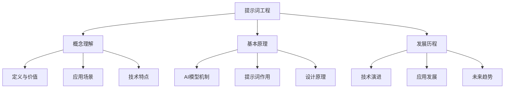
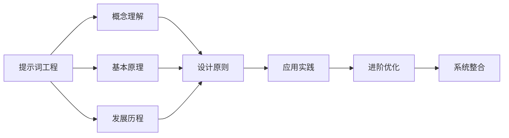

# 基础认知总结

## 📋 知识回顾

### 核心概念体系

## 🎯 关键知识点

### 1. 概念理解要点
| 核心概念 | 关键要点 | 实际意义 | 应用价值 |
|----------|----------|----------|----------|
| **提示词工程** | 系统化设计输入文本的技术 | 提升AI输出质量 | 提高使用效率 |
| **提示词** | 向AI模型输入的指令文本 | 引导模型行为 | 控制输出结果 |
| **优化策略** | 持续改进提示词效果 | 保证长期效果 | 降低使用成本 |

### 2. 基本原理要点
| 技术原理 | 核心机制 | 设计影响 | 实践指导 |
|----------|----------|----------|----------|
| **模型机制** | 基于概率的文本生成 | 理解模型行为 | 设计有效提示词 |
| **上下文影响** | 输入信息影响输出 | 提供充分背景 | 控制输出质量 |
| **参数调优** | 控制输出特性 | 平衡质量与多样性 | 优化用户体验 |

### 3. 发展历程要点
| 发展阶段 | 技术特点 | 应用特征 | 发展趋势 |
|----------|----------|----------|----------|
| **早期阶段** | 基础模型能力 | 简单应用探索 | 技术突破 |
| **发展阶段** | 方法体系形成 | 应用扩展 | 商业化推进 |
| **成熟阶段** | 标准化建立 | 深度应用 | 生态完善 |

## 🔍 知识关联

### 概念关联图

### 学习路径关联
| 当前模块 | 下一模块 | 关联要点 | 学习重点 |
|----------|----------|----------|----------|
| **基础认知** | **核心理解** | 从概念到方法 | 设计原则学习 |
| **核心理解** | **应用实践** | 从理论到实践 | 技能应用训练 |
| **应用实践** | **进阶优化** | 从基础到高级 | 技术深度提升 |

## 📊 知识检验

### 概念理解检验
- [ ] 能够准确解释提示词工程的定义
- [ ] 理解提示词工程的核心价值
- [ ] 掌握主要应用场景
- [ ] 了解技术特点和发展趋势

### 原理掌握检验
- [ ] 理解AI模型的基本工作机制
- [ ] 掌握提示词如何影响模型输出
- [ ] 了解关键参数的作用
- [ ] 知道模型限制及应对策略

### 发展认知检验
- [ ] 了解技术发展的主要阶段
- [ ] 掌握关键技术突破
- [ ] 理解应用场景的演进
- [ ] 能够预测未来发展趋势

## 🎯 学习成果

### 知识收获
1. **概念体系**：建立了完整的提示词工程概念框架
2. **技术理解**：掌握了AI模型和提示词的基本原理
3. **发展认知**：了解了技术发展历程和未来趋势
4. **应用视野**：认识了提示词工程的广泛应用价值

### 能力提升
1. **理解能力**：能够理解提示词工程的核心概念
2. **分析能力**：能够分析技术原理和应用价值
3. **判断能力**：能够判断技术发展趋势
4. **学习能力**：建立了系统化的学习方法

## 🚀 下一步学习

### 学习重点转移
从**基础认知**转向**核心理解**，重点学习：
- [[02-1-1-清晰性原则]] - 掌握清晰表达的方法
- [[02-1-2-具体性原则]] - 学会具体化描述
- [[02-1-3-上下文原则]] - 理解上下文的重要性
- [[02-1-4-角色设定原则]] - 掌握角色扮演技巧

### 学习方法建议
1. **理论结合实践**：在学习设计原则的同时进行实践
2. **案例学习**：通过具体案例理解抽象概念
3. **对比分析**：比较不同设计方法的效果
4. **迭代优化**：不断改进和完善提示词设计

### 实践准备
1. **工具准备**：选择合适的AI平台进行实践
2. **场景选择**：选择熟悉的应用场景开始练习
3. **目标设定**：明确学习目标和评估标准
4. **记录习惯**：建立学习记录和总结习惯

## 💡 学习心得

### 关键洞察
- 提示词工程是AI应用的关键技术
- 理解技术原理有助于设计更好的提示词
- 技术发展具有阶段性特征
- 应用场景不断扩展和深化

### 实践启示
- 从简单场景开始练习
- 注重效果评估和优化
- 积累经验和最佳实践
- 关注技术发展趋势

## 🔗 相关链接

### 回顾链接
- [[01-1-概念理解]] - 回顾基本概念
- [[01-2-基本原理]] - 回顾技术原理
- [[01-3-发展历程]] - 回顾发展历程

### 进阶链接
- [[02-1-1-清晰性原则]] - 开始核心理解学习
- [[02-4-核心理解总结]] - 核心理解模块总结
- [[03-4-应用实践总结]] - 应用实践模块总结

### 资源链接
- [[基础模板集合]] - 实践模板资源
- [[项目1-基础提示词练习]] - 基础练习项目
- [[学习进度追踪]] - 记录学习进度
