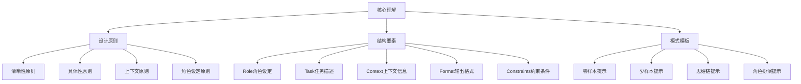
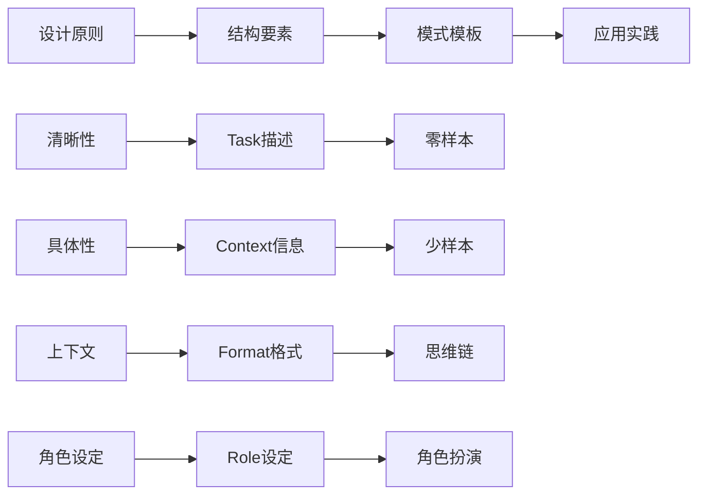

# 核心理解总结

## 📋 知识回顾

### 核心概念体系

## 🎯 关键知识点

### 1. 设计原则要点
| 核心原则 | 关键要点 | 实际意义 | 应用价值 |
|----------|----------|----------|----------|
| **清晰性原则** | 表达清晰、逻辑明确 | 提高理解准确性 | 减少歧义和误解 |
| **具体性原则** | 细节具体、避免模糊 | 确保执行准确性 | 提高输出质量 |
| **上下文原则** | 提供充分背景信息 | 增强理解深度 | 确保适用性 |
| **角色设定原则** | 明确AI角色身份 | 提供专业视角 | 增强可信度 |

### 2. 结构要素要点
| 结构要素 | 核心功能 | 设计要点 | 实践指导 |
|----------|----------|----------|----------|
| **Role角色设定** | 定义AI身份 | 专业、具体、可信 | 提供专业视角 |
| **Task任务描述** | 明确任务目标 | 清晰、可执行、具体 | 确保执行准确 |
| **Context上下文信息** | 提供背景信息 | 充分、相关、准确 | 增强理解深度 |
| **Format输出格式** | 控制输出结构 | 结构化、标准化 | 确保输出质量 |
| **Constraints约束条件** | 限制输出范围 | 明确、合理、可执行 | 保证质量达标 |

### 3. 模式模板要点
| 模式类型 | 核心特点 | 适用场景 | 学习重点 |
|----------|----------|----------|----------|
| **零样本提示** | 直接指令、无需示例 | 基础任务 | 指令设计 |
| **少样本提示** | 示例引导、模式学习 | 复杂任务 | 示例设计 |
| **思维链提示** | 逐步推理、逻辑清晰 | 推理任务 | 逻辑构建 |
| **角色扮演提示** | 身份代入、专业表达 | 专业咨询 | 角色塑造 |

## 🔍 知识关联

### 概念关联图

### 学习路径关联
| 当前模块 | 下一模块 | 关联要点 | 学习重点 |
|----------|----------|----------|----------|
| **核心理解** | **应用实践** | 从理论到实践 | 技能应用训练 |
| **设计原则** | **结构要素** | 从抽象到具体 | 具体化应用 |
| **结构要素** | **模式模板** | 从要素到模式 | 模式化应用 |
| **模式模板** | **实践应用** | 从模式到实践 | 实际应用训练 |

## 📊 知识检验

### 设计原则检验
- [ ] 能够解释四大设计原则的核心要点
- [ ] 掌握清晰性原则的实现方法
- [ ] 理解具体性原则的应用技巧
- [ ] 知道上下文原则的重要性
- [ ] 了解角色设定原则的价值

### 结构要素检验
- [ ] 能够设计有效的Role角色设定
- [ ] 掌握Task任务描述的技巧
- [ ] 理解Context上下文信息的构建
- [ ] 知道Format输出格式的控制
- [ ] 了解Constraints约束条件的设置

### 模式模板检验
- [ ] 能够使用零样本提示完成基础任务
- [ ] 掌握少样本提示的示例设计
- [ ] 理解思维链提示的推理构建
- [ ] 知道角色扮演提示的角色塑造
- [ ] 了解各种模式的适用场景

## 🎯 学习成果

### 知识收获
1. **理论体系**：建立了完整的提示词设计理论体系
2. **设计原则**：掌握了四大核心设计原则
3. **结构要素**：理解了五大结构要素的功能和设计
4. **模式模板**：学会了四种基本模式模板的应用

### 能力提升
1. **设计能力**：能够设计高质量的提示词
2. **分析能力**：能够分析提示词的效果和问题
3. **优化能力**：能够优化和改进提示词设计
4. **应用能力**：能够将理论知识应用到实际场景

## 🚀 下一步学习

### 学习重点转移
从**核心理解**转向**应用实践**，重点学习：
- [[03-1-1-文本生成应用]] - 文本生成实践
- [[03-1-2-问答系统应用]] - 问答系统构建
- [[03-1-3-内容创作应用]] - 内容创作技巧
- [[03-1-4-代码生成应用]] - 代码生成实践

### 学习方法建议
1. **理论结合实践**：将学到的理论知识应用到实际场景
2. **案例学习**：通过具体案例理解抽象概念
3. **对比分析**：比较不同设计方法的效果
4. **迭代优化**：不断改进和完善提示词设计

### 实践准备
1. **工具准备**：选择合适的AI平台进行实践
2. **场景选择**：选择熟悉的应用场景开始练习
3. **目标设定**：明确学习目标和评估标准
4. **记录习惯**：建立学习记录和总结习惯

## 💡 学习心得

### 关键洞察
- 提示词设计是一门系统性的技术
- 设计原则是指导实践的理论基础
- 结构要素是构建提示词的基石
- 模式模板是提高效率的有效方法

### 实践启示
- 从简单场景开始练习
- 注重效果评估和优化
- 积累经验和最佳实践
- 关注技术发展趋势

## 🔗 相关链接

### 回顾链接
- [[02-1-1-清晰性原则]] - 回顾清晰性原则
- [[02-1-2-具体性原则]] - 回顾具体性原则
- [[02-1-3-上下文原则]] - 回顾上下文原则
- [[02-1-4-角色设定原则]] - 回顾角色设定原则
- [[02-2-1-Role角色设定]] - 回顾角色设定
- [[02-2-2-Task任务描述]] - 回顾任务描述
- [[02-2-3-Context上下文信息]] - 回顾上下文信息
- [[02-2-4-Format输出格式]] - 回顾输出格式
- [[02-2-5-Constraints约束条件]] - 回顾约束条件
- [[02-3-1-零样本提示]] - 回顾零样本提示
- [[02-3-2-少样本提示]] - 回顾少样本提示
- [[02-3-3-思维链提示]] - 回顾思维链提示
- [[02-3-4-角色扮演提示]] - 回顾角色扮演提示

### 进阶链接
- [[03-1-1-文本生成应用]] - 开始应用实践学习
- [[03-4-应用实践总结]] - 应用实践模块总结
- [[04-4-进阶优化总结]] - 进阶优化模块总结
- [[05-3-系统整合总结]] - 系统整合模块总结

### 资源链接
- [[基础模板集合]] - 实践模板资源
- [[项目1-基础提示词练习]] - 基础练习项目
- [[项目2-进阶技巧练习]] - 进阶练习项目
- [[学习进度追踪]] - 记录学习进度
