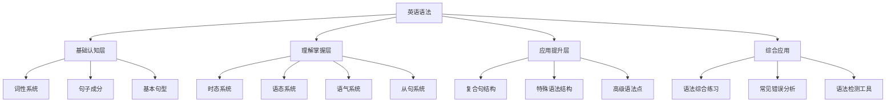

# 英语语法知识地图

## 🗺️ 整体架构

## 📚 学习路径

### 第一阶段：基础认知层
- **目标**：建立语法基础概念
- **内容**：[[01-基础认知层/01-词性系统/01-名词系统|词性系统]] → [[01-基础认知层/02-句子成分/01-主语|句子成分]] → [[01-基础认知层/03-基本句型/01-五种基本句型|基本句型]]
- **时间**：2-3周

### 第二阶段：理解掌握层
- **目标**：掌握核心语法规则
- **内容**：[[02-理解掌握层/01-时态系统/01-时态总览|时态系统]] → [[02-理解掌握层/02-语态系统/01-主动语态|语态系统]] → [[02-理解掌握层/03-语气系统/01-陈述语气|语气系统]] → [[02-理解掌握层/04-从句系统/01-名词性从句|从句系统]]
- **时间**：4-6周

### 第三阶段：应用提升层
- **目标**：提升语法应用能力
- **内容**：[[03-应用提升层/01-复合句结构/01-并列复合句|复合句结构]] → [[03-应用提升层/02-特殊语法结构/01-倒装结构|特殊语法结构]] → [[03-应用提升层/03-高级语法点/01-非谓语动词|高级语法点]]
- **时间**：3-4周

### 第四阶段：综合应用
- **目标**：综合运用语法知识
- **内容**：[[04-综合应用/01-语法综合练习/01-基础练习|综合练习]] → [[04-综合应用/02-常见错误分析/01-时态错误|错误分析]] → [[04-综合应用/03-语法检测工具/01-语法检查清单|检测工具]]
- **时间**：持续练习

## 🔗 核心知识点链接

### 基础概念
- [[01-基础认知层/01-词性系统/01-名词系统|名词系统]]
- [[01-基础认知层/01-词性系统/03-动词系统|动词系统]]
- [[01-基础认知层/02-句子成分/01-主语|主语]]
- [[01-基础认知层/02-句子成分/02-谓语|谓语]]

### 核心语法
- [[02-理解掌握层/01-时态系统/01-时态总览|时态总览]]
- [[02-理解掌握层/02-语态系统/02-被动语态|被动语态]]
- [[02-理解掌握层/04-从句系统/02-定语从句|定语从句]]
- [[02-理解掌握层/04-从句系统/03-状语从句|状语从句]]

### 高级应用
- [[03-应用提升层/03-高级语法点/01-非谓语动词|非谓语动词]]
- [[03-应用提升层/03-高级语法点/02-情态动词|情态动词]]
- [[03-应用提升层/02-特殊语法结构/01-倒装结构|倒装结构]]
- [[03-应用提升层/02-特殊语法结构/02-强调结构|强调结构]]

## 📊 学习进度跟踪

| 阶段 | 完成状态 | 开始日期 | 完成日期 | 备注 |
|------|----------|----------|----------|------|
| 基础认知层 | ⏳ 进行中 | | | |
| 理解掌握层 | ⏸️ 未开始 | | | |
| 应用提升层 | ⏸️ 未开始 | | | |
| 综合应用 | ⏸️ 未开始 | | | |

## 🎯 学习目标

1. **认识层面**：掌握英语语法的基本概念和术语
2. **理解层面**：理解语法规则的内在逻辑和相互关系
3. **应用层面**：能够正确运用语法知识进行表达和写作

## 📖 相关资源

- [[02-学习路径指南|学习路径指南]]
- [[03-快速索引|快速索引]]
- [[04-语法学习进度|学习进度跟踪]]
- [[99-附录资料/01-语法术语表|语法术语表]]
