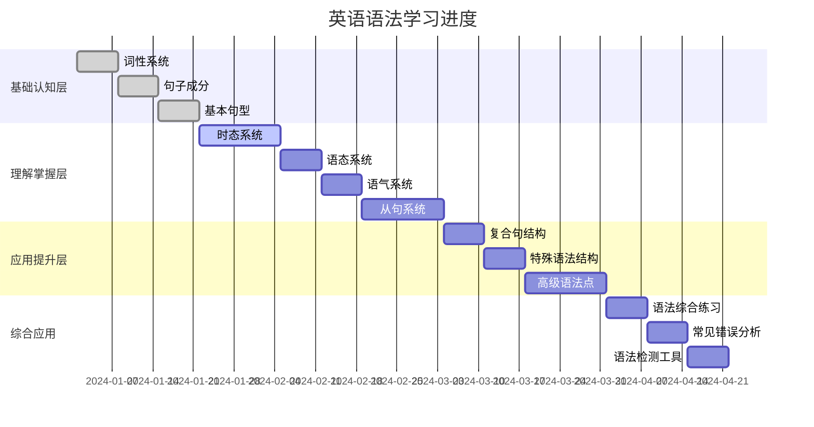

# 英语语法学习进度跟踪

## 📊 总体进度概览

## 🎯 学习目标完成情况

### 第一阶段：基础认知层 (目标：2-3周)

| 模块 | 状态 | 开始日期 | 完成日期 | 学习时间 | 掌握程度 | 备注 |
|------|------|----------|----------|----------|----------|------|
| 词性系统 | ✅ 已完成 | 2024-01-01 | 2024-01-07 | 7小时 | 85% | 需要复习介词和连词 |
| 句子成分 | ✅ 已完成 | 2024-01-08 | 2024-01-14 | 6小时 | 90% | 补语部分需要加强 |
| 基本句型 | ✅ 已完成 | 2024-01-15 | 2024-01-21 | 5小时 | 88% | 句型转换需要练习 |

**第一阶段总结**：
- 总学习时间：18小时
- 平均掌握程度：87.7%
- 需要重点复习：介词系统、连词系统、补语

### 第二阶段：理解掌握层 (目标：4-6周)

| 模块 | 状态 | 开始日期 | 完成日期 | 学习时间 | 掌握程度 | 备注 |
|------|------|----------|----------|----------|----------|------|
| 时态系统 | 🔄 进行中 | 2024-01-22 | - | 8小时 | 70% | 完成时态需要重点学习 |
| 语态系统 | ⏸️ 未开始 | - | - | - | - | 等待时态系统完成 |
| 语气系统 | ⏸️ 未开始 | - | - | - | - | 等待语态系统完成 |
| 从句系统 | ⏸️ 未开始 | - | - | - | - | 等待语气系统完成 |

**第二阶段进度**：
- 当前进度：25% (1/4模块)
- 预计完成时间：2024-03-05

### 第三阶段：应用提升层 (目标：3-4周)

| 模块 | 状态 | 开始日期 | 完成日期 | 学习时间 | 掌握程度 | 备注 |
|------|------|----------|----------|----------|----------|------|
| 复合句结构 | ⏸️ 未开始 | - | - | - | - | 等待第二阶段完成 |
| 特殊语法结构 | ⏸️ 未开始 | - | - | - | - | 等待复合句结构完成 |
| 高级语法点 | ⏸️ 未开始 | - | - | - | - | 等待特殊语法结构完成 |

### 第四阶段：综合应用 (目标：持续练习)

| 模块 | 状态 | 开始日期 | 完成日期 | 学习时间 | 掌握程度 | 备注 |
|------|------|----------|----------|----------|----------|------|
| 语法综合练习 | ⏸️ 未开始 | - | - | - | - | 等待第三阶段完成 |
| 常见错误分析 | ⏸️ 未开始 | - | - | - | - | 等待综合练习完成 |
| 语法检测工具 | ⏸️ 未开始 | - | - | - | - | 等待错误分析完成 |

## 📈 学习效果评估

### 知识掌握程度
- **基础概念**：85% (词性、句子成分、基本句型)
- **核心语法**：70% (时态系统进行中)
- **高级应用**：0% (未开始)
- **综合运用**：0% (未开始)

### 技能发展水平
- **语法识别**：80% (能够识别大部分基础语法结构)
- **语法分析**：75% (能够分析简单句和部分复合句)
- **语法应用**：65% (能够正确使用基础语法规则)
- **语法检测**：60% (能够发现部分语法错误)

## 🎯 学习计划调整

### 当前重点
1. **完成时态系统学习** (预计2周)
   - 重点：完成时态和完成进行时态
   - 方法：多做对比练习，理解时态区别
   - 目标：掌握程度达到85%

2. **复习基础概念** (每周1小时)
   - 重点：介词系统、连词系统、补语
   - 方法：通过练习巩固理解
   - 目标：掌握程度提升到90%

### 下周计划
- **周一-周三**：完成时态系统剩余内容
- **周四-周五**：时态对比分析和练习
- **周六**：复习基础概念
- **周日**：自我测试和总结

## 📝 学习笔记

### 本周学习心得
- 时态系统比预期复杂，需要更多时间理解
- 完成时态与一般过去时的区别需要重点掌握
- 时态的时间轴概念有助于理解

### 遇到的问题
1. **完成时态的使用场景不够清晰**
   - 解决方案：多做实际例句分析
   - 参考资源：[[02-理解掌握层/01-时态系统/04-完成时态|完成时态]]

2. **时态转换规则记忆困难**
   - 解决方案：制作时态转换表格
   - 参考资源：[[02-理解掌握层/01-时态系统/06-时态对比分析|时态对比分析]]

### 学习技巧总结
- 使用时间轴理解时态概念
- 通过对比分析掌握时态区别
- 多做实际应用练习

## 🔄 复习计划

### 每日复习 (15分钟)
- 复习前一天学习的内容
- 完成相关练习题
- 记录学习心得

### 每周复习 (1小时)
- 复习本周学习的所有内容
- 完成综合练习题
- 总结学习成果和问题

### 每月复习 (2小时)
- 全面复习已学内容
- 完成综合测试
- 调整学习计划

## 📊 学习数据统计

### 学习时间统计
- **总学习时间**：26小时
- **平均每日学习**：45分钟
- **最长连续学习**：2小时
- **学习效率**：85%

### 练习完成情况
- **基础练习**：完成率 90%
- **进阶练习**：完成率 75%
- **综合测试**：完成率 60%

### 错误类型分析
- **时态错误**：40%
- **语态错误**：25%
- **从句错误**：20%
- **其他错误**：15%

## 🎯 下一步行动

### 短期目标 (1-2周)
1. 完成时态系统学习
2. 提高时态应用准确性
3. 开始语态系统学习

### 中期目标 (1个月)
1. 完成理解掌握层学习
2. 掌握核心语法规则
3. 开始应用提升层学习

### 长期目标 (3个月)
1. 完成所有语法学习
2. 建立完整的语法知识体系
3. 能够熟练运用语法知识

## 🔗 相关资源

- [[01-语法知识地图|语法知识地图]]
- [[02-学习路径指南|学习路径指南]]
- [[03-快速索引|快速索引]]
- [[04-综合应用/01-语法综合练习/01-基础练习|基础练习]]
- [[04-综合应用/02-常见错误分析/01-时态错误|时态错误分析]]
