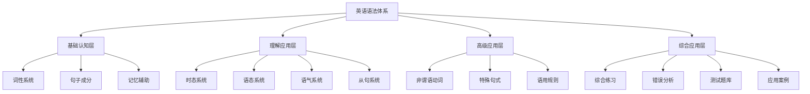
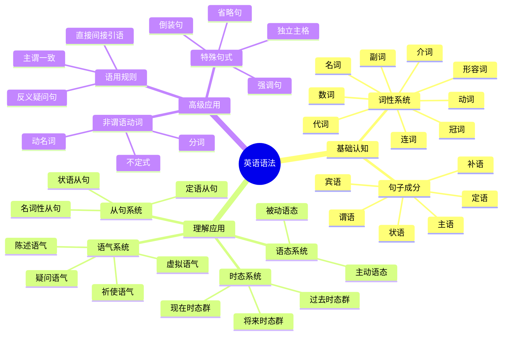

# 英语语法体系总览

## 🎯 学习目标
- 建立英语语法的整体认知框架
- 理解语法各层级之间的逻辑关系
- 掌握语法学习的系统性方法

## 📚 语法金字塔模型

## 🏗️ 四层架构详解

### 第一层：基础认知层
**目标**：建立语法基础概念
- [[01-词性系统]]：掌握9大词性的特征与用法
- [[02-句子成分]]：理解句子结构的基本组成
- [[03-记忆辅助]]：建立词性识别与记忆方法

### 第二层：理解应用层
**目标**：掌握语法规则的实际运用
- [[01-时态系统]]：16种时态的准确使用
- [[02-语态系统]]：主动被动语态的转换
- [[03-语气系统]]：4种语气的表达方式
- [[04-从句系统]]：三大从句的构建与应用

### 第三层：高级应用层
**目标**：处理复杂语法现象
- [[01-非谓语动词]]：不定式、动名词、分词的高级用法
- [[02-特殊句式]]：倒装、强调、省略等特殊结构
- [[03-语用规则]]：主谓一致、反义疑问等规则

### 第四层：综合应用层
**目标**：在真实语境中熟练运用
- [[01-语法综合练习]]：系统化练习体系
- [[02-常见错误分析]]：避免常见语法错误
- [[03-语法测试题库]]：检验学习效果
- [[04-实际应用案例]]：写作、口语、阅读中的应用

## 🔄 学习路径设计

### 费曼学习法应用
1. **概念学习**：理解语法概念的本质
2. **简化表达**：用简单语言解释复杂规则
3. **教学输出**：向他人讲解语法点
4. **查漏补缺**：发现知识盲点并完善

### 刻意练习策略
1. **分解练习**：将复杂语法点拆解练习
2. **重复强化**：通过重复练习形成肌肉记忆
3. **反馈修正**：及时纠正错误并调整方法
4. **渐进提升**：从简单到复杂的递进练习

## 📊 知识点关联图

## 🎯 学习建议

### 对于INTJ学习者的建议
1. **系统性学习**：按照金字塔模型逐层深入
2. **逻辑梳理**：建立知识点间的逻辑关系
3. **实践应用**：在真实语境中验证语法规则
4. **持续优化**：根据学习效果调整学习策略

### 学习顺序建议
1. 先掌握基础认知层，建立语法基础
2. 再学习理解应用层，掌握核心语法
3. 然后攻克高级应用层，处理复杂语法
4. 最后通过综合应用层，实现熟练运用

## 🔗 相关链接
- [[02-学习路径指南]]：详细的学习路径规划
- [[03-语法思维导图]]：可视化知识结构
- [[04-语法学习策略]]：具体的学习方法指导

---
*本文件为英语语法学习体系的顶层设计，为后续深入学习提供框架指导*
