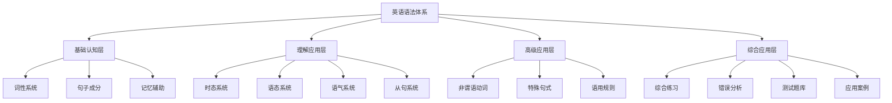
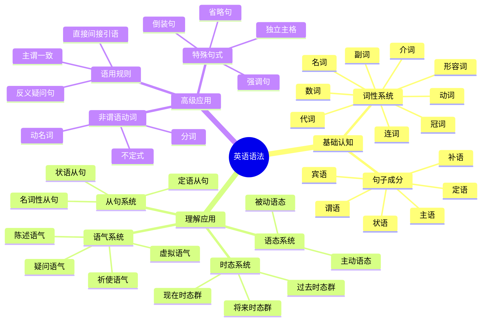

# 英语语法体系总览

## 🎯 学习目标
- 建立英语语法的整体认知框架
- 理解语法各层级之间的逻辑关系
- 掌握语法学习的系统性方法

## 📚 语法金字塔模型

## 🏗️ 四层架构详解

### 第一层：基础认知层
**目标**：建立语法基础概念
- [[01-基础认知层/01-词性系统]]：掌握9大词性的特征与用法
  - [[01-基础认知层/01-词性系统/01-名词系统]]：名词分类、可数性、单复数、所有格
  - [[01-基础认知层/01-词性系统/02-代词系统]]：人称、物主、指示、疑问、关系、不定代词
  - [[01-基础认知层/01-词性系统/03-动词系统]]：动词分类、及物性、基本形式、情态动词
  - [[01-基础认知层/01-词性系统/04-形容词系统]]：形容词分类、位置、比较级、特殊用法
  - [[01-基础认知层/01-词性系统/05-副词系统]]：副词分类、位置、比较级、特殊用法
  - [[01-基础认知层/01-词性系统/06-介词系统]]：介词分类、搭配、短语、特殊用法
  - [[01-基础认知层/01-词性系统/07-连词系统]]：并列连词、从属连词、使用规则
  - [[01-基础认知层/01-词性系统/08-冠词系统]]：定冠词、不定冠词、零冠词
  - [[01-基础认知层/01-词性系统/09-数词系统]]：基数词、序数词、分数小数表达
- [[01-基础认知层/02-句子成分]]：理解句子结构的基本组成
  - [[01-基础认知层/02-句子成分/01-基本成分]]：主语、谓语、宾语、表语、定语、状语、补语
  - [[01-基础认知层/02-句子成分/02-句子结构类型]]：简单句、并列句、复合句、并列复合句
  - [[01-基础认知层/02-句子成分/03-成分关系图]]：成分间的逻辑关系
  - [[01-基础认知层/02-句子成分/04-句子成分易混点辨析]]：相似成分的区分
- [[01-基础认知层/03-记忆辅助]]：建立词性识别与记忆方法
  - [[01-基础认知层/03-记忆辅助/01-词性记忆口诀]]：词性记忆口诀
  - [[01-基础认知层/03-记忆辅助/02-词性对比图表]]：词性对比图表
  - [[01-基础认知层/03-记忆辅助/03-词性练习游戏]]：词性练习游戏

### 第二层：理解应用层
**目标**：掌握语法规则的实际运用
- [[02-理解应用层/01-时态系统]]：16种时态的准确使用
  - [[02-理解应用层/01-时态系统/01-现在时态群]]：一般现在时、现在进行时、现在完成时、现在完成进行时
  - [[02-理解应用层/01-时态系统/02-过去时态群]]：一般过去时、过去进行时、过去完成时、过去完成进行时
  - [[02-理解应用层/01-时态系统/03-将来时态群]]：一般将来时、将来进行时、将来完成时、将来完成进行时
  - [[02-理解应用层/01-时态系统/04-时态综合对比]]：时态时间轴图、选择决策树、易混点辨析
  - [[02-理解应用层/01-时态系统/05-时态记忆辅助]]：时态记忆口诀、对比图表、练习游戏
- [[02-理解应用层/02-语态系统]]：主动被动语态的转换
  - [[02-理解应用层/02-语态系统/01-主动语态]]：主动语态的基本概念和用法
  - [[02-理解应用层/02-语态系统/02-被动语态]]：被动语态的基本概念和用法
  - [[02-理解应用层/02-语态系统/03-语态转换]]：主动被动语态的转换规则
  - [[02-理解应用层/02-语态系统/04-语态易混点辨析]]：语态使用中的易混点
  - [[02-理解应用层/02-语态系统/05-语态记忆辅助]]：语态记忆辅助方法
- [[02-理解应用层/03-语气系统]]：4种语气的表达方式
  - [[02-理解应用层/03-语气系统/01-陈述语气]]：陈述语气的基本概念和用法
  - [[02-理解应用层/03-语气系统/02-疑问语气]]：疑问语气的基本概念和用法
  - [[02-理解应用层/03-语气系统/03-祈使语气]]：祈使语气的基本概念和用法
  - [[02-理解应用层/03-语气系统/04-虚拟语气]]：虚拟语气的基本概念和用法
  - [[02-理解应用层/03-语气系统/05-语气易混点辨析]]：语气使用中的易混点
  - [[02-理解应用层/03-语气系统/06-语气记忆辅助]]：语气记忆辅助方法
- [[02-理解应用层/04-从句系统]]：三大从句的构建与应用
  - [[02-理解应用层/04-从句系统/01-名词性从句]]：主语从句、宾语从句、表语从句、同位语从句
  - [[02-理解应用层/04-从句系统/02-定语从句]]：限制性定语从句、非限制性定语从句、特殊情况
  - [[02-理解应用层/04-从句系统/03-状语从句]]：时间、地点、原因、条件、目的、结果、让步、比较、方式状语从句
  - [[02-理解应用层/04-从句系统/04-从句记忆辅助]]：从句记忆口诀、对比图表、练习游戏

### 第三层：高级应用层
**目标**：处理复杂语法现象
- [[03-高级应用层/01-非谓语动词]]：不定式、动名词、分词的高级用法
  - [[03-高级应用层/01-非谓语动词/01-不定式]]：不定式基本概念、用法、时态语态、特殊情况
  - [[03-高级应用层/01-非谓语动词/02-动名词]]：动名词基本概念、用法、时态语态、特殊情况
  - [[03-高级应用层/01-非谓语动词/03-分词]]：现在分词、过去分词、特殊情况、易混点辨析
  - [[03-高级应用层/01-非谓语动词/04-非谓语动词对比分析]]：不定式vs动名词、现在分词vs过去分词、选择决策树
  - [[03-高级应用层/01-非谓语动词/05-非谓语动词记忆辅助]]：记忆口诀、对比图表、练习游戏
- [[03-高级应用层/02-特殊句式]]：倒装、强调、省略等特殊结构
  - [[03-高级应用层/02-特殊句式/01-倒装句]]：完全倒装、部分倒装、特殊情况、易混点辨析
  - [[03-高级应用层/02-特殊句式/02-强调句]]：It is...that强调句、其他强调方式、易混点辨析
  - [[03-高级应用层/02-特殊句式/03-省略句]]：并列省略、从句省略、不定式省略、易混点辨析
  - [[03-高级应用层/02-特殊句式/04-独立主格]]：基本概念、用法、特殊情况、易混点辨析
  - [[03-高级应用层/02-特殊句式/05-特殊句式记忆辅助]]：记忆口诀、对比图表、练习游戏
- [[03-高级应用层/03-语用规则]]：主谓一致、反义疑问等规则
  - [[03-高级应用层/03-语用规则/01-主谓一致]]：主谓一致的基本规则和特殊情况
  - [[03-高级应用层/03-语用规则/02-反义疑问句]]：反义疑问句的构成和使用规则
  - [[03-高级应用层/03-语用规则/03-直接间接引语]]：直接引语和间接引语的转换规则
  - [[03-高级应用层/03-语用规则/04-语域语用]]：语域和语用的基本概念
  - [[03-高级应用层/03-语用规则/05-语用规则易混点辨析]]：语用规则使用中的易混点
  - [[03-高级应用层/03-语用规则/06-语用规则记忆辅助]]：语用规则记忆辅助方法

### 第四层：综合应用层
**目标**：在真实语境中熟练运用
- [[04-综合应用/01-语法综合练习]]：系统化练习体系
  - [[04-综合应用/01-语法综合练习/01-基础练习]]：基础语法练习
  - [[04-综合应用/01-语法综合练习/02-时态练习]]：时态专项练习
  - [[04-综合应用/01-语法综合练习/03-从句练习]]：从句专项练习
  - [[04-综合应用/01-语法综合练习/04-高级语法练习]]：高级语法练习
  - [[04-综合应用/01-语法综合练习/05-综合测试]]：综合语法测试
- [[04-综合应用/02-常见错误分析]]：避免常见语法错误
  - [[04-综合应用/02-常见错误分析/01-中国学生常见错误]]：中国学生常见语法错误
  - [[04-综合应用/02-常见错误分析/02-时态错误分析]]：时态使用错误分析
  - [[04-综合应用/02-常见错误分析/03-从句错误分析]]：从句使用错误分析
  - [[04-综合应用/02-常见错误分析/04-非谓语动词错误分析]]：非谓语动词使用错误分析
  - [[04-综合应用/02-常见错误分析/05-错误纠正策略]]：错误纠正策略和方法
- [[04-综合应用/03-语法测试题库]]：检验学习效果
  - [[04-综合应用/03-语法测试题库/01-基础测试]]：基础语法测试
  - [[04-综合应用/03-语法测试题库/02-中级测试]]：中级语法测试
  - [[04-综合应用/03-语法测试题库/03-高级测试]]：高级语法测试
  - [[04-综合应用/03-语法测试题库/04-模拟考试]]：模拟考试
- [[04-综合应用/04-实际应用案例]]：写作、口语、阅读中的应用
  - [[04-综合应用/04-实际应用案例/01-写作语法应用]]：写作中的语法应用
  - [[04-综合应用/04-实际应用案例/02-口语语法应用]]：口语中的语法应用
  - [[04-综合应用/04-实际应用案例/03-阅读语法应用]]：阅读中的语法应用
  - [[04-综合应用/04-实际应用案例/04-听力语法应用]]：听力中的语法应用
  - [[04-综合应用/04-实际应用案例/05-翻译语法应用]]：翻译中的语法应用

## 🔄 学习路径设计

### 费曼学习法应用
1. **概念学习**：理解语法概念的本质
2. **简化表达**：用简单语言解释复杂规则
3. **教学输出**：向他人讲解语法点
4. **查漏补缺**：发现知识盲点并完善

### 刻意练习策略
1. **分解练习**：将复杂语法点拆解练习
2. **重复强化**：通过重复练习形成肌肉记忆
3. **反馈修正**：及时纠正错误并调整方法
4. **渐进提升**：从简单到复杂的递进练习

## 📊 知识点关联图

## 🎯 学习建议

### 对于INTJ学习者的建议
1. **系统性学习**：按照金字塔模型逐层深入
2. **逻辑梳理**：建立知识点间的逻辑关系
3. **实践应用**：在真实语境中验证语法规则
4. **持续优化**：根据学习效果调整学习策略

### 学习顺序建议
1. 先掌握基础认知层，建立语法基础
2. 再学习理解应用层，掌握核心语法
3. 然后攻克高级应用层，处理复杂语法
4. 最后通过综合应用层，实现熟练运用

## 🔗 相关链接
- [[00-语法总览/02-学习路径指南]]：详细的学习路径规划
- [[00-语法总览/03-语法思维导图]]：可视化知识结构
- [[00-语法总览/04-语法学习策略]]：具体的学习方法指导
- [[05-参考资料]]：语法术语表、规则速查、学习资源
- [[06-学习进度跟踪]]：学习计划、进度记录、难点攻克

---
*本文件为英语语法学习体系的顶层设计，为后续深入学习提供框架指导*
