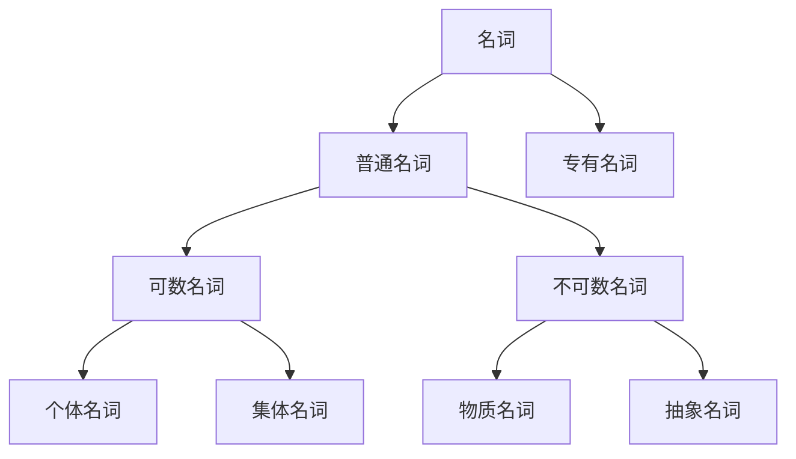

# 名词系统

## 📚 名词概述

名词是表示人、事物、地点、概念等名称的词类，是英语语法的基础组成部分。

## 🎯 学习目标

- **认识层面**：了解名词的基本概念和分类
- **理解层面**：掌握名词的数和格的变化规律
- **应用层面**：能够正确使用名词进行表达

## 📖 名词的分类

### 1. 按意义分类

#### 普通名词 (Common Nouns)
- **个体名词**：表示单个的人或事物
  - 例：book, student, city
- **集体名词**：表示一群人或事物的集合
  - 例：family, team, class
- **物质名词**：表示无法分割的物质
  - 例：water, air, gold
- **抽象名词**：表示抽象概念
  - 例：love, happiness, knowledge

#### 专有名词 (Proper Nouns)
- 表示特定的人、地点、机构等
- 例：Beijing, John, Microsoft

### 2. 按可数性分类

| 类型 | 特征 | 例子 | 用法 |
|------|------|------|------|
| 可数名词 | 有单复数形式 | book/books, student/students | 可与a/an, many, few连用 |
| 不可数名词 | 无复数形式 | water, information, advice | 可与much, little连用 |

## 🔢 名词的数

### 单数变复数的规则

#### 规则变化

| 情况 | 规则 | 例子 |
|------|------|------|
| 一般情况 | 加-s | book → books, cat → cats |
| 以s, x, ch, sh结尾 | 加-es | box → boxes, watch → watches |
| 以辅音字母+y结尾 | 变y为i加-es | city → cities, baby → babies |
| 以f或fe结尾 | 变f/fe为v加-es | leaf → leaves, knife → knives |
| 以o结尾 | 加-es或-s | tomato → tomatoes, photo → photos |

#### 不规则变化

| 类型 | 例子 | 复数形式 |
|------|------|----------|
| 改变元音 | man, woman, foot, tooth | men, women, feet, teeth |
| 词尾变化 | child, ox, mouse | children, oxen, mice |
| 单复数同形 | sheep, deer, fish | sheep, deer, fish |
| 外来词 | datum, phenomenon, criterion | data, phenomena, criteria |

### 不可数名词的量化

| 量词 | 用法 | 例子 |
|------|------|------|
| a piece of | 用于抽象名词 | a piece of advice/information |
| a cup of | 用于液体 | a cup of coffee/tea |
| a bottle of | 用于瓶装液体 | a bottle of water/wine |
| a slice of | 用于片状物 | a slice of bread/cake |

## 🏷️ 名词的格

### 所有格 (Possessive Case)

#### 构成规则

| 情况 | 规则 | 例子 |
|------|------|------|
| 单数名词 | 加-'s | the boy's book, Mary's car |
| 复数名词以s结尾 | 加-' | the students' books, the teachers' office |
| 复数名词不以s结尾 | 加-'s | the children's toys, the men's room |
| 复合名词 | 在最后一个词后加-'s | my brother-in-law's house |

#### 用法

1. **表示所属关系**
   - This is Tom's book. (这是汤姆的书)

2. **表示时间、距离、价格**
   - today's newspaper (今天的报纸)
   - a mile's distance (一英里的距离)

3. **表示店铺、住宅**
   - at the barber's (在理发店)
   - at my uncle's (在我叔叔家)

## 📝 名词的用法

### 1. 作主语
- **The book** is interesting. (这本书很有趣)

### 2. 作宾语
- I read **a book** yesterday. (我昨天读了一本书)

### 3. 作表语
- He is **a teacher**. (他是一名教师)

### 4. 作定语
- **School** life is wonderful. (学校生活很精彩)

### 5. 作同位语
- Mr. Smith, **our teacher**, is very kind. (我们的老师史密斯先生很和蔼)

## ⚠️ 常见错误分析

### 错误1：可数名词与不可数名词混用
- ❌ I have many informations.
- ✅ I have much information.

### 错误2：所有格使用错误
- ❌ the childrens' toys
- ✅ the children's toys

### 错误3：复数形式错误
- ❌ two sheeps
- ✅ two sheep

## 🎯 费曼学习法应用

### 第一步：选择概念
选择"名词的数"这个概念进行解释

### 第二步：教授他人
用简单语言解释：名词的数是指名词表示一个还是多个的概念

### 第三步：发现问题
在解释过程中发现：不规则变化需要特别记忆

### 第四步：重新学习
回到资料重新学习不规则变化规律

### 第五步：简化表达
用更简单的语言重新表达：大部分名词加s变复数，少数需要特殊记忆

## 📚 刻意练习

### 基础练习
1. 将下列名词变为复数形式：
   - book → books
   - city → cities
   - child → children
   - sheep → sheep

2. 用适当的所有格形式填空：
   - This is (Tom) book. → Tom's
   - The (students) books are on the desk. → students'

### 进阶练习
1. 判断下列名词是可数还是不可数：
   - information (不可数)
   - advice (不可数)
   - furniture (不可数)
   - equipment (不可数)

2. 用适当的量词填空：
   - a piece of advice
   - a cup of coffee
   - a slice of bread

## 🔗 相关知识点

- [[02-代词系统|代词系统]] - 名词的替代词
- [[03-动词系统|动词系统]] - 名词与动词的搭配
- [[01-主语|主语]] - 名词作主语
- [[03-宾语|宾语]] - 名词作宾语

## 📖 扩展阅读

- [[99-附录资料/01-语法术语表|语法术语表]]
- [[04-综合应用/02-常见错误分析/05-其他常见错误|其他常见错误]]
- [[04-综合应用/01-语法综合练习/01-基础练习|基础练习]]
