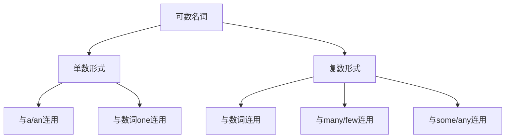
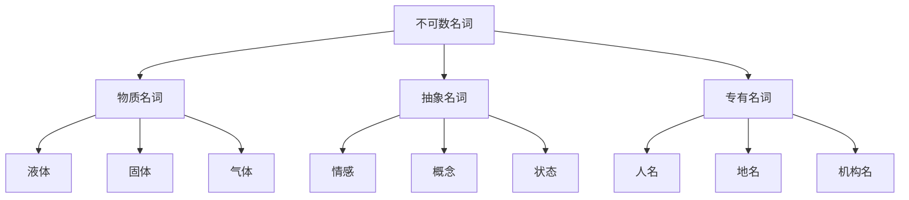
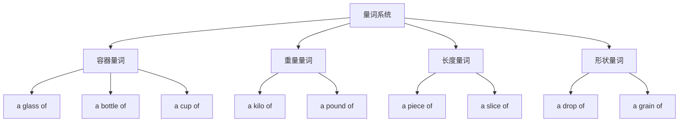

# 可数不可数名词

## 🎯 学习目标
- 准确区分可数名词和不可数名词
- 掌握不可数名词的量化表达方法
- 避免可数性使用中的常见错误

## 📚 基本概念

### 可数名词（Countable Nouns）
**定义**：可以计数的名词，有单复数形式

**特征**：
- 可以与数词直接连用
- 可以与冠词a/an连用
- 有单复数变化

### 不可数名词（Uncountable Nouns）
**定义**：不可以计数的名词，没有复数形式

**特征**：
- 不能与数词直接连用
- 不能与冠词a/an连用
- 没有复数变化

## 🔢 可数名词详解

### 基本特征

### 单数形式使用
**规则**：
- 与冠词a/an连用
- 与数词one连用
- 作单数主语时谓语动词用单数

**示例**：
- ✅ A book is on the table.
- ✅ One student is reading.
- ✅ The cat is sleeping.
- ✅ This book is interesting.

### 复数形式使用
**规则**：
- 与数词two, three等连用
- 与many, few, several等连用
- 作复数主语时谓语动词用复数

**示例**：
- ✅ Three books are on the table.
- ✅ Many students are reading.
- ✅ Few cats are sleeping.
- ✅ These books are interesting.

### 复数变化规则
| 规则 | 示例 | 说明 |
|------|------|------|
| 一般情况 | book→books, cat→cats | 直接加-s |
| 以s,x,ch,sh结尾 | box→boxes, watch→watches | 加-es |
| 以辅音字母+y结尾 | city→cities, baby→babies | 变y为i加-es |
| 以f或fe结尾 | leaf→leaves, knife→knives | 变f/fe为v加-es |
| 以o结尾 | tomato→tomatoes, photo→photos | 有生命加-es，无生命加-s |
| 不规则变化 | child→children, foot→feet, mouse→mice | 特殊变化 |

## 💧 不可数名词详解

### 基本特征

### 物质名词
**特征**：表示物质、材料、液体等

**分类**：

| 类别 | 示例 | 说明 |
|------|------|------|
| 液体 | water, milk, oil, juice | 液体物质 |
| 固体 | gold, silver, iron, wood | 固体材料 |
| 气体 | air, oxygen, hydrogen | 气体物质 |
| 食物 | bread, rice, meat, cheese | 食物材料 |
| 材料 | paper, cloth, plastic | 制作材料 |

**用法规则**：
- 不与a/an连用
- 没有复数形式
- 表示数量时用量词

**示例**：
- ✅ Water is essential for life.
- ✅ Gold is expensive.
- ✅ A glass of water (用量词)
- ❌ A water (错误)
- ❌ Two waters (错误)

### 抽象名词
**特征**：表示抽象概念、情感、状态等

**分类**：

| 类别 | 示例 | 说明 |
|------|------|------|
| 情感 | love, happiness, anger, fear | 情感状态 |
| 品质 | courage, honesty, wisdom, patience | 人的品质 |
| 概念 | freedom, justice, peace, democracy | 抽象概念 |
| 状态 | health, wealth, poverty, success | 状态概念 |
| 学科 | mathematics, physics, history, biology | 学科名称 |

**用法规则**：
- 不与a/an连用
- 没有复数形式
- 作主语时谓语动词用单数

**示例**：
- ✅ Love is beautiful.
- ✅ Courage is important.
- ✅ Mathematics is difficult.
- ❌ A love (错误)
- ❌ Two loves (错误)

### 专有名词
**特征**：表示特定的人、地点、机构等

**分类**：
| 类别 | 示例 | 说明 |
|------|------|------|
| 人名 | John, Mary, Smith | 个人姓名 |
| 地名 | Beijing, London, Mount Everest | 地理名称 |
| 机构名 | Harvard University, Microsoft | 组织名称 |
| 节日名 | Christmas, New Year's Day | 节日名称 |

**用法规则**：
- 首字母通常大写
- 一般不与冠词连用
- 没有复数形式

**示例**：
- ✅ John is my friend.
- ✅ I live in Beijing.
- ✅ Harvard University is famous.
- ❌ The John is my friend. (通常不用冠词)

## 📏 不可数名词的量化表达

### 量词系统

### 常用量词搭配
| 量词 | 搭配名词 | 示例 | 说明 |
|------|----------|------|------|
| a glass of | 液体 | a glass of water | 一杯水 |
| a bottle of | 液体 | a bottle of milk | 一瓶牛奶 |
| a cup of | 液体 | a cup of coffee | 一杯咖啡 |
| a piece of | 固体 | a piece of paper | 一张纸 |
| a slice of | 食物 | a slice of bread | 一片面包 |
| a kilo of | 重量 | a kilo of rice | 一公斤米 |
| a drop of | 液体 | a drop of water | 一滴水 |
| a grain of | 小颗粒 | a grain of sand | 一粒沙子 |

### 量词使用规则
**规则**：
- 量词本身可数，有单复数变化
- 量词后的名词保持不可数形式
- 量词作主语时，谓语动词与量词的单复数一致

**示例**：
- ✅ A glass of water is on the table.
- ✅ Three glasses of water are on the table.
- ✅ A piece of paper is white.
- ✅ Two pieces of paper are white.

## 🔄 可数性转换

### 可数名词的不可数用法
**规则**：某些可数名词在特定语境下可作不可数名词使用

**示例**：
- ✅ I like chicken. (鸡肉，不可数)
- ✅ I have a chicken. (鸡，可数)
- ✅ I drink coffee. (咖啡，不可数)
- ✅ I want a coffee. (一杯咖啡，可数)

### 不可数名词的可数用法
**规则**：某些不可数名词在特定语境下可作可数名词使用

**示例**：
- ✅ I need some water. (水，不可数)
- ✅ I need some waters. (矿泉水，可数)
- ✅ I like coffee. (咖啡，不可数)
- ✅ I like different coffees. (不同种类的咖啡，可数)

## 📊 可数性判断技巧

### 1. 语义判断法
- **可数**：可以数出具体数量
- **不可数**：无法数出具体数量

### 2. 语法判断法
- **可数**：可与a/an连用，有复数形式
- **不可数**：不能与a/an连用，无复数形式

### 3. 语境判断法
- **可数**：表示个体概念
- **不可数**：表示物质或抽象概念

## 🚫 常见错误分析

### 错误类型1：不可数名词加复数
**错误**：❌ I need two waters.
**正确**：✅ I need two glasses of water.
**分析**：water是不可数名词，不能直接加复数

### 错误类型2：不可数名词与a/an连用
**错误**：❌ I want a water.
**正确**：✅ I want a glass of water.
**分析**：不可数名词不能与a/an直接连用

### 错误类型3：可数名词缺少冠词
**错误**：❌ I have book.
**正确**：✅ I have a book.
**分析**：可数名词单数需要冠词

### 错误类型4：量词使用错误
**错误**：❌ A glass of waters.
**正确**：✅ A glass of water.
**分析**：量词后的名词保持不可数形式

## 🎯 练习建议

### 1. 识别练习
- 给出名词，判断可数性
- 给出句子，找出可数性错误

### 2. 转换练习
- 将可数名词改为不可数用法
- 将不可数名词用量词表达

### 3. 应用练习
- 在真实语境中使用正确的可数性
- 写作中注意可数性的准确性

## 🔗 相关链接
- [[01-名词分类与特征]]：名词基本分类
- [[03-名词单复数变化]]：复数变化规则
- [[04-名词所有格]]：所有格的使用
- [[05-名词易混点辨析]]：常见错误分析
- [[01-基础认知层/02-句子成分/01-基本成分]]：名词在句子中的作用

## 💡 记忆口诀

**可数不可数判断法**：
- 可数名词能计数，单复数形式要记住
- 不可数名词不计数，量词表达要准确
- 物质抽象专有名，通常都是不可数
- 个体集体普通名，通常都是可数名

---
*掌握可数不可数名词是语法学习的重要基础，需要大量练习才能熟练运用*
