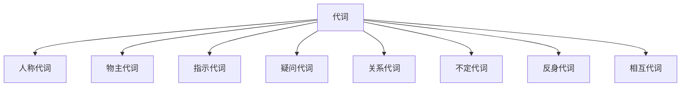

# 代词系统

## 📚 代词概述

代词是用来代替名词或名词短语的词类，避免重复，使语言更加简洁。

## 🎯 学习目标

- **认识层面**：了解代词的基本概念和分类
- **理解层面**：掌握各类代词的用法和变化规律
- **应用层面**：能够正确使用代词进行表达

## 📖 代词的分类

### 代词分类图

## 👥 人称代词 (Personal Pronouns)

### 人称代词表

| 人称 | 主格 | 宾格 | 所有格 | 反身代词 |
|------|------|------|--------|----------|
| 第一人称单数 | I | me | my | myself |
| 第二人称单数 | you | you | your | yourself |
| 第三人称单数 | he/she/it | him/her/it | his/her/its | himself/herself/itself |
| 第一人称复数 | we | us | our | ourselves |
| 第二人称复数 | you | you | your | yourselves |
| 第三人称复数 | they | them | their | themselves |

### 用法规则

1. **主格作主语**
   - **I** am a student. (我是学生)
   - **They** are teachers. (他们是老师)

2. **宾格作宾语**
   - He helps **me**. (他帮助我)
   - We like **them**. (我们喜欢他们)

3. **所有格作定语**
   - **My** book is on the desk. (我的书在桌子上)
   - **Their** house is big. (他们的房子很大)

## 🏠 物主代词 (Possessive Pronouns)

### 物主代词分类

| 类型 | 形容词性物主代词 | 名词性物主代词 |
|------|------------------|----------------|
| 第一人称单数 | my | mine |
| 第二人称单数 | your | yours |
| 第三人称单数 | his/her/its | his/hers/its |
| 第一人称复数 | our | ours |
| 第二人称复数 | your | yours |
| 第三人称复数 | their | theirs |

### 用法区别

1. **形容词性物主代词 + 名词**
   - This is **my** book. (这是我的书)
   - **Her** car is red. (她的车是红色的)

2. **名词性物主代词独立使用**
   - This book is **mine**. (这本书是我的)
   - The red car is **hers**. (红色的车是她的)

## 👉 指示代词 (Demonstrative Pronouns)

### 指示代词表

| 距离 | 单数 | 复数 |
|------|------|------|
| 近指 | this | these |
| 远指 | that | those |

### 用法规则

1. **指代人或物**
   - **This** is my book. (这是我的书)
   - **Those** are my friends. (那些是我的朋友)

2. **指代时间**
   - **This** is a good time to study. (这是学习的好时机)
   - **That** was yesterday. (那是昨天)

3. **指代上文内容**
   - I want to buy a car. **This** is my dream. (我想买车，这是我的梦想)

## ❓ 疑问代词 (Interrogative Pronouns)

### 疑问代词表

| 代词 | 用法 | 例子 |
|------|------|------|
| who | 指人，主格 | **Who** is he? (他是谁？) |
| whom | 指人，宾格 | **Whom** did you see? (你看见了谁？) |
| whose | 指人，所有格 | **Whose** book is this? (这是谁的书？) |
| what | 指物 | **What** is this? (这是什么？) |
| which | 指人或物，有选择 | **Which** book do you want? (你想要哪本书？) |

### 用法规则

1. **作主语**
   - **Who** is coming? (谁要来？)
   - **What** happened? (发生了什么？)

2. **作宾语**
   - **Whom** are you waiting for? (你在等谁？)
   - **What** are you doing? (你在做什么？)

3. **作定语**
   - **Whose** car is this? (这是谁的车？)
   - **Which** way should I go? (我应该走哪条路？)

## 🔗 关系代词 (Relative Pronouns)

### 关系代词表

| 代词 | 指代 | 用法 |
|------|------|------|
| who | 人，主格 | The man **who** is talking is my teacher. |
| whom | 人，宾格 | The man **whom** I met is my teacher. |
| whose | 人，所有格 | The man **whose** car is red is my teacher. |
| which | 物 | The book **which** I read is interesting. |
| that | 人或物 | The man **that** I met is my teacher. |

### 用法规则

1. **引导定语从句**
   - The book **which** I bought is expensive. (我买的那本书很贵)

2. **在从句中作成分**
   - The teacher **who** teaches us is very kind. (教我们的老师很和蔼)

## 🔄 不定代词 (Indefinite Pronouns)

### 不定代词分类

| 类型 | 代词 | 用法 |
|------|------|------|
| 肯定 | some, someone, something | 用于肯定句 |
| 否定 | no, none, nothing | 用于否定句 |
| 疑问 | any, anyone, anything | 用于疑问句和否定句 |
| 全部 | all, both, every, each | 表示全部 |
| 部分 | some, any, many, much | 表示部分 |

### 用法规则

1. **some/any 的区别**
   - **Some** people like coffee. (有些人喜欢咖啡)
   - Do you have **any** questions? (你有问题吗？)

2. **many/much 的区别**
   - **Many** students are here. (许多学生在这里)
   - **Much** water is needed. (需要很多水)

## 🪞 反身代词 (Reflexive Pronouns)

### 反身代词表

| 人称 | 反身代词 |
|------|----------|
| 第一人称单数 | myself |
| 第二人称单数 | yourself |
| 第三人称单数 | himself/herself/itself |
| 第一人称复数 | ourselves |
| 第二人称复数 | yourselves |
| 第三人称复数 | themselves |

### 用法规则

1. **作宾语，表示动作的承受者**
   - I hurt **myself**. (我伤了自己)
   - She taught **herself** English. (她自学英语)

2. **作同位语，强调**
   - I **myself** did it. (我自己做的)
   - The teacher **himself** came. (老师亲自来了)

## 🤝 相互代词 (Reciprocal Pronouns)

### 相互代词

| 代词 | 用法 |
|------|------|
| each other | 两者之间 |
| one another | 三者或以上之间 |

### 用法规则

1. **作宾语**
   - They help **each other**. (他们互相帮助)
   - We should respect **one another**. (我们应该互相尊重)

## ⚠️ 常见错误分析

### 错误1：人称代词主宾格混用
- ❌ **Me** am a student.
- ✅ **I** am a student.

### 错误2：物主代词类型混用
- ❌ This book is **my**.
- ✅ This book is **mine**.

### 错误3：反身代词使用错误
- ❌ I hurt **me**.
- ✅ I hurt **myself**.

## 🎯 费曼学习法应用

### 第一步：选择概念
选择"人称代词"这个概念进行解释

### 第二步：教授他人
用简单语言解释：人称代词是用来代替人的词，有主格和宾格的区别

### 第三步：发现问题
在解释过程中发现：主格和宾格的使用场合容易混淆

### 第四步：重新学习
回到资料重新学习主格和宾格的使用规则

### 第五步：简化表达
用更简单的语言重新表达：主格作主语，宾格作宾语

## 📚 刻意练习

### 基础练习
1. 选择正确的人称代词：
   - (I/Me) am a student. → I
   - He helps (I/me). → me

2. 选择正确的物主代词：
   - This is (my/mine) book. → my
   - This book is (my/mine). → mine

### 进阶练习
1. 用适当的关系代词填空：
   - The man **who** is talking is my teacher.
   - The book **which** I read is interesting.

2. 用适当的不定代词填空：
   - **Some** people like coffee.
   - Do you have **any** questions?

## 🔗 相关知识点

- [[01-名词系统|名词系统]] - 代词代替名词
- [[03-动词系统|动词系统]] - 代词与动词的搭配
- [[01-主语|主语]] - 代词作主语
- [[03-宾语|宾语]] - 代词作宾语

## 📖 扩展阅读

- [[99-附录资料/01-语法术语表|语法术语表]]
- [[04-综合应用/02-常见错误分析/05-其他常见错误|其他常见错误]]
- [[04-综合应用/01-语法综合练习/01-基础练习|基础练习]]
