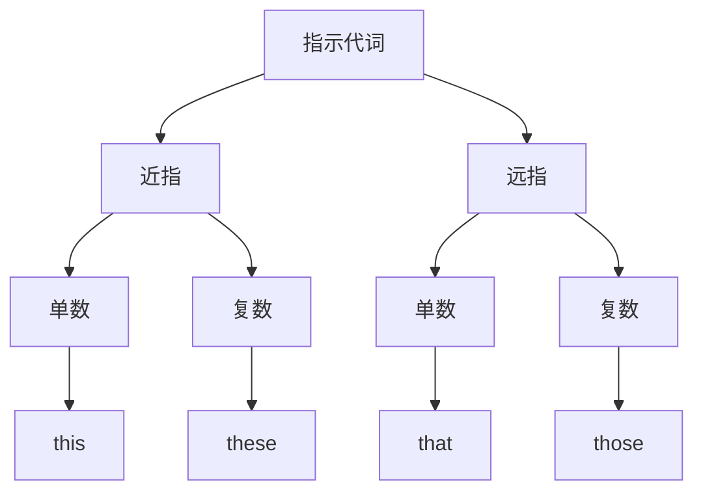

# 指示代词

## 🎯 学习目标
- 掌握指示代词的基本形式和用法
- 理解指示代词的空间和时间概念
- 熟练运用指示代词的各种变化

## 📚 基本概念

### 指示代词（Demonstrative Pronouns）
**定义**：用来指示人或事物的代词

### 基本特征
- 有近指和远指的区别
- 有单数和复数的变化
- 在句中可作主语、宾语、表语、定语

## 📍 指示代词分类

## 📊 指示代词变化表

### 基本变化表
| 距离 | 数 | 指示代词 | 说明 |
|------|----|----------|------|
| 近指 | 单数 | this | 这个 |
| 近指 | 复数 | these | 这些 |
| 远指 | 单数 | that | 那个 |
| 远指 | 复数 | those | 那些 |

## 🎯 基本用法

### 1. 作主语
**功能**：在句中作主语

**示例**：
- ✅ This is my book. (这是我的书)
- ✅ That is your car. (那是你的车)
- ✅ These are my friends. (这些是我的朋友)
- ✅ Those are your classmates. (那些是你的同学)

### 2. 作宾语
**功能**：在句中作宾语

**示例**：
- ✅ I like this. (我喜欢这个)
- ✅ He wants that. (他想要那个)
- ✅ We prefer these. (我们更喜欢这些)
- ✅ They choose those. (他们选择那些)

### 3. 作表语
**功能**：在系动词后作表语

**示例**：
- ✅ What I want is this. (我想要的是这个)
- ✅ The problem is that. (问题是那个)
- ✅ My favorites are these. (我最喜欢的是这些)
- ✅ The best ones are those. (最好的是那些)

### 4. 作定语
**功能**：修饰名词，作定语

**示例**：
- ✅ This book is interesting. (这本书很有趣)
- ✅ That car is expensive. (那辆车很贵)
- ✅ These students are smart. (这些学生很聪明)
- ✅ Those teachers are kind. (那些老师很善良)

## 🔄 空间概念

### 1. 近指（this/these）
**概念**：指距离说话人较近的人或事物

**使用场景**：
- 说话人身边的事物
- 正在讨论的事物
- 刚刚提到的事物

**示例**：
- ✅ This pen is mine. (这支笔是我的)
- ✅ These books are new. (这些书是新的)
- ✅ I like this movie. (我喜欢这部电影)
- ✅ These flowers are beautiful. (这些花很美丽)

### 2. 远指（that/those）
**概念**：指距离说话人较远的人或事物

**使用场景**：
- 距离说话人较远的事物
- 之前提到的事物
- 对比中的另一个事物

**示例**：
- ✅ That house is big. (那座房子很大)
- ✅ Those trees are tall. (那些树很高)
- ✅ I remember that day. (我记得那一天)
- ✅ Those people are friendly. (那些人很友好)

## ⏰ 时间概念

### 1. 现在时间（this/these）
**概念**：指现在或最近的时间

**示例**：
- ✅ This week is busy. (这周很忙)
- ✅ These days are difficult. (这些天很困难)
- ✅ This year is important. (今年很重要)
- ✅ These months are cold. (这几个月很冷)

### 2. 过去时间（that/those）
**概念**：指过去的时间

**示例**：
- ✅ That day was sunny. (那天很晴朗)
- ✅ Those years were hard. (那些年很艰难)
- ✅ That summer was hot. (那个夏天很热)
- ✅ Those times were good. (那些时光很好)

## 📝 使用规则

### 1. 单复数规则
- this/that + 单数名词
- these/those + 复数名词
- 注意主谓一致

### 2. 距离规则
- 近指用this/these
- 远指用that/those
- 根据实际距离选择

### 3. 时间规则
- 现在时间用this/these
- 过去时间用that/those
- 根据时间概念选择

## 🚫 常见错误分析

### 错误类型1：单复数不一致
**错误**：❌ This books are interesting.
**正确**：✅ These books are interesting.
**分析**：复数名词用these/those

### 错误类型2：距离概念错误
**错误**：❌ This car over there is mine.
**正确**：✅ That car over there is mine.
**分析**：远处的车用that

### 错误类型3：时间概念错误
**错误**：❌ That week is busy.
**正确**：✅ This week is busy.
**分析**：现在的时间用this

### 错误类型4：主谓不一致
**错误**：❌ This are my books.
**正确**：✅ These are my books.
**分析**：复数主语用复数动词

## 📊 指示代词功能对比表

| 功能 | this | that | these | those |
|------|------|------|-------|-------|
| 作主语 | ✅ | ✅ | ✅ | ✅ |
| 作宾语 | ✅ | ✅ | ✅ | ✅ |
| 作表语 | ✅ | ✅ | ✅ | ✅ |
| 作定语 | ✅ | ✅ | ✅ | ✅ |

## 🎯 特殊用法

### 1. 电话用语
**示例**：
- ✅ Hello, this is John. (你好，我是约翰)
- ✅ Is that Mary? (是玛丽吗？)
- ✅ This is John speaking. (我是约翰)

### 2. 介绍用语
**示例**：
- ✅ This is my friend. (这是我的朋友)
- ✅ That is my teacher. (那是我的老师)
- ✅ These are my parents. (这些是我的父母)
- ✅ Those are my classmates. (那些是我的同学)

### 3. 对比用语
**示例**：
- ✅ This is better than that. (这个比那个好)
- ✅ These are more expensive than those. (这些比那些贵)
- ✅ I prefer this to that. (我更喜欢这个而不是那个)
- ✅ We like these more than those. (我们更喜欢这些而不是那些)

### 4. 强调用语
**示例**：
- ✅ This is what I want. (这就是我想要的)
- ✅ That is the problem. (那就是问题)
- ✅ These are the best. (这些是最好的)
- ✅ Those are the ones. (那些就是)

## 🔗 相关链接
- [[01-人称代词]]：人称代词的基本用法
- [[02-物主代词]]：物主代词的使用
- [[04-疑问代词]]：疑问代词的用法
- [[05-关系代词]]：关系代词的使用
- [[06-不定代词]]：不定代词的用法
- [[07-代词易混点辨析]]：常见错误分析
- [[01-基础认知层/02-句子成分/01-基本成分]]：代词在句子中的作用

## 💡 记忆口诀

**指示代词记忆法**：
- 近指用this/these，远指用that/those
- 单数用this/that，复数用these/those
- 现在时间用this/these，过去时间用that/those
- 作主宾表定都可以，注意单复数要一致
- 电话用语要记牢，介绍对比要熟练

---
*掌握指示代词是语法学习的重要基础，需要大量练习才能熟练运用*
