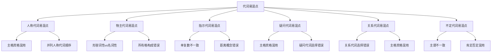

# 代词易混点辨析

## 🎯 学习目标
- 识别代词使用中的常见易混点
- 掌握易混点的正确用法
- 避免代词使用中的常见错误

## 🔍 易混点分类

## 👥 人称代词易混点

### 1. 主格宾格混用
**易混点**：主格和宾格的使用错误

**常见错误**：

| 错误 | 正确 | 分析 |
|------|------|------|
| Me am a student. | I am a student. | 作主语时用主格 |
| He helps I. | He helps me. | 作宾语时用宾格 |
| Between you and I | Between you and me | 介词后必须用宾格 |
| It is I. | It is me. | 非正式语体可用宾格 |

**辨析技巧**：
- 作主语时用主格
- 作宾语时用宾格
- 介词后必须用宾格
- 表语位置非正式语体可用宾格

### 2. 并列人称代词顺序
**易混点**：并列人称代词时顺序错误

**常见错误**：

| 错误 | 正确 | 分析 |
|------|------|------|
| I and you are friends. | You and I are friends. | 第一人称放在最后 |
| He and I went there. | He and I went there. | 第三人称在前 |
| You, he and I are students. | You, he and I are students. | 正确顺序 |

**辨析技巧**：
- 第一人称放在最后
- 第二人称在前
- 第三人称在中间
- 礼貌顺序：you, he/she, I

## 🏠 物主代词易混点

### 1. 形容词性vs名词性物主代词
**易混点**：形容词性物主代词和名词性物主代词混用

**常见错误**：

| 错误 | 正确 | 分析 |
|------|------|------|
| This book is my. | This book is mine. | 名词性物主代词 |
| This is mine book. | This is my book. | 形容词性物主代词 |
| The book is your. | The book is yours. | 名词性物主代词 |
| The book is yours. | The book is yours. | 正确 |

**辨析技巧**：
- 形容词性物主代词修饰名词
- 名词性物主代词代替名词
- 作定语时用形容词性物主代词
- 作主语、宾语、表语时用名词性物主代词

### 2. 所有格构成错误
**易混点**：名词性物主代词构成错误

**常见错误**：

| 错误 | 正确 | 分析 |
|------|------|------|
| This is her's. | This is hers. | 名词性物主代词无撇号 |
| This is his's. | This is his. | 名词性物主代词无撇号 |
| This is their's. | This is theirs. | 名词性物主代词无撇号 |

**辨析技巧**：
- 名词性物主代词无撇号
- 形容词性物主代词无撇号
- 名词所有格有撇号
- 注意区分名词性物主代词和名词所有格

## 📍 指示代词易混点

### 1. 单复数不一致
**易混点**：指示代词单复数使用错误

**常见错误**：

| 错误 | 正确 | 分析 |
|------|------|------|
| This books are interesting. | These books are interesting. | 复数名词用these |
| This are my books. | These are my books. | 复数主语用these |
| That cars are expensive. | Those cars are expensive. | 复数名词用those |
| That are my cars. | Those are my cars. | 复数主语用those |

**辨析技巧**：
- 单数名词用this/that
- 复数名词用these/those
- 单数主语用this/that
- 复数主语用these/those

### 2. 距离概念错误
**易混点**：近指和远指概念混淆

**常见错误**：

| 错误 | 正确 | 分析 |
|------|------|------|
| This car over there is mine. | That car over there is mine. | 远处的车用that |
| That book here is yours. | This book here is yours. | 近处的书用this |
| This week was busy. | This week is busy. | 现在的时间用this |
| That week is busy. | This week is busy. | 现在的时间用this |

**辨析技巧**：
- 近指用this/these
- 远指用that/those
- 现在时间用this/these
- 过去时间用that/those

## ❓ 疑问代词易混点

### 1. 主格宾格混用
**易混点**：疑问代词主格宾格使用错误

**常见错误**：

| 错误 | 正确 | 分析 |
|------|------|------|
| Whom is he? | Who is he? | 作主语时用who |
| Who did you see? | Who did you see? | 非正式语体可用who |
| Who did you give it to? | Whom did you give it to? | 介词后必须用whom |
| To who did you give it? | To whom did you give it? | 介词后必须用whom |

**辨析技巧**：
- 作主语时用who
- 作宾语时用whom（正式语体）
- 作宾语时用who（非正式语体）
- 介词后必须用whom

### 2. 疑问代词选择错误
**易混点**：疑问代词选择错误

**常见错误**：

| 错误 | 正确 | 分析 |
|------|------|------|
| Who book is this? | Whose book is this? | 询问所有关系用whose |
| What is your name? | What is your name? | 询问姓名用what |
| Which is your name? | What is your name? | 询问姓名用what |
| What do you prefer? | Which do you prefer? | 询问选择用which |

**辨析技巧**：
- 询问人用who/whom/whose
- 询问事物用what
- 询问选择用which
- 询问所有关系用whose

## 🔗 关系代词易混点

### 1. 关系代词选择错误
**易混点**：关系代词选择错误

**常见错误**：

| 错误 | 正确 | 分析 |
|------|------|------|
| The man which is tall is my friend. | The man who is tall is my friend. | 指人用who |
| The book who is interesting is mine. | The book which is interesting is mine. | 指物用which |
| The man whom is talking is my teacher. | The man who is talking is my teacher. | 作主语时用who |
| The man who car is red is my neighbor. | The man whose car is red is my neighbor. | 作定语时用whose |

**辨析技巧**：
- 指人用who/whom/whose
- 指物用which/whose
- 作主语时用who/which
- 作宾语时用whom/which
- 作定语时用whose

### 2. 主格宾格混用
**易混点**：关系代词主格宾格使用错误

**常见错误**：

| 错误 | 正确 | 分析 |
|------|------|------|
| The man whom is talking is my teacher. | The man who is talking is my teacher. | 作主语时用who |
| The man who I met yesterday is my friend. | The man whom I met yesterday is my friend. | 作宾语时用whom |
| The man who I helped is grateful. | The man whom I helped is grateful. | 作宾语时用whom |

**辨析技巧**：
- 作主语时用who/which
- 作宾语时用whom/which
- 作定语时用whose
- 注意关系代词在从句中的语法功能

## 🔢 不定代词易混点

### 1. 主谓不一致
**易混点**：不定代词作主语时主谓不一致

**常见错误**：

| 错误 | 正确 | 分析 |
|------|------|------|
| Everybody are here. | Everybody is here. | 单数不定代词用单数动词 |
| Both is correct. | Both are correct. | 复数不定代词用复数动词 |
| All is students. | All are students. | 指人时all用复数动词 |
| Some is students. | Some are students. | 指人时some用复数动词 |

**辨析技巧**：
- 单数不定代词用单数动词
- 复数不定代词用复数动词
- 单复数同形根据语境判断
- 指人时用复数动词，指物时用单数动词

### 2. 肯定否定混用
**易混点**：肯定句和否定句中不定代词使用错误

**常见错误**：

| 错误 | 正确 | 分析 |
|------|------|------|
| I don't know somebody. | I don't know anybody. | 否定句中用anybody |
| Is somebody here? | Is anybody here? | 疑问句中用anybody |
| I know anybody here. | I know somebody here. | 肯定句中用somebody |
| I don't have some money. | I don't have any money. | 否定句中用any |

**辨析技巧**：
- 肯定句用somebody/someone/everybody/everyone
- 疑问句用anybody/anyone
- 否定句用nobody/no one/anybody/anyone
- 注意肯定否定的一致性

## 📊 易混点对比表

| 易混点类型 | 错误示例 | 正确示例 | 辨析要点 |
|------------|----------|----------|----------|
| 人称代词主格宾格 | Me am a student. | I am a student. | 作主语用主格 |
| 人称代词并列顺序 | I and you are friends. | You and I are friends. | 第一人称放最后 |
| 物主代词形容词性 | This is mine book. | This is my book. | 修饰名词用形容词性 |
| 物主代词名词性 | This book is my. | This book is mine. | 代替名词用名词性 |
| 指示代词单复数 | This books are interesting. | These books are interesting. | 复数名词用these |
| 指示代词距离 | This car over there is mine. | That car over there is mine. | 远处用that |
| 疑问代词主格宾格 | Whom is he? | Who is he? | 作主语用who |
| 疑问代词选择 | Who book is this? | Whose book is this? | 询问所有关系用whose |
| 关系代词选择 | The man which is tall. | The man who is tall. | 指人用who |
| 关系代词主格宾格 | The man whom is talking. | The man who is talking. | 作主语用who |
| 不定代词主谓一致 | Everybody are here. | Everybody is here. | 单数不定代词用单数动词 |
| 不定代词肯定否定 | I don't know somebody. | I don't know anybody. | 否定句中用anybody |

## 🎯 辨析技巧总结

### 1. 语法功能分析法
- 分析代词在句子中的语法功能
- 根据语法功能选择正确的代词
- 注意主谓一致

### 2. 语境分析法
- 根据语境判断代词的含义
- 注意上下文关系
- 理解语言环境

### 3. 对比分析法
- 对比相似代词
- 找出差异点
- 强化记忆

### 4. 练习强化法
- 大量练习
- 及时纠正错误
- 形成正确习惯

## 🔗 相关链接
- [[01-人称代词]]：人称代词的基本用法
- [[02-物主代词]]：物主代词的使用
- [[03-指示代词]]：指示代词的使用
- [[04-疑问代词]]：疑问代词的用法
- [[05-关系代词]]：关系代词的使用
- [[06-不定代词]]：不定代词的用法
- [[01-基础认知层/02-句子成分/01-基本成分]]：代词在句子中的作用

## 💡 记忆口诀

**代词易混点辨析记忆法**：
- 人称代词主格宾格要分清，作主语用主格作宾语用宾格
- 物主代词形容词性名词性要分清，修饰名词用形容词性代替名词用名词性
- 指示代词单复数要分清，单数名词用this/that复数名词用these/those
- 疑问代词主格宾格要分清，作主语用who作宾语用whom
- 关系代词选择要分清，指人用who指物用which作定语用whose
- 不定代词主谓一致要分清，单数不定代词用单数动词复数不定代词用复数动词

---
*掌握代词易混点辨析是提高语法准确性的关键，需要大量练习和对比分析*