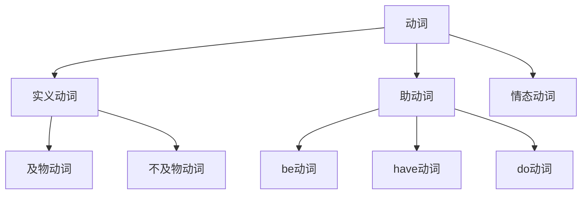

# 动词系统

## 📚 动词概述

动词是表示动作、状态或存在的词类，是句子的核心成分，决定句子的时态、语态和语气。

## 🎯 学习目标

- **认识层面**：了解动词的基本概念和分类
- **理解层面**：掌握动词的基本形式和变化规律
- **应用层面**：能够正确使用动词进行表达

## 📖 动词的分类

### 动词分类图

## 🎭 实义动词 (Lexical Verbs)

### 及物动词 (Transitive Verbs)

#### 定义
需要宾语才能表达完整意义的动词。

#### 用法规则
1. **单宾语动词**
   - I **read** a book. (我读一本书)
   - She **likes** music. (她喜欢音乐)

2. **双宾语动词**
   - He **gave** me a gift. (他给了我一个礼物)
   - She **taught** us English. (她教我们英语)

3. **复合宾语动词**
   - We **call** him Tom. (我们叫他汤姆)
   - I **found** the book interesting. (我发现这本书有趣)

### 不及物动词 (Intransitive Verbs)

#### 定义
不需要宾语就能表达完整意义的动词。

#### 用法规则
1. **纯不及物动词**
   - The sun **rises**. (太阳升起)
   - Birds **fly**. (鸟飞翔)

2. **可带状语的动词**
   - He **lives** in Beijing. (他住在北京)
   - She **works** hard. (她努力工作)

## 🔧 助动词 (Auxiliary Verbs)

### be动词

#### 基本形式
| 时态 | 形式 | 例子 |
|------|------|------|
| 现在时 | am/is/are | I am a student. |
| 过去时 | was/were | He was here yesterday. |
| 将来时 | will be | They will be here tomorrow. |

#### 用法规则
1. **构成进行时态**
   - I **am** reading. (我正在读书)
   - He **was** sleeping. (他正在睡觉)

2. **构成被动语态**
   - The book **is** written by him. (这本书是他写的)
   - The house **was** built last year. (房子是去年建的)

3. **作系动词**
   - She **is** beautiful. (她很漂亮)
   - They **are** students. (他们是学生)

### have动词

#### 基本形式
| 时态 | 形式 | 例子 |
|------|------|------|
| 现在时 | have/has | I have a book. |
| 过去时 | had | He had a car. |
| 将来时 | will have | We will have a meeting. |

#### 用法规则
1. **构成完成时态**
   - I **have** finished my homework. (我已经完成了作业)
   - He **had** left when I arrived. (我到达时他已经离开了)

2. **表示拥有**
   - She **has** a beautiful house. (她有一座漂亮的房子)
   - We **have** enough time. (我们有足够的时间)

### do动词

#### 基本形式
| 时态 | 形式 | 例子 |
|------|------|------|
| 现在时 | do/does | I do my homework. |
| 过去时 | did | He did his work. |
| 将来时 | will do | We will do our best. |

#### 用法规则
1. **构成疑问句**
   - **Do** you like coffee? (你喜欢咖啡吗？)
   - **Did** he come yesterday? (他昨天来了吗？)

2. **构成否定句**
   - I **don't** like tea. (我不喜欢茶)
   - He **didn't** go to school. (他没有去学校)

3. **表示强调**
   - I **do** like this book. (我确实喜欢这本书)
   - He **did** help me. (他确实帮助了我)

## 🎭 情态动词 (Modal Verbs)

### 情态动词表

| 情态动词 | 含义 | 例子 |
|----------|------|------|
| can | 能够，可以 | I can swim. (我会游泳) |
| could | 能够，可以(过去) | He could run fast. (他过去跑得很快) |
| may | 可能，可以 | You may go now. (你现在可以走了) |
| might | 可能，可以(过去) | It might rain. (可能会下雨) |
| must | 必须，一定 | You must study hard. (你必须努力学习) |
| should | 应该 | You should help others. (你应该帮助别人) |
| will | 将要，愿意 | I will help you. (我会帮助你) |
| would | 将要，愿意(过去) | He would come if he could. (如果他能来，他会来的) |

### 用法规则

1. **表示能力**
   - I **can** speak English. (我会说英语)
   - She **could** play piano when she was young. (她年轻时能弹钢琴)

2. **表示可能性**
   - It **may** rain tomorrow. (明天可能会下雨)
   - He **might** be at home. (他可能在家)

3. **表示义务**
   - You **must** finish your homework. (你必须完成作业)
   - We **should** respect our teachers. (我们应该尊敬老师)

4. **表示意愿**
   - I **will** help you. (我会帮助你)
   - He **would** like to go with us. (他想和我们一起去)

## 🔄 动词的基本形式

### 动词变化表

| 基本形式 | 现在时 | 过去时 | 过去分词 | 现在分词 |
|----------|--------|--------|----------|----------|
| 规则动词 | work | worked | worked | working |
| 不规则动词 | go | went | gone | going |
| 不规则动词 | see | saw | seen | seeing |

### 规则动词变化

#### 现在分词构成规则
| 情况 | 规则 | 例子 |
|------|------|------|
| 一般情况 | 加-ing | work → working |
| 以e结尾 | 去e加-ing | make → making |
| 以重读闭音节结尾 | 双写辅音字母加-ing | run → running |
| 以ie结尾 | 变ie为y加-ing | die → dying |

#### 过去式和过去分词构成规则
| 情况 | 规则 | 例子 |
|------|------|------|
| 一般情况 | 加-ed | work → worked |
| 以e结尾 | 加-d | like → liked |
| 以辅音字母+y结尾 | 变y为i加-ed | study → studied |
| 以重读闭音节结尾 | 双写辅音字母加-ed | stop → stopped |

### 不规则动词变化

#### 常见不规则动词
| 原形 | 过去式 | 过去分词 | 现在分词 |
|------|--------|----------|----------|
| be | was/were | been | being |
| have | had | had | having |
| do | did | done | doing |
| go | went | gone | going |
| see | saw | seen | seeing |
| take | took | taken | taking |
| come | came | come | coming |
| get | got | got/gotten | getting |

## 📝 动词的用法

### 1. 作谓语
- I **study** English. (我学习英语)
- She **is** a teacher. (她是老师)

### 2. 作非谓语
- **To study** is important. (学习是重要的)
- I like **reading** books. (我喜欢读书)
- The **broken** window needs repair. (破窗户需要修理)

### 3. 作宾语补足语
- I want you **to come**. (我想让你来)
- I saw him **running**. (我看见他在跑)

## ⚠️ 常见错误分析

### 错误1：动词时态使用错误
- ❌ I **am** go to school yesterday.
- ✅ I **went** to school yesterday.

### 错误2：及物动词缺少宾语
- ❌ I **like**.
- ✅ I **like** this book.

### 错误3：情态动词后加to
- ❌ I **can to** swim.
- ✅ I **can** swim.

## 🎯 费曼学习法应用

### 第一步：选择概念
选择"及物动词和不及物动词"这个概念进行解释

### 第二步：教授他人
用简单语言解释：及物动词需要宾语，不及物动词不需要宾语

### 第三步：发现问题
在解释过程中发现：有些动词既可以作及物动词也可以作不及物动词

### 第四步：重新学习
回到资料重新学习动词的及物性和不及物性

### 第五步：简化表达
用更简单的语言重新表达：看动词后面是否需要宾语来判断

## 📚 刻意练习

### 基础练习
1. 判断下列动词是及物还是不及物：
   - read (及物) - I read a book.
   - sleep (不及物) - I sleep well.

2. 用适当的情态动词填空：
   - I **can** swim. (我会游泳)
   - You **must** study hard. (你必须努力学习)

### 进阶练习
1. 用动词的适当形式填空：
   - I **am studying** English now. (现在进行时)
   - He **has finished** his work. (现在完成时)

2. 将下列句子改为疑问句：
   - You like coffee. → **Do** you like coffee?
   - He is a student. → **Is** he a student?

## 🔗 相关知识点

- [[01-名词系统|名词系统]] - 动词与名词的搭配
- [[02-代词系统|代词系统]] - 动词与代词的搭配
- [[02-谓语|谓语]] - 动词作谓语
- [[03-宾语|宾语]] - 及物动词的宾语

## 📖 扩展阅读

- [[99-附录资料/01-语法术语表|语法术语表]]
- [[04-综合应用/02-常见错误分析/05-其他常见错误|其他常见错误]]
- [[04-综合应用/01-语法综合练习/01-基础练习|基础练习]]
