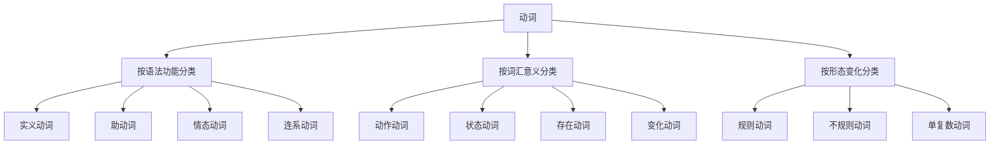

# 动词分类

## 🎯 学习目标
- 掌握动词的基本分类方法
- 理解各类动词的特征和用法
- 能够准确识别和使用不同类别的动词

## 📚 基本概念

### 动词（Verb）
**定义**：表示动作、状态、存在、变化等的词类

### 基本特征
- 有语法功能：作谓语
- 有形态变化：时态、语态、语气
- 有语法关系：主谓关系

## 🔄 动词分类体系

## 🎯 按语法功能分类

### 1. 实义动词（Notional Verbs）
**定义**：具有实际意义，能独立作谓语的动词

**特征**：
- 有实际意义
- 能独立作谓语
- 可带宾语
- 有形态变化

**示例**：
- ✅ I eat an apple. (我吃苹果)
- ✅ She reads books. (她读书)
- ✅ He runs fast. (他跑得快)
- ✅ We study English. (我们学英语)

**语法特点**：
- 作谓语
- 可带宾语
- 有被动语态
- 有分词形式

### 2. 助动词（Auxiliary Verbs）
**定义**：帮助构成谓语，表达时态、语态、语气等语法意义

**特征**：
- 无实际意义
- 不能独立作谓语
- 帮助构成谓语
- 有形态变化

**分类**：
| 助动词 | 功能 | 示例 |
|--------|------|------|
| be | 构成进行时态、被动语态 | I am reading. / The book is read. |
| have | 构成完成时态 | I have finished. |
| do | 构成疑问句、否定句 | Do you like it? / I don't know. |
| will/shall | 构成将来时态 | I will go. |
| would/should | 构成过去将来时态 | I would go. |

**语法特点**：
- 帮助构成谓语
- 表达语法意义
- 有形态变化
- 不能独立作谓语

### 3. 情态动词（Modal Verbs）
**定义**：表示说话人的态度、情感、能力、义务等

**特征**：
- 有情态意义
- 不能独立作谓语
- 后接动词原形
- 有形态变化

**分类**：
| 情态动词 | 含义 | 示例 |
|----------|------|------|
| can/could | 能力、可能性 | I can swim. / It could rain. |
| may/might | 可能性、许可 | It may rain. / May I go? |
| must | 义务、必要性 | You must study. |
| should/ought to | 义务、建议 | You should study. |
| will/would | 意愿、习惯 | I will help you. |
| shall | 意愿、建议 | Shall we go? |
| need | 必要性 | You need to study. |
| dare | 勇气 | I dare not go. |

**语法特点**：
- 表达情态意义
- 后接动词原形
- 有形态变化
- 不能独立作谓语

### 4. 连系动词（Linking Verbs）
**定义**：连接主语和表语，表示主语的状态、性质、特征等

**特征**：
- 连接主语和表语
- 表示状态、性质
- 无被动语态
- 有形态变化

**分类**：
| 连系动词 | 含义 | 示例 |
|----------|------|------|
| be | 是 | I am a student. |
| become | 变成 | He became a teacher. |
| get | 变得 | It gets dark. |
| grow | 生长、变得 | She grows tall. |
| turn | 变成 | The leaves turn yellow. |
| look | 看起来 | She looks happy. |
| seem | 似乎 | He seems tired. |
| appear | 显得 | It appears easy. |
| feel | 感觉 | I feel good. |
| smell | 闻起来 | It smells good. |
| taste | 尝起来 | It tastes sweet. |
| sound | 听起来 | It sounds good. |

**语法特点**：
- 连接主语和表语
- 表示状态、性质
- 无被动语态
- 有形态变化

## 🎯 按词汇意义分类

### 1. 动作动词（Action Verbs）
**定义**：表示具体动作的动词

**特征**：
- 表示具体动作
- 有主动语态
- 可带宾语
- 有形态变化

**示例**：
- ✅ I run every day. (我每天跑步)
- ✅ She writes letters. (她写信)
- ✅ He drives a car. (他开车)
- ✅ We play football. (我们踢足球)

**语法特点**：
- 表示具体动作
- 有主动语态
- 可带宾语
- 有形态变化

### 2. 状态动词（State Verbs）
**定义**：表示状态、性质、关系的动词

**特征**：
- 表示状态、性质
- 无被动语态
- 不可带宾语
- 有形态变化

**示例**：
- ✅ I know English. (我懂英语)
- ✅ She loves music. (她爱音乐)
- ✅ He has a car. (他有车)
- ✅ We like reading. (我们喜欢读书)

**语法特点**：
- 表示状态、性质
- 无被动语态
- 不可带宾语
- 有形态变化

### 3. 存在动词（Existential Verbs）
**定义**：表示存在、拥有等概念的动词

**特征**：
- 表示存在、拥有
- 无被动语态
- 可带宾语
- 有形态变化

**示例**：
- ✅ There is a book. (有一本书)
- ✅ I have a pen. (我有一支笔)
- ✅ She owns a house. (她拥有一座房子)
- ✅ We possess knowledge. (我们拥有知识)

**语法特点**：
- 表示存在、拥有
- 无被动语态
- 可带宾语
- 有形态变化

### 4. 变化动词（Change Verbs）
**定义**：表示变化、转变的动词

**特征**：
- 表示变化、转变
- 有主动语态
- 可带宾语
- 有形态变化

**示例**：
- ✅ The weather changes. (天气变化)
- ✅ She becomes happy. (她变得快乐)
- ✅ He turns red. (他变红)
- ✅ We grow old. (我们变老)

**语法特点**：
- 表示变化、转变
- 有主动语态
- 可带宾语
- 有形态变化

## 🎯 按形态变化分类

### 1. 规则动词（Regular Verbs）
**定义**：按规则变化词形的动词

**特征**：
- 按规则变化
- 过去式加-ed
- 过去分词加-ed
- 现在分词加-ing

**示例**：
| 原形 | 过去式 | 过去分词 | 现在分词 |
|------|--------|----------|----------|
| work | worked | worked | working |
| play | played | played | playing |
| study | studied | studied | studying |
| finish | finished | finished | finishing |

**语法特点**：
- 按规则变化
- 过去式加-ed
- 过去分词加-ed
- 现在分词加-ing

### 2. 不规则动词（Irregular Verbs）
**定义**：不按规则变化词形的动词

**特征**：
- 不按规则变化
- 过去式不规则
- 过去分词不规则
- 现在分词加-ing

**示例**：
| 原形 | 过去式 | 过去分词 | 现在分词 |
|------|--------|----------|----------|
| go | went | gone | going |
| come | came | come | coming |
| see | saw | seen | seeing |
| do | did | done | doing |

**语法特点**：
- 不按规则变化
- 过去式不规则
- 过去分词不规则
- 现在分词加-ing

### 3. 单复数动词（Singular/Plural Verbs）
**定义**：根据主语单复数变化的动词

**特征**：
- 根据主语单复数变化
- 第三人称单数加-s
- 其他情况用原形
- 有形态变化

**示例**：
- ✅ I work. (我工作)
- ✅ You work. (你工作)
- ✅ He works. (他工作)
- ✅ We work. (我们工作)

**语法特点**：
- 根据主语单复数变化
- 第三人称单数加-s
- 其他情况用原形
- 有形态变化

## 📊 动词分类对比表

| 分类标准 | 动词类型 | 特征 | 示例 |
|----------|----------|------|------|
| 语法功能 | 实义动词 | 有实际意义，能独立作谓语 | eat, read, run |
| 语法功能 | 助动词 | 无实际意义，帮助构成谓语 | be, have, do |
| 语法功能 | 情态动词 | 有情态意义，后接动词原形 | can, may, must |
| 语法功能 | 连系动词 | 连接主语和表语 | be, become, look |
| 词汇意义 | 动作动词 | 表示具体动作 | run, write, drive |
| 词汇意义 | 状态动词 | 表示状态、性质 | know, love, have |
| 词汇意义 | 存在动词 | 表示存在、拥有 | be, have, own |
| 词汇意义 | 变化动词 | 表示变化、转变 | change, become, turn |
| 形态变化 | 规则动词 | 按规则变化 | work, play, study |
| 形态变化 | 不规则动词 | 不按规则变化 | go, come, see |
| 形态变化 | 单复数动词 | 根据主语单复数变化 | work, works |

## 🎯 动词识别技巧

### 1. 语法功能识别法
- 分析动词在句子中的语法功能
- 判断是否能独立作谓语
- 确定动词的语法作用

### 2. 词汇意义识别法
- 分析动词的词汇意义
- 判断动词表示的动作、状态等
- 确定动词的语义特征

### 3. 形态变化识别法
- 观察动词的形态变化
- 判断动词的变化规律
- 确定动词的形态特征

## 🔗 相关链接
- [[02-及物不及物动词]]：动词的及物性
- [[03-动词基本形式]]：动词的基本形式
- [[04-情态动词详解]]：情态动词的详细用法
- [[05-动词易混点辨析]]：常见错误分析
- [[01-基础认知层/02-句子成分/01-基本成分]]：动词在句子中的作用

## 💡 记忆口诀

**动词分类记忆法**：
- 实义动词有实际意义，助动词帮助构成谓语
- 情态动词表达情态，连系动词连接主表
- 动作动词表示动作，状态动词表示状态
- 存在动词表示存在，变化动词表示变化
- 规则动词按规则变化，不规则动词特殊变化
- 单复数动词根据主语变化，第三人称单数加-s

---
*掌握动词分类是语法学习的基础，为后续的语法学习奠定坚实基础*
