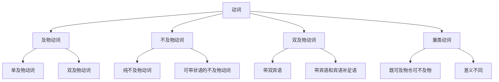

# 及物不及物动词

## 🎯 学习目标
- 掌握及物动词和不及物动词的基本概念
- 理解动词的及物性特征
- 熟练运用及物动词和不及物动词

## 📚 基本概念

### 及物动词（Transitive Verbs）
**定义**：需要带宾语的动词

### 不及物动词（Intransitive Verbs）
**定义**：不需要带宾语的动词

### 基本特征
- 及物动词：必须有宾语
- 不及物动词：不能带宾语
- 有些动词：既可及物也可不及物

## 🔄 动词及物性分类

## 🎯 及物动词详解

### 1. 单及物动词（Monotransitive Verbs）
**定义**：只带一个宾语的动词

**特征**：
- 只带一个宾语
- 宾语是动作的承受者
- 有被动语态
- 可带宾语补足语

**示例**：
- ✅ I eat an apple. (我吃苹果)
- ✅ She reads books. (她读书)
- ✅ He drives a car. (他开车)
- ✅ We study English. (我们学英语)

**语法特点**：
- 必须带宾语
- 宾语是动作的承受者
- 有被动语态
- 可带宾语补足语

### 2. 双及物动词（Ditransitive Verbs）
**定义**：带两个宾语的动词

**特征**：
- 带两个宾语
- 直接宾语和间接宾语
- 有被动语态
- 可转换为被动语态

**示例**：
- ✅ I give him a book. (我给他一本书)
- ✅ She teaches us English. (她教我们英语)
- ✅ He tells me a story. (他给我讲故事)
- ✅ We show them the way. (我们给他们指路)

**语法特点**：
- 带两个宾语
- 直接宾语和间接宾语
- 有被动语态
- 可转换为被动语态

### 3. 复合及物动词（Complex Transitive Verbs）
**定义**：带宾语和宾语补足语的动词

**特征**：
- 带宾语和宾语补足语
- 宾语补足语说明宾语
- 有被动语态
- 可转换为被动语态

**示例**：
- ✅ I make him happy. (我使他快乐)
- ✅ She calls him Tom. (她叫他汤姆)
- ✅ He finds the book interesting. (他发现书有趣)
- ✅ We consider him a hero. (我们认为他是英雄)

**语法特点**：
- 带宾语和宾语补足语
- 宾语补足语说明宾语
- 有被动语态
- 可转换为被动语态

## 🎯 不及物动词详解

### 1. 纯不及物动词（Pure Intransitive Verbs）
**定义**：完全不能带宾语的动词

**特征**：
- 完全不能带宾语
- 表示动作、状态
- 无被动语态
- 可带状语

**示例**：
- ✅ I sleep. (我睡觉)
- ✅ She cries. (她哭)
- ✅ He laughs. (他笑)
- ✅ We dance. (我们跳舞)

**语法特点**：
- 完全不能带宾语
- 表示动作、状态
- 无被动语态
- 可带状语

### 2. 可带状语的不及物动词（Intransitive Verbs with Adverbials）
**定义**：可带状语但不能带宾语的不及物动词

**特征**：
- 可带状语
- 不能带宾语
- 无被动语态
- 状语说明动作

**示例**：
- ✅ I walk to school. (我步行上学)
- ✅ She runs fast. (她跑得快)
- ✅ He goes home. (他回家)
- ✅ We travel abroad. (我们出国旅行)

**语法特点**：
- 可带状语
- 不能带宾语
- 无被动语态
- 状语说明动作

## 🔄 兼类动词

### 1. 既可及物也可不及物
**定义**：既可带宾语也可不带宾语的动词

**特征**：
- 既可带宾语也可不带宾语
- 意义相同或相近
- 有被动语态
- 用法灵活

**示例**：
- ✅ I eat. / I eat an apple. (我吃。/ 我吃苹果)
- ✅ She reads. / She reads books. (她读。/ 她读书)
- ✅ He drives. / He drives a car. (他开车。/ 他开车)
- ✅ We study. / We study English. (我们学习。/ 我们学英语)

**语法特点**：
- 既可带宾语也可不带宾语
- 意义相同或相近
- 有被动语态
- 用法灵活

### 2. 意义不同
**定义**：及物和不及物时意义不同的动词

**特征**：
- 及物和不及物时意义不同
- 需要根据语境判断
- 有被动语态
- 用法灵活

**示例**：
- ✅ I run. (我跑步) / I run a company. (我经营公司)
- ✅ She flies. (她飞) / She flies a plane. (她开飞机)
- ✅ He turns. (他转身) / He turns the page. (他翻页)
- ✅ We break. (我们休息) / We break the window. (我们打破窗户)

**语法特点**：
- 及物和不及物时意义不同
- 需要根据语境判断
- 有被动语态
- 用法灵活

## 📊 动词及物性对比表

| 动词类型 | 宾语 | 被动语态 | 示例 |
|----------|------|----------|------|
| 单及物动词 | 一个宾语 | ✅ | I eat an apple. |
| 双及物动词 | 两个宾语 | ✅ | I give him a book. |
| 复合及物动词 | 宾语+宾语补足语 | ✅ | I make him happy. |
| 纯不及物动词 | 无宾语 | ❌ | I sleep. |
| 可带状语的不及物动词 | 状语 | ❌ | I walk to school. |
| 兼类动词 | 可有可无 | ✅ | I eat. / I eat an apple. |

## 🎯 动词及物性判断技巧

### 1. 语法功能判断法
- 分析动词在句子中的语法功能
- 判断是否需要宾语
- 确定动词的及物性

### 2. 语义关系判断法
- 分析动词的语义关系
- 判断动作的承受者
- 确定动词的及物性

### 3. 被动语态判断法
- 判断动词是否有被动语态
- 有被动语态的是及物动词
- 无被动语态的是不及物动词

## 🚫 常见错误分析

### 错误类型1：不及物动词带宾语
**错误**：❌ I sleep a bed.
**正确**：✅ I sleep in a bed.
**分析**：不及物动词不能带宾语，可用介词短语

### 错误类型2：及物动词不带宾语
**错误**：❌ I eat.
**正确**：✅ I eat an apple.
**分析**：及物动词必须带宾语

### 错误类型3：被动语态使用错误
**错误**：❌ The book reads.
**正确**：✅ The book is read.
**分析**：及物动词有被动语态

### 错误类型4：宾语补足语使用错误
**错误**：❌ I make him.
**正确**：✅ I make him happy.
**分析**：复合及物动词需要宾语补足语

## 🎯 特殊用法

### 1. 不及物动词的被动语态
**结构**：不及物动词+介词+宾语

**示例**：
- ✅ The bed is slept in. (床被睡)
- ✅ The chair is sat on. (椅子被坐)
- ✅ The door is knocked at. (门被敲)
- ✅ The window is looked through. (窗户被看)

**用法说明**：
- 不及物动词+介词+宾语
- 介词不能省略
- 被动语态中介词保留

### 2. 及物动词的省略
**结构**：及物动词省略宾语

**示例**：
- ✅ I eat. (我吃)
- ✅ She reads. (她读)
- ✅ He drives. (他开车)
- ✅ We study. (我们学习)

**用法说明**：
- 宾语在语境中明确
- 可省略宾语
- 意义不变

### 3. 动词的转换
**结构**：及物动词转换为不及物动词

**示例**：
- ✅ I eat an apple. → I eat. (我吃苹果。→ 我吃。)
- ✅ She reads books. → She reads. (她读书。→ 她读。)
- ✅ He drives a car. → He drives. (他开车。→ 他开车。)

**用法说明**：
- 宾语在语境中明确
- 可省略宾语
- 意义不变

## 🔗 相关链接
- [[01-动词分类]]：动词的基本分类
- [[03-动词基本形式]]：动词的基本形式
- [[04-情态动词详解]]：情态动词的详细用法
- [[05-动词易混点辨析]]：常见错误分析
- [[01-基础认知层/02-句子成分/01-基本成分]]：动词在句子中的作用

## 💡 记忆口诀

**动词及物性记忆法**：
- 及物动词带宾语，不及物动词不带宾语
- 单及物动词带一个宾语，双及物动词带两个宾语
- 复合及物动词带宾语补足语，纯不及物动词完全不带宾语
- 兼类动词既可及物也可不及物，意义相同或不同
- 被动语态判断及物性，有被动语态的是及物动词
- 不及物动词用介词短语，及物动词可省略宾语

---
*掌握动词及物性是语法学习的重要基础，需要大量练习才能熟练运用*
