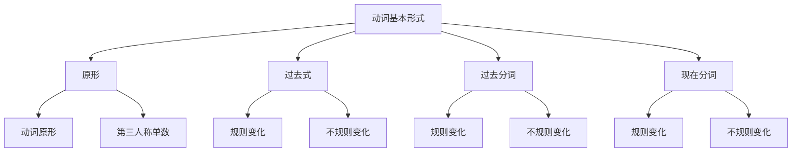

# 动词基本形式

## 🎯 学习目标
- 掌握动词的基本形式及其变化规律
- 理解动词形态变化规则
- 熟练运用动词的各种形式

## 📚 基本概念

### 动词基本形式（Basic Forms of Verbs）
**定义**：动词的基本形态，包括原形、过去式、过去分词、现在分词

### 基本特征
- 原形：动词的基本形式
- 过去式：表示过去时态
- 过去分词：构成完成时态和被动语态
- 现在分词：构成进行时态

## 🔄 动词基本形式分类

## 📊 动词基本形式变化表

### 基本变化表
| 动词 | 原形 | 第三人称单数 | 过去式 | 过去分词 | 现在分词 |
|------|------|---------------|--------|----------|----------|
| 规则动词 | work | works | worked | worked | working |
| 规则动词 | play | plays | played | played | playing |
| 规则动词 | study | studies | studied | studied | studying |
| 不规则动词 | go | goes | went | gone | going |
| 不规则动词 | come | comes | came | come | coming |
| 不规则动词 | see | sees | saw | seen | seeing |
| 不规则动词 | do | does | did | done | doing |

## 🎯 动词原形

### 1. 动词原形（Base Form）
**定义**：动词的基本形式，不含任何词尾变化

**特征**：
- 动词的基本形式
- 不含任何词尾变化
- 用于一般现在时（除第三人称单数）
- 用于情态动词后

**示例**：
- ✅ I work every day. (我每天工作)
- ✅ You play football. (你踢足球)
- ✅ We study English. (我们学英语)
- ✅ They can swim. (他们会游泳)

**语法特点**：
- 动词的基本形式
- 不含任何词尾变化
- 用于一般现在时（除第三人称单数）
- 用于情态动词后

### 2. 第三人称单数（Third Person Singular）
**定义**：动词在第三人称单数主语后的变化形式

**特征**：
- 第三人称单数主语后使用
- 一般加-s
- 特殊变化规则
- 有发音变化

**变化规则**：
| 规则 | 示例 | 说明 |
|------|------|------|
| 一般情况 | work→works, play→plays | 直接加-s |
| 以s,x,ch,sh结尾 | watch→watches, fix→fixes | 加-es |
| 以辅音字母+y结尾 | study→studies, try→tries | 变y为i加-es |
| 以o结尾 | go→goes, do→does | 加-es |
| 特殊情况 | have→has, be→is | 特殊变化 |

**示例**：
- ✅ He works every day. (他每天工作)
- ✅ She plays football. (她踢足球)
- ✅ It studies English. (它学英语)
- ✅ Tom has a car. (汤姆有车)

**语法特点**：
- 第三人称单数主语后使用
- 一般加-s
- 特殊变化规则
- 有发音变化

## 🎯 动词过去式

### 1. 规则动词过去式（Regular Past Tense）
**定义**：按规则变化词形的动词过去式

**特征**：
- 按规则变化
- 一般加-ed
- 有发音变化
- 表示过去时态

**变化规则**：

| 规则 | 示例 | 说明 |
|------|------|------|
| 一般情况 | work→worked, play→played | 直接加-ed |
| 以e结尾 | live→lived, hope→hoped | 直接加-d |
| 以辅音字母+y结尾 | study→studied, try→tried | 变y为i加-ed |
| 以重读闭音节结尾 | stop→stopped, plan→planned | 双写辅音字母加-ed |

**示例**：
- ✅ I worked yesterday. (我昨天工作)
- ✅ She played football. (她踢足球)
- ✅ We studied English. (我们学英语)
- ✅ They stopped here. (他们在这里停下来)

**语法特点**：
- 按规则变化
- 一般加-ed
- 有发音变化
- 表示过去时态

### 2. 不规则动词过去式（Irregular Past Tense）
**定义**：不按规则变化词形的动词过去式

**特征**：
- 不按规则变化
- 需要特殊记忆
- 有发音变化
- 表示过去时态

**示例**：

| 原形 | 过去式 | 示例 |
|------|--------|------|
| go | went | I went to school. |
| come | came | She came here. |
| see | saw | He saw a movie. |
| do | did | We did homework. |
| have | had | They had dinner. |
| be | was/were | I was happy. |

**语法特点**：
- 不按规则变化
- 需要特殊记忆
- 有发音变化
- 表示过去时态

## 🎯 动词过去分词

### 1. 规则动词过去分词（Regular Past Participle）
**定义**：按规则变化词形的动词过去分词

**特征**：
- 按规则变化
- 一般加-ed
- 有发音变化
- 构成完成时态和被动语态

**变化规则**：

| 规则 | 示例 | 说明 |
|------|------|------|
| 一般情况 | work→worked, play→played | 直接加-ed |
| 以e结尾 | live→lived, hope→hoped | 直接加-d |
| 以辅音字母+y结尾 | study→studied, try→tried | 变y为i加-ed |
| 以重读闭音节结尾 | stop→stopped, plan→planned | 双写辅音字母加-ed |

**示例**：
- ✅ I have worked here. (我在这里工作过)
- ✅ The book was written. (书被写了)
- ✅ She has studied English. (她学过英语)
- ✅ The door was opened. (门被打开了)

**语法特点**：
- 按规则变化
- 一般加-ed
- 有发音变化
- 构成完成时态和被动语态

### 2. 不规则动词过去分词（Irregular Past Participle）
**定义**：不按规则变化词形的动词过去分词

**特征**：
- 不按规则变化
- 需要特殊记忆
- 有发音变化
- 构成完成时态和被动语态

**示例**：

| 原形 | 过去分词 | 示例 |
|------|----------|------|
| go | gone | I have gone there. |
| come | come | She has come here. |
| see | seen | He has seen a movie. |
| do | done | We have done homework. |
| have | had | They have had dinner. |
| be | been | I have been happy. |

**语法特点**：
- 不按规则变化
- 需要特殊记忆
- 有发音变化
- 构成完成时态和被动语态

## 🎯 动词现在分词

### 1. 规则动词现在分词（Regular Present Participle）
**定义**：按规则变化词形的动词现在分词

**特征**：
- 按规则变化
- 一般加-ing
- 有发音变化
- 构成进行时态

**变化规则**：

| 规则 | 示例 | 说明 |
|------|------|------|
| 一般情况 | work→working, play→playing | 直接加-ing |
| 以e结尾 | live→living, hope→hoping | 去e加-ing |
| 以辅音字母+y结尾 | study→studying, try→trying | 直接加-ing |
| 以重读闭音节结尾 | stop→stopping, plan→planning | 双写辅音字母加-ing |

**示例**：
- ✅ I am working now. (我现在正在工作)
- ✅ She is playing football. (她正在踢足球)
- ✅ We are studying English. (我们正在学英语)
- ✅ They are stopping here. (他们正在这里停下来)

**语法特点**：
- 按规则变化
- 一般加-ing
- 有发音变化
- 构成进行时态

### 2. 不规则动词现在分词（Irregular Present Participle）
**定义**：不按规则变化词形的动词现在分词

**特征**：
- 不按规则变化
- 需要特殊记忆
- 有发音变化
- 构成进行时态

**示例**：

| 原形 | 现在分词 | 示例 |
|------|----------|------|
| go | going | I am going to school. |
| come | coming | She is coming here. |
| see | seeing | He is seeing a movie. |
| do | doing | We are doing homework. |
| have | having | They are having dinner. |
| be | being | I am being happy. |

**语法特点**：
- 不按规则变化
- 需要特殊记忆
- 有发音变化
- 构成进行时态

## 📊 动词基本形式对比表

| 动词形式 | 构成 | 用法 | 示例 |
|----------|------|------|------|
| 原形 | 动词基本形式 | 一般现在时（除第三人称单数） | I work. |
| 第三人称单数 | 原形+s/es | 一般现在时第三人称单数 | He works. |
| 过去式 | 原形+ed/不规则变化 | 一般过去时 | I worked. |
| 过去分词 | 原形+ed/不规则变化 | 完成时态、被动语态 | I have worked. |
| 现在分词 | 原形+ing | 进行时态 | I am working. |

## 🎯 动词形式变化规律

### 1. 规则变化规律
- 原形：动词基本形式
- 第三人称单数：加-s/-es
- 过去式：加-ed
- 过去分词：加-ed
- 现在分词：加-ing

### 2. 不规则变化规律
- 原形：动词基本形式
- 第三人称单数：加-s/-es
- 过去式：不规则变化
- 过去分词：不规则变化
- 现在分词：加-ing

### 3. 特殊变化规律
- 以辅音字母+y结尾：变y为i
- 以重读闭音节结尾：双写辅音字母
- 以e结尾：去e加-ing
- 特殊情况：特殊记忆

## 🚫 常见错误分析

### 错误类型1：第三人称单数错误
**错误**：❌ He work every day.
**正确**：✅ He works every day.
**分析**：第三人称单数主语后动词加-s

### 错误类型2：过去式错误
**错误**：❌ I work yesterday.
**正确**：✅ I worked yesterday.
**分析**：过去时态用过去式

### 错误类型3：过去分词错误
**错误**：❌ I have work here.
**正确**：✅ I have worked here.
**分析**：完成时态用过去分词

### 错误类型4：现在分词错误
**错误**：❌ I am work now.
**正确**：✅ I am working now.
**分析**：进行时态用现在分词

## 🔗 相关链接
- [[01-动词分类]]：动词的基本分类
- [[02-及物不及物动词]]：动词的及物性
- [[04-情态动词详解]]：情态动词的详细用法
- [[05-动词易混点辨析]]：常见错误分析
- [[01-基础认知层/02-句子成分/01-基本成分]]：动词在句子中的作用

## 💡 记忆口诀

**动词基本形式记忆法**：
- 原形是动词基本形式，第三人称单数加-s/-es
- 过去式加-ed或不规则变化，过去分词加-ed或不规则变化
- 现在分词加-ing，规则变化要记牢
- 不规则变化要特殊记忆，发音变化要注意
- 时态语态要分清，动词形式要正确

---
*掌握动词基本形式是语法学习的基础，需要大量练习才能熟练运用*
