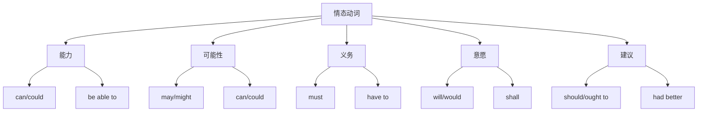

# 情态动词详解

## 🎯 学习目标
- 掌握情态动词的基本概念和用法
- 理解情态动词的各种含义
- 熟练运用情态动词的各种形式

## 📚 基本概念

### 情态动词（Modal Verbs）
**定义**：表示说话人的态度、情感、能力、义务等的动词

### 基本特征
- 有情态意义
- 不能独立作谓语
- 后接动词原形
- 有形态变化

## 🔄 情态动词分类

## 📊 情态动词变化表

### 基本变化表
| 情态动词 | 现在式 | 过去式 | 含义 | 示例 |
|----------|--------|--------|------|------|
| can | can | could | 能力、可能性 | I can swim. |
| may | may | might | 可能性、许可 | It may rain. |
| must | must | must | 义务、必要性 | You must study. |
| will | will | would | 意愿、习惯 | I will help you. |
| shall | shall | should | 意愿、建议 | Shall we go? |
| should | should | should | 义务、建议 | You should study. |
| ought to | ought to | ought to | 义务、建议 | You ought to study. |
| need | need | needed | 必要性 | You need to study. |
| dare | dare | dared | 勇气 | I dare not go. |

## 🎯 能力情态动词

### 1. can的用法
**功能**：表示能力、可能性

**基本用法**：
- ✅ I can swim. (我会游泳)
- ✅ She can speak English. (她会说英语)
- ✅ He can drive a car. (他会开车)
- ✅ We can solve this problem. (我们能解决这个问题)

**语法特点**：
- 表示能力
- 表示可能性
- 后接动词原形
- 有过去式could

### 2. could的用法
**功能**：表示过去的能力、可能性

**基本用法**：
- ✅ I could swim when I was young. (我年轻时会游泳)
- ✅ She could speak English well. (她英语说得很好)
- ✅ He could drive a car. (他会开车)
- ✅ We could solve this problem. (我们能解决这个问题)

**语法特点**：
- 表示过去的能力
- 表示可能性
- 后接动词原形
- 比can更礼貌

### 3. be able to的用法
**功能**：表示能力，可替代can

**基本用法**：
- ✅ I am able to swim. (我会游泳)
- ✅ She is able to speak English. (她会说英语)
- ✅ He is able to drive a car. (他会开车)
- ✅ We are able to solve this problem. (我们能解决这个问题)

**语法特点**：
- 表示能力
- 可替代can
- 有各种时态
- 后接动词原形

## 🎯 可能性情态动词

### 1. may的用法
**功能**：表示可能性、许可

**基本用法**：
- ✅ It may rain tomorrow. (明天可能下雨)
- ✅ She may come to the party. (她可能来参加聚会)
- ✅ He may be right. (他可能是对的)
- ✅ We may win the game. (我们可能赢得比赛)

**语法特点**：
- 表示可能性
- 表示许可
- 后接动词原形
- 有过去式might

### 2. might的用法
**功能**：表示可能性，比may更不确定

**基本用法**：
- ✅ It might rain tomorrow. (明天可能下雨)
- ✅ She might come to the party. (她可能来参加聚会)
- ✅ He might be right. (他可能是对的)
- ✅ We might win the game. (我们可能赢得比赛)

**语法特点**：
- 表示可能性
- 比may更不确定
- 后接动词原形
- 表示过去的可能性

### 3. can的用法（可能性）
**功能**：表示可能性

**基本用法**：
- ✅ It can rain tomorrow. (明天可能下雨)
- ✅ She can come to the party. (她可能来参加聚会)
- ✅ He can be right. (他可能是对的)
- ✅ We can win the game. (我们可能赢得比赛)

**语法特点**：
- 表示可能性
- 比may更确定
- 后接动词原形
- 表示理论上的可能性

## 🎯 义务情态动词

### 1. must的用法
**功能**：表示义务、必要性

**基本用法**：
- ✅ You must study hard. (你必须努力学习)
- ✅ She must finish her homework. (她必须完成作业)
- ✅ He must be on time. (他必须准时)
- ✅ We must follow the rules. (我们必须遵守规则)

**语法特点**：
- 表示义务
- 表示必要性
- 后接动词原形
- 语气较强

### 2. have to的用法
**功能**：表示义务，可替代must

**基本用法**：
- ✅ You have to study hard. (你必须努力学习)
- ✅ She has to finish her homework. (她必须完成作业)
- ✅ He has to be on time. (他必须准时)
- ✅ We have to follow the rules. (我们必须遵守规则)

**语法特点**：
- 表示义务
- 可替代must
- 有各种时态
- 后接动词原形

### 3. need的用法
**功能**：表示必要性

**基本用法**：
- ✅ You need to study hard. (你需要努力学习)
- ✅ She needs to finish her homework. (她需要完成作业)
- ✅ He needs to be on time. (他需要准时)
- ✅ We need to follow the rules. (我们需要遵守规则)

**语法特点**：
- 表示必要性
- 后接动词原形
- 有各种时态
- 语气较弱

## 🎯 意愿情态动词

### 1. will的用法
**功能**：表示意愿、习惯

**基本用法**：
- ✅ I will help you. (我会帮助你)
- ✅ She will come to the party. (她会来参加聚会)
- ✅ He will be there. (他会在那里)
- ✅ We will win the game. (我们会赢得比赛)

**语法特点**：
- 表示意愿
- 表示习惯
- 后接动词原形
- 有过去式would

### 2. would的用法
**功能**：表示过去的意愿、习惯

**基本用法**：
- ✅ I would help you. (我会帮助你)
- ✅ She would come to the party. (她会来参加聚会)
- ✅ He would be there. (他会在那里)
- ✅ We would win the game. (我们会赢得比赛)

**语法特点**：
- 表示过去的意愿
- 表示习惯
- 后接动词原形
- 比will更礼貌

### 3. shall的用法
**功能**：表示意愿、建议

**基本用法**：
- ✅ Shall we go? (我们去吗？)
- ✅ Shall I help you? (我帮助你吗？)
- ✅ Shall she come? (她来吗？)
- ✅ Shall we start? (我们开始吗？)

**语法特点**：
- 表示意愿
- 表示建议
- 后接动词原形
- 有过去式should

## 🎯 建议情态动词

### 1. should的用法
**功能**：表示义务、建议

**基本用法**：
- ✅ You should study hard. (你应该努力学习)
- ✅ She should finish her homework. (她应该完成作业)
- ✅ He should be on time. (他应该准时)
- ✅ We should follow the rules. (我们应该遵守规则)

**语法特点**：
- 表示义务
- 表示建议
- 后接动词原形
- 语气较弱

### 2. ought to的用法
**功能**：表示义务、建议

**基本用法**：
- ✅ You ought to study hard. (你应该努力学习)
- ✅ She ought to finish her homework. (她应该完成作业)
- ✅ He ought to be on time. (他应该准时)
- ✅ We ought to follow the rules. (我们应该遵守规则)

**语法特点**：
- 表示义务
- 表示建议
- 后接动词原形
- 语气较弱

### 3. had better的用法
**功能**：表示建议

**基本用法**：
- ✅ You had better study hard. (你最好努力学习)
- ✅ She had better finish her homework. (她最好完成作业)
- ✅ He had better be on time. (他最好准时)
- ✅ We had better follow the rules. (我们最好遵守规则)

**语法特点**：
- 表示建议
- 后接动词原形
- 语气较强
- 表示警告

## 🎯 勇气情态动词

### 1. dare的用法
**功能**：表示勇气

**基本用法**：
- ✅ I dare not go. (我不敢去)
- ✅ She dare not speak. (她不敢说话)
- ✅ He dare not try. (他不敢尝试)
- ✅ We dare not ask. (我们不敢问)

**语法特点**：
- 表示勇气
- 后接动词原形
- 有各种时态
- 语气较强

## 📊 情态动词对比表

| 情态动词 | 含义 | 语气 | 用法 | 示例 |
|----------|------|------|------|------|
| can | 能力、可能性 | 一般 | 后接动词原形 | I can swim. |
| could | 过去的能力、可能性 | 一般 | 后接动词原形 | I could swim. |
| may | 可能性、许可 | 一般 | 后接动词原形 | It may rain. |
| might | 可能性 | 不确定 | 后接动词原形 | It might rain. |
| must | 义务、必要性 | 强 | 后接动词原形 | You must study. |
| will | 意愿、习惯 | 一般 | 后接动词原形 | I will help you. |
| would | 过去的意愿、习惯 | 一般 | 后接动词原形 | I would help you. |
| shall | 意愿、建议 | 一般 | 后接动词原形 | Shall we go? |
| should | 义务、建议 | 弱 | 后接动词原形 | You should study. |
| ought to | 义务、建议 | 弱 | 后接动词原形 | You ought to study. |
| need | 必要性 | 一般 | 后接动词原形 | You need to study. |
| dare | 勇气 | 强 | 后接动词原形 | I dare not go. |

## 🎯 情态动词使用规则

### 1. 基本规则
- 情态动词后接动词原形
- 情态动词没有人称和数的变化
- 情态动词有过去式变化
- 情态动词不能独立作谓语

### 2. 时态规则
- 情态动词有现在式和过去式
- 情态动词没有将来式
- 情态动词没有完成式
- 情态动词没有进行式

### 3. 语态规则
- 情态动词没有被动语态
- 情态动词后的动词可以有被动语态
- 情态动词后的动词可以有各种时态
- 情态动词后的动词可以有各种语态

## 🚫 常见错误分析

### 错误类型1：情态动词后接动词原形
**错误**：❌ I can to swim.
**正确**：✅ I can swim.
**分析**：情态动词后接动词原形

### 错误类型2：情态动词有人称变化
**错误**：❌ He cans swim.
**正确**：✅ He can swim.
**分析**：情态动词没有人称变化

### 错误类型3：情态动词独立作谓语
**错误**：❌ I can.
**正确**：✅ I can swim.
**分析**：情态动词不能独立作谓语

### 错误类型4：情态动词时态错误
**错误**：❌ I will can swim.
**正确**：✅ I will be able to swim.
**分析**：情态动词没有将来式

## 🔗 相关链接
- [[01-动词分类]]：动词的基本分类
- [[02-及物不及物动词]]：动词的及物性
- [[03-动词基本形式]]：动词的基本形式
- [[05-动词易混点辨析]]：常见错误分析
- [[01-基础认知层/02-句子成分/01-基本成分]]：动词在句子中的作用

## 💡 记忆口诀

**情态动词记忆法**：
- 情态动词有情态意义，后接动词原形
- 能力用can/could，可能性用may/might
- 义务用must/have to，意愿用will/would
- 建议用should/ought to，勇气用dare
- 情态动词无人称变化，不能独立作谓语
- 时态语态要分清，用法规则要记牢

---
*掌握情态动词是语法学习的重要基础，需要大量练习才能熟练运用*
