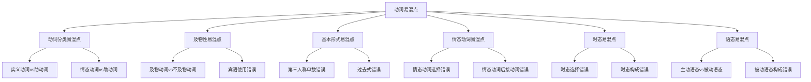

# 动词易混点辨析

## 🎯 学习目标
- 识别动词使用中的常见易混点
- 掌握易混点的正确用法
- 避免动词使用中的常见错误

## 🔍 易混点分类

## 🔄 动词分类易混点

### 1. 实义动词vs助动词
**易混点**：实义动词和助动词的使用错误

**常见错误**：
| 错误 | 正确 | 分析 |
|------|------|------|
| I am a student. | I am a student. | be动词作连系动词 |
| I am reading. | I am reading. | be动词作助动词 |
| I have a book. | I have a book. | have作实义动词 |
| I have finished. | I have finished. | have作助动词 |

**辨析技巧**：
- 实义动词：有实际意义，能独立作谓语
- 助动词：无实际意义，帮助构成谓语
- 根据语法功能判断

### 2. 情态动词vs助动词
**易混点**：情态动词和助动词的使用错误

**常见错误**：
| 错误 | 正确 | 分析 |
|------|------|------|
| I can to swim. | I can swim. | 情态动词后接动词原形 |
| I will to go. | I will go. | 情态动词后接动词原形 |
| I must to study. | I must study. | 情态动词后接动词原形 |

**辨析技巧**：
- 情态动词：有情态意义，后接动词原形
- 助动词：无实际意义，帮助构成谓语
- 根据语法功能判断

## 🎯 及物性易混点

### 1. 及物动词vs不及物动词
**易混点**：及物动词和不及物动词的使用错误

**常见错误**：
| 错误 | 正确 | 分析 |
|------|------|------|
| I sleep a bed. | I sleep in a bed. | 不及物动词不能带宾语 |
| I eat. | I eat an apple. | 及物动词必须带宾语 |
| The book reads. | The book is read. | 及物动词有被动语态 |

**辨析技巧**：
- 及物动词：必须带宾语，有被动语态
- 不及物动词：不能带宾语，无被动语态
- 根据语法功能判断

### 2. 宾语使用错误
**易混点**：宾语的使用错误

**常见错误**：
| 错误 | 正确 | 分析 |
|------|------|------|
| I give him. | I give him a book. | 双及物动词需要两个宾语 |
| I make him. | I make him happy. | 复合及物动词需要宾语补足语 |
| I listen music. | I listen to music. | 不及物动词用介词短语 |

**辨析技巧**：
- 单及物动词：带一个宾语
- 双及物动词：带两个宾语
- 复合及物动词：带宾语和宾语补足语
- 不及物动词：用介词短语

## 🔄 基本形式易混点

### 1. 第三人称单数错误
**易混点**：第三人称单数的使用错误

**常见错误**：
| 错误 | 正确 | 分析 |
|------|------|------|
| He work every day. | He works every day. | 第三人称单数加-s |
| She go to school. | She goes to school. | 第三人称单数加-es |
| It have a tail. | It has a tail. | 第三人称单数特殊变化 |

**辨析技巧**：
- 第三人称单数主语后动词加-s/-es
- 特殊情况需要特殊记忆
- 注意发音变化

### 2. 过去式错误
**易混点**：过去式的使用错误

**常见错误**：
| 错误 | 正确 | 分析 |
|------|------|------|
| I work yesterday. | I worked yesterday. | 过去时态用过去式 |
| She go to school. | She went to school. | 不规则动词过去式 |
| He study English. | He studied English. | 规则动词过去式 |

**辨析技巧**：
- 规则动词：加-ed
- 不规则动词：特殊变化
- 过去时态用过去式

### 3. 过去分词错误
**易混点**：过去分词的使用错误

**常见错误**：
| 错误 | 正确 | 分析 |
|------|------|------|
| I have work here. | I have worked here. | 完成时态用过去分词 |
| The book is write. | The book is written. | 被动语态用过去分词 |
| I have go there. | I have gone there. | 不规则动词过去分词 |

**辨析技巧**：
- 规则动词：加-ed
- 不规则动词：特殊变化
- 完成时态和被动语态用过去分词

### 4. 现在分词错误
**易混点**：现在分词的使用错误

**常见错误**：
| 错误 | 正确 | 分析 |
|------|------|------|
| I am work now. | I am working now. | 进行时态用现在分词 |
| She is read a book. | She is reading a book. | 进行时态用现在分词 |
| He is run fast. | He is running fast. | 进行时态用现在分词 |

**辨析技巧**：
- 规则动词：加-ing
- 不规则动词：加-ing
- 进行时态用现在分词

## 🎯 情态动词易混点

### 1. 情态动词选择错误
**易混点**：情态动词的选择错误

**常见错误**：
| 错误 | 正确 | 分析 |
|------|------|------|
| I can to swim. | I can swim. | 情态动词后接动词原形 |
| You must to study. | You must study. | 情态动词后接动词原形 |
| She will to come. | She will come. | 情态动词后接动词原形 |

**辨析技巧**：
- 情态动词后接动词原形
- 情态动词无人称变化
- 情态动词不能独立作谓语

### 2. 情态动词含义混淆
**易混点**：情态动词含义的混淆

**常见错误**：
| 错误 | 正确 | 分析 |
|------|------|------|
| I may can swim. | I may be able to swim. | 情态动词不能连用 |
| You must can do it. | You must be able to do it. | 情态动词不能连用 |
| She will can help. | She will be able to help. | 情态动词不能连用 |

**辨析技巧**：
- 情态动词不能连用
- 用be able to替代can
- 注意情态动词的含义

## 🔄 时态易混点

### 1. 时态选择错误
**易混点**：时态的选择错误

**常见错误**：
| 错误 | 正确 | 分析 |
|------|------|------|
| I am work every day. | I work every day. | 一般现在时用原形 |
| I work now. | I am working now. | 现在进行时用现在分词 |
| I work yesterday. | I worked yesterday. | 一般过去时用过去式 |

**辨析技巧**：
- 一般现在时：用原形
- 现在进行时：用现在分词
- 一般过去时：用过去式

### 2. 时态构成错误
**易混点**：时态构成的错误

**常见错误**：
| 错误 | 正确 | 分析 |
|------|------|------|
| I have work here. | I have worked here. | 现在完成时用过去分词 |
| I will work tomorrow. | I will work tomorrow. | 一般将来时用原形 |
| I was work yesterday. | I was working yesterday. | 过去进行时用现在分词 |

**辨析技巧**：
- 现在完成时：have/has + 过去分词
- 一般将来时：will + 原形
- 过去进行时：was/were + 现在分词

## 🎯 语态易混点

### 1. 主动语态vs被动语态
**易混点**：主动语态和被动语态的使用错误

**常见错误**：
| 错误 | 正确 | 分析 |
|------|------|------|
| The book reads. | The book is read. | 及物动词有被动语态 |
| The door opens. | The door is opened. | 及物动词有被动语态 |
| The window breaks. | The window is broken. | 及物动词有被动语态 |

**辨析技巧**：
- 及物动词有被动语态
- 不及物动词无被动语态
- 被动语态用be + 过去分词

### 2. 被动语态构成错误
**易混点**：被动语态构成的错误

**常见错误**：
| 错误 | 正确 | 分析 |
|------|------|------|
| The book is read by me. | The book is read by me. | 被动语态用be + 过去分词 |
| The door is open by him. | The door is opened by him. | 被动语态用be + 过去分词 |
| The window is break by them. | The window is broken by them. | 被动语态用be + 过去分词 |

**辨析技巧**：
- 被动语态：be + 过去分词
- 注意时态变化
- 注意主谓一致

## 📊 易混点对比表

| 易混点类型 | 错误示例 | 正确示例 | 辨析要点 |
|------------|----------|----------|----------|
| 动词分类 | I am a student. | I am a student. | be动词作连系动词 |
| 动词分类 | I can to swim. | I can swim. | 情态动词后接动词原形 |
| 及物性 | I sleep a bed. | I sleep in a bed. | 不及物动词不能带宾语 |
| 及物性 | I eat. | I eat an apple. | 及物动词必须带宾语 |
| 第三人称单数 | He work every day. | He works every day. | 第三人称单数加-s |
| 过去式 | I work yesterday. | I worked yesterday. | 过去时态用过去式 |
| 过去分词 | I have work here. | I have worked here. | 完成时态用过去分词 |
| 现在分词 | I am work now. | I am working now. | 进行时态用现在分词 |
| 情态动词 | I can to swim. | I can swim. | 情态动词后接动词原形 |
| 时态选择 | I am work every day. | I work every day. | 一般现在时用原形 |
| 语态选择 | The book reads. | The book is read. | 及物动词有被动语态 |

## 🎯 辨析技巧总结

### 1. 语法功能分析法
- 分析动词在句子中的语法功能
- 根据语法功能判断动词类型
- 注意语法关系

### 2. 语义关系分析法
- 分析动词的语义关系
- 根据语义关系判断及物性
- 注意动作的承受者

### 3. 形态变化分析法
- 观察动词的形态变化
- 根据形态变化判断时态
- 注意主谓一致

### 4. 语境判断分析法
- 根据语境判断动词用法
- 注意上下文关系
- 理解语言环境

## 🔗 相关链接
- [[01-动词分类]]：动词的基本分类
- [[02-及物不及物动词]]：动词的及物性
- [[03-动词基本形式]]：动词的基本形式
- [[04-情态动词详解]]：情态动词的详细用法
- [[01-基础认知层/02-句子成分/01-基本成分]]：动词在句子中的作用

## 💡 记忆口诀

**动词易混点辨析记忆法**：
- 实义动词有实际意义，助动词帮助构成谓语
- 情态动词有情态意义，后接动词原形
- 及物动词带宾语，不及物动词不带宾语
- 第三人称单数加-s/-es，过去式加-ed或不规则变化
- 过去分词构成完成时态和被动语态，现在分词构成进行时态
- 时态语态要分清，动词形式要正确

---
*掌握动词易混点辨析是提高语法准确性的关键，需要大量练习和对比分析*
