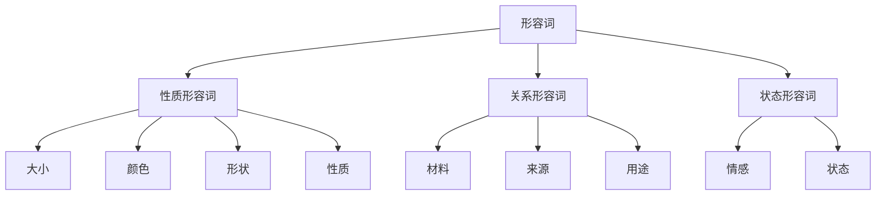
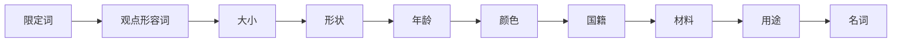

# 形容词系统

## 📚 形容词概述

形容词是用来修饰名词或代词，表示人或事物的性质、状态、特征等的词类。

## 🎯 学习目标

- **认识层面**：了解形容词的基本概念和分类
- **理解层面**：掌握形容词的比较级和位置规律
- **应用层面**：能够正确使用形容词进行表达

## 📖 形容词的分类

### 形容词分类图

## 🎨 形容词的分类

### 1. 按意义分类

#### 性质形容词 (Qualitative Adjectives)
- **大小**：big, small, large, tiny
- **颜色**：red, blue, green, yellow
- **形状**：round, square, long, short
- **性质**：good, bad, beautiful, ugly

#### 关系形容词 (Relative Adjectives)
- **材料**：wooden, metal, plastic, glass
- **来源**：Chinese, American, European
- **用途**：educational, medical, commercial

#### 状态形容词 (State Adjectives)
- **情感**：happy, sad, angry, excited
- **状态**：tired, sick, healthy, busy

### 2. 按功能分类

#### 定语形容词
- 修饰名词，通常位于名词前
- 例：a **beautiful** flower (美丽的花)

#### 表语形容词
- 作表语，位于系动词后
- 例：The flower is **beautiful**. (花很美丽)

## 📊 形容词的比较级

### 比较级构成规则

#### 规则变化

| 情况 | 规则 | 例子 |
|------|------|------|
| 单音节词 | 加-er/est | big → bigger → biggest |
| 以e结尾 | 加-r/st | nice → nicer → nicest |
| 以辅音字母+y结尾 | 变y为i加-er/est | happy → happier → happiest |
| 以重读闭音节结尾 | 双写辅音字母加-er/est | hot → hotter → hottest |
| 多音节词 | 加more/most | beautiful → more beautiful → most beautiful |

#### 不规则变化

| 原级 | 比较级 | 最高级 |
|------|--------|--------|
| good | better | best |
| bad | worse | worst |
| many/much | more | most |
| little | less | least |
| far | farther/further | farthest/furthest |
| old | older/elder | oldest/eldest |

### 比较级用法

#### 1. 同级比较
- **as + 形容词原级 + as**
  - She is **as tall as** her sister. (她和姐姐一样高)
  - This book is **as interesting as** that one. (这本书和那本一样有趣)

#### 2. 比较级
- **形容词比较级 + than**
  - He is **taller than** his brother. (他比弟弟高)
  - This car is **more expensive than** that one. (这辆车比那辆贵)

#### 3. 最高级
- **the + 形容词最高级 + 范围**
  - She is **the tallest** in her class. (她是班里最高的)
  - This is **the most beautiful** flower in the garden. (这是花园里最美丽的花)

## 📍 形容词的位置

### 前置定语位置

#### 多个形容词的排列顺序

#### 排列顺序表

| 顺序 | 类型 | 例子 |
|------|------|------|
| 1 | 限定词 | a, the, my, this |
| 2 | 观点形容词 | beautiful, good, nice |
| 3 | 大小 | big, small, large |
| 4 | 形状 | round, square, long |
| 5 | 年龄 | old, young, new |
| 6 | 颜色 | red, blue, green |
| 7 | 国籍 | Chinese, American |
| 8 | 材料 | wooden, metal, plastic |
| 9 | 用途 | educational, medical |

#### 例子
- a **beautiful big round old red Chinese wooden** table
- the **good small square new blue American plastic** box

### 后置定语位置

#### 1. 修饰复合不定代词
- something **interesting** (有趣的事情)
- nothing **important** (不重要的事情)

#### 2. 修饰以-thing结尾的词
- anything **new** (任何新东西)
- everything **good** (所有好的东西)

#### 3. 某些固定搭配
- the people **present** (在场的人)
- the students **absent** (缺席的学生)

## 📝 形容词的用法

### 1. 作定语
- **Beautiful** flowers are everywhere. (美丽的花到处都是)
- I have a **red** car. (我有一辆红色的车)

### 2. 作表语
- The flowers are **beautiful**. (花很美丽)
- The car is **red**. (车是红色的)

### 3. 作宾语补足语
- I found the book **interesting**. (我发现这本书有趣)
- We made the room **clean**. (我们把房间弄干净了)

### 4. 作状语
- **Happy**, he went home. (高兴地，他回家了)
- **Tired**, she sat down. (累了，她坐下了)

## ⚠️ 常见错误分析

### 错误1：比较级使用错误
- ❌ This book is **more good** than that one.
- ✅ This book is **better** than that one.

### 错误2：形容词位置错误
- ❌ a **red beautiful** flower
- ✅ a **beautiful red** flower

### 错误3：比较级和最高级混用
- ❌ He is **the taller** in his class.
- ✅ He is **the tallest** in his class.

## 🎯 费曼学习法应用

### 第一步：选择概念
选择"形容词的比较级"这个概念进行解释

### 第二步：教授他人
用简单语言解释：形容词的比较级是用来比较两个或多个事物的程度

### 第三步：发现问题
在解释过程中发现：不规则变化的形容词需要特别记忆

### 第四步：重新学习
回到资料重新学习不规则变化的规律

### 第五步：简化表达
用更简单的语言重新表达：大部分形容词加er变比较级，少数需要特殊记忆

## 📚 刻意练习

### 基础练习
1. 写出下列形容词的比较级和最高级：
   - big → bigger → biggest
   - good → better → best
   - beautiful → more beautiful → most beautiful

2. 用适当的形容词形式填空：
   - This book is **more interesting** than that one.
   - She is **the tallest** in her class.

### 进阶练习
1. 将下列形容词按正确顺序排列：
   - a, Chinese, beautiful, red, big, wooden, table
   - → a beautiful big red Chinese wooden table

2. 用适当的比较级形式填空：
   - This car is **more expensive** than that one.
   - He is **taller** than his brother.

## 🔗 相关知识点

- [[01-名词系统|名词系统]] - 形容词修饰名词
- [[02-代词系统|代词系统]] - 形容词修饰代词
- [[04-定语|定语]] - 形容词作定语
- [[06-补语|补语]] - 形容词作补语

## 📖 扩展阅读

- [[99-附录资料/01-语法术语表|语法术语表]]
- [[04-综合应用/02-常见错误分析/05-其他常见错误|其他常见错误]]
- [[04-综合应用/01-语法综合练习/01-基础练习|基础练习]]
