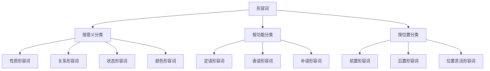

# 形容词分类与位置

## 🎯 学习目标
- 掌握形容词的基本分类方法
- 理解形容词在句子中的位置
- 能够准确识别和使用不同类别的形容词

## 📚 基本概念

### 形容词（Adjective）
**定义**：用来修饰名词或代词，表示人或事物的性质、特征、状态等的词类

### 基本特征
- 修饰名词或代词
- 表示性质、特征、状态
- 有比较级和最高级
- 在句中可作定语、表语、补语

## 🔄 形容词分类体系

## 📊 形容词分类表

### 按意义分类
| 类别 | 特征 | 示例 | 说明 |
|------|------|------|------|
| 性质形容词 | 表示性质、特征 | big, small, good, bad | 描述事物的性质 |
| 关系形容词 | 表示关系、归属 | Chinese, American, daily | 表示关系或归属 |
| 状态形容词 | 表示状态、情况 | happy, sad, tired, busy | 描述状态或情况 |
| 颜色形容词 | 表示颜色 | red, blue, green, yellow | 描述颜色 |

### 按功能分类
| 类别 | 功能 | 示例 | 说明 |
|------|------|------|------|
| 定语形容词 | 修饰名词 | a big house | 作定语 |
| 表语形容词 | 作表语 | The house is big. | 作表语 |
| 补语形容词 | 作补语 | I find it big. | 作补语 |

### 按位置分类
| 类别 | 位置 | 示例 | 说明 |
|------|------|------|------|
| 前置形容词 | 名词前 | a big house | 放在名词前 |
| 后置形容词 | 名词后 | something big | 放在名词后 |
| 位置灵活形容词 | 位置灵活 | big enough | 位置可变化 |

## 🎯 性质形容词

### 1. 基本特征
**定义**：表示人或事物的性质、特征的形容词

**特征**：
- 表示性质、特征
- 有比较级和最高级
- 可作定语、表语、补语
- 位置灵活

**示例**：
- ✅ a big house (大房子)
- ✅ The house is big. (房子很大)
- ✅ I find it big. (我发现它很大)
- ✅ a small car (小车)
- ✅ The car is small. (车很小)
- ✅ I find it small. (我发现它很小)

**语法特点**：
- 表示性质、特征
- 有比较级和最高级
- 可作定语、表语、补语
- 位置灵活

### 2. 常见性质形容词
| 形容词 | 含义 | 比较级 | 最高级 |
|--------|------|--------|--------|
| big | 大的 | bigger | biggest |
| small | 小的 | smaller | smallest |
| good | 好的 | better | best |
| bad | 坏的 | worse | worst |
| tall | 高的 | taller | tallest |
| short | 矮的 | shorter | shortest |
| long | 长的 | longer | longest |
| short | 短的 | shorter | shortest |

## 🎯 关系形容词

### 1. 基本特征
**定义**：表示关系、归属的形容词

**特征**：
- 表示关系、归属
- 无比较级和最高级
- 通常作定语
- 位置固定

**示例**：
- ✅ a Chinese book (中文书)
- ✅ an American car (美国车)
- ✅ a daily newspaper (日报)
- ✅ a monthly magazine (月刊)
- ✅ a yearly report (年度报告)
- ✅ a weekly meeting (周会)

**语法特点**：
- 表示关系、归属
- 无比较级和最高级
- 通常作定语
- 位置固定

### 2. 常见关系形容词
| 形容词 | 含义 | 说明 |
|--------|------|------|
| Chinese | 中国的 | 表示国籍 |
| American | 美国的 | 表示国籍 |
| daily | 每日的 | 表示频率 |
| monthly | 每月的 | 表示频率 |
| yearly | 每年的 | 表示频率 |
| weekly | 每周的 | 表示频率 |

## 🎯 状态形容词

### 1. 基本特征
**定义**：表示状态、情况的形容词

**特征**：
- 表示状态、情况
- 有比较级和最高级
- 可作定语、表语、补语
- 位置灵活

**示例**：
- ✅ a happy child (快乐的孩子)
- ✅ The child is happy. (孩子很快乐)
- ✅ I find him happy. (我发现他很快乐)
- ✅ a tired worker (疲惫的工人)
- ✅ The worker is tired. (工人很疲惫)
- ✅ I find him tired. (我发现他很疲惫)

**语法特点**：
- 表示状态、情况
- 有比较级和最高级
- 可作定语、表语、补语
- 位置灵活

### 2. 常见状态形容词
| 形容词 | 含义 | 比较级 | 最高级 |
|--------|------|--------|--------|
| happy | 快乐的 | happier | happiest |
| sad | 悲伤的 | sadder | saddest |
| tired | 疲惫的 | more tired | most tired |
| busy | 忙碌的 | busier | busiest |
| free | 自由的 | freer | freest |
| sick | 生病的 | sicker | sickest |

## 🎯 颜色形容词

### 1. 基本特征
**定义**：表示颜色的形容词

**特征**：
- 表示颜色
- 无比较级和最高级
- 可作定语、表语、补语
- 位置灵活

**示例**：
- ✅ a red car (红色的车)
- ✅ The car is red. (车是红色的)
- ✅ I find it red. (我发现它是红色的)
- ✅ a blue sky (蓝色的天空)
- ✅ The sky is blue. (天空是蓝色的)
- ✅ I find it blue. (我发现它是蓝色的)

**语法特点**：
- 表示颜色
- 无比较级和最高级
- 可作定语、表语、补语
- 位置灵活

### 2. 常见颜色形容词
| 形容词 | 含义 | 说明 |
|--------|------|------|
| red | 红色的 | 基本颜色 |
| blue | 蓝色的 | 基本颜色 |
| green | 绿色的 | 基本颜色 |
| yellow | 黄色的 | 基本颜色 |
| black | 黑色的 | 基本颜色 |
| white | 白色的 | 基本颜色 |

## 🎯 形容词位置

### 1. 前置形容词
**定义**：放在名词前的形容词

**特征**：
- 放在名词前
- 作定语
- 位置固定
- 数量有限

**示例**：
- ✅ a big house (大房子)
- ✅ a small car (小车)
- ✅ a good book (好书)
- ✅ a bad day (糟糕的一天)
- ✅ a happy child (快乐的孩子)
- ✅ a tired worker (疲惫的工人)

**语法特点**：
- 放在名词前
- 作定语
- 位置固定
- 数量有限

### 2. 后置形容词
**定义**：放在名词后的形容词

**特征**：
- 放在名词后
- 作定语
- 位置固定
- 数量有限

**示例**：
- ✅ something big (大的东西)
- ✅ anything good (好的东西)
- ✅ nothing bad (没有坏的东西)
- ✅ everything possible (一切可能的)
- ✅ someone important (重要的人)
- ✅ anyone interested (感兴趣的人)

**语法特点**：
- 放在名词后
- 作定语
- 位置固定
- 数量有限

### 3. 位置灵活形容词
**定义**：位置可变化的形容词

**特征**：
- 位置可变化
- 可作定语、表语、补语
- 位置灵活
- 数量较多

**示例**：
- ✅ a big house / The house is big. (大房子 / 房子很大)
- ✅ a small car / The car is small. (小车 / 车很小)
- ✅ a good book / The book is good. (好书 / 书很好)
- ✅ a bad day / The day is bad. (糟糕的一天 / 这一天很糟糕)

**语法特点**：
- 位置可变化
- 可作定语、表语、补语
- 位置灵活
- 数量较多

## 📊 形容词位置规则

### 1. 基本位置规则
- 前置形容词：放在名词前
- 后置形容词：放在名词后
- 位置灵活形容词：位置可变化

### 2. 多个形容词的位置
- 性质形容词在前
- 关系形容词在后
- 颜色形容词在最后
- 大小形容词在最前

### 3. 特殊位置规则
- 以a-开头的形容词：通常作表语
- 以-able/-ible结尾的形容词：可前置或后置
- 以-ed/-ing结尾的形容词：位置灵活

## 🚫 常见错误分析

### 错误类型1：形容词位置错误
**错误**：❌ a house big
**正确**：✅ a big house
**分析**：前置形容词放在名词前

### 错误类型2：形容词功能错误
**错误**：❌ The house big.
**正确**：✅ The house is big.
**分析**：表语形容词需要系动词

### 错误类型3：形容词比较级错误
**错误**：❌ more big
**正确**：✅ bigger
**分析**：单音节形容词用-er形式

### 错误类型4：形容词最高级错误
**错误**：❌ most big
**正确**：✅ biggest
**分析**：单音节形容词用-est形式

## 🔗 相关链接
- [[02-形容词比较级最高级]]：形容词的比较级和最高级
- [[03-形容词特殊用法]]：形容词的特殊用法
- [[04-形容词易混点辨析]]：常见错误分析
- [[01-基础认知层/02-句子成分/01-基本成分]]：形容词在句子中的作用

## 💡 记忆口诀

**形容词分类与位置记忆法**：
- 性质形容词表示性质特征，关系形容词表示关系归属
- 状态形容词表示状态情况，颜色形容词表示颜色
- 前置形容词放在名词前，后置形容词放在名词后
- 位置灵活形容词位置可变化，功能多样要记牢
- 比较级最高级要分清，单音节多音节要区别

---
*掌握形容词分类与位置是语法学习的基础，为后续的语法学习奠定坚实基础*
