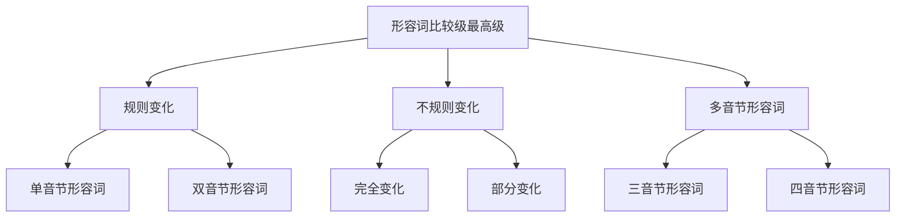

# 形容词比较级最高级

## 🎯 学习目标
- 掌握形容词比较级和最高级的基本构成规则
- 理解比较级和最高级的使用方法
- 熟练运用形容词的比较级和最高级

## 📚 基本概念

### 比较级（Comparative Degree）
**定义**：表示两者之间的比较，表示"更..."的意思

### 最高级（Superlative Degree）
**定义**：表示三者或三者以上的比较，表示"最..."的意思

### 基本特征
- 比较级：两者比较
- 最高级：三者或三者以上比较
- 有规则变化和不规则变化
- 需要冠词the

## 🔄 形容词比较级最高级分类

## 📊 形容词比较级最高级变化表

### 规则变化表
| 形容词 | 比较级 | 最高级 | 变化规则 |
|--------|--------|--------|----------|
| big | bigger | biggest | 单音节形容词 |
| small | smaller | smallest | 单音节形容词 |
| tall | taller | tallest | 单音节形容词 |
| short | shorter | shortest | 单音节形容词 |
| long | longer | longest | 单音节形容词 |
| young | younger | youngest | 单音节形容词 |
| old | older | oldest | 单音节形容词 |
| new | newer | newest | 单音节形容词 |

### 不规则变化表
| 形容词 | 比较级 | 最高级 | 变化规则 |
|--------|--------|--------|----------|
| good | better | best | 完全变化 |
| bad | worse | worst | 完全变化 |
| many | more | most | 完全变化 |
| much | more | most | 完全变化 |
| little | less | least | 完全变化 |
| far | farther/further | farthest/furthest | 部分变化 |
| old | older/elder | oldest/eldest | 部分变化 |

### 多音节形容词变化表
| 形容词 | 比较级 | 最高级 | 变化规则 |
|--------|--------|--------|----------|
| beautiful | more beautiful | most beautiful | 多音节形容词 |
| interesting | more interesting | most interesting | 多音节形容词 |
| difficult | more difficult | most difficult | 多音节形容词 |
| important | more important | most important | 多音节形容词 |
| expensive | more expensive | most expensive | 多音节形容词 |
| comfortable | more comfortable | most comfortable | 多音节形容词 |

## 🎯 规则变化

### 1. 单音节形容词
**规则**：加-er和-est

**变化规则**：
| 规则 | 示例 | 说明 |
|------|------|------|
| 一般情况 | big→bigger→biggest | 直接加-er和-est |
| 以e结尾 | large→larger→largest | 直接加-r和-st |
| 以辅音字母+y结尾 | happy→happier→happiest | 变y为i加-er和-est |
| 以重读闭音节结尾 | hot→hotter→hottest | 双写辅音字母加-er和-est |

**示例**：
- ✅ big → bigger → biggest (大的 → 更大的 → 最大的)
- ✅ small → smaller → smallest (小的 → 更小的 → 最小的)
- ✅ tall → taller → tallest (高的 → 更高的 → 最高的)
- ✅ short → shorter → shortest (矮的 → 更矮的 → 最矮的)

**语法特点**：
- 单音节形容词
- 加-er和-est
- 有发音变化
- 需要冠词the

### 2. 双音节形容词
**规则**：部分加-er和-est，部分用more和most

**变化规则**：
| 规则 | 示例 | 说明 |
|------|------|------|
| 以-y结尾 | happy→happier→happiest | 变y为i加-er和-est |
| 以-er结尾 | clever→cleverer→cleverest | 直接加-er和-est |
| 以-ow结尾 | narrow→narrower→narrowest | 直接加-er和-est |
| 其他双音节 | careful→more careful→most careful | 用more和most |

**示例**：
- ✅ happy → happier → happiest (快乐的 → 更快乐的 → 最快乐的)
- ✅ clever → cleverer → cleverest (聪明的 → 更聪明的 → 最聪明的)
- ✅ narrow → narrower → narrowest (窄的 → 更窄的 → 最窄的)
- ✅ careful → more careful → most careful (仔细的 → 更仔细的 → 最仔细的)

**语法特点**：
- 双音节形容词
- 部分加-er和-est
- 部分用more和most
- 需要冠词the

## 🎯 不规则变化

### 1. 完全变化
**定义**：比较级和最高级完全不同的形容词

**特征**：
- 比较级和最高级完全不同
- 需要特殊记忆
- 有发音变化
- 需要冠词the

**示例**：
| 形容词 | 比较级 | 最高级 | 示例 |
|--------|--------|--------|------|
| good | better | best | This is better than that. |
| bad | worse | worst | This is worse than that. |
| many | more | most | I have more books. |
| much | more | most | I have more money. |
| little | less | least | I have less time. |

**语法特点**：
- 比较级和最高级完全不同
- 需要特殊记忆
- 有发音变化
- 需要冠词the

### 2. 部分变化
**定义**：比较级和最高级部分不同的形容词

**特征**：
- 比较级和最高级部分不同
- 需要特殊记忆
- 有发音变化
- 需要冠词the

**示例**：
| 形容词 | 比较级 | 最高级 | 示例 |
|--------|--------|--------|------|
| far | farther/further | farthest/furthest | This is farther than that. |
| old | older/elder | oldest/eldest | This is older than that. |

**语法特点**：
- 比较级和最高级部分不同
- 需要特殊记忆
- 有发音变化
- 需要冠词the

## 🎯 多音节形容词

### 1. 三音节形容词
**规则**：用more和most

**特征**：
- 三音节形容词
- 用more和most
- 有发音变化
- 需要冠词the

**示例**：
- ✅ beautiful → more beautiful → most beautiful (美丽的 → 更美丽的 → 最美丽的)
- ✅ interesting → more interesting → most interesting (有趣的 → 更有趣的 → 最有趣的)
- ✅ difficult → more difficult → most difficult (困难的 → 更困难的 → 最困难的)
- ✅ important → more important → most important (重要的 → 更重要的 → 最重要的)

**语法特点**：
- 三音节形容词
- 用more和most
- 有发音变化
- 需要冠词the

### 2. 四音节形容词
**规则**：用more和most

**特征**：
- 四音节形容词
- 用more和most
- 有发音变化
- 需要冠词the

**示例**：
- ✅ comfortable → more comfortable → most comfortable (舒适的 → 更舒适的 → 最舒适的)
- ✅ expensive → more expensive → most expensive (昂贵的 → 更昂贵的 → 最昂贵的)
- ✅ necessary → more necessary → most necessary (必要的 → 更必要的 → 最必要的)
- ✅ impossible → more impossible → most impossible (不可能的 → 更不可能的 → 最不可能的)

**语法特点**：
- 四音节形容词
- 用more和most
- 有发音变化
- 需要冠词the

## 🎯 比较级用法

### 1. 基本用法
**结构**：形容词比较级 + than

**示例**：
- ✅ This book is better than that one. (这本书比那本书好)
- ✅ She is taller than her sister. (她比她姐姐高)
- ✅ This car is more expensive than that one. (这辆车比那辆车贵)
- ✅ He is more intelligent than his brother. (他比他哥哥聪明)

**语法特点**：
- 形容词比较级 + than
- 表示两者比较
- 需要than连接
- 可省略than后的部分

### 2. 特殊用法
**结构**：the + 形容词比较级 + of the two

**示例**：
- ✅ This is the better of the two. (这是两者中较好的)
- ✅ She is the taller of the two. (她是两者中较高的)
- ✅ This is the more expensive of the two. (这是两者中较贵的)
- ✅ He is the more intelligent of the two. (他是两者中较聪明的)

**语法特点**：
- the + 形容词比较级 + of the two
- 表示两者中较...的
- 需要the
- 需要of the two

## 🎯 最高级用法

### 1. 基本用法
**结构**：the + 形容词最高级 + 名词

**示例**：
- ✅ This is the best book. (这是最好的书)
- ✅ She is the tallest girl. (她是最高的女孩)
- ✅ This is the most expensive car. (这是最贵的车)
- ✅ He is the most intelligent student. (他是最聪明的学生)

**语法特点**：
- the + 形容词最高级 + 名词
- 表示三者或三者以上比较
- 需要the
- 需要名词

### 2. 特殊用法
**结构**：形容词最高级 + of/in + 范围

**示例**：
- ✅ This is the best of all. (这是所有中最好的)
- ✅ She is the tallest in her class. (她是班上最高的)
- ✅ This is the most expensive in the store. (这是店里最贵的)
- ✅ He is the most intelligent in the school. (他是学校最聪明的)

**语法特点**：
- 形容词最高级 + of/in + 范围
- 表示在某个范围内最...的
- 需要of/in
- 需要范围

## 📊 比较级最高级对比表

| 用法 | 结构 | 示例 | 说明 |
|------|------|------|------|
| 比较级 | 形容词比较级 + than | This is better than that. | 两者比较 |
| 比较级 | the + 形容词比较级 + of the two | This is the better of the two. | 两者中较...的 |
| 最高级 | the + 形容词最高级 + 名词 | This is the best book. | 三者或三者以上比较 |
| 最高级 | 形容词最高级 + of/in + 范围 | This is the best of all. | 在某个范围内最...的 |

## 🚫 常见错误分析

### 错误类型1：比较级构成错误
**错误**：❌ more big
**正确**：✅ bigger
**分析**：单音节形容词用-er形式

### 错误类型2：最高级构成错误
**错误**：❌ most big
**正确**：✅ biggest
**分析**：单音节形容词用-est形式

### 错误类型3：冠词使用错误
**错误**：❌ This is best book.
**正确**：✅ This is the best book.
**分析**：最高级需要冠词the

### 错误类型4：比较对象错误
**错误**：❌ This is better than that.
**正确**：✅ This is better than that one.
**分析**：比较对象要明确

## 🔗 相关链接
- [[01-形容词分类与位置]]：形容词的基本分类
- [[03-形容词特殊用法]]：形容词的特殊用法
- [[04-形容词易混点辨析]]：常见错误分析
- [[01-基础认知层/02-句子成分/01-基本成分]]：形容词在句子中的作用

## 💡 记忆口诀

**形容词比较级最高级记忆法**：
- 单音节形容词加-er和-est，双音节形容词部分加-er和-est
- 多音节形容词用more和most，不规则变化要特殊记忆
- 比较级用than连接，最高级用the修饰
- 两者比较用比较级，三者或三者以上用最高级
- 冠词使用要记牢，比较对象要明确

---
*掌握形容词比较级最高级是语法学习的重要基础，需要大量练习才能熟练运用*
