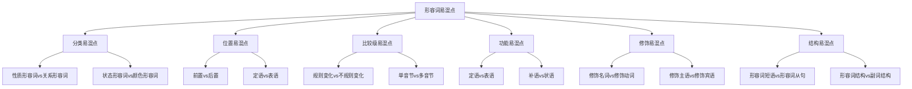

# 形容词易混点辨析

## 🎯 学习目标
- 识别形容词使用中的常见易混点
- 掌握易混点的正确用法
- 避免形容词使用中的常见错误

## 🔍 易混点分类

## 🔄 分类易混点

### 1. 性质形容词vs关系形容词
**易混点**：性质形容词和关系形容词的使用错误

**常见错误**：

| 错误 | 正确 | 分析 |
|------|------|------|
| a Chinese big book | a big Chinese book | 性质形容词在前，关系形容词在后 |
| an American good car | a good American car | 性质形容词在前，关系形容词在后 |
| a daily interesting newspaper | an interesting daily newspaper | 性质形容词在前，关系形容词在后 |

**辨析技巧**：
- 性质形容词：表示性质、特征，有比较级和最高级
- 关系形容词：表示关系、归属，无比较级和最高级
- 多个形容词修饰名词时，性质形容词在前，关系形容词在后

### 2. 状态形容词vs颜色形容词
**易混点**：状态形容词和颜色形容词的使用错误

**常见错误**：

| 错误 | 正确 | 分析 |
|------|------|------|
| a happy red car | a red happy car | 颜色形容词在前，状态形容词在后 |
| a tired blue sky | a blue tired sky | 颜色形容词在前，状态形容词在后 |
| a busy green tree | a green busy tree | 颜色形容词在前，状态形容词在后 |

**辨析技巧**：
- 状态形容词：表示状态、情况，有比较级和最高级
- 颜色形容词：表示颜色，无比较级和最高级
- 多个形容词修饰名词时，颜色形容词在前，状态形容词在后

## 🎯 位置易混点

### 1. 前置vs后置
**易混点**：形容词前置和后置的使用错误

**常见错误**：

| 错误 | 正确 | 分析 |
|------|------|------|
| a house big | a big house | 前置形容词放在名词前 |
| something good | something good | 后置形容词放在名词后 |
| a book interesting | an interesting book | 前置形容词放在名词前 |

**辨析技巧**：
- 前置形容词：放在名词前，作定语
- 后置形容词：放在名词后，作定语
- 根据形容词类型和语法功能判断位置

### 2. 定语vs表语
**易混点**：形容词作定语和表语的使用错误

**常见错误**：

| 错误 | 正确 | 分析 |
|------|------|------|
| The book interesting is. | The book is interesting. | 形容词作表语时在连系动词后 |
| I find the book is interesting. | I find the book interesting. | 形容词作宾语补足语时不需要系动词 |
| The car expensive is. | The car is expensive. | 形容词作表语时在连系动词后 |

**辨析技巧**：
- 定语：修饰名词，位置在名词前后
- 表语：说明主语，位置在连系动词后
- 根据语法功能判断位置

## 🔄 比较级易混点

### 1. 规则变化vs不规则变化
**易混点**：规则变化和不规则变化的使用错误

**常见错误**：

| 错误 | 正确 | 分析 |
|------|------|------|
| more big | bigger | 单音节形容词用-er形式 |
| most big | biggest | 单音节形容词用-est形式 |
| more good | better | 不规则变化需要特殊记忆 |
| most good | best | 不规则变化需要特殊记忆 |

**辨析技巧**：
- 规则变化：单音节形容词加-er/-est，多音节形容词用more/most
- 不规则变化：需要特殊记忆，如good→better→best
- 根据形容词的音节数判断变化规则

### 2. 单音节vs多音节
**易混点**：单音节和多音节形容词的变化错误

**常见错误**：

| 错误 | 正确 | 分析 |
|------|------|------|
| more big | bigger | 单音节形容词用-er形式 |
| most big | biggest | 单音节形容词用-est形式 |
| bigger beautiful | more beautiful | 多音节形容词用more/most形式 |
| biggest beautiful | most beautiful | 多音节形容词用more/most形式 |

**辨析技巧**：
- 单音节形容词：加-er/-est
- 多音节形容词：用more/most
- 双音节形容词：部分加-er/-est，部分用more/most

## 🎯 功能易混点

### 1. 定语vs表语
**易混点**：形容词作定语和表语的使用错误

**常见错误**：

| 错误 | 正确 | 分析 |
|------|------|------|
| The book interesting is. | The book is interesting. | 形容词作表语时在连系动词后 |
| I find the book is interesting. | I find the book interesting. | 形容词作宾语补足语时不需要系动词 |
| The car expensive is. | The car is expensive. | 形容词作表语时在连系动词后 |

**辨析技巧**：
- 定语：修饰名词，位置在名词前后
- 表语：说明主语，位置在连系动词后
- 根据语法功能判断位置

### 2. 补语vs状语
**易混点**：形容词作补语和状语的使用错误

**常见错误**：

| 错误 | 正确 | 分析 |
|------|------|------|
| He walked slowly. | He walked slow. | 形容词作状语时用形容词形式 |
| She spoke loudly. | She spoke loud. | 形容词作状语时用形容词形式 |
| He ran fastly. | He ran fast. | 形容词作状语时用形容词形式 |

**辨析技巧**：
- 补语：说明宾语或主语，位置在宾语或主语后
- 状语：修饰动词，位置在动词后
- 根据语法功能判断形式

## 🔄 修饰易混点

### 1. 修饰名词vs修饰动词
**易混点**：形容词修饰名词和动词的使用错误

**常见错误**：

| 错误 | 正确 | 分析 |
|------|------|------|
| He walked slowly. | He walked slow. | 形容词修饰动词时用形容词形式 |
| She spoke loudly. | She spoke loud. | 形容词修饰动词时用形容词形式 |
| He ran fastly. | He ran fast. | 形容词修饰动词时用形容词形式 |

**辨析技巧**：
- 修饰名词：用形容词形式，位置在名词前后
- 修饰动词：用形容词形式，位置在动词后
- 根据修饰对象判断形式

### 2. 修饰主语vs修饰宾语
**易混点**：形容词修饰主语和宾语的使用错误

**常见错误**：

| 错误 | 正确 | 分析 |
|------|------|------|
| I find the book is interesting. | I find the book interesting. | 形容词作宾语补足语时不需要系动词 |
| The book is found is interesting. | The book is found interesting. | 形容词作主语补足语时不需要系动词 |
| I consider the car is expensive. | I consider the car expensive. | 形容词作宾语补足语时不需要系动词 |

**辨析技巧**：
- 修饰主语：作主语补足语，位置在主语后
- 修饰宾语：作宾语补足语，位置在宾语后
- 根据修饰对象判断位置

## 🎯 结构易混点

### 1. 形容词短语vs形容词从句
**易混点**：形容词短语和形容词从句的使用错误

**常见错误**：

| 错误 | 正确 | 分析 |
|------|------|------|
| a book that interesting | a book that is interesting | 形容词从句需要系动词 |
| a car that expensive | a car that is expensive | 形容词从句需要系动词 |
| a house that big | a house that is big | 形容词从句需要系动词 |

**辨析技巧**：
- 形容词短语：由形容词和修饰语组成，不需要系动词
- 形容词从句：由形容词引导，需要系动词
- 根据结构判断是否需要系动词

### 2. 形容词结构vs副词结构
**易混点**：形容词结构和副词结构的使用错误

**常见错误**：

| 错误 | 正确 | 分析 |
|------|------|------|
| He walked slowly. | He walked slow. | 形容词作状语时用形容词形式 |
| She spoke loudly. | She spoke loud. | 形容词作状语时用形容词形式 |
| He ran fastly. | He ran fast. | 形容词作状语时用形容词形式 |

**辨析技巧**：
- 形容词结构：用形容词形式，修饰动词
- 副词结构：用副词形式，修饰动词
- 根据语法功能判断形式

## 📊 易混点对比表

| 易混点类型 | 错误示例 | 正确示例 | 辨析要点 |
|------------|----------|----------|----------|
| 分类易混点 | a Chinese big book | a big Chinese book | 性质形容词在前，关系形容词在后 |
| 位置易混点 | a house big | a big house | 前置形容词放在名词前 |
| 比较级易混点 | more big | bigger | 单音节形容词用-er形式 |
| 功能易混点 | The book interesting is. | The book is interesting. | 形容词作表语时在连系动词后 |
| 修饰易混点 | He walked slowly. | He walked slow. | 形容词修饰动词时用形容词形式 |
| 结构易混点 | a book that interesting | a book that is interesting | 形容词从句需要系动词 |

## 🎯 辨析技巧总结

### 1. 语法功能分析法
- 分析形容词在句子中的语法功能
- 根据语法功能判断位置和形式
- 注意语法关系

### 2. 语义关系分析法
- 分析形容词的语义关系
- 根据语义关系判断分类
- 注意修饰对象

### 3. 结构分析法
- 分析形容词的结构
- 根据结构判断用法
- 注意语法规则

### 4. 对比分析法
- 对比相似形容词的用法
- 找出差异点
- 强化记忆

## 🔗 相关链接
- [[01-形容词分类与位置]]：形容词的基本分类
- [[02-形容词比较级最高级]]：形容词的比较级和最高级
- [[03-形容词特殊用法]]：形容词的特殊用法
- [[01-基础认知层/02-句子成分/01-基本成分]]：形容词在句子中的作用

## 💡 记忆口诀

**形容词易混点辨析记忆法**：
- 性质形容词在前，关系形容词在后
- 前置形容词放在名词前，后置形容词放在名词后
- 单音节形容词用-er/-est，多音节形容词用more/most
- 形容词作表语时在连系动词后，作定语时在名词前后
- 形容词修饰动词时用形容词形式，修饰名词时用形容词形式
- 形容词从句需要系动词，形容词短语不需要系动词

---
*掌握形容词易混点辨析是提高语法准确性的关键，需要大量练习和对比分析*
