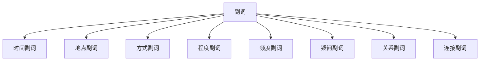

# 副词系统

## 📚 副词概述

副词是用来修饰动词、形容词、其他副词或整个句子的词类，表示时间、地点、方式、程度等。

## 🎯 学习目标

- **认识层面**：了解副词的基本概念和分类
- **理解层面**：掌握副词的位置和比较级规律
- **应用层面**：能够正确使用副词进行表达

## 📖 副词的分类

### 副词分类图

## ⏰ 时间副词 (Adverbs of Time)

### 常见时间副词

| 类型 | 副词 | 例子 |
|------|------|------|
| 现在 | now, today, nowadays | I am studying **now**. |
| 过去 | yesterday, ago, before | He came **yesterday**. |
| 将来 | tomorrow, soon, later | We will meet **tomorrow**. |
| 持续 | always, still, yet | I am **still** working. |
| 完成 | already, just, recently | I have **already** finished. |

### 用法规则

1. **句末位置**
   - I will come **tomorrow**. (我明天来)
   - He left **yesterday**. (他昨天离开了)

2. **句首位置**
   - **Today** we have a meeting. (今天我们有会议)
   - **Yesterday** I went to school. (昨天我去了学校)

3. **句中位置**
   - I **already** finished my homework. (我已经完成了作业)
   - He **still** lives here. (他仍然住在这里)

## 📍 地点副词 (Adverbs of Place)

### 常见地点副词

| 类型 | 副词 | 例子 |
|------|------|------|
| 方向 | here, there, everywhere | Come **here**. |
| 位置 | inside, outside, upstairs | He is **inside**. |
| 距离 | near, far, away | The school is **near**. |
| 运动 | up, down, back, forward | Go **up** the stairs. |

### 用法规则

1. **句末位置**
   - Put the book **here**. (把书放在这里)
   - He went **there**. (他去了那里)

2. **与动词搭配**
   - Come **in**. (进来)
   - Go **out**. (出去)

## 🎭 方式副词 (Adverbs of Manner)

### 构成方式

#### 1. 形容词 + -ly
| 形容词 | 副词 | 例子 |
|--------|------|------|
| quick | quickly | He runs **quickly**. |
| careful | carefully | Drive **carefully**. |
| beautiful | beautifully | She sings **beautifully**. |

#### 2. 不规则变化
| 形容词 | 副词 | 例子 |
|--------|------|------|
| good | well | He speaks English **well**. |
| fast | fast | He runs **fast**. |
| hard | hard | He works **hard**. |

### 用法规则

1. **修饰动词**
   - She speaks **clearly**. (她说话清楚)
   - He drives **carefully**. (他开车小心)

2. **修饰形容词**
   - The book is **very** interesting. (这本书很有趣)
   - He is **quite** tall. (他相当高)

## 📊 程度副词 (Adverbs of Degree)

### 常见程度副词

| 程度 | 副词 | 例子 |
|------|------|------|
| 最高 | very, extremely, quite | The book is **very** good. |
| 较高 | rather, fairly, pretty | It's **rather** cold today. |
| 中等 | somewhat, moderately | He is **somewhat** tired. |
| 较低 | slightly, a little | I'm **slightly** hungry. |
| 最低 | hardly, barely | I **hardly** know him. |

### 用法规则

1. **修饰形容词**
   - The movie is **very** interesting. (电影很有趣)
   - She is **quite** beautiful. (她很漂亮)

2. **修饰副词**
   - He runs **very** fast. (他跑得很快)
   - She speaks **quite** clearly. (她说话相当清楚)

## 🔄 频度副词 (Adverbs of Frequency)

### 频度副词表

| 频度 | 副词 | 例子 |
|------|------|------|
| 100% | always | I **always** get up early. |
| 90% | usually | He **usually** goes to work by bus. |
| 70% | often | We **often** play football. |
| 50% | sometimes | She **sometimes** reads books. |
| 30% | occasionally | I **occasionally** watch TV. |
| 10% | rarely | He **rarely** eats meat. |
| 0% | never | I **never** smoke. |

### 用法规则

1. **句中位置（be动词后）**
   - He is **always** late. (他总是迟到)
   - She is **never** angry. (她从不生气)

2. **句中位置（实义动词前）**
   - I **usually** have breakfast at 7. (我通常7点吃早餐)
   - We **often** go shopping. (我们经常购物)

## ❓ 疑问副词 (Interrogative Adverbs)

### 疑问副词表

| 副词 | 含义 | 例子 |
|------|------|------|
| when | 什么时候 | **When** did you come? |
| where | 在哪里 | **Where** do you live? |
| how | 怎样 | **How** are you? |
| why | 为什么 | **Why** are you late? |

### 用法规则

1. **引导疑问句**
   - **When** will you come? (你什么时候来？)
   - **Where** is the library? (图书馆在哪里？)

2. **引导感叹句**
   - **How** beautiful the flower is! (花多美啊！)
   - **What** a nice day it is! (多好的天气啊！)

## 🔗 关系副词 (Relative Adverbs)

### 关系副词表

| 副词 | 含义 | 例子 |
|------|------|------|
| when | 时间 | This is the time **when** we met. |
| where | 地点 | This is the place **where** I was born. |
| why | 原因 | This is the reason **why** I came. |
| how | 方式 | This is the way **how** he did it. |

### 用法规则

1. **引导定语从句**
   - I remember the day **when** we first met. (我记得我们第一次见面的那天)
   - This is the house **where** I grew up. (这是我长大的房子)

## 🔄 连接副词 (Conjunctive Adverbs)

### 连接副词表

| 副词 | 含义 | 例子 |
|------|------|------|
| however | 然而 | He is rich; **however**, he is not happy. |
| therefore | 因此 | It's raining; **therefore**, we can't go out. |
| moreover | 此外 | He is smart; **moreover**, he is hardworking. |
| nevertheless | 尽管如此 | It's difficult; **nevertheless**, we will try. |

### 用法规则

1. **连接句子**
   - He is tired; **however**, he continues working. (他累了，然而他继续工作)
   - It's late; **therefore**, we should go home. (很晚了，因此我们应该回家)

## 📍 副词的位置

### 位置规则

#### 1. 句末位置
- 时间副词：I will come **tomorrow**.
- 地点副词：Put it **here**.
- 方式副词：He speaks **clearly**.

#### 2. 句中位置
- 频度副词：I **always** get up early.
- 程度副词：The book is **very** interesting.

#### 3. 句首位置
- 时间副词：**Today** we have a meeting.
- 连接副词：**However**, he didn't come.

## 📊 副词的比较级

### 比较级构成

#### 规则变化
| 情况 | 规则 | 例子 |
|------|------|------|
| 单音节词 | 加-er/est | fast → faster → fastest |
| 以-ly结尾 | 加more/most | quickly → more quickly → most quickly |
| 不规则变化 | 特殊形式 | well → better → best |

### 比较级用法

1. **同级比较**
   - He runs **as fast as** his brother. (他跑得和弟弟一样快)

2. **比较级**
   - He runs **faster than** his brother. (他跑得比弟弟快)

3. **最高级**
   - He runs **the fastest** in his class. (他是班里跑得最快的)

## ⚠️ 常见错误分析

### 错误1：副词位置错误
- ❌ I **always** am late.
- ✅ I am **always** late.

### 错误2：形容词和副词混用
- ❌ He speaks **good** English.
- ✅ He speaks English **well**.

### 错误3：比较级使用错误
- ❌ He runs **more fast** than me.
- ✅ He runs **faster** than me.

## 🎯 费曼学习法应用

### 第一步：选择概念
选择"副词的位置"这个概念进行解释

### 第二步：教授他人
用简单语言解释：副词的位置取决于副词的种类和句子的结构

### 第三步：发现问题
在解释过程中发现：不同种类的副词位置规则不同

### 第四步：重新学习
回到资料重新学习各类副词的位置规则

### 第五步：简化表达
用更简单的语言重新表达：时间地点副词通常在句末，频度副词在句中

## 📚 刻意练习

### 基础练习
1. 选择适当的副词：
   - He speaks English (good/well). → well
   - I (always/never) get up early. → always

2. 用适当的副词形式填空：
   - He runs **faster** than me.
   - She speaks **more clearly** than her sister.

### 进阶练习
1. 将下列副词放在正确位置：
   - I (always) am happy. → I am **always** happy.
   - He (yesterday) came. → He came **yesterday**.

2. 用适当的连接副词填空：
   - It's raining; **therefore**, we can't go out.
   - He is rich; **however**, he is not happy.

## 🔗 相关知识点

- [[01-名词系统|名词系统]] - 副词修饰名词
- [[03-动词系统|动词系统]] - 副词修饰动词
- [[04-形容词系统|形容词系统]] - 副词修饰形容词
- [[05-状语|状语]] - 副词作状语

## 📖 扩展阅读

- [[99-附录资料/01-语法术语表|语法术语表]]
- [[04-综合应用/02-常见错误分析/05-其他常见错误|其他常见错误]]
- [[04-综合应用/01-语法综合练习/01-基础练习|基础练习]]
